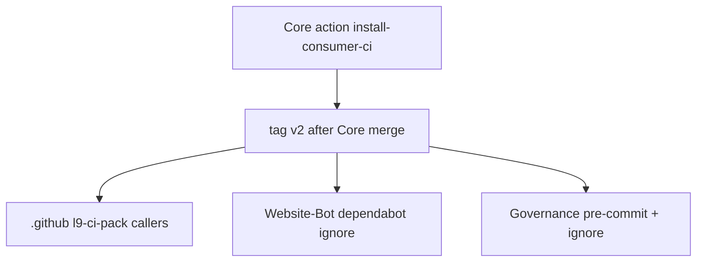

# Consumer CI toolchain lock and percolation

> **l9-plan:** depth=`deep` (`route_plan.py --risk high --evidence conflicting`). Machine `PLAN_DOCUMENT` JSON was not written in this Plan-mode turn (no workspace mutation). First execute step is emit+validate that JSON, then PE+autonomy. This file is the executable projection.

> **Execute:** `@environment/program-execution` then `/autonomy` under a Program lease. Do not free-form mutate from this markdown. `autonomous_merge: false`.

## Architect framing

Versions of ruff / mypy / pytest / Biome are **operator-owned in Core**, not Dependabot-owned in each consumer. Downstream repos **call** Core; they do not copy pin files.

Settled lock (do not reopen):

- `ruff==0.16.2`
- `mypy==2.3.0`
- `pytest==9.1.1`
- Biome `2.5.8`

Percolation pointer: floating tag `v2` on `l9-ci-core` for the **installer action only**. Analysis / SDK invoke stays SHA-pinned. `v2` does **not** exist today (tags are `v0.1.0`, `v1`, `v1.0.0`). Creating it is a Core release step, not a v2.0.0 platform release.



## Repo isolation law (executing agent)

Work in **four separate clones**, **four branches from each repo’s `origin/main`**, **four PRs**. Never stage files from repo A in repo B. Never commit Website-Bot dirty WIP into the lock PR.

- **R1 `Quantum-L9/l9-ci-core`** — clone elsewhere (not inside Website-Bot). Baseline `373bb6d26084e67ef76aaab95021364182a34ee7`. **Only place versions are written.**
- **R2 `Quantum-L9/.github`** — separate clone. Baseline `3a5c89aebf21c2530b681e97db905a90f0c77880`. **Callers only. No version literals.**
- **R3 `Website-Bot`** — this workspace. HEAD `2ebb6be41a43ec4fcefab9672b1ff571912a9e1e` is **dirty and ahead 4 / behind 1**. New branch from `origin/main`. Touch **only** [`.github/dependabot.yml`](.github/dependabot.yml). Leave biome stamp WIP, `ContextResolver.ts`, `claude-deepseek.sh` unstaged.
- **R4 Cursor-Governance** — `/Users/macm2/.cursor-governance` at `3257d6b89327077d30ecc94913b428dfc895a940`. Align local pins to Core; do not invent Core files.

**Out of this wave:** `Quantum-L9/l9-ci-sdk` (Biome schema `2.5.5` vs lock `2.5.8`). Document only.

**Do not add** a new file under `l9-ci-core/.github/workflows/*.yml` unless you also update the exact set in [`tests/workflows/test_phase_scope.py`](https://github.com/Quantum-L9/l9-ci-core/blob/main/tests/workflows/test_phase_scope.py). That test is `assertEqual(expected, actual)` on workflow filenames. Retag lives in `tools/`, not a new workflow.

## Immutable baselines (re-resolve at execute)

- Core `origin/main`: `373bb6d26084e67ef76aaab95021364182a34ee7` (same SHA Website-Bot already pins in `ci.yml`)
- Org pack `origin/main`: `3a5c89aebf21c2530b681e97db905a90f0c77880`
- Website-Bot: do not use dirty HEAD as baseline; `git fetch` and branch from `origin/main`
- Governance: `3257d6b89327077d30ecc94913b428dfc895a940`
- If any SHA drifted, stop_and_replan

## Objective

One Core-owned installer action is the lock. After `v2` moves, every caller CI run installs the new pins. No consumer Dependabot on ruff / mypy / pytest / `@biomejs/biome`. No copied `requirements-consumer-ci.txt` in Website-Bot. No `ruff.toml` stamp.

## Success properties (evidence-typed)

- **SP-01** Action pin file at Core `v2` contains exactly `ruff==0.16.2`, `mypy==2.3.0`, `pytest==9.1.1`. Evidence: `gh api` raw file at `ref=v2`.
- **SP-02** `toolchain-lock.json` in the same action dir has `"biome": "2.5.8"`. Evidence: file contents.
- **SP-03** Core pre-commit `rev: v0.16.2` equals pin `ruff==`. Evidence: new unit test PASS.
- **SP-04** No `ruff==0.14.5`, no `mypy==1.19.0`, no `pytest==8.4.2`, no bare `pip install ruff` / `pip install mypy` / `pip install pytest` in Core `pr-pipeline.yml` or `presets/python/.github/workflows/l9-lint-test.yml`. Evidence: ripgrep empty.
- **SP-05** Core Dependabot has **no** `pip` ecosystem on `/` for consumer pins. `uv` + `github-actions` remain. Evidence: [`.github/dependabot.yml`](https://github.com/Quantum-L9/l9-ci-core/blob/main/.github/dependabot.yml).
- **SP-06** Pack Python workflow calls `Quantum-L9/l9-ci-core/.github/actions/install-consumer-ci@v2` and does not inline unpinned pip. Evidence: [l9-ci-pack/workflows/l9-lint-test.yml](https://github.com/Quantum-L9/.github/blob/main/l9-ci-pack/workflows/l9-lint-test.yml).
- **SP-07** Website-Bot Dependabot ignores `@biomejs/biome`. No `requirements-consumer-ci.txt` added. Evidence: [`.github/dependabot.yml`](.github/dependabot.yml) + `test ! -f requirements-consumer-ci.txt`.
- **SP-08** Governance pre-commit `rev: v0.16.2`; Dependabot `pip` ignores `ruff`, `mypy`, `pytest`. Evidence: those two files.
- **SP-09** Per-repo completion proof: Core `make agent-check`; Governance `make pr-check`; Website-Bot `make verify-all` only if more than Dependabot changed — otherwise `npm run typecheck` plus the Dependabot file diff. Evidence: command output.

## Capability preflight

- `gh auth status` can push PRs to `Quantum-L9/l9-ci-core` and `Quantum-L9/.github`. If 403, stop (U-01).
- Separate worktrees/clones exist; Website-Bot dirty tree is not used as the Core workdir.
- Python 3.10+ for Core tests; Node 20+ only if Website-Bot validation runs.
- Tag push permission on Core (needed for `v2`). If missing, operator tags after merge.

## Execution envelope

- **fs:** only the `may_modify` paths listed per repo below. No cross-repo copies of `install.sh`.
- **commands:** repo-local `make agent-check` / `make pr-check` / targeted pytest. No `pip install ruff` unpinned to “get a green”.
- **network:** GitHub clone/PR/tag; PyPI only inside the action under test.
- **secrets:** none. Do not write tokens into workflows.
- **autonomous_merge:** false.

## What goes where

### R1 Core — write the lock

Create:

- `.github/actions/install-consumer-ci/action.yml` — composite; `bash "${{ github.action_path }}/install.sh"`. Mirror `provision-sdk` (`github.action_path`). Inputs: none required. Assumes `setup-python` already ran.
- `.github/actions/install-consumer-ci/install.sh` — fail-closed. Read sibling `requirements-consumer-ci.txt` if present; else fetch the same path from `https://raw.githubusercontent.com/Quantum-L9/l9-ci-core/${L9_CI_CORE_REF:-v2}/.github/actions/install-consumer-ci/requirements-consumer-ci.txt`. Refuse unpinned lines (`ruff` without `==`). `pip install -r` that file. Do not install Biome via pip.
- `.github/actions/install-consumer-ci/requirements-consumer-ci.txt` — the three exact pins + comment that Dependabot does not own this file.
- `.github/actions/install-consumer-ci/toolchain-lock.json` — `{"ruff":"0.16.2","mypy":"2.3.0","pytest":"9.1.1","biome":"2.5.8"}`.
- `tests/actions/test_install_consumer_ci.py` — pin parse, lock JSON matches txt, pre-commit `rev` == `v{ruff}`, `install.sh` rejects a fixture with unpinned `ruff`, `test_phase_scope` still PASS (no new workflow file).
- `tools/publish_consumer_ci_tag.sh` — after merge, move annotated or lightweight tag `v2` to the merge SHA and print the push command. Does not run in consumer CI.

Replace / delete:

- Root [`requirements-consumer-ci.txt`](https://github.com/Quantum-L9/l9-ci-core/blob/main/requirements-consumer-ci.txt) becomes a one-line include: `-r .github/actions/install-consumer-ci/requirements-consumer-ci.txt` (keep path so existing Core docs still resolve).
- [`.pre-commit-config.yaml`](https://github.com/Quantum-L9/l9-ci-core/blob/main/.pre-commit-config.yaml) `rev: v0.14.5` → `v0.16.2`. Comment: match action pin, not pr-pipeline fallback.
- [`.github/workflows/pr-pipeline.yml`](https://github.com/Quantum-L9/l9-ci-core/blob/main/.github/workflows/pr-pipeline.yml) Python install: **delete** the `else pip install "ruff==0.14.5" "mypy==1.19.0" "pytest==8.4.2"` branch. After consumer requirements, run the composite action (or `bash` the script from `github.action_path` if calling from the same repo). Fail if pins cannot be installed. Do not look for a consumer-copied pin file as the authority.
- [`presets/python/.github/workflows/l9-lint-test.yml`](https://github.com/Quantum-L9/l9-ci-core/blob/main/presets/python/.github/workflows/l9-lint-test.yml) “Install lint tools” / “Install test tools”: replace `command -v ruff || pip install ruff` (and mypy/pytest equivalents) with `uses: Quantum-L9/l9-ci-core/.github/actions/install-consumer-ci@v2`. Same for [`docs/templates/`](https://github.com/Quantum-L9/l9-ci-core/tree/main/docs/templates) copies if they still inline pip (pack syncs from templates).
- [`.github/dependabot.yml`](https://github.com/Quantum-L9/l9-ci-core/blob/main/.github/dependabot.yml): **delete** the entire `package-ecosystem: pip` / `deps(consumer-ci)` block. Keep `uv` and `github-actions`.
- [`docs/consumer-lint-test.md`](https://github.com/Quantum-L9/l9-ci-core/blob/main/docs/consumer-lint-test.md): reverse “template you copy” + “Dependabot-visible pins”. New contract: call `install-consumer-ci@v2`; config (`ruff.toml` / `[tool.mypy]`) stays repo-owned; versions do not.

Do **not** modify:

- `ruff.toml` rule set (Core-local style, not org style)
- `tests/workflows/test_phase_scope.py` expected workflow set (unless you add a workflow — don’t)
- Analysis reusable workflows / SDK revision defaults
- `presets/typescript/` biome.json contract (no stamp.sh on Core main today; do not invent one in this wave)

### R2 `Quantum-L9/.github` — distribute callers

May modify:

- `l9-ci-pack/workflows/l9-lint-test.yml` — after `setup-python`, `uses: Quantum-L9/l9-ci-core/.github/actions/install-consumer-ci@v2`. Delete `command -v ruff || pip install ruff` and mypy/pytest unpinned fallbacks. Keep `env:` consumer knobs.
- `l9-ci-pack/README.md` — pack is callers; versions live in Core action; never `@main` for analysis SHA; installer uses `@v2`.
- `ops/sync-v2-starters.sh` only if it still copies pin files or inline versions (make it copy the caller YAML, not pins).

Must **not** modify:

- A copy of `install.sh` or `requirements-consumer-ci.txt` inside the pack
- Version numbers in YAML
- `l9-ci-pack/workflows/l9-lint-test-node.yml` ESLint→Biome rewrite (separate seeder/stamp program; out of scope)
- `l9-analysis.yml` Core SHA pins (analysis stays SHA)
- org rulesets / policies / CODEOWNERS unless a one-line pointer is required

Seeder stays missing-only for `biome.json`. It may replace the **stock** Python lint workflow when the pack caller changes. Do not teach the seeder to overwrite consumer `biome.json`.

Start R2 **only after** Core PR is merged **and** `v2` points at that commit. Otherwise `@v2` 404s.

### R3 Website-Bot — consume, do not pin

May modify:

- [`.github/dependabot.yml`](.github/dependabot.yml) — add npm ignore for `@biomejs/biome` (exact name). Leave the existing patch-ignore for `*`.

Must **not** modify in this PR:

- `package.json` / lock (already `"@biomejs/biome": "2.5.8"`)
- `biome.json`, `.biomeignore`, `.editorconfig` (untracked stamp WIP — different change)
- `.github/workflows/ci.yml` Core SHA (analysis pin; optional later bump, not this PR)
- `.github/workflows/l9-lint-test.yml` (already calls SDK biome scan)
- Any `requirements-consumer-ci.txt` (do not add)
- `packages/validation-executor/**`, `scripts/claude-deepseek.sh`

Website-Bot has **no** `pyproject.toml`. It does not call `install-consumer-ci`. Lock here = stop Dependabot from drifting Biome.

Branch: `git fetch origin && git checkout -b lock/dependabot-ignore-biome origin/main`. Cherry-pick nothing from the dirty tree.

### R4 Cursor-Governance — stop the third drift source

May modify:

- `.pre-commit-config.yaml` — `rev: v0.16.2`; delete “sdk wins over core”
- `.github/dependabot.yml` — under `pip`, `ignore: ruff`, `mypy`, `pytest`
- `skills/l9-setting-up-ci/SKILL.md` — Python path: call `install-consumer-ci@v2`; do not copy pin files; do not invent `ci.yml`

Must **not** modify:

- `requirements.txt` / `pyproject.toml` versions already `ruff==0.16.2` (leave unless they diverge)
- `environment/ide/policy.json` formatter ownership
- Core or Website-Bot files from this clone

### Follow-on (do not execute in this program)

- `l9-ci-sdk` `biome.json` schema `2.5.5` vs lock `2.5.8`. CI Biome binary stays SDK-SHA-pinned until a dedicated SDK PR. Do not “fix” it from a Core or Website-Bot checkout.

## Side effects + idempotency

- **core-action-lock:** new files; re-run is overwrite-same. SE: consumers on `@v2` change install source after tag move.
- **core-kill-fallbacks:** repos that relied on silent `0.14.5` fallback will start using `0.16.2` once they call the action or a bumped `pr-pipeline` SHA. Website-Bot Node path is unaffected.
- **core-retag-v2:** moving `v2` is the percolation event. Idempotent if retagged to the same SHA. Rollback = point `v2` back at previous SHA.
- **orgpack-callers:** existing seeded consumers keep old copied workflows (seeder missing-only). New seeds get the caller. That is accepted; mass rewrite is out of scope.
- **websitebot-dependabot / gov-align:** config-only; idempotent.

## Architecture impact

Reverses Core `docs/consumer-lint-test.md` “copy the template / Dependabot owns pins” for **versions only**. Lint **config** stays consumer-owned. Frozen seven analysis workflows unchanged. New composite action is allowed (`test_phase_4_actions_exist` is a subset check).

## Rollback

- Core: revert the Core PR; if `v2` was moved, `git tag -f v2 <previous-sha> && git push origin v2 --force` (operator-only; document the previous SHA in the Core PR body before moving the tag).
- Pack: revert the `.github` PR; callers 404 only if `v2` was deleted — never delete `v2`, only move it back.
- Website-Bot / Governance: revert those PRs independently.

## Complexity and uncertainty

Deep. Conflicting evidence: Core docs and Dependabot `pip` block vs operator lock. `v2` tag absent. `stamp.sh` not on Core main (search empty). Website-Bot dirty tree. SDK Biome 2.5.5 leftover.

## Execution DAG / PE Task Cards

| Wave | Todo | Repo | Depends |
|------|------|------|---------|
| W0 | `todo-01-preflight` | none (read) | — |
| W1 | `todo-02-core-action-lock` | R1 | 01 |
| W1 | `todo-03-core-kill-fallbacks` | R1 | 02 |
| W1 | `todo-04-core-tests-docs` | R1 | 03 |
| W1 | `todo-05-core-validate-pr` | R1 | 04 |
| W1 | `todo-06-core-retag-v2` | R1 | 05 + human merge |
| W2 | `todo-07-orgpack-callers` | R2 | 06 |
| W2 | `todo-08-orgpack-validate-pr` | R2 | 07 |
| W3 | `todo-09-websitebot-dependabot` | R3 | 06 (tag exists; no need to wait for pack) |
| W3 | `todo-10-gov-align` | R4 | 06 |
| W4 | `todo-11-cross-repo-validate` | all (read) | 08, 09, 10 |

Critical path: 01 → 02 → 03 → 04 → 05 → 06 → 07 → 08 → 11. 09 and 10 are parallel after 06.

## Property evidence matrix

- SP-01, SP-02, SP-03, SP-04, SP-05 ← todos 02–05
- SP-06 ← todos 07–08
- SP-07 ← todo 09
- SP-08 ← todo 10
- SP-09 ← todos 05, 08, 09, 10, 11

## Stress and disconfirm

Disconfirming questions:

1. If callers keep SHA-pinning the action, does a Core bump still no-op? Yes — that is why the pack **must** use `@v2`, not a SHA.
2. If `test_phase_scope.py` is left unchanged and someone adds `release-toolchain.yml`, does Core CI go red? Yes — retag is a `tools/` script.
3. If Website-Bot lock PR includes the dirty biome/WIP tree, is the change reviewable? No — reject and redo from `origin/main`.
4. If pack Python workflow calls `@v2` before the tag exists, do new seeds fail install? Yes — gate todo-07 on todo-06.
5. If Dependabot `pip` is left on Core, does the lock survive a week? No — delete that block.

Assumed false ifs (must remain true):

- Operator can merge Core and push tag `v2`
- Composite actions expose sibling files via `github.action_path`
- Website-Bot will not add a local Python pin file
- Analysis SHA pins stay independent of the installer tag

Blast radius: every Python consumer that switches to the action or a new `pr-pipeline` SHA installs ruff 0.16.2. Format/lint deltas vs 0.14.5 are possible in those repos. Website-Bot Node CI does not run ruff. Org pack Node ESLint template is unchanged.

## Out of scope

- Stamping `ruff.toml` or rewriting consumer formatter config
- Mass PRs to all Quantum-L9 repos
- Replacing pack Node ESLint with Biome in this program
- Adding `stamp.sh` to Core (not on main; not this lock)
- Bumping `l9-ci-sdk` Biome 2.5.5 → 2.5.8
- Dependabot for app libraries / Actions SHAs (keep)
- `@main` for analysis or installer
- Auto-merge
- Mixing Website-Bot factory WIP into the lock PR
- Inventing phone/email/secrets

## Doc / root surface impact

- Core `docs/consumer-lint-test.md` — **update** (todo-04)
- Core `AGENTS.md` — **update** only if it still says Dependabot owns consumer pins (todo-04)
- Pack `l9-ci-pack/README.md` — **update** (todo-07)
- Governance `skills/l9-setting-up-ci/SKILL.md` — **update** (todo-10)
- Website-Bot `AGENTS.md` — **n_a** (formatter ownership unchanged; no version table there)
- Website-Bot root README — **n_a** (Dependabot-only)

## Validation (mandatory, W4)

Run in this order. Fail-closed. Do not claim done on exit-0 of a single repo.

**V-CORE** (in the Core clone, after todo-05, before merge):

```bash
make agent-check
python3 -m unittest tests.actions.test_install_consumer_ci tests.workflows.test_phase_scope
rg -n 'ruff==0\.14\.5|pip install ruff$|pip install mypy$|pip install pytest$' .github presets docs || true
```

Pass: `agent-check` PASS; pin test PASS; phase-scope PASS; ripgrep has no fallback hits in those trees.

**V-TAG** (after merge, todo-06):

```bash
gh api repos/Quantum-L9/l9-ci-core/git/ref/tags/v2 --jq .object.sha
curl -fsSL https://raw.githubusercontent.com/Quantum-L9/l9-ci-core/v2/.github/actions/install-consumer-ci/requirements-consumer-ci.txt
```

Pass: SHA equals Core merge commit; file lists the three exact pins.

**V-PACK** (R2 clone):

```bash
rg -n 'install-consumer-ci@v2' l9-ci-pack/workflows/l9-lint-test.yml
rg -n 'pip install ruff$' l9-ci-pack/workflows/l9-lint-test.yml
# expect first hit, second empty
```

**V-WB** (Website-Bot clean branch):

```bash
rg -n '@biomejs/biome' .github/dependabot.yml   # ignore entry present
test ! -f requirements-consumer-ci.txt
git diff origin/main --stat   # only dependabot.yml
```

**V-GOV** (Governance clone):

```bash
make pr-check
rg -n 'rev: v0.16.2' .pre-commit-config.yaml
rg -n 'dependency-name: ruff' .github/dependabot.yml
```

**V-CROSS** (todo-11, any machine):

```bash
# 1) Core lock at v2
curl -fsSL https://raw.githubusercontent.com/Quantum-L9/l9-ci-core/v2/.github/actions/install-consumer-ci/toolchain-lock.json
# 2) Pack is a caller, not a pin store
rg -n 'ruff==|mypy==|pytest==' Quantum-L9/.github/l9-ci-pack && echo FAIL || echo PASS
# 3) Website-Bot did not grow a pin file
test ! -f /Users/macm2/Website-Bot/requirements-consumer-ci.txt
```

Pass: lock JSON matches the four versions; pack has no version literals; Website-Bot has no pin file.

## Convergence

- status: `partial` (plan structured; implementation not run; PLAN_DOCUMENT JSON not validator-PASSed in this turn)
- remaining unknowns: U-01, U-02
- next_skill: `@environment/program-execution` then `/autonomy`; then `l9-ynp`
- stop_reason: planning complete; waiting for Build / PE lease

## Unknowns

- **U-01** Can this operator push to `l9-ci-core` and `.github` and create tag `v2`? Effect: if no, Core+pack todos block. Resolution: probe `gh` at execute.
- **U-02** Confirm `stamp.sh` still absent on Core `main` at execute. Effect: do not add it. Resolution: accept_bounded.
- **U-03** SDK Biome 2.5.5. Effect: CI scan binary may not be 2.5.8 until a later SDK PR. Resolution: accept_bounded (follow-on).
- **U-04** Website-Bot `origin/main` vs dirty tree. Effect: lock PR must ignore local WIP. Resolution: accept_bounded (branch from `origin/main`).

## GMP / PE handoff

- **may_modify:** R1 action dir, root pin include, pre-commit, `pr-pipeline.yml`, python preset + docs templates, Core dependabot, `docs/consumer-lint-test.md`, `tests/actions/*`, `tools/publish_consumer_ci_tag.sh`; R2 pack python workflow + README + sync script if needed; R3 `.github/dependabot.yml` only; R4 pre-commit, dependabot, `skills/l9-setting-up-ci/SKILL.md`
- **must_not_modify:** Core `ruff.toml` rules, `test_phase_scope.py` expected set, analysis workflow SHAs, SDK defaults, Website-Bot product/WIP files, pack Node ESLint rewrite, `l9-ci-sdk`, secrets, `.env.local`
- **preserved_contracts:** Astro+Vercel+npm on Website-Bot; Core frozen workflow filename set; Biome owns JS/TS/JSON config; Ruff owns Python config; no second formatter; preview-first deploy; no invented legal/contact values
- **validation_commands:** listed in Validation above, including Core `make agent-check` and Governance `make pr-check`

## Execute via @environment/program-execution + autonomy

1. Attach PE + autonomy. Instantiate Blueprint under `$HOME/.l9/programs/pes-toolchain-lock/`.
2. Program Lock bind to the four repo SHAs above; stop_and_replan on drift.
3. One Task Card per todo; authorization ceiling = that repo’s `may_modify` only.
4. Campaign packet: `autonomous_merge: false`; `declared_branches` = four feature branches; forbidden: force_push, mix repos, commit secrets, weaken tests.
5. After green+mergeable, human merges Core first, then tags `v2`, then pack, then WB+Governance.
6. `pec.py export-handoff` with V-CROSS receipts.

### Campaign packet stub

```yaml
packet_id: autonomy-2026-08-15-toolchain-lock
authority: A4_CAMPAIGN_BOUNDED_EXTERNAL_WRITE
autonomous_merge: false
plan_id: plan.ci.toolchain-lock-percolation.v1
declared_branches:
  - lock/consumer-ci-action          # l9-ci-core
  - lock/pack-install-caller         # Quantum-L9/.github
  - lock/dependabot-ignore-biome     # Website-Bot
  - lock/align-core-toolchain        # cursor-governance
forbidden_inside_packet:
  - mix_files_across_repos
  - add_core_workflow_yml_without_phase_scope_update
  - copy_install_sh_into_pack_or_website_bot
  - stamp_ruff_toml
  - commit_website_bot_wip
```
