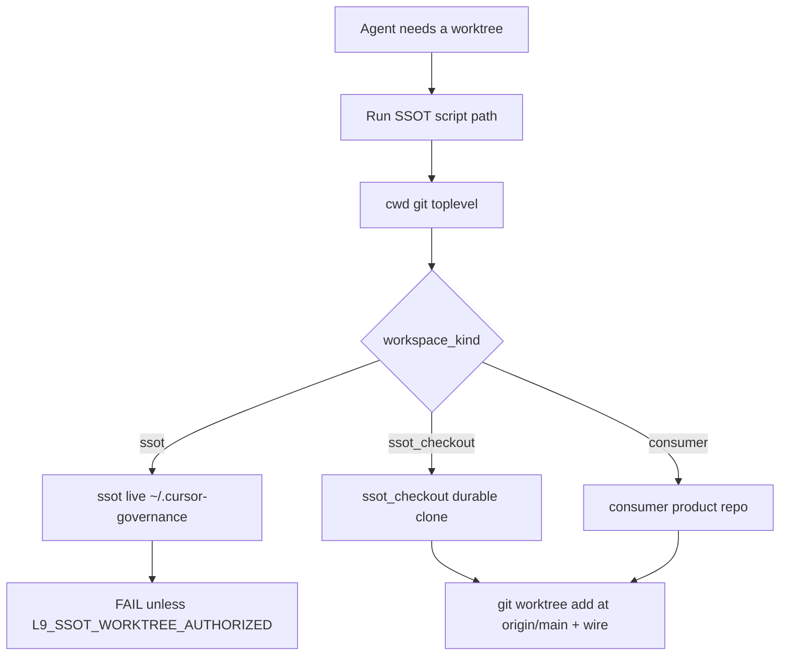

# Worktree parent clone contract

> **plan_id:** `plan.git.worktree-parent-clone.v1` · **schema:** `canonical.schema.plan_document.v1` · **status:** executable after T0 baseline matches `origin/main` · **PLAN_DOCUMENT:** `validate_plan_document.py` **PASS** (`/tmp/plan-worktree-parent-clone.json`)
> **Execute:** `@environment/program-execution` then subordinate `@autonomy` under a Program lease. Do not free-form mutate from this markdown alone.
> **Landing branch:** `feat/worktree-parent-clone` from fetched `origin/main` `941ab775c3e6d2a4d8b0425b10e9cb32b9a8e403` (rule 46). Do not land on `feat/agents-md-operating-digest`.

## Architect framing

Agents read [AGENTS.md](AGENTS.md) §2.1.1’s script path (`$HOME/.cursor-governance/ops/scripts/worktree_add_wired.sh`) as “cd into the SSOT, then add a worktree.” That script runs `git worktree add` against **cwd’s** git repo ([worktree_add_wired.sh](ops/scripts/worktree_add_wired.sh) line 44; [agent_worktree_start.sh](ops/scripts/agent_worktree_start.sh) `git rev-parse --show-toplevel`). SessionStart can `mv` the live SSOT aside (`do_swap` in [governance_activate_fresh.sh](ops/scripts/governance_activate_fresh.sh)); worktrees attached there become orphaned. The durable coding clone is already classified `ssot_checkout` ([workspace_kind.sh](ops/scripts/lib/workspace_kind.sh)).

Three authorities, never substitutable:

- **Script home** — always `$HOME/.cursor-governance/ops/scripts/…`
- **Ancestry** — fetched `origin/main` (rule 96 E2)
- **Parent clone** — cwd git toplevel: `ssot_checkout` (gov) or `consumer` (product). Live `ssot` is denied.

## Immutable baseline

- **Required start SHA:** `941ab775c3e6d2a4d8b0425b10e9cb32b9a8e403` (`origin/main`)
- **This workspace HEAD (do not use):** `600ec5c974aa7b1bce7e3cc8f328f02b9d7b1072` on `feat/agents-md-operating-digest`
- Stop and replan if `origin/main` moved before T0

## Objective + success properties

Fail-closed parent check plus append-only law so a later agent cannot “create the worktree from the SSOT” and call that AGENTS.md-compliant.

- **SP-01** — cwd realpath == `~/.cursor-governance` → both launchers exit nonzero unless `L9_SSOT_WORKTREE_AUTHORIZED` is set
- **SP-02** — `ssot_checkout` and `consumer` parents still allowed (existing pytest temp clones stay green)
- **SP-03** — AGENTS.md §21 and CANONICAL_LAW §1.2 appended; zero existing root lines rewritten
- **SP-04** — rule 49 names the three authorities
- **SP-05** — `make pr-check` PASS vs `origin/main`

## Capability preflight

Already verified this planning session: workspace is `ssot_checkout`; SSOT is `ssot`; launchers use cwd git; `do_swap` does not migrate worktrees; root files are `additive_only`; `test_multi_agent_main_bound.py` starts tasks from identity-less temp clones (consumer).

## Execution envelope

- **fs write:** only `gmp_handoff.may_modify` paths
- **fs deny:** [governance_activate_fresh.sh](ops/scripts/governance_activate_fresh.sh), [workspace_kind.sh](ops/scripts/lib/workspace_kind.sh), `pyproject.toml`, `Makefile`, `requirements.txt`, sessionStart hook
- **commands:** bash tests, locked-venv pytest, `validate_root_file_protection.py`, `make pr-check`; publish only `PR_REMEDIATE=0 make pr`
- **network:** fetch `origin/main` at T0; no other network
- **secrets:** none
- **autonomous_merge:** false

## Side effects + idempotency

- **T1/T2** — new sourced function; re-run is overwrite-same. Fail-closed changes agent behavior on SSOT cwd only.
- **T3** — tests are deterministic; GLOBAL_COMMANDS pointed at a temp identity tree (do not use the live SSOT as a worktree parent in tests).
- **T4** — rule insert + `sync_generated_artifacts.py` for llm-rules peers.
- **T5** — append-only; re-run must not duplicate §21 / §1.2 (idempotent if heading already present).
- **T6** — create-once failure note.
- **T7** — gate receipts; no push until T7.

## Architecture impact

- Adds a parent-kind gate beside E1/E2 (dedicated worktree + main ancestry).
- Does not change workspace_kind classification.
- Does not change SSOT tip-activation / swap.
- Consumer `worktree_add_wired.sh` path stays the sanctioned consumer wire.



## Rollback

Revert the feature branch. The mechanical change is one lib + two `source` calls. Root appends revert if no existing line was rewritten. Prior worktrees already attached to a `.bak.*` SSOT stay an ops cleanup problem (out of scope).

## Complexity and uncertainty

Standard depth. One bounded unknown (U1): SSOT-only operators. Accepted via `L9_SSOT_WORKTREE_AUTHORIZED=<reason>` in the error text.

## Execution DAG

- T0 → T1 → T2 → T3 → T7
- T1 → T4 → T5 → T6 → T7
- T3 and T6 both join at T7

Phase-0 ↔ PE Task Cards: T0 preflight, T1–T6 execute, T7 validate/converge.

## Property evidence matrix

- SP-01 ← T1, T2, T3
- SP-02 ← T3 (consumer fixtures + ssot_checkout case)
- SP-03 ← T5 + `validate_root_file_protection.py`
- SP-04 ← T4
- SP-05 ← T7 `make pr-check`

## Stress and disconfirm

- Does any sanctioned flow create a **governance** worktree with cwd=`~/.cursor-governance` and expect success? (Assumed no; escape covers yes.)
- Does fail-closed break SSOT-only machines? (Escape; U1 accept_bounded.)
- Is `worktree_add_wired.sh` invoked from **consumer** repos? (Yes — consumer parent must stay allowed.)
- Would rewriting §2.1.1 or the formatter fence fail additive_only? (Yes — append §21 before the formatter block; do not touch existing lines.)

## Out of scope

- Changing `do_swap` / tip activation
- Rewriting AGENTS.md §2.1.1 in place
- Denying consumer parents
- Copying dirty/uncommitted files into a new worktree
- New Makefile targets
- Mixing onto current WIP branch

## Contract to implement

**Lib** [`ops/scripts/lib/worktree_parent.sh`](ops/scripts/lib/worktree_parent.sh) (new):

- Source [workspace_kind.sh](ops/scripts/lib/workspace_kind.sh) (or via `resolve_governance_paths.sh`)
- `assert_worktree_parent_ok <git-toplevel>`
- `ssot` + unset/empty `L9_SSOT_WORKTREE_AUTHORIZED` → die with: script home ≠ parent; attach from the durable `ssot_checkout`; ancestry is `origin/main`; escape name
- `ssot_checkout` | `consumer` → return 0

**Wire** after `repo_root` in [agent_worktree_start.sh](ops/scripts/agent_worktree_start.sh); in [worktree_add_wired.sh](ops/scripts/worktree_add_wired.sh) after parsing path, resolve `git rev-parse --show-toplevel` and assert **before** `git worktree add`.

**Tests:** [ops/scripts/tests/test_worktree_parent.sh](ops/scripts/tests/test_worktree_parent.sh) (mirror [test_workspace_kind.sh](ops/scripts/tests/test_workspace_kind.sh): seed identity, set `GLOBAL_COMMANDS` to a temp fake SSOT — do not add a worktree under the live SSOT). Pytest: refuse when cwd realpath equals `GLOBAL_COMMANDS`; existing identity-less clones still pass.

**Docs (append-only roots):**

- [AGENTS.md](AGENTS.md) new **§21** immediately before `<!-- BEGIN L9 FORMATTER OWNERSHIP` — `WORKTREE_PARENT_CLONE_V1`; show the `cd` to the durable clone + SSOT script path; do not edit §2.1.1
- [CANONICAL_LAW.md](CANONICAL_LAW.md) new **§1.2** after §1.1 — parent-clone law + swap orphan risk
- [rules/49-shared-worktree-isolation.mdc](rules/49-shared-worktree-isolation.mdc) MUST bullet; [rules/96-multi-agent-main-bound-execution.mdc](rules/96-multi-agent-main-bound-execution.mdc) one sentence in §2
- regenerate llm-rules peers
- [learning/failures/worktree-ssot-parent.md](learning/failures/worktree-ssot-parent.md)

## Convergence

- **status:** partial (final_validation pending)
- **remaining_unknown_ids:** U1 (bounded)
- **next_skill:** `l9-ynp` → execute via PE + `/autonomy`
- **stop_reason:** plan validated; do not implement from chat

## Execute via @environment/program-execution + autonomy

```text
this .plan.md
  → @environment/program-execution  (Blueprint → Program Lock → Controller)
  → root autonomy/ + @autonomy (/autonomy → l9-bounded-autonomy)
  → PE adapter (cursor-foreground)
```

```bash
make -C "$HOME/.cursor-governance" campaign INTENT=<this-plan-or-brief>
```

Or after Build: T0 on a **new** worktree/branch from `origin/main` using this contract (parent = this `ssot_checkout`, not `~/.cursor-governance`), then T1–T7, then L4 kernels and `PR_REMEDIATE=0 make pr`. `autonomous_merge: false`.

Campaign packet stub: `authority: A4_CAMPAIGN_BOUNDED_EXTERNAL_WRITE` · `profile: pr-convergence` · `autonomous_merge: false` · `plan_id: plan.git.worktree-parent-clone.v1` · `provider_ref: cursor-foreground`
