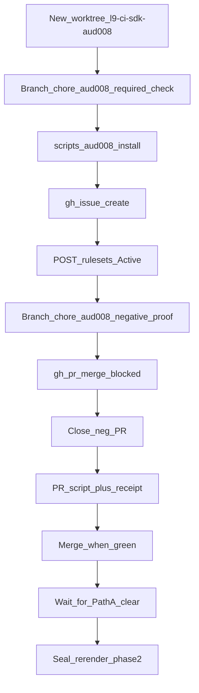

# PLAN: AUD-008 real closure (API-only, collision-isolated)

### Objective

Install an **Active** repo branch ruleset that requires check **`Lint, type-check, test, coverage`** on `main`, capture issue + ruleset + ± proof URLs, then (only after the concurrent Path A branch is clear) rewrite seal evidence.

**Concurrent-agent isolation is a hard constraint** — this GMP must not collide with the other chat working Path A / `docs/v1-release-unblock`.

### Isolation law (non-negotiable)

| Do | Do not |
|----|--------|
| New worktree: `/Users/ib-mac/l9-ci-sdk-aud008` @ `origin/main` | Touch `/Users/ib-mac/l9-ci-sdk-unblock` |
| Branch: `chore/aud008-required-check` | Checkout, commit, or push `docs/v1-release-unblock` |
| Negative branch: `chore/aud008-negative-proof` (throwaway) | Edit the dirty Cursor clone `/Users/ib-mac/l9-ci-sdk` product files |
| Own files only: `scripts/aud008_*`, `docs/release/aud008-*` | Edit shared seal SSOT while the other agent owns them |
| One WIP topic in this worktree | `git stash` / switch over their dirty trees |

**Shared seal files (deferred):** `.l9/audit-findings.md`, `docs/release/blocker-closure.md`, `.l9/roadmap.yaml`, `.l9/release-policy.yaml`, `docs/release/evidence-map.yaml`, Path A plan/known-limitations — **out of scope for the first AUD-008 PR** so both agents can work in parallel.

### Scope

**In (phase 1 — isolated, no collision):**
- Automation script + ruleset JSON under AUD-008-owned paths
- Active ruleset via API (not Copilot `19469354`, not advisory hygiene)
- Tracking issue → receipt `AUD_008_ISSUE_URL`
- Ruleset HTML URL → receipt `AUD_008_RULESET_URL`
- Negative proof PR → receipt `AUD_008_NEGATIVE_PROOF_URL`
- Positive proof = merge of `chore/aud008-required-check` (script+receipt) under Active ruleset → receipt `AUD_008_POSITIVE_PROOF_URL`
- Commit/push/PR only from the AUD-008 worktree

**In (phase 2 — after concurrent Path A lands or is paused):**
- Rebase/branch-from updated `main` (or from merged Path A tip)
- Flip `AUD_008_*` in evidence-map from waived → resolved using receipt URLs
- Re-render four seal files; restore “required on main” assertion
- `rg` placeholder gate; separate small PR if needed

**Out:**
- Any work in `l9-ci-sdk-unblock` / `docs/v1-release-unblock`
- Manual GitHub UI
- Path A W2 doc-drift packs (other agent)
- Semgrep Path B / `v1.0.0` tag
- Changing `ci.yml` job name

### Concrete automation design

**Required check context (verified):** `Lint, type-check, test, coverage` + Actions `integration_id` **15368**.

**Ruleset payload:** same as before — name `SDK self-validation required on main`, Active, `refs/heads/main`, Admin bypass `always`, idempotent create-by-name.

**Phase 1 file ownership on `chore/aud008-required-check`:**
- [`scripts/aud008_install_required_check.sh`](../l9-ci-sdk-aud008/scripts/aud008_install_required_check.sh)
- [`docs/release/aud008-ruleset.json`](../l9-ci-sdk-aud008/docs/release/aud008-ruleset.json)
- [`docs/release/aud008-receipt.json`](../l9-ci-sdk-aud008/docs/release/aud008-receipt.json) (issue/ruleset/± URLs; schema documented in script header)
- Optional: `docs/release/aud008-README.md` (operator notes; no Path A marketing in root README)

**Negative proof:** only on `chore/aud008-negative-proof`; never merge; close after blocked-merge evidence.

**Positive proof:** merge PR of phase-1 files only (no seal rewrite in that PR).

### TODO Plan

| # | Task | Files | Effort | Risk |
|---|------|-------|--------|------|
| 1 | Create isolated worktree + branch; leave unblock worktree untouched | `/Users/ib-mac/l9-ci-sdk-aud008`, `chore/aud008-required-check` | S | Low |
| 2 | Add install script + ruleset JSON | `scripts/aud008_*`, `docs/release/aud008-ruleset.json` | M | Med — API shape |
| 3 | Run: issue + Active ruleset → receipt | `docs/release/aud008-receipt.json` + GitHub | M | Med — live gate |
| 4 | Negative proof branch/PR → blocked merge → close | throwaway test on neg branch only | M | Low |
| 5 | Open/merge positive PR (script+receipt only) | same owned paths | M | Med |
| 6 | Phase 2 (gated): after Path A clear, evidence-map + seal re-render PR | shared seal SSOT | M | Collision if done early |

### Dependencies

Phase 1: 1 → 2 → 3 → 4 → 5  
Phase 2: **blocked on** concurrent `docs/v1-release-unblock` merge (or explicit handoff that the other agent has released those files) → 6

### Risks

| Risk | Mitigation |
|------|------------|
| Colliding with Path A agent | Separate worktree/branch; no shared seal edits in phase 1 |
| Both PRs touch `MANIFEST.md` | Prefer AUD-008 PR paths that reconcile cleanly; run manifest generate only on owned tree before push |
| Active ruleset blocks other agent's PR | Same required check already runs on PRs; green Path A PR still merges; Admin bypass for emergencies |
| Phase 2 races | Do not start seal rewrite until Path A is merged or user says the other chat released the files |
| Wrong check name | Freeze `Lint, type-check, test, coverage` + integration_id 15368 |

### Estimate

**Phase 1:** ~1–2 hours (CI waits)  
**Phase 2:** ~30–45 min after Path A clear  
**GMPs:** 1 for phase 1; optional 2nd for seal re-render

### Success criteria

**Phase 1 done when:**
- Isolated worktree/branch used exclusively
- Zero commits on `docs/v1-release-unblock` / `l9-ci-sdk-unblock` from this agent
- Active ruleset + issue + ± proofs in `aud008-receipt.json`
- Positive PR merged with required check green

**Phase 2 done when:**
- All four `AUD_008_*` resolved in evidence-map with receipt URLs
- Four seal files updated; `rg` placeholders empty; Path A AUD-008 waivers removed

### Recommend after plan approval

Execute **phase 1 only** in `/Users/ib-mac/l9-ci-sdk-aud008` on `chore/aud008-required-check`. Stop and ask before phase 2 seal edits.
