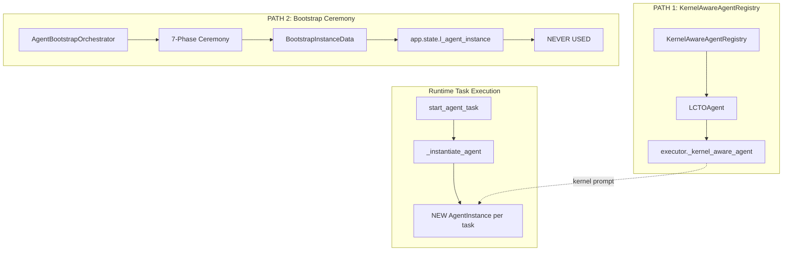
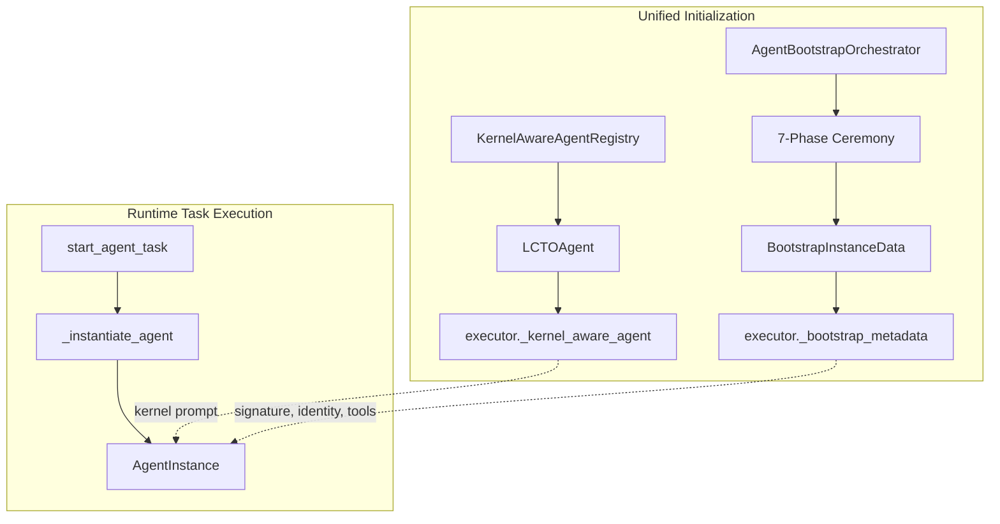

# Bridge Agent Initialization Paths

## Current Problem

Two separate initialization paths exist for L-CTO that don't connect:



**Issues:**

1. `app.state.l_agent_instance` (BootstrapInstanceData) is stored but never used
2. Type mismatch: orchestrator returns `BootstrapInstanceData`, not `AgentInstance`
3. Runtime creates fresh `AgentInstance` per task without bootstrap metadata

## Target State



## Implementation Plan

### 1. Add Bootstrap Metadata Storage to Executor

**File:** [core/agents/executor.py](core/agents/executor.py)

Add attribute and setter for bootstrap metadata:

```python
# In __init__ (around line 480)
self._bootstrap_metadata: Dict[str, Any] | None = None

# New setter method (after set_tool_audit_service)
def set_bootstrap_metadata(self, metadata: Any) -> None:
    """
    Set bootstrap metadata from 7-phase ceremony.
    
    Stage 7: Bootstrap Integration (GMP-BRIDGE-INIT).
    Stores initialization signature, identity, and bound tools
    from the bootstrap ceremony for injection into runtime instances.
    """
    self._bootstrap_metadata = metadata
    logger.info(
        "agent.executor.bootstrap_metadata_set: enabled=%s, agent_id=%s",
        metadata is not None,
        getattr(metadata, "agent_id", "unknown") if metadata else None,
    )
```

### 2. Inject Bootstrap Metadata into Runtime Instances

**File:** [core/agents/executor.py](core/agents/executor.py)

Modify `_instantiate_agent()` (around line 1364) to inject bootstrap data:

```python
# After creating instance, before _hydrate_context
instance = AgentInstance(config=config, task=task)

# Inject bootstrap metadata if available (GMP-BRIDGE-INIT)
if self._bootstrap_metadata is not None:
    bootstrap = self._bootstrap_metadata
    # Transfer initialization signature
    if hasattr(bootstrap, "initialization_signature"):
        instance._initialization_signature = bootstrap.initialization_signature
    # Transfer identity fields
    if hasattr(bootstrap, "designation"):
        instance._designation = bootstrap.designation
    if hasattr(bootstrap, "mission"):
        instance._mission = bootstrap.mission
    logger.info(
        "agent.executor.bootstrap_injected",
        agent_id=task.agent_id,
        has_signature=bool(getattr(bootstrap, "initialization_signature", None)),
    )
```

### 3. Add Bootstrap Fields to AgentInstance

**File:** [core/agents/agent_instance.py](core/agents/agent_instance.py)

Add optional fields for bootstrap metadata (around line 140):

```python
self._initialization_signature: str | None = None
self._designation: str | None = None
self._mission: str | None = None
self._bootstrap_verified: bool = False

# Add properties
@property
def initialization_signature(self) -> str | None:
    """Get initialization signature from bootstrap."""
    return self._initialization_signature

@property
def is_bootstrapped(self) -> bool:
    """Check if instance has bootstrap metadata."""
    return self._initialization_signature is not None
```

### 4. Wire Bootstrap to Executor at Startup

**File:** [api/server.py](api/server.py)

After bootstrap ceremony (around line 1867), wire to executor:

```python
l_instance = await bootstrap.bootstrap_agent(l_config)
app.state.l_agent_instance = l_instance

# Wire bootstrap metadata to executor (GMP-BRIDGE-INIT)
agent_executor = getattr(app.state, "agent_executor", None)
if agent_executor is not None:
    agent_executor.set_bootstrap_metadata(l_instance)
    logger.info("Bootstrap metadata wired to AgentExecutor")
```

### 5. Fix Type Annotation in Orchestrator

**File:** [core/agents/bootstrap/orchestrator.py](core/agents/bootstrap/orchestrator.py)

Fix return type to match actual behavior (line 68):

```python
# Before
async def bootstrap_agent(...) -> AgentInstance:

# After  
async def bootstrap_agent(...) -> "BootstrapInstanceData":
```

Also update the import at top of file:

```python
# Remove: from core.agents.agent_instance import AgentInstance
# Add to TYPE_CHECKING block:
from .phase_2_instantiate import BootstrapInstanceData
```

## Files Changed Summary

| File | Changes |

|------|---------|

| `core/agents/executor.py` | Add `_bootstrap_metadata`, setter, injection in `_instantiate_agent` |

| `core/agents/agent_instance.py` | Add signature/identity fields and properties |

| `api/server.py` | Wire bootstrap result to executor |

| `core/agents/bootstrap/orchestrator.py` | Fix return type annotation |

## Validation

After implementation:

1. **Startup logs should show:**

   - "Bootstrap metadata wired to AgentExecutor"

2. **Runtime logs should show:**

   - "agent.executor.bootstrap_injected" when processing tasks

3. **Test:**
   ```bash
   pytest tests/unit/test_lcto_bootstrap.py -v
   pytest tests/integration/test_l_cto_end_to_end.py -v
   ```


## Data Flow After Bridge

```
Startup:
  KernelAwareAgentRegistry → LCTOAgent → executor._kernel_aware_agent
  AgentBootstrapOrchestrator → BootstrapInstanceData → executor._bootstrap_metadata

Runtime (POST /lchat):
  start_agent_task(task)
    → _instantiate_agent(task)
        → AgentInstance(config, task)
        → inject kernel prompt from _kernel_aware_agent ✓
        → inject signature/identity from _bootstrap_metadata ✓ (NEW)
    → _hydrate_context(instance)
    → _run_execution_loop(instance)
```