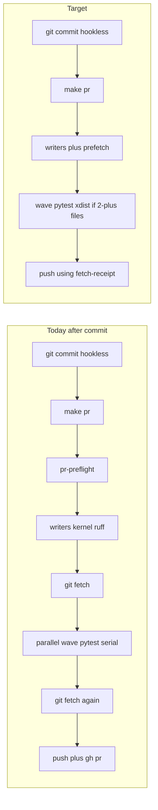

# PLAN: Ceremony speed

## Objective

Speed the remaining **single** `git commit` then `make pr` path on this checkout.

`git commit` already has no hook. `make pr` is already the publish command (Makefile happy-path help and `PR_REMEDIATE ?= 1` are landed). The leftover wall is **local pytest without xdist**, plus a **second git fetch**, a **second changed-file resolve** in security, and **no phase timings**.

Sibling plans stay out of this Build:

- [publish_ceremony_once_d08758b6.plan.md](publish_ceremony_once_d08758b6.plan.md) — tests-once teaching, remediates default, CI selector
- [remediator_remaining_speed_bb4c2204.plan.md](remediator_remaining_speed_bb4c2204.plan.md) — remediator ingest (foreign dirty; do not stage)

## Reasoning

**Abductive.** Perceived slowness is three stacked ceremonies (post-commit `precommit-repo`, `pr-check`, `make pr`) plus minutes of pytest. Scaffolding on this machine is small: wiring 1.8s, digest 0.8s, fetch 0.7s, each pre-commit pass 0.8s, projection 0.2s. Local `--profile local` omits `-n auto` that CI already uses on the same suites.

**Deductive.** A commit hook would slow the fast step. Combining writers and readers would hide formatter dirt until after pytest (already failed once; see built `precommit_before_pr`). Skipping wiring would drop C6. The lawful cuts are xdist on the local selected set, one fetch per `make pr`, one resolve, and timings.

**Inductive.** Receipt skip already saved the 5.5-minute double pytest. Parallel reader wave already hid wiring behind pytest. The repeating defect is a velocity flag CI has and local `make pr` does not.

**Confidence:** 88%. Evidence quality: high for scaffolding times and missing local xdist; medium for typical pytest seconds (U1). Action: proceed with validation.

## Immutable baseline

- Workspace: `/Users/ib-mac/Cursor-Governance` on `main` @ `f1321207f525481798210ef63e15335b9d4b9ded`
- Dirty (foreign, write_deny): `.claude/settings.json`, `docs/plans/stop_generated_collisions_b4203c61.plan.md`, `docs/plans/remediator_remaining_speed_bb4c2204.plan.md`
- Do not write `Lock: origin/main = <sha>`
- Do not switch away from this checkout as a planning requirement
- At **Build** start: `git switch -c feat/ceremony-speed` on this worktree so `make pr` is legal. Do not create a second worktree. Do not commit foreign dirty.

## Success properties

| id | property | evidence_type | proof | blocking |
|----|----------|---------------|-------|----------|
| SP-01 | `.l9/pr/gate-timing.json` written each gate run with digest/writers/fetch/wave/total ms | quality_gate | file after `make pr-check` | true |
| SP-02 | local changed-file pytest gets `-n auto` iff selected pytest file count >= 2 | unit | `test_ceremony_speed.py` | true |
| SP-03 | `open_pr_after_gate.sh` skips fetch when fetch-receipt is <60s and SHA matches | unit | fixture receipt | true |
| SP-04 | `run_pr_security.sh` with `PR_CHANGED_FILE` does not call `resolve_changed_files.sh` | unit | same | true |
| SP-05 | `make pr-check` PASS on this change set | quality_gate | gate receipt | true |

## Capability preflight

- Locked venv `.venv/bin/python` present (used to validate this PLAN_DOCUMENT).
- `pytest-xdist` already in `ops/config/python-contract.json` `required_dev_distributions` and CI argv.
- `gh` / network needed only at `make pr` open, not at `make pr-check`.

## Execution envelope

- **fs write_allow:** `ops/scripts/run_pr_gate.sh`, `ops/scripts/open_pr_after_gate.sh`, `ops/scripts/run_python_test_suites.py`, `ops/scripts/run_pr_security.sh`, `tests/ops/scripts/test_ceremony_speed.py`, this plan pair
- **fs write_deny:** `AGENTS.md`, `CANONICAL_LAW.md`, `Makefile`, `kernels/`, `.github/workflows/`, `ops/config/python-contract.json` **ci** profile argv, foreign dirty paths above
- **commands allow:** targeted pytest, `make pr-check`
- **commands deny:** `make campaign`, `pre-commit install`, force-push, `--admin`, `git add -A`
- **network:** git fetch origin BASE_REF only (existing)
- **secrets:** none
- **autonomous_merge:** false

## Side effects + idempotency

- `instrument-spans`: writes gitignored `.l9/pr/gate-timing.json`. Re-run overwrites.
- `local-xdist`: argv injection only. Re-run is the same branch.
- `prefetch-reuse`: writes gitignored `.l9/pr/fetch-receipt.json`. Stale or SHA mismatch fetches as today.
- `security-changed-file`: env-gated. Standalone `make pr-security` unchanged.
- `prove`: new test file. Re-run is additive.

## Architecture impact

Velocity gate internals only. CI `--profile ci` argv stays. Consumer workspaces still skip the governance pytest registry. No new Make target. No new pre-commit hook.

## Rollback

Revert the feature-branch PR. `.l9/pr/*.json` receipts are untracked. CI Test Suite does not change.

## Complexity and uncertainty

- U1: typical pytest seconds before xdist — bounded; instrument records the after number.
- U2: xdist flake on a locally selected test — probe; pin that file or that suite id; do not disable xdist globally. CI already runs those tests with `-n auto`.

## Execution DAG / Phase-0 table

| id | task | files | deps |
|----|------|-------|------|
| instrument-spans | timing JSON | `ops/scripts/run_pr_gate.sh`, `tests/ops/scripts/test_ceremony_speed.py` | — |
| local-xdist | `-n auto` at 2+ files | `ops/scripts/run_python_test_suites.py`, tests | instrument-spans |
| prefetch-reuse | fetch receipt | `run_pr_gate.sh`, `open_pr_after_gate.sh`, tests | instrument-spans |
| security-changed-file | honor `PR_CHANGED_FILE` | `run_pr_security.sh`, `run_pr_gate.sh`, tests | instrument-spans |
| prove | tests + `make pr-check` | `tests/ops/scripts/test_ceremony_speed.py` | the three cuts |

Rows are Build todos, not Controller Task Cards.

## Property evidence matrix

See Success properties. SP-02/03/04 are unit tests in `test_ceremony_speed.py`. SP-01/05 are the gate run.

## Stress and disconfirm

- If a typical Python PR selects **one** test file, xdist does not fire — do not claim a pytest speedup for that shape; timings still prove scaffolding.
- If fetch-receipt is reused after origin/main moved, SHA mismatch must fetch. A TTL-only skip is a defect.
- If `PR_CHANGED_FILE` were reused after writers rewrote files, the gate already fail-closes on tracked dirt before the reader wave, so security never sees a rewritten dirty tree.
- If xdist flakes a test that passes serially, check whether CI already runs it with `-n auto`. If yes, it is a product flake. If no, stop injecting for that suite id.

Assumed false if: gate receipt still keys on worktree content; CI repo-root and claude-code-autonomy already use `-n auto`; `PR_CHANGED_FILE` is written once before writers.

Blast radius: every local `make pr` / `make pr-check` on ssot / ssot_checkout. `git commit` latency unchanged.

## Out of scope

- Tests-once / remediates / CI selector (sibling publish_ceremony_once)
- Remediator GraphQL census (foreign remediator plan)
- Installing a git commit hook
- Weakening scanners or pytest assertions
- Moving LaunchAgent scan off `check_governance_wiring.sh`
- Folding AGENTS.md / CANONICAL_LAW.md / Makefile
- `make campaign`, Program Lock, new worktree from tip
- Staging foreign dirty files on this checkout

## Doc / root surface

- AGENTS.md — N/A (command stays `make pr`; tests-once teaching is the sibling plan)
- CANONICAL_LAW.md — N/A
- CLAUDE.md — N/A
- Makefile — N/A (happy-path echo already landed)
- INVARIANTS.md — N/A

## Leverage

Highest first: local-xdist → instrument-spans → prefetch-reuse → security-changed-file → prove.

Shared cause: local velocity omits a flag CI already pays for; each leaf re-fetches and re-resolves.

Deletions: the second `git fetch` when the receipt is fresh; the second `resolve_changed_files.sh` inside security when `PR_CHANGED_FILE` is set. Do not delete the writers/readers split.

## Convergence

- status: partial (plan validated; code not yet run)
- next_skill: Build (current checkout)
- stop_reason: Press **Build**. Do not run `make campaign`.
- execute_via: cursor-build

PLAN_DOCUMENT: [ceremony_speed_f8580fa5.plan.json](ceremony_speed_f8580fa5.plan.json)

## Execute via Cursor Build

Press **Build**. Work in the **current checkout**.

- Do not run `make campaign`.
- Do not admit a Program Lock or Controller lease.
- Do not write `Lock: origin/main = <sha>`.
- Do not open a new worktree from tip as a planning requirement.
- At Build start, create `feat/ceremony-speed` on this worktree (HEAD is `main`). Pathspecs only.
