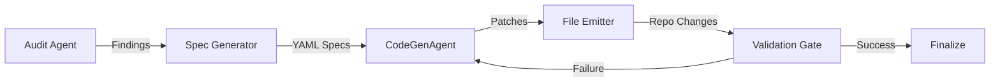

# CGA Spec Generator Implementation Plan

The goal is to automate the transition from technical debt findings (identified by Perplexity) to actionable code changes (implemented by CodeGenAgent).

## 1. Data Model Alignment

The generator will consume the `Finding` dataclass from `scripts/perplexity_audit_agent.py` and map it to the `Module-Spec-v2.4` YAML format used by `CodeGenAgent`.

## 2. Component: `CGASpecGenerator`

A new script `scripts/cga_spec_generator.py` will be created with the following responsibilities:

- **Input**: Path to an audit report JSON (e.g., `reports/perplexity_audit/audit_20260213_035046.json`).
- **Logic**:
  - Iterate through findings.
  - Filter for P0 and P1 findings.
  - Generate DORA-compliant headers (ADR-0014).
  - Construct the `patch` or `code` block using `finding.code_before` and `finding.code_after`.
  - Map the finding category to a CGA `patch_type` (e.g., `reliability_patch`, `security_patch`).
- **Output**: Save generated YAML files to `codegenagent/patches/` for immediate ingestion.

## 3. Integration Flow

The generator will be wired into the `AuditPipeline` to enable a seamless "Audit -> Spec -> Fix" loop.

## 4. Key Files to Leverage

- `scripts/perplexity_audit_agent.py`: For the source data model.
- `codegenagent/codegen_agent.py`: For understanding the ingestion pipeline.
- `codegenagent/extract_yaml_specs.py`: For patch detection logic.

## 5. Implementation Steps

1. Define the `CGASpecGenerator` class with template-based YAML generation.
2. Implement surgical patch detection (identifying exact line ranges from findings).
3. Add a CLI interface to run the generator on existing audit reports.
4. Wire the generator as an optional post-processing step in `scripts/perplexity_audit_agent.py`.

