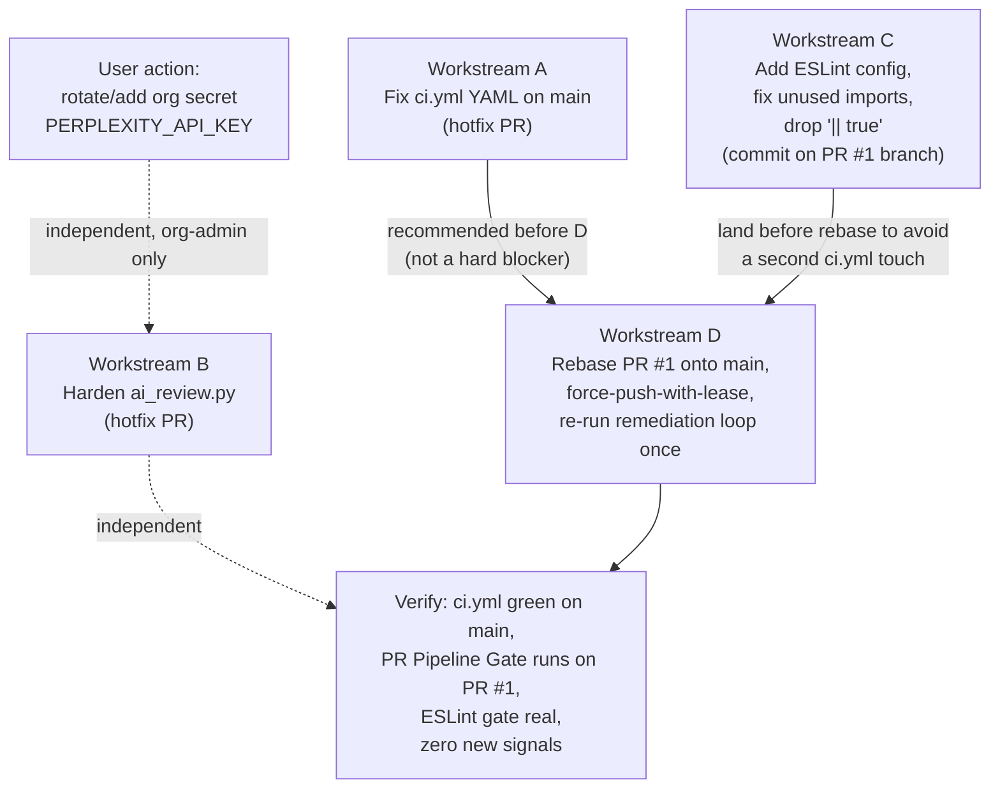

# PLAN: Resolve l9-ci-debt-lsp Structural/Infra Gaps

## Objective

The `l9-pr-remediation` loop converged PR #1 (`wire/lsp-consume-compiled-rules`) from a code-fix standpoint — all local CI gates pass, zero actionable review comments. It surfaced three issues outside the loop's remit. This plan resolves each with a minimal, isolated, verifiable change. No merge of PR #1 is performed as part of this plan (per explicit instruction).

## Scope

**In:**
1. Fix the invalid YAML in `origin/main`'s [.github/workflows/ci.yml](l9-ci-debt-lsp/.github/workflows/ci.yml) (lines 38-48) that has failed every push to `main` for the last 4 runs.
2. Harden [tools/ai_review.py](l9-ci-debt-lsp/tools/ai_review.py) so an invalid/expired `PERPLEXITY_API_KEY` produces a clean advisory skip instead of a raw `httpx.HTTPStatusError` traceback dumped into the PR comment.
3. Author a real ESLint config for `l9-ci-debt-lsp` (currently `eslint`/`@typescript-eslint` are installed but zero config files exist anywhere in the repo), fix the resulting violation(s), then remove the `|| true` that masks the lint gate in `ci.yml`.
4. Rebase PR #1 onto latest `main` so it inherits `pr-pipeline.yml` (the source of the required `"PR Pipeline Gate"` check) and exits `mergeStateStatus: BEHIND` — then re-run the remediation loop once to confirm no new signals from the first-ever run of PR Pipeline Gate against this branch.

**Out:**
- Actually creating/rotating the `PERPLEXITY_API_KEY` GitHub org secret — requires org-admin access I don't have; called out as a required **user action**.
- Merging PR #1 — explicitly excluded by the user.
- Re-litigating the CI-Kernel harvest commits already on `main` (`d2b6c8c`, `7df80c7`, `bea79e1`, `37a7383`) — those are done deals; this plan only patches the one YAML bug they introduced.
- Type-aware ESLint rules (`parserOptions.project`) — adds `tsconfig` coupling and lint latency for a 317-line `src/`; not needed to unmask the gate. Noted as an optional future upgrade only.

## Root causes (confirmed via direct investigation)

**A. `main`'s `ci.yml` is structurally broken, not test-broken.** Lines 38-48 dedent a multi-line `python -c "..."` string to column 0, breaking YAML block-scalar parsing:

```38:48:l9-ci-debt-lsp/.github/workflows/ci.yml
          python -c "
import json, sys
rules = json.load(open('rules/compiled_rules.json'))
required = {'id', 'language', 'topology', 'severity', 'patterns', 'message'}
for r in rules:
    missing = required - set(r.keys())
    if missing:
        print(f\"Rule {r.get('id')} missing: {missing}\")
        sys.exit(1)
print(f'All {len(rules)} compiled rules valid')
"
```
Confirmed via `gh api .../actions/runs/{id}/jobs` returning zero jobs (workflow fails to parse before any job is scheduled) and local `yaml.safe_load()` reproducing the exact parse error. This is **not** a required status check (only `"PR Pipeline Gate"` is), so it doesn't block merges — but it has failed on every push to `main` for the observed window and produces constant red-X noise.

**B. The AI review bot has a graceful-skip path for a *missing* key, but none for an *invalid* one.** [.github/workflows/ai-code-review.yml](l9-ci-debt-lsp/.github/workflows/ai-code-review.yml) gates on presence only:

```53:63:l9-ci-debt-lsp/.github/workflows/ai-code-review.yml
      - name: Detect Perplexity API Key
        id: key
        run: |
          if [ -n "$PERPLEXITY_API_KEY" ]; then
            echo "present=true" >> "$GITHUB_OUTPUT"
          else
            echo "present=false" >> "$GITHUB_OUTPUT"
            echo "::warning::PERPLEXITY_API_KEY not configured (fork PR or missing secret) — skipping AI review"
          fi
```
Once past that gate, [tools/ai_review.py](l9-ci-debt-lsp/tools/ai_review.py) has no try/except around the API call:

```348:349:l9-ci-debt-lsp/tools/ai_review.py
    result = call_review(code, api_key, model, system_prompt)
    should_block = print_results(result)
```
```187:196:l9-ci-debt-lsp/tools/ai_review.py
        resp = client.post(
            PERPLEXITY_URL,
            headers={"Authorization": f"Bearer {api_key}", ...},
            json=payload,
        )
        resp.raise_for_status()   # <- unhandled 401 here
```
The workflow step wraps the call in `set +e` so the step "succeeds" regardless, and `tee`s the raw traceback straight into the PR comment:
```104:116:l9-ci-debt-lsp/.github/workflows/ai-code-review.yml
        run: |
          set +e
          PYTHONPATH=. python3 tools/ai_review.py --mode file --diff-path pr_diff.txt --no-block 2>&1 | tee review_output.txt
          echo "exit_code=${PIPESTATUS[0]}" >> "$GITHUB_OUTPUT"
          set -e
```
`steps.review.outputs.exit_code` is captured but never consumed anywhere downstream — pure dead code today. This workflow exists **only** on `l9-ci-debt-lsp`'s `main` (confirmed absent from `l9-ci-debt-intelligence` and `l9-ci-debt-resolver` on `main`), so this fix is scoped to this one repo.

**C. ESLint is fully uninstalled-as-config, not just permissive.** `package.json` declares `eslint@^8.57.0`, `@typescript-eslint/parser@^7.0.0`, `@typescript-eslint/eslint-plugin@^7.0.0` as devDependencies, but there is no `.eslintrc*`, `eslint.config.*`, or `eslintConfig` key anywhere in this repo or any sibling in `l9-ci-trio` to copy from. Running `eslint src --ext ts` without config throws ESLint's "couldn't find config" error, which both `ci.yml` variants swallow:

```85:86:l9-ci-debt-lsp/.github/workflows/ci.yml  (PR branch)
      - name: ESLint
        run: npm run lint || true
```
(main's `ci.yml` has the identical line.) Lint target is exactly 5 files, 317 lines, under `src/` (`extension.ts`, `commands/refreshCorpus.ts`, `commands/applyQuickFix.ts`, `commands/openFindingDocs.ts`, `views/statusBar.ts`). `extension.ts` imports `Uri` and `env` from `vscode` but does not appear to use them — the one likely violation once a real config exists (`@typescript-eslint/no-unused-vars`).

**D. Merge-readiness — confirmed, and worse than "behind": the required check literally cannot run yet.** `origin/main` is 4 commits ahead (`37a7383`, `bea79e1`, `7df80c7`, `d2b6c8c` — none of which touch `server/`, `rules/`, `src/`, `tests/`, or `ci.yml`, so rebase conflict risk on those paths is low). Those commits add `.github/workflows/pr-pipeline.yml`, which is the sole source of the `"PR Pipeline Gate"` required check (branch protection: `required_status_checks: ["PR Pipeline Gate"]`, `strict: true`, `required_linear_history: true`). Since `pull_request`-triggered workflows run from the **head branch's** copy of the workflow file, and `pr-pipeline.yml` doesn't exist on `wire/lsp-consume-compiled-rules`, GitHub has no way to ever produce that check for this PR until the branch contains the file — confirmed by `gh pr checks 1` showing only `python-server`/`typescript-extension`, no Gate entry at all. Separately, `"PR Pipeline Gate"` **has** run and passed twice on `main` directly (push-triggered), so the gate's own logic is sound today; only the PR branch is missing the file.

## Sequencing



## TODO Plan

| # | Workstream | Task | Files | Effort | Risk |
|---|------------|------|-------|--------|------|
| 1 | A | Fix indentation of the inline `python -c` block so it's a flat, single-level string (either re-indent every line to match the `run: \|` block, or replace with a heredoc-free one-liner using `python -c "$(cat <<'EOF' ... EOF)"`, or move the validation script to a real file `server/validate_rules.py` and call it — recommend the file-extraction approach since it's also more testable) | `l9-ci-debt-lsp/.github/workflows/ci.yml` (main, lines 38-48) | ~10 min | Low — isolated YAML fix, not a required check, easy to verify with `yamllint`/`python -c "import yaml; yaml.safe_load(open(...))"` before pushing |
| 2 | B | Wrap the `call_review()` invocation in `main()` in `try/except (httpx.HTTPStatusError, httpx.RequestError)`; on 401/403 print a clean one-line advisory message (mirroring the existing "key not configured" tone) and `sys.exit(0)`; on other HTTP errors (5xx, timeout) print the status and also exit 0 (stay advisory/non-blocking) | `l9-ci-debt-lsp/tools/ai_review.py` (`main()`, ~line 312-349; `call_review()`, ~line 170-196) | ~20 min | Low — pure exception handling, no behavior change for the success path; add/extend a unit test for the 401 case if a test file for `ai_review.py` exists (check `tests/` for one; if none, this is a good-to-have, not a blocker) |
| 2b | B (optional) | Wire the already-captured-but-unused `steps.review.outputs.exit_code` into an `::warning::` annotation when non-zero, so failures are visible in the Actions UI without needing to open the PR comment | `l9-ci-debt-lsp/.github/workflows/ai-code-review.yml` (after "Run AI Review" step, ~line 104-116) | ~10 min | Low |
| 2c | B (user action, out of agent's authority) | Org admin adds or rotates the `PERPLEXITY_API_KEY` org secret (visibility=all) in GitHub org settings | N/A — GitHub UI | ~5 min | N/A — cannot be performed by the agent; until done, the bot will (post-fix) skip cleanly forever, which is an acceptable steady state |
| 3 | C | Add `.eslintrc.json` at repo root: `parser: '@typescript-eslint/parser'`, `plugins: ['@typescript-eslint']`, `extends: ['eslint:recommended', 'plugin:@typescript-eslint/recommended']`, `env: {node: true, es2020: true}`, `ignorePatterns: ['out/', 'tests/', 'node_modules/']`. No `parserOptions.project` (keep non-type-aware for speed/simplicity) | `l9-ci-debt-lsp/.eslintrc.json` (new) | ~15 min | Low |
| 4 | C | Run `npm run lint` locally against the new config; fix the resulting violation(s) — expected: remove unused `Uri`/`env` imports in `extension.ts` (or use them / prefix-underscore if intentionally unused) | `l9-ci-debt-lsp/src/extension.ts` (lines ~8-9) | ~10 min | Low — verify no other of the 5 files trip a rule; if more violations surface, fix each individually before proceeding |
| 5 | C | Remove `\|\| true` from the ESLint step so the gate actually blocks | `l9-ci-debt-lsp/.github/workflows/ci.yml` (PR branch, line 86) | ~2 min | Low — do this on the PR #1 branch (`wire/lsp-consume-compiled-rules`), since that branch already owns `ci.yml`; avoids a second future touch during the Workstream D rebase |
| 6 | D | Rebase `wire/lsp-consume-compiled-rules` onto latest `origin/main` (after Workstream A lands, for hygiene — not a hard dependency since `ci.yml`'s brokenness on `main` doesn't block the rebase itself). Use `git rebase` (not merge) per `required_linear_history: true`. Confirmed low conflict risk: main's 4 new commits touch only `.github/`, `.semgrep/`, `tools/` paths the PR branch doesn't modify | `wire/lsp-consume-compiled-rules` branch (git operation, no file-level plan needed beyond conflict resolution if any) | ~15 min mechanical + CI wait | Medium — first-ever run of the new `pr-pipeline.yml`'s "Classify PR / Semgrep / Validate / Secret Scan / L9 Audit" stack against this branch's 62-file diff is unverified; some steps could surface new signals even though most are "advisory" |
| 7 | D | Force-push-with-lease the rebased branch, then re-run one cycle of `l9-pr-remediation` against PR #1: confirm both `ci.yml` jobs pass, `"PR Pipeline Gate"` appears and passes, `ESLint` step is real and green, and zero new blocking/actionable signals | Same branch | ~15 min + CI wait (~5-10 min) | Low-Medium — contingent on step 6; if Gate surfaces new findings, that's a normal remediation cycle, not a plan failure |

## Dependencies

- **A -> D**: recommended ordering only (fixing `main` first keeps the rebase diff clean and stops red-X noise before touching the PR branch), not a hard technical blocker.
- **B, 2b, 2c**: fully independent of everything else; can land in any order, at any time.
- **C -> D**: hard ordering — land the ESLint fix on the PR branch *before* rebasing, so the rebase carries the fix forward instead of requiring a second `ci.yml` edit post-rebase.
- **D** is the only workstream that changes PR #1's mergeability; A/B/C alone do not unblock the merge.

## Execution notes (for when this plan is approved and implementation begins)

- Workstreams A and B are two small, independent hotfix PRs against `main` (each well under the repo's PR-size guidance). Each still needs its own explicit "commit"/"push" go-ahead per this workspace's git-approval rules — nothing here authorizes pushing to `main` unilaterally.
- Workstream C is a normal iteration commit on the existing PR #1 branch (not a merge), consistent with "do NOT merge."
- Workstream D's rebase + force-push-with-lease is the one git operation the user explicitly reserved as "your call, not mine to make unilaterally" — this plan documents *how*, but execution still requires an explicit go-ahead at that point, separate from approving this plan.
- Recommended execution vehicle: `l9-gmp-protocol` for A/B (locked TODO, phase 0-6, evidence report) since they touch shared CI infra on `main`; a lighter direct-commit cycle for C since it's isolated to the already-in-flight PR #1 branch.

## Risks

| Risk | Mitigation |
|------|------------|
| Re-indenting the broken `python -c` block introduces a second YAML bug | Validate with `python -c "import yaml; yaml.safe_load(open('.github/workflows/ci.yml'))"` locally before pushing; prefer extracting to a real `.py` file over inline re-indentation |
| Adding real ESLint rules surfaces more than the one expected violation | Run `npm run lint` locally first (dry run before touching `ci.yml`'s `\|\| true`); fix everything it reports before flipping the gate to blocking |
| First run of `pr-pipeline.yml`'s Gate against PR #1's 62-file diff surfaces unexpected findings (Secret Scan, Semgrep, Validate) | Budget one extra remediation-loop cycle; none of these are irreversible — worst case is another fix/push cycle before the branch is truly green |
| Rebase conflicts despite "low risk" assessment (assessment was path-based, not content-based) | Abort-and-report if `git rebase` stops with conflicts; do not force-resolve blindly — surface conflicting hunks to the user |
| `PERPLEXITY_API_KEY` is never added by org admin | Acceptable steady state post-fix: bot skips cleanly forever with a warning annotation instead of crashing; no PR is ever blocked by this either way |

## Estimate

**Total hands-on effort:** ~1.5-2 hours across 4 workstreams (excluding CI wait time and the user's own secret-rotation step).
**Suggested execution units:** 2 small GMPs/PRs (A, B) + 1 iteration commit (C) + 1 git-ops cycle with a remediation-loop re-run (D).
