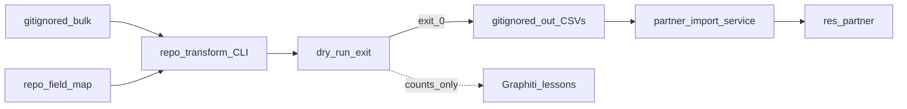

# PLAN: cieTrade → Odoo partners (RA + Improve aligned)

**Kernels applied to this plan (iteration only — no code):**
- [Improve.md](.cursor-commands/kernels/Improve.md) v3.0 — contract harden / entropy
- [Recursive Alignment.md](.cursor-commands/kernels/Recursive%20Alignment.md) v1.0 — architecture / SSOT / ownership audit

**RA mode:** audit → corrections applied **to the plan document** (user: “improve the plan in place”). Implementation still requires explicit execute.

**Alignment readiness:** ConditionallyReady — execution of transform/sample may proceed; **full promote blocked** on U1 Role confirm.

---

## Recursive Alignment audit (summary)

### Context lock

| Field | Value |
|-------|-------|
| Target | This plan + coupled surfaces: [`plasticos_partner_import`](plasticos_partner_import/), live `bulk/`, [`docs/cietrade_sm_export_research.md`](docs/cietrade_sm_export_research.md) |
| Purpose | Minimal-user-work land of cieTrade partners into `res.partner` |
| Consumers | Operator (approve dry-run), Odoo import service, agent (map/dry-run loop) |
| Excluded | Payables/WKS, `crm.lead`, Graphiti row store, Production, Gate/CEG |

### Authority adapters

| Adapter | Status | Governing source |
|---------|--------|------------------|
| PlasticOS layer / module ownership | Applied | `AGENTS.md`, layer deps on partner_import |
| Version bump on module change | Applied | `89-plasticos-odoo-version-bump` |
| Agent memory ≠ product I/O | Applied | ADR-0005 / Graphiti skill |
| First-order execution | Applied | `35-plasticos-first-order-execution` |
| Gate hub / CEG | NotApplicable | Partner CSV path does not call Gate |
| Pipeline_v2 | NotApplicable | Forbidden; untouched |

### Domain scores (plan-level; NotApplicable excluded)

| Domain | Status | Note |
|--------|--------|------|
| intent_and_scope | Pass | Partners only; memory bus rejected |
| communication_contracts | **Fail→corrected** | Header “byte-match” contradicted `parent_ref` |
| routing_and_integration | Pass | Headless service / ICP; no unauthorized bus |
| ownership_and_authority | **Fail→corrected** | Map+CLI were wholly gitignored → competing/non-reviewable SSOT |
| structure_and_source_of_truth | **Fail→corrected** | Split: repo owns map+CLI; gitignore owns bulk/out |
| schema_and_configuration | **Fail→corrected** | Facility schema = bundled columns + `parent_ref` |
| security | Pass | No Graphiti PII; dumps not committed |
| reliability_and_observability | AcceptedRisk | Service `cr.commit()` every 100 — rely on idempotent re-run |
| testing_and_validation | **Fail→corrected** | Added pure pytest for map/normalize |

**Weighted alignment (post plan-fix):** ~0.85 — remaining drag = U1 Role semantics Unknown (blocks full promote only).

### Confirmed findings → plan corrections

| ID | Sev | Finding | Root cause | Plan correction |
|----|-----|---------|------------|-----------------|
| RA-01 | High | Success criterion “byte-match bundled headers” conflicts with required `parent_ref` | Schema/compatibility ambiguity | Emit **superset**: exact bundled column order/names **plus** trailing `parent_ref`. Service reads `parent_ref` when present. |
| RA-02 | High | `field_map` + CLI only under gitignored `transform/` | Competing / invisible SSOT | **Repo owns** `plasticos_partner_import/data/cietrade/field_map.yaml` + `scripts/cietrade_to_partner_csv.py`. Live `transform/out/` stays gitignored. |
| RA-03 | Med | No automated test for Role/Type contracts | Validation underbuilt | Todo `transform-tests` — pure pytest, no Odoo. |
| RA-04 | Med | Bundled module CSVs + `post_init` auto-import compete with live pipeline | Dual seed paths | Do **not** replace bundled CSVs until full promote green; ICP/shell paths point at `transform/out`; leave post_init on bundled defaults. |
| RA-05 | Low | Improve-loop todo overlapped RA concerns without SSOT fix | Entropy | Merged into `dryrun-green` after repo CLI exists. |
| RA-06 | Info | Batch commit mid-import | Pre-existing importer | AcceptedRisk — document idempotent re-run as recovery. |

### Skipped RA passes (explicit)

- Gate/CEG routing deep-dive — NotApplicable  
- Neo4j / matching — OutOfScope  
- Production deploy adapters — OutOfScope until Docker green  

### Minimum safe next action (RA)

On execute: implement **RA-01/02 first** (repo `field_map.yaml` + `parent_ref` contract + CLI skeleton) before any Odoo write.

---

## Decision record (locked — post RA)

| Decision | Lock |
|----------|------|
| Target model | `res.partner` (corporate + children + nested contacts). Not `crm.lead`. |
| Data path | `bulk/` → **repo CLI** + **repo field_map** → `transform/out/*.csv` → `run_csv_import` |
| Memory | Graphiti lessons/PICKUP only. **Forbidden:** row payloads. |
| Map SSOT | [`plasticos_partner_import/data/cietrade/field_map.yaml`](plasticos_partner_import/data/cietrade/field_map.yaml) (create on execute) |
| CLI SSOT | [`plasticos_partner_import/scripts/cietrade_to_partner_csv.py`](plasticos_partner_import/scripts/cietrade_to_partner_csv.py) |
| Generated I/O | Gitignored live pack: `…/transform/out/` |
| Facility schema | Bundled facility headers + **`parent_ref`** (CpID). `partner_id` remains exact corporate name. |
| Parent resolve | `ref == parent_ref` then name fallback. Version bump required. |
| Promote env | Docker first; Odoo.sh after green. |
| User work | Approve dry-run + one shell/Settings run. |
| Payments / leads | Out. |



---

## Evidence (unchanged; still governing)

### Role letters (live n=1290)

`V:543 A:262 D:160 S:137 X:111 P:47 C:30`

### Provisional Role map (U1 — confirm before full)

| Letter | Importer `role` |
|--------|-----------------|
| C | `Customer` |
| S | `Supplier` |
| P | `Customer,Supplier` |
| X | `Customer,Expense` |
| D | `Expense` |
| V | `Supplier,Expense` |
| A | `Customer,Supplier,Expense` |

Derived from bundled ready-CSV role histogram (prior transform art), not from an official cieTrade legend.

### Address.Type normalize (mandatory)

| Live (upper) | Emit |
|--------------|------|
| `INVOICE` | `Invoice` |
| `PRIMARY`, `PRIMARY ADDRESS` | `Primary` |
| `REMIT` | `Remit` |
| `INV/REMIT`, `INV REMIT` | `Inv/Remit` |
| Delivery / pick-up / warehouse variants | `Location` |
| Else (incl. city-like) | `Location` (+ raw → Alias if empty) |

Allowlist after emit: `{Remit, Inv/Remit, Invoice, Primary, Location}` — else blocker.

---

## Objective and success

Land partners with minimal clicks; map→dry-run→fix→promote until clean.

1. Repo `field_map.yaml`: every CounterParty/Address/Contact column `mapped` or `deferred`; `map_id` versioned.  
2. CLI exit `0` iff blockers=0; `2` on blockers; `1` on IO/usage.  
3. Corporate headers = bundled corporate headers (exact). Facility = bundled facility headers **+** `parent_ref`.  
4. Sample 50: `ref=CpID` present; ranks/tags match map; parents via `parent_ref`; orphan facilities=0; `validate_partner_graph` clean or documented AcceptedRisk.  
5. Full (post U1): create-delta on re-run = 0.  
6. Zero Graphiti business-row ingests.  
7. `make pr-check` green when module code changes.

---

## Contracts

### CLI

```text
python3 plasticos_partner_import/scripts/cietrade_to_partner_csv.py \
  --bulk "$LIVE/bulk" \
  --map plasticos_partner_import/data/cietrade/field_map.yaml \
  --out "$LIVE/transform/out" \
  [--sample-cpids "$LIVE/transform/sample_50_cpids.txt"]
```

Outputs: `corporate_ready.csv`, `facility_ready.csv`, `dry_run_report.md`, `dry_run.json`.

**Blockers:** unknown Role; Type outside allowlist; duplicate/empty CpID/name; address CpID not in CounterParty set.

### Importer patch

- Read optional `parent_ref` from facility row.  
- Match `res.partner`: `("ref", "=", parent_ref), ("parent_id", "=", False)`.  
- Else existing name match / auto-create for invoice types.  
- Bump `19.0.2.7.3` → next patch; `make update m=plasticos_partner_import`.

### Promote

```python
env["plasticos.partner.import.service"].run_csv_import(corp_path, fac_path)
```

Paths must be container-visible (mount `transform/out`).

### Sample 50

Stratified across V/A/D/S/X/P/C; deterministic file under live `transform/` (gitignored).

---

## Critical path

1. lock-maps (repo)  
2. parent-by-ref + bump  
3. transform-cli  
4. transform-tests  
5. dryrun-green (Improve on CLI/map until exit 0)  
6. sample-promote  
7. **role-confirm (U1 gate)**  
8. full-promote  
9. playbook  

---

## Stress / rollback

- Wrong Role map → wrong ranks on ~1.3k partners → U1 gate + stratified sample.  
- Unpatched service ignores `parent_ref` → orphans → version bump mandatory before promote.  
- Rollback: disposable Docker DB; Staging snapshot; `plasticos_import.*` XML ID cleanup; no Production.

---

## Doc / root surface

| Surface | Action |
|---------|--------|
| `plasticos_partner_import/data/cietrade/field_map.yaml` | Create |
| `plasticos_partner_import/scripts/cietrade_to_partner_csv.py` | Create |
| `plasticos_partner_import/models/partner_import_service.py` | parent_ref |
| `__manifest__.py` | bump |
| tests (pure) for transform | Create |
| [`docs/cietrade_sm_export_research.md`](docs/cietrade_sm_export_research.md) | update |
| [`docs/README_plasticos_partner_import.md`](docs/README_plasticos_partner_import.md) | update parent_ref + CLI |

---

## Unknowns (gated)

| ID | Unknown | Gate |
|----|---------|------|
| U1 | Official Role letter meanings | **Human confirm** before full-promote |
| U2 | ContactRoleAssignment needed? | Contact.csv only in phase 1; reopen if sample missing AP/AR |
| U3 | Odoo.sh path layout | After Docker green |

---

## GMP handoff (on execute)

- **May modify:** repo map/CLI/tests; importer parent_ref + bump; playbook/README; gitignored out/.  
- **Must not:** Graphiti rows; pipeline_v2; replace bundled seed CSVs before full green; Production; commit golden dumps.  
- **Validate:** pytest transform; CLI exit 0; sample ORM; `make update m=plasticos_partner_import`; `make pr-check`.  
- **Next:** user says **execute** → implement RA-01/02 first.

---

## Dual-kernel execution checklist

| Kernel | When implementing |
|--------|-------------------|
| Recursive Alignment | Re-audit ownership: map/CLI in repo; out/ gitignored; no memory bus; header superset |
| Improve | Recursive passes on CLI+map until dry-run exit 0 and sample green |

Converge only when success 1–7 Observed Passed (full promote waits on U1).
