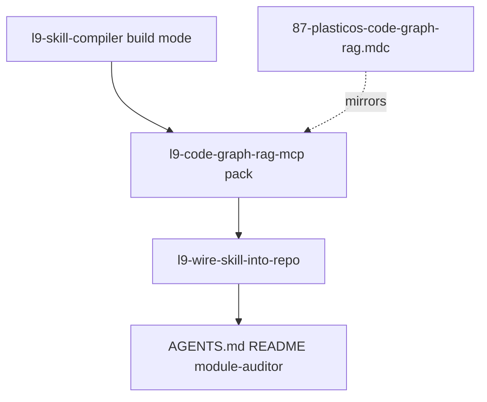

# Code-graph RAG governance (compiler-aligned)

## Decision

**Yes — rule + skill**, compiled with **`l9-skill-compiler`** (not ad-hoc `l9-create-skill` alone):

| Artifact | Role | Compiler layer |
|----------|------|----------------|
| [`.cursor/rules/87-plasticos-code-graph-rag.mdc`](.cursor/rules/87-plasticos-code-graph-rag.mdc) | Always-on enforcement (~15 lines) | Repo overlay — mirrors `references/kernel-tool-gate.md` |
| [`GlobalCommands/skills/l9-code-graph-rag-mcp/`](.cursor-commands/skills/l9-code-graph-rag-mcp/) | On-demand SOP + deterministic scripts | Full skill pack — control plane + kernels + scripts |



---

## Execution protocol (l9-skill-compiler)

Follow [`l9-skill-compiler/SKILL.md`](.cursor-commands/skills/l9-skill-compiler/SKILL.md) compact workflow:

1. **Parse** — objective, scope, triggers, constraints, outputs, risks, unknowns from: er77 README, prior session SOP, user verbatim rule, Graphiti/memory-bank boundary.
2. **First-order filter** — highest leverage = **deterministic index script** (zero chat tokens) + **always-on rule** (enforcement) + **lean SKILL.md** (routing only).
3. **Mode:** `build` — complete files only; no stubs.
4. **Design file tree** (below) before writing.
5. **Build** all linked files.
6. **Wire** — mandatory [`l9-wire-skill-into-repo`](.cursor-commands/skills/l9-wire-skill-into-repo/SKILL.md) + [`.claude/adapters/plasticos-repo-wiring.md`](.claude/adapters/plasticos-repo-wiring.md).
7. **Validate** — [`references/validation-checklist.md`](.cursor-commands/skills/l9-skill-compiler/references/validation-checklist.md); fail closed if any gate fails.

**Do not create** `agents/openai.yaml`. **Do not** hardcode `/Users/...` — use `$HOME`, `$REPO_ROOT`, `$GOV_ROOT` per governance SSOT law.

---

## Skill pack file tree (complete)

```
GlobalCommands/skills/l9-code-graph-rag-mcp/
├── SKILL.md                          # control plane (≤120 lines target)
├── references/
│   ├── kernel-token-hierarchy.md     # authority order: rules → grep → structural → semantic
│   ├── kernel-tool-gate.md           # allow/deny MCP tools + scoped prompt patterns
│   ├── memory-layer-boundary.md      # code-graph vs Graphiti vs memory-bank vs AGENTS.md
│   ├── tool-matrix.md                # all 26 tools: tier, token cost, when/when-not
│   ├── cli-indexing-contract.md      # JSON-RPC batch_index loop, incremental, health
│   ├── mcp-config-contract.md        # ~/.cursor/mcp.json shape, env vars, install path
│   └── troubleshooting.md            # empty graph, agent_busy, Node engine, log paths
├── scripts/
│   ├── code_graph_health.sh          # get_graph_health one-shot; exit 0/1
│   └── code_graph_batch_index.sh     # loops batch_index until done:true; prints progress
└── assets/
    ├── mcp-server-snippet.json       # template entry (no secrets) for manual MCP add
    └── scoped-prompts.md             # copy-paste user prompts that enforce scope
```

Every `references/*` and `scripts/*` file gets HTML-comment metadata per [`meta-standard.md`](.cursor-commands/skills/l9-skill-compiler/references/meta-standard.md).

---

## SKILL.md control plane (compiler contract)

Frontmatter (single block):

```yaml
---
name: l9-code-graph-rag-mcp
description: operate @er77/code-graph-rag-mcp for repo-local code structure — token-safe tool selection, cli indexing, importers, impact analysis, cross-module discovery. use when code-graph, batch_index, semantic code search, list_module_importers, analyze_code_impact, or mcp indexing is needed.
skill_schema: 1
layer: control_plane
role: skill_entrypoint
tags: [l9, mcp, code-graph, rag, token_discipline, plasticos]
owner: igor_beylin
status: active
version: 1.0.0
updated: 2026-06-06
sources:
  - er77/code-graph-rag-mcp@v2.7.15
  - session-sop-2026-06-06
---
```

Body sections (mirror `l9-gmp-protocol` shape):

| Section | Content |
|---------|---------|
| **Purpose** | Repo-local code structure graph; not episodic memory |
| **Core contract** | `AUTHORITY → TOOL GATE → INDEX VIA SCRIPT → SCOPED QUERY` |
| **Authority order** | `87-plasticos-code-graph-rag` → AGENTS/rules → Grep/Read → structural MCP → scoped semantic |
| **Compact workflow** | 1) confirm index (`scripts/code_graph_health.sh`) 2) index if empty (script, not chat) 3) resolve_entity → get_entity_source 4) importers/impact only when needed |
| **Behavior rules** | Never get_graph/clean_index/unscoped semantic_search; never full index in chat |
| **Resource map** | Link every reference + script with one-line purpose |
| **Validation** | Scripts exit 0; health shows entities; validation-checklist PASS |
| **Failure handling** | Fail closed; label Unknown; point to troubleshooting.md |

---

## Kernels (compressed power)

### `kernel-token-hierarchy.md`

Authority stack (load before any MCP call):

1. PlasticOS rules + `AGENTS.md` (free)
2. Grep/Read when symbol/path known (low)
3. Structural MCP: `resolve_entity`, `get_entity_source`, `list_module_importers`, `list_entity_relationships`, `analyze_code_impact` (medium-low)
4. Scoped `semantic_search` with module path hint (medium)
5. Forbidden in normal edits: `get_graph`, clone sweeps, `suggest_refactoring`, chat indexing

Include **PlasticOS-specific** shortcuts: `scripts/check_module_wiring.py`, manifest deps before `list_module_importers`.

### `kernel-tool-gate.md`

Machine-readable allow/deny table — **same content mirrored in rule 87**:

| Tier | Tools |
|------|-------|
| **Allow** | `resolve_entity`, `get_entity_source`, `list_module_importers`, `list_entity_relationships`, `analyze_code_impact`, `list_file_entities`, scoped `semantic_search` |
| **Deny in chat** | `get_graph`, `clean_index`, `reset_graph`, `detect_code_clones`, `jscpd_detect_clones`, `suggest_refactoring`, `index`, `batch_index` |
| **CLI only** | `batch_index`, `index`, `clean_index`, `reset_graph` via `scripts/code_graph_batch_index.sh` |

### `memory-layer-boundary.md`

| Layer | Store | Question it answers |
|-------|-------|---------------------|
| `memory-bank/` | Git | What task were we on? |
| Graphiti | VPS Neo4j | What did we decide? |
| code-graph RAG | `.code-graph-rag/vectors.db` | Where in code / who imports? |
| AGENTS.md / rules | Repo | How does CI/Odoo work here? |

Agents must not write decisions to code-graph or confuse layers.

---

## Scripts (compounding leverage)

Per [`file-contract.md`](.cursor-commands/skills/l9-skill-compiler/references/file-contract.md) — deterministic, testable, named in SKILL.md.

### `code_graph_health.sh`

- Resolves `$CODE_GRAPH_BIN` → `$HOME/.local/code-graph-rag-mcp/node_modules/.bin/code-graph-rag-mcp`
- Args: `$REPO_ROOT` (required)
- Calls `get_graph_health`; prints entity counts; exit 1 if graph empty

### `code_graph_batch_index.sh`

- Same bin/repo resolution
- Loops `batch_index` with `maxFilesPerBatch=200` until `done:true`
- Resumes via `sessionId`; safe to re-run
- **Agent instruction:** run this script in terminal — never emulate JSON-RPC in chat

Both scripts documented in SKILL.md § Compact workflow step 1–2.

---

## Repo rule 87 (enforcement mirror)

[`87-plasticos-code-graph-rag.mdc`](.cursor/rules/87-plasticos-code-graph-rag.mdc):

```yaml
---
description: Code-graph RAG MCP discipline — grep first, graph for structure only.
alwaysApply: true
---
```

Body — user verbatim + skill pointer:

- Prefer **Grep/Read** for known symbols.
- **code-graph** only for importers, impact analysis, unknown cross-module location.
- **Never** `get_graph`, `clean_index`, unscoped `semantic_search`; **never** index in chat.
- Index via `@.cursor-commands/skills/l9-code-graph-rag-mcp/scripts/code_graph_batch_index.sh`.
- Load **`l9-code-graph-rag-mcp`** for full SOP.
- Not episodic memory — Graphiti + `memory-bank/` when live.

**Router line** in [`00-plasticos-master-context.mdc`](.cursor/rules/00-plasticos-master-context.mdc):

> Code navigation / code-graph MCP → **`87-plasticos-code-graph-rag`** + **`l9-code-graph-rag-mcp`**

---

## Wiring (plasticos adapter)

[`plasticos-repo-wiring.md`](.claude/adapters/plasticos-repo-wiring.md):

| Target | Action |
|--------|--------|
| `.claude/README.md` | L9 Global Skills row: `@.cursor-commands/skills/l9-code-graph-rag-mcp/` |
| `AGENTS.md` | Agent Skills row with triggers + `make`-less (MCP/CLI) |
| `00-plasticos-master-context.mdc` | TASK ROUTER line |
| `.claude/agents/module-auditor.md` | **Preload** `l9-code-graph-rag-mcp` (cross-module wiring audits) |
| `.claude/agents/code-reviewer.md` | **No preload** — on-demand only (avoid tool sprawl on every PR review) |

Optional adapter patch: add preload row to plasticos-repo-wiring § Wire Subagents table.

**Governance backup:** `make governance-backup` after GlobalCommands edit (separate from PlasticOS `make push`).

---

## Validation gates (fail closed)

From [`validation-checklist.md`](.cursor-commands/skills/l9-skill-compiler/references/validation-checklist.md):

- [ ] All pack files exist, non-empty, linked from SKILL.md
- [ ] Frontmatter audit fields complete; `name` matches directory
- [ ] No stubs, no invented paths, no `agents/openai.yaml`
- [ ] `bash scripts/code_graph_health.sh "$REPO_ROOT"` runs (may show empty pre-index — OK)
- [ ] `l9-wire-skill-into-repo` reports **Validation: PASS**
- [ ] Rule 87 text consistent with `kernel-tool-gate.md`
- [ ] `.code-graph-rag/` in `.gitignore`

---

## Relationship to Graphiti plan

Separate initiative — no blocker. Cross-link only in `memory-layer-boundary.md` and optional Graphiti Phase 7 tool-sprawl checklist.

---

## Files touched (execution)

| Repo | Files |
|------|-------|
| **GlobalCommands** | `skills/l9-code-graph-rag-mcp/**` (full pack) |
| **IB-Odoo_19** | `.cursor/rules/87-plasticos-code-graph-rag.mdc`, router in `00-plasticos-master-context.mdc`, `.gitignore`, `AGENTS.md`, `.claude/README.md`, `.claude/agents/module-auditor.md` |
| **Optional** | `.claude/adapters/plasticos-repo-wiring.md` preload row |
