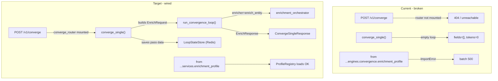

# Converge Loop Wiring Plan

## Architecture: Current vs Target




---

## File 1 — `[app/api/v1/converge.py](app/api/v1/converge.py)`

### Fix A — Import path (line 23, 1 line changed)

Wrong path — file lives at `app/services/`, not `app/engines/convergence/`:

```python
# BEFORE (lines 23-26)
from ...engines.convergence.enrichment_profile import (
    EnrichmentProfile,
    ProfileRegistry,
)

# AFTER
from ...services.enrichment_profile import (
    EnrichmentProfile,
    ProfileRegistry,
)
```

### Fix B — Add missing imports (after line 16)

The handler needs the controller, config, schemas and settings but none are imported:

```python
from ...core.config import get_settings
from ...engines import convergence_controller
from ...engines.convergence.convergence_config import ConvergenceConfig
from ...engines.enrichment_orchestrator import enrich_entity
from ...models.schemas import EnrichRequest
```

Also replace `import logging` (line 14) with `import structlog` and change the logger at line 50:

```python
# line 14: import logging  →  remove
# line 50: logger = logging.getLogger(__name__)
logger = structlog.get_logger(__name__)
```

### Fix C — Expand module-level state + `configure()` (lines 56-70)

`converge_single()` needs `kb_resolver` and `idem_store` — they must be injected at startup like `_state_store` already is:

```python
# Add two new module-level slots alongside existing ones
_kb_resolver: Any = None
_idem_store_ref: Any = None

# Expand configure() signature
def configure(
    state_store: LoopStateStore,
    profile_registry: ProfileRegistry,
    domain_specs: dict[str, dict[str, Any]],
    kb_resolver: Any = None,
    idem_store: Any = None,
) -> None:
    global _state_store, _profile_registry, _domain_specs, _kb_resolver, _idem_store_ref
    _state_store = state_store
    _profile_registry = profile_registry
    _domain_specs = domain_specs
    _kb_resolver = kb_resolver
    _idem_store_ref = idem_store
```

### Fix D — Replace stub body in `converge_single()` (lines 132-218)

The pass loop (lines 148-195) and the static empty `PassResult` construction are the stub. Replace the entire function body with a controller delegation:

```python
@router.post("/converge")
async def converge_single(body: ConvergeRequestBody) -> ConvergeSingleResponse:
    store = _get_state_store()
    settings = get_settings()

    state = LoopState(
        entity_id=str(body.entity.get("id", body.entity.get("Name", "unknown"))),
        domain=body.domain,
        status=LoopStatus.RUNNING,
    )
    await store.save(state)

    # Build EnrichRequest from API body
    enrich_request = EnrichRequest(
        entity=body.entity,
        object_type=body.object_type,
        objective=body.objective,
        schema=None,
    )
    conv_config = ConvergenceConfig(
        max_passes=body.max_passes,
        confidence_threshold=body.convergence_threshold,
    )

    try:
        enrich_response = await convergence_controller.run_convergence_loop(
            request=enrich_request,
            settings=settings,
            kb_resolver=_kb_resolver,
            idem_store=_idem_store_ref,
            enricher=enrich_entity,
            domain_spec=_domain_specs.get(body.domain),
            convergence_config=conv_config,
        )
    except Exception as exc:
        state.status = LoopStatus.FAILED
        state.failure_reason = str(exc)
        await store.save(state)
        raise HTTPException(status_code=500, detail=str(exc)) from exc

    # Map controller pass data back to LoopState PassResults
    passes_completed = int(enrich_response.uncertainty_score or 0)  # controller stores pass count here
    state.accumulated_fields = enrich_response.fields or {}
    state.current_pass = passes_completed
    state.status = LoopStatus.CONVERGED if enrich_response.state == "completed" else LoopStatus.FAILED

    # Populate cost summary from feature_vector if present
    cost_info = (enrich_response.feature_vector or {}).get("cost_summary", {})
    if cost_info:
        from ...engines.convergence.cost_tracker import CostSummary
        state.cost_summary = CostSummary(**cost_info)

    await store.save(state)

    convergence_reason = (
        "converged" if passes_completed < body.max_passes else "max_passes"
    )

    return ConvergeSingleResponse(
        run_id=state.run_id,
        status=state.status.value,
        passes_completed=passes_completed,
        fields_discovered=len(state.accumulated_fields),
        tokens_used=enrich_response.tokens_used,
        cost_usd=cost_info.get("total_cost_usd", 0.0),
        convergence_reason=convergence_reason,
    )
```

---

## File 2 — `[app/main.py](app/main.py)`

### Fix E — Add imports (after line 20)

```python
import redis.asyncio as aioredis

from .api.v1.converge import configure as configure_converge
from .api.v1.converge import router as converge_router
from .engines.convergence.loop_state import RedisLoopStateStore
from .services.enrichment_profile import ProfileRegistry
```

### Fix F — Startup wiring in `lifespan()` (after line 61, after `register_orchestration` call)

`RedisLoopStateStore` takes a redis client object (not a URL). Reuse `_idem.client` if Redis is available — avoids a second connection pool:

```python
# Wire convergence loop infrastructure (after register_orchestration call)
if _idem is not None:
    loop_state_store = RedisLoopStateStore(_idem.client)
    profile_registry = ProfileRegistry()
    domain_specs: dict = {}  # populated by DomainPackLoader when domain YAMLs present
    configure_converge(
        state_store=loop_state_store,
        profile_registry=profile_registry,
        domain_specs=domain_specs,
        kb_resolver=_kb,
        idem_store=_idem,
    )
    logger.info("converge_configured", profiles=len(profile_registry))
else:
    logger.warning("converge_not_configured", reason="redis_unavailable")
```

If Redis is unavailable, `configure_converge` is never called, so `_state_store` stays `None` and every converge request returns `503` via `_get_state_store()` — clean degradation, no crash.

### Fix G — Mount the router (after line 95)

```python
# After: app.include_router(chassis_router)
app.include_router(converge_router)
```

---

## Summary


| #   | File          | Lines                     | What changes                                                                 |
| --- | ------------- | ------------------------- | ---------------------------------------------------------------------------- |
| A   | `converge.py` | 1                         | Fix `engines.convergence.enrichment_profile` → `services.enrichment_profile` |
| B   | `converge.py` | +5                        | Add missing imports                                                          |
| C   | `converge.py` | +2 slots, ~8 in configure | Expand `configure()` to accept `kb_resolver` + `idem_store`                  |
| D   | `converge.py` | ~87 → ~50                 | Replace stub loop with real controller call                                  |
| E   | `main.py`     | +5                        | New imports                                                                  |
| F   | `main.py`     | +12                       | Startup wiring: create store, registry, call `configure_converge`            |
| G   | `main.py`     | +1                        | `app.include_router(converge_router)`                                        |


All 6 converge routes become live. `/v1/scan` becomes reachable. Batch route `/v1/converge/batch` stops crashing on import. The pass loop runs real enrichment + inference on every call instead of returning empty fields.