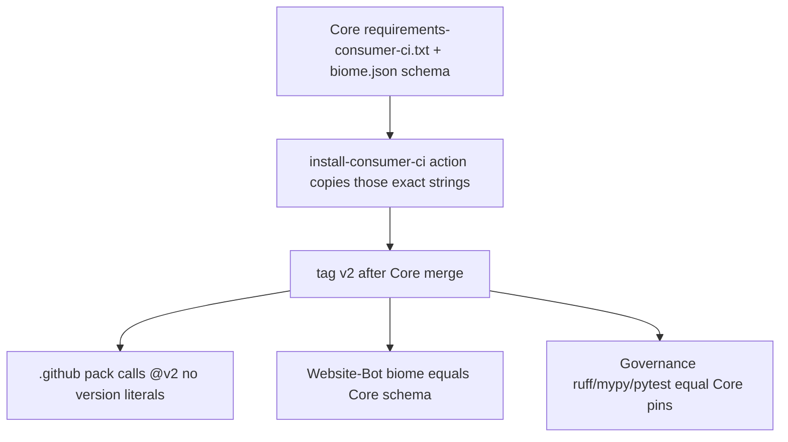

# Core-identical toolchain locks (no invented versions)

This replaces the prior plan’s lock set. That plan used `ruff==0.16.2` because Governance already had it. **Wrong.** Core is the only authority. Governance must move to Core, not the other way around.

## Authority law (fail-closed)

At execute, re-read these two Core files at `origin/main`. Those strings are the lock. If they differ from this plan’s snapshot, **use the files**, not this snapshot.

- Python SSOT: [`requirements-consumer-ci.txt`](https://github.com/Quantum-L9/l9-ci-core/blob/main/requirements-consumer-ci.txt)
- Biome SSOT: [`presets/typescript/biome.json`](https://github.com/Quantum-L9/l9-ci-core/blob/main/presets/typescript/biome.json) `$schema` (the `2.5.8` in `https://biomejs.dev/schemas/2.5.8/schema.json`)

**Snapshot at Core `0d28395428426853c44825c4645c23ee8ace23b1` (2026-08-17):**

- `ruff==0.16.1`
- `mypy==2.3.0`
- `pytest==9.1.1`
- Biome `2.5.8`

Forbidden:

- Bumping Core to `0.16.2` / `0.16.3` / latest PyPI because it is newer
- Leaving Governance on `ruff==0.16.2` (“already newer”)
- Writing a different ruff/mypy/pytest/biome string in Website-Bot, the org pack, or Governance
- Copying pin files into consumers as a second SSOT (callers only, except Governance local venv which must **equal** Core)

Identity rule: after the program, `ruff`/`mypy`/`pytest`/`biome` version strings that appear as locks in R1–R4 are **character-identical** to Core’s two authority files. V-IDENT fails on any mismatch.

## What is drift today (align TO Core, do not pick a third number)

- Core pin file: `ruff==0.16.1`
- Core pre-commit: `rev: v0.14.5` (internal Core drift — set to `v0.16.1`)
- Core `pr-pipeline.yml` fallback: `ruff==0.14.5` `mypy==1.19.0` `pytest==8.4.2` (delete; install the pin file)
- Core `ruff.toml` comment still says `ruff==0.14.5` (comment only; do not change rule set)
- Governance `requirements.txt` / `pyproject.toml`: `ruff==0.16.2` (change to `0.16.1`)
- Governance pre-commit: `rev: v0.16.0` plus “sdk wins over core” (change to `v0.16.1`; drop that comment)
- Website-Bot `@biomejs/biome`: `2.5.8` (already equals Core schema; keep; Dependabot-ignore so it cannot leave)
- `l9-ci-sdk` biome schema `2.5.5` (follow-on; do not “fix” from this program)

## Percolation (unchanged mechanism)



Installer lives at `l9-ci-core/.github/actions/install-consumer-ci/` because `$GITHUB_ACTION_PATH` only ships that directory. Pin **values** inside it must be the existing Core pin file, moved or included — not rewritten to a preferred version.

Do not add a new `.github/workflows/*.yml` unless `tests/workflows/test_phase_scope.py` expected set is updated. Retag `v2` via `tools/publish_consumer_ci_tag.sh`. `v2` does not exist yet.

## Repo isolation

Four clones, four branches from each `origin/main`, four PRs. Never mix.

- **R1 Core** — only place the lock is **authored**. Baseline re-resolve; last seen `0d28395428426853c44825c4645c23ee8ace23b1`. Move existing pins into the action; align pre-commit/fallback **to** the pin file. Do not bump the pin file.
- **R2 `Quantum-L9/.github`** — callers only. Zero `ruff==` / `mypy==` / `pytest==` / biome version literals in `l9-ci-pack`.
- **R3 Website-Bot** — new branch from `origin/main` (dirty tree is not the baseline). Biome lock must equal Core `2.5.8`. Dependabot ignore `@biomejs/biome`. No `requirements-consumer-ci.txt`. No WIP files.
- **R4 Governance** — `ruff`/`mypy`/`pytest` in `requirements.txt`, `pyproject.toml`, and `.pre-commit-config.yaml` must equal Core pins (`0.16.1` / `2.3.0` / `9.1.1`). Ignore those three in Dependabot. Skill tells agents to call the action.

## R1 Core work (no version invention)

Create action files by **moving** the current pin file contents:

- `requirements-consumer-ci.txt` inside the action = current root file (`ruff==0.16.1` …)
- `toolchain-lock.json` derived from that file plus biome schema `2.5.8`
- Root `requirements-consumer-ci.txt` becomes `-r .github/actions/install-consumer-ci/requirements-consumer-ci.txt`
- `install.sh` fail-closed; no unpinned `pip install ruff`
- `action.yml` runs `install.sh` from `github.action_path`

Align Core to its own pin file:

- `.pre-commit-config.yaml` `rev: v0.16.1` (from `v0.14.5`)
- Delete `pr-pipeline.yml` else-branch `0.14.5` / `1.19.0` / `8.4.2`
- Replace preset/template `command -v ruff || pip install ruff` with `uses: …/install-consumer-ci@v2`
- Delete Dependabot `pip` / `deps(consumer-ci)` block
- Rewrite `docs/consumer-lint-test.md`: versions are Core-owned; consumers call `@v2`
- Test: pre-commit `rev` == `v` + pin `ruff==`; lock JSON == pin file; `test_phase_scope` still exact-set
- `stamp.sh` **exists** on current main; do not invent a new stamp; do not change `biome.json` schema unless Core’s file already changed

## R2 / R3 / R4 (identical strings only)

- Pack Python workflow: `uses: Quantum-L9/l9-ci-core/.github/actions/install-consumer-ci@v2` after Core `v2` exists. Start R2 only after tag.
- Website-Bot: if `package.json` biome != Core schema, set it to Core’s version and refresh the lockfile **only for that package**. Today it already matches `2.5.8`. Dependabot ignore. No python pins.
- Governance: replace `0.16.2` with Core’s `0.16.1` in both manifests; pre-commit `v0.16.1`; delete “sdk wins over core”; Dependabot ignore `ruff` `mypy` `pytest`.

## Success properties

- **SP-AUTH** Execute log shows the two Core files were read and the four strings recorded before any edit.
- **SP-01** Action pin file at `v2` equals Core’s pre-change pin file (`ruff==0.16.1` unless Core’s file moved).
- **SP-02** `toolchain-lock.json` biome equals Core `biome.json` `$schema` minor (`2.5.8`).
- **SP-03** Core pre-commit `rev` == `v` + pin ruff (`v0.16.1`).
- **SP-04** No stale fallback pins and no bare `pip install ruff|mypy|pytest` in Core workflows/presets.
- **SP-05** Core Dependabot has no `pip` consumer-ci ecosystem.
- **SP-06** Pack has `@v2` caller and no version literals.
- **SP-07** Website-Bot `@biomejs/biome` == Core biome schema version; Dependabot ignores it; no python pin file.
- **SP-08** Governance `ruff`/`mypy`/`pytest` strings == Core pin file; pre-commit matches ruff; Dependabot ignores those three.
- **SP-09** Core `make agent-check`; Governance `make pr-check`.
- **SP-IDENT** V-IDENT: extracted lock strings from R1 action, R3 package.json, R4 requirements/pyproject/pre-commit are identical to the Core authority files. Any extra version is a fail.

## Validation

**V-AUTH (before edits):**

```bash
gh api repos/Quantum-L9/l9-ci-core/contents/requirements-consumer-ci.txt?ref=main --jq .content | base64 -d
gh api repos/Quantum-L9/l9-ci-core/contents/presets/typescript/biome.json?ref=main --jq .content | base64 -d | rg 'biomejs.dev/schemas/'
```

Record `CORE_RUFF`, `CORE_MYPY`, `CORE_PYTEST`, `CORE_BIOME`. All later writes use these variables.

**V-CORE / V-TAG / V-PACK** as before, but greps use `$CORE_RUFF` not `0.16.2`.

**V-IDENT (required):**

```bash
# fail if any written lock != Core authority
test "$(rg -N '^ruff==' "$CORE_ACTION_PINS")" = "ruff==${CORE_RUFF#ruff==}"
# Governance
rg -n "ruff==${CORE_RUFF#ruff==}" ~/.cursor-governance/requirements.txt
rg -n "ruff==${CORE_RUFF#ruff==}" ~/.cursor-governance/pyproject.toml
rg -n "rev: v${CORE_RUFF#ruff==}" ~/.cursor-governance/.pre-commit-config.yaml
# Website-Bot
rg -n "\"@biomejs/biome\": \"${CORE_BIOME}\"" package.json
# Pack has no literals
rg -n 'ruff==|mypy==|pytest==|@biomejs/biome' l9-ci-pack && echo FAIL || echo PASS
```

**V-GOV:** `make pr-check` after the **downgrade** to Core’s ruff. Do not keep `0.16.2` to make a local test green.

## Out of scope

- Choosing a “better” ruff than Core’s pin file
- Stamping `ruff.toml` into consumers
- Mass fan-out PRs
- Pack Node ESLint→Biome rewrite
- `l9-ci-sdk` 2.5.5 follow-on
- Auto-merge / `@main`
- Website-Bot dirty WIP

## Unknowns

- **U-01** Push/tag rights on Core and `.github` — probe at execute
- **U-02** Core pin file may change before execute — use the file, not this snapshot
- **U-03** SDK Biome 2.5.5 — accept_bounded follow-on

## Execute

`@environment/program-execution` then `/autonomy`. `autonomous_merge: false`. Core PR first, tag `v2`, then pack, then Website-Bot + Governance in parallel. Four PRs, never mixed.
