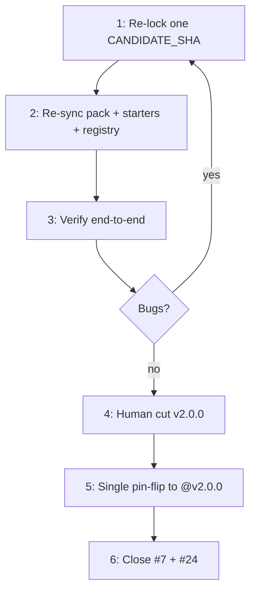

# Residual: verify → cut `v2.0.0` → pin-flip

## Already delivered (do not redo)

- Core #33 / #23 merged; yaml provision fixes on main; stale `54a2f2fc…` pin gone from Core templates.
- Root [`AGENTS.md`](AGENTS.md) rewritten as agent SSOT (template flow, consumer integrate, Core↔SDK ownership).
- `Quantum-L9/.github/l9-ci-pack/` exists (6 governance + `l9-analysis` + both lint templates) with agent README linking Core `AGENTS.md`.
- Org `workflow-templates/l9-v2-*` starters wired; legacy `@v1` starters marked Legacy (frozen).
- `ops/sync-v2-starters.sh` + `ops/validate-starters.sh` + CI present.
- Core `docs/templates/` no longer owns ISSUE/PR templates (org community-health only).
- Historical `@v1` / `@v1.0.0` tags exist on `l9-ci-core` (live peel → `978cf94…`, v1-compat kernels #44) — `pr-pipeline.yml@v1` resolves.
- `gate evaluate` already wired into `analyze-semgrep.yml` (plan’s dormant triage default of “defer” was superseded). Remaining dormant SDK ops (`providers list/detect`, `semgrep detect`, …) stay deferred post-`v2.0.0`.

## Current blocker

Pin drift — nothing is frozen for release:

| Surface | Pin today |
|---------|-----------|
| Core `docs/templates/l9-analysis.yml` | `373bb6d26084e67ef76aaab95021364182a34ee7` (= `origin/main`) |
| `.github/l9-ci-pack/` + README + registry `v2.current_sha` | `f88116503430aa18992b70d8d31063e34ff97ef1` |
| Registry root `current_sha` | still `2b330a5…` (stale) |
| `v2` / `v2.0.0` tags | **none** |
| Issues | [core#24](https://github.com/Quantum-L9/l9-ci-core/issues/24) and [.github#7](https://github.com/Quantum-L9/.github/issues/7) still OPEN |

Also leftover (non-blocking for v2 cut): `ops/tag-v1.sh` still asserts `origin/main == EXPECTED_SHA` and hardcodes `2a3270be5…`, which matches neither `main` nor the live `v1.0.0` commit. Optional cleanup later; not on the release critical path.

## Decision (unchanged)

- Do **not** cut `v2.0.0` until the consumer path is verified green on one frozen **CANDIDATE_SHA**.
- No restoring retired kernels onto Core `main`.
- Human cuts tags; agents do not auto-push.

---

## 1 — Re-lock `CANDIDATE_SHA`

1. Choose **one** SHA to freeze (prefer current Core `origin/main` = `373bb6d…` unless a known regression forces staying on `f881165…`).
2. Minimum bar still applies: SHA must include `98f012f` + `d2c2cd7` (venv requirements + `_load_yaml_module`) — both already on main.
3. Record the SHA in the handoff / PR; do **not** write `@v2.0.0` yet.

## 2 — Re-sync `.github` to that SHA

In `Quantum-L9/.github`:

1. Run / update `ops/sync-v2-starters.sh` so `l9-ci-pack/` and `l9-v2-*` starters match Core `docs/templates/` at `CANDIDATE_SHA`.
2. Set registry `v2.current_sha` → `CANDIDATE_SHA`; keep `status: pre-release-candidate`.
3. Fix root `current_sha: "2b330a5…"` (stale) to the live `@v1` peel (`978cf94…`) or document that root field is legacy-only — do not leave the wrong historical SHA unexplained.
4. Pack README “Pin Core at …” line must match the same SHA.

In Core (if chosen SHA is `origin/main`): confirm `docs/templates/` pins already equal that SHA (today they do for `373bb6d…`).

## 3 — Verify before any v2 cut

All against the **frozen** `CANDIDATE_SHA`:

1. Core: `python3 -m unittest discover tests` (+ self-ci green on that commit).
2. `ops/validate-starters.sh` pass (legacy `@v1` + new `@CANDIDATE_SHA`).
3. API: `publish-analysis.yml?ref=CANDIDATE_SHA` → 200; `pr-pipeline.yml?ref=v1` → 200.
4. Dogfood Python path from pack README only — non-shadow publish; must not reproduce `ModuleNotFoundError: yaml`.
5. Dogfood Node path (or dry-run checklist): analysis + `l9-lint-test-node`.
6. If anything fails: fix on Core `main` → new `CANDIDATE_SHA` → re-sync → re-verify. Still **no** `v2.0.0` tag.

**Exit criterion:** written “verified at SHA …” note; pack README accurate; SHA frozen.

## 4 — Cut `v2.0.0` (human only)

1. Confirm release target **equals** frozen `CANDIDATE_SHA` (explicit arg if `main` moved): `bash docs/release/tag-and-release.sh $CANDIDATE_SHA`.
2. Confirm `release-validation.yml` green.
3. Leave issue close for step 6 (after pin-flip).

## 5 — Single pin-flip to `@v2.0.0`

One coordinated change set (Core + `.github`):

- Replace every `CANDIDATE_SHA` in Core templates, `l9-ci-pack/`, v2 starters, registry, sync script, pack README, and AGENTS.md pin examples with `@v2.0.0`.
- Registry `v2.status` → `released`.
- Re-run `validate-starters.sh` (expect `@v2.0.0` resolves).

No second hash bump after this unless cutting `v2.0.1`.

## 6 — Close issues

- Close [.github#7](https://github.com/Quantum-L9/.github/issues/7) (starters/registry no longer stranded on missing `@v1` for new work; legacy starters intentionally stay on frozen `@v1`).
- Close [core#24](https://github.com/Quantum-L9/l9-ci-core/issues/24) after the release + pin-flip are live.

---

## Out of scope (unchanged)

- Re-adding Scorecard/SBOM/Gitleaks/pre-commit as Core reusable workflows.
- Wiring remaining dormant SDK CLI ops before this cut.
- Fixing `ops/tag-v1.sh` `main==EXPECTED` assertion (optional hygiene; `@v1` already published).
- Auto-pushing tags from agents.
- Migrating every org repo off legacy wrappers.
