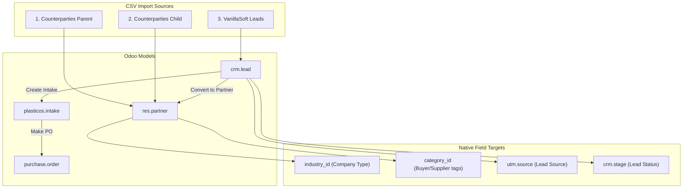

# CRM Integration Build Plan (REVISED)

## Overview

This build integrates Odoo's native CRM module, consolidates custom fields with Odoo native equivalents, fixes the `company_type` bug, expands intake statuses, and adds VanillaSoft CSV import for `crm.lead` records.

---

## Architecture: Data Flow




---

## Phase 1: Bug Fix (BLOCKER)

### Task 1.1: Fix `company_type` ValueError

**Problem:** `company_type` is a computed (non-stored) field in Odoo 19. Cannot use in search domains.

**Files to modify:**

1. `[plasticos_partner_import/models/validation.py](plasticos_partner_import/models/validation.py)`
  - Replace `("company_type", "=", "company")` with `("is_company", "=", True)`
  - Replace `("company_type", "=", "person")` with `("is_company", "=", False)`
  - Replace in-memory checks `p.company_type == "company"` with `p.is_company`
2. `[plasticos_partner_import/models/partner_import_service.py](plasticos_partner_import/models/partner_import_service.py)`
  - Remove `"company_type"` from `vals` dictionaries (write to `is_company` instead)

---

## Phase 2: Enable CRM Module

### Task 2.1: Add CRM dependency

**File:** `[plasticos_base/__manifest__.py](plasticos_base/__manifest__.py)`

```python
"depends": ["base", "mail", "crm", ...],  # Add "crm"
```

---

## Phase 3: Migrate Lead Source to UTM

### Task 3.1: Create utm.source data

**New file:** `plasticos_facility_profile/data/utm_source_data.xml`

```xml
<odoo>
    <record id="utm_source_web_lead" model="utm.source">
        <field name="name">Web Lead (Marketing)</field>
    </record>
    <record id="utm_source_sales_manual" model="utm.source">
        <field name="name">Sales Manual Entry</field>
    </record>
    <record id="utm_source_referral" model="utm.source">
        <field name="name">Referral</field>
    </record>
    <record id="utm_source_pallet_central" model="utm.source">
        <field name="name">Pallet Central</field>
    </record>
    <record id="utm_source_google" model="utm.source">
        <field name="name">Google</field>
    </record>
    <record id="utm_source_igor_beylin" model="utm.source">
        <field name="name">Igor Beylin</field>
    </record>
</odoo>
```

### Task 3.2: Migrate lead_source_id field

**Files to modify:**

1. `[plasticos_facility_profile/models/res_partner.py](plasticos_facility_profile/models/res_partner.py)`

```python
   # Change from:
   lead_source_id = fields.Many2one("plasticos.lead.source", ...)
   # To:
   lead_source_id = fields.Many2one("utm.source", ...)


```

1. `[plasticos_intake/models/intake.py](plasticos_intake/models/intake.py)`
  - Same change for `lead_source_id`
2. `[plasticos_web_leads/models/web_lead.py](plasticos_web_leads/models/web_lead.py)`
  - Update lookup to use `utm.source`

### Task 3.3: Delete custom lead source model

**Files to delete:**

- `plasticos_facility_profile/models/lead_source.py`
- `plasticos_facility_profile/views/lead_source_views.xml`
- `plasticos_facility_profile/data/lead_source_data.xml`

**Files to update:**

- `plasticos_facility_profile/__manifest__.py` - remove references
- `plasticos_facility_profile/models/__init__.py` - remove import

---

## Phase 4: Consolidate Custom Fields

### Task 4.1: Migrate partner_type_id to industry_id

**Current:** `partner_type_id = Many2one("plasticos.partner.type")`
**Target:** `industry_id = Many2one("res.partner.industry")` (native)

**Steps:**

1. Create `res.partner.industry` records for existing partner types
2. Write migration script to copy `partner_type_id.name` to `industry_id`
3. Remove `partner_type_id` field from `res_partner.py`
4. Delete `plasticos.partner.type` model

**New file:** `plasticos_facility_profile/data/industry_data.xml`

```xml
<odoo>
    <record id="industry_distribution_center" model="res.partner.industry">
        <field name="name">Distribution Center</field>
    </record>
    <record id="industry_pallet_recycler" model="res.partner.industry">
        <field name="name">Pallet Recycler</field>
    </record>
    <record id="industry_commercial_recycler" model="res.partner.industry">
        <field name="name">Commercial Recycler</field>
    </record>
    <record id="industry_compounder" model="res.partner.industry">
        <field name="name">Compounder</field>
    </record>
    <record id="industry_ewaste" model="res.partner.industry">
        <field name="name">E-Waste</field>
    </record>
    <record id="industry_grinder_processor" model="res.partner.industry">
        <field name="name">Grinder/Processor</field>
    </record>
</odoo>
```

### Task 4.2: Migrate x_facility_role to category_id

**Current:** `x_facility_role = Selection([...])` (single value)
**Target:** `category_id = Many2many("res.partner.category")` (tags, multiple values)

**Steps:**

1. Create `res.partner.category` records for facility roles
2. Write migration script to convert `x_facility_role` to `category_id` tags
3. Remove `x_facility_role` field

**New file:** `plasticos_facility_profile/data/partner_category_data.xml`

```xml
<odoo>
    <record id="category_buyer" model="res.partner.category">
        <field name="name">Buyer</field>
    </record>
    <record id="category_supplier" model="res.partner.category">
        <field name="name">Supplier</field>
    </record>
    <record id="category_freight" model="res.partner.category">
        <field name="name">Freight</field>
    </record>
    <record id="category_service_provider" model="res.partner.category">
        <field name="name">Service Provider</field>
    </record>
    <record id="category_processor" model="res.partner.category">
        <field name="name">Processor</field>
    </record>
    <record id="category_broker" model="res.partner.category">
        <field name="name">Broker</field>
    </record>
    <record id="category_recycler" model="res.partner.category">
        <field name="name">Recycler</field>
    </record>
</odoo>
```

---

## Phase 5: Expand Intake Statuses

### Task 5.1: Update status field

**File:** `[plasticos_intake/models/intake.py](plasticos_intake/models/intake.py)`

```python
status = fields.Selection([
    ("draft", "Draft"),
    ("matched", "Matched"),
    ("offer_sent", "Offer Sent"),      # NEW
    ("won", "Won / PO Made"),          # NEW
    ("lost", "Lost"),                  # NEW
    ("expired", "Expired"),            # RENAMED from expired/lost
], default="draft", tracking=True, index=True)
```

### Task 5.2: Update intake views

**File:** `[plasticos_intake/views/intake_views.xml](plasticos_intake/views/intake_views.xml)`

- Update statusbar widget with new states

---

## Phase 6: Create CRM Module

### Task 6.1: Create plasticos_crm module

**New module structure:**

```
plasticos_crm/
├── __init__.py
├── __manifest__.py
├── models/
│   ├── __init__.py
│   └── crm_lead.py
├── views/
│   └── crm_lead_views.xml
├── data/
│   └── crm_stage_data.xml
└── security/
    └── ir.model.access.csv
```

### Task 6.2: Create CRM stages

**File:** `plasticos_crm/data/crm_stage_data.xml`

```xml
<odoo>
    <record id="stage_active_supplier" model="crm.stage">
        <field name="name">Active Supplier</field>
        <field name="sequence">1</field>
    </record>
    <record id="stage_hot" model="crm.stage">
        <field name="name">Hot</field>
        <field name="sequence">2</field>
    </record>
    <record id="stage_warm" model="crm.stage">
        <field name="name">Warm</field>
        <field name="sequence">3</field>
    </record>
    <record id="stage_cold" model="crm.stage">
        <field name="name">Cold</field>
        <field name="sequence">4</field>
    </record>
    <record id="stage_dead" model="crm.stage">
        <field name="name">Dead</field>
        <field name="sequence">5</field>
        <field name="is_won">False</field>
    </record>
</odoo>
```

### Task 6.3: Extend crm.lead model

**File:** `plasticos_crm/models/crm_lead.py`

```python
class CrmLead(models.Model):
    _inherit = "crm.lead"

    intake_ids = fields.One2many(
        "plasticos.intake", "crm_lead_id",
        string="Intakes"
    )
    intake_count = fields.Integer(
        compute="_compute_intake_count"
    )

    def action_create_intake(self):
        """Create intake from CRM lead."""
        return {
            "type": "ir.actions.act_window",
            "res_model": "plasticos.intake",
            "view_mode": "form",
            "context": {
                "default_crm_lead_id": self.id,
                "default_partner_id": self.partner_id.id,
            },
        }
```

### Task 6.4: Add crm_lead_id to intake

**File:** `[plasticos_intake/models/intake.py](plasticos_intake/models/intake.py)`

```python
crm_lead_id = fields.Many2one(
    "crm.lead",
    string="CRM Lead",
    index=True,
    ondelete="set null",
)
```

---

## Phase 7: Make PO Button

### Task 7.1: Add action_make_po method

**File:** `[plasticos_intake/models/intake.py](plasticos_intake/models/intake.py)`

```python
def action_make_po(self):
    """Create purchase order from intake."""
    self.ensure_one()
    if not self.partner_id:
        raise UserError("Cannot create PO without a supplier.")

    # Ensure partner is a supplier
    if self.partner_id.supplier_rank == 0:
        self.partner_id.supplier_rank = 1

    po = self.env["purchase.order"].create({
        "partner_id": self.partner_id.id,
        "origin": self.name,
    })

    self.status = "won"

    return {
        "type": "ir.actions.act_window",
        "res_model": "purchase.order",
        "view_mode": "form",
        "res_id": po.id,
    }
```

### Task 7.2: Add button to intake form

**File:** `[plasticos_intake/views/intake_views.xml](plasticos_intake/views/intake_views.xml)`

```xml
<button name="action_make_po" type="object" string="Make PO"
        class="btn-primary"
        attrs="{'invisible': [('status', 'in', ['won', 'lost'])]}"/>
```

---

## Phase 8: VanillaSoft Import

### Task 8.1: Add CRM lead import method

**File:** `[plasticos_partner_import/models/partner_import_service.py](plasticos_partner_import/models/partner_import_service.py)`

**New method:** `import_vanillasoft_leads()`

**Field mappings:**


| CSV Column                   | Target Field                            |
| ---------------------------- | --------------------------------------- |
| ContactID                    | External ID                             |
| Buyer/Supplier               | `category_id` tags                      |
| Lead Status                  | `stage_id` (crm.stage)                  |
| Contact Owner                | `user_id`                               |
| Company                      | `partner_name`                          |
| First Name + Last Name       | `contact_name`                          |
| Address fields               | Native address                          |
| Email, Direct, Mobile 1      | `email_from`, `phone`, `mobile`         |
| Company Type                 | `industry_id` (via partner)             |
| Location Type                | Skip for now                            |
| Materials                    | Link to material profile                |
| Material Type, Material Form | Material profile attributes             |
| Notes                        | `description`                           |
| Lead Source                  | `source_id` (utm.source)                |
| Latitude, Longitude          | `partner_latitude`, `partner_longitude` |
| Alias                        | `description` (append to notes)         |


**Lead Status to Stage mapping:**


| VanillaSoft Status        | CRM Stage       |
| ------------------------- | --------------- |
| 1= Currently Working With | Active Supplier |
| 2b=Qualified/WARM         | Warm            |
| 2a=Qualified/HOT          | Hot             |
| 3=Qualified/Resist        | Cold            |
| 4=Dead                    | Dead            |


---

## CSV Field Mapping Summary

### 1. Counterparties Parent CSV


| CSV Column                           | Odoo Field        | Notes                                                |
| ------------------------------------ | ----------------- | ---------------------------------------------------- |
| ref                                  | `res.partner.ref` | Legacy Company ID (internal reference)               |
| role                                 | `category_id`     | Supplier, Customer, Expense tags                     |
| user_id                              | `user_id`         | Salesperson lookup                                   |
| alias                                | SKIP              | Not needed - parent/child hierarchy provides context |
| name                                 | `name`            | Partner name                                         |
| street, city, state_id, zip, country | Native address    | Standard mapping                                     |


### 2. Counterparties Child CSV


| CSV Column            | Odoo Field               | Notes                                                |
| --------------------- | ------------------------ | ---------------------------------------------------- |
| partner_id            | Parent lookup            | Link to parent partner                               |
| Type                  | Internal logic           | Remit vs Location determines `is_facility`           |
| is_remit              | `type = "invoice"`       | Billing address                                      |
| is_invoice_entity     | `type = "invoice"`       | Invoice entity                                       |
| is_facility           | `is_facility` (computed) | Physical facility (auto-computed from parent_id)     |
| Alias                 | SKIP                     | Not needed - parent/child hierarchy provides context |
| address fields        | Native address           | Standard mapping                                     |
| Contact, Phone, Email | Child contact            | Create res.partner child                             |


**Logic chain for Type determination:**

- `is_facility = TRUE` → Physical facility location
- `is_remit = TRUE, is_facility = FALSE` → Billing/remit address only
- `is_remit = TRUE, is_invoice_entity = TRUE, is_facility = TRUE` → Combined (facility + billing)
- All FALSE → Corporate HQ (standalone)

### 3. VanillaSoft CSV


| CSV Column            | Odoo Field                                           | Notes                                                    |
| --------------------- | ---------------------------------------------------- | -------------------------------------------------------- |
| ContactID             | External ID                                          | For deduplication                                        |
| Flagged               | SKIP                                                 | All TRUE = active leads only                             |
| Buyer/Supplier        | `category_id`                                        | Tags                                                     |
| Lead Status           | `stage_id`                                           | CRM stage                                                |
| Contact Owner         | `user_id`                                            | Salesperson                                              |
| Company               | `partner_name`                                       | Lead company                                             |
| First/Last Name       | `contact_name`                                       | Lead contact                                             |
| Address fields        | Native address                                       | Standard                                                 |
| Email, Direct, Mobile | `email_from`, `phone`, `mobile`                      | Contact info                                             |
| Company Type          | `industry_id`                                        | Via partner (Distribution Center, Pallet Recycler, etc.) |
| Location Type         | `is_facility`                                        | Facility vs Office (computed from parent_id)             |
| Materials             | Material profile                                     | Link to `plasticos.material.profile`                     |
| Material Type         | Material profile                                     | Post Consumer / Post Industrial                          |
| Material Form         | Material profile                                     | Bales, Loose, etc.                                       |
| Notes                 | `description`                                        | Notes                                                    |
| Lead Source           | `source_id`                                          | utm.source                                               |
| Lat/Long              | `partner_latitude/longitude`                         | Geo                                                      |
| Receptionist          | SKIP                                                 | Not needed                                               |
| NEW Sales Rep         | SKIP                                                 | Not needed                                               |
| SIC/NAICS             | SKIP                                                 | Not needed                                               |
| Sales Volume Range    | SKIP                                                 | Not needed                                               |
| Sales Volume          | SKIP                                                 | Not needed                                               |
| Employees             | SKIP                                                 | Not needed                                               |
| Square Footage        | SKIP                                                 | Not needed                                               |
| Equipment             | `plasticos.facility.profile.equipment_type_ids`      | Link to equipment types                                  |
| Product (MFR)         | `plasticos.facility.profile.end_product_description` | What they manufacture                                    |
| ClosedFlag            | SKIP                                                 | Not importing closed leads                               |


---

## Phase 9: Additional Field Migrations

### Task 9.1: Add end_product_description to facility profile AND intake

**File:** `[plasticos_facility_profile/models/facility_profile.py](plasticos_facility_profile/models/facility_profile.py)`

```python
end_product_description = fields.Text(
    string="End Product (MFR)",
    help="What this facility manufactures as their end product. Useful for inference/graph traversal.",
)
```

**File:** `[plasticos_intake/models/intake.py](plasticos_intake/models/intake.py)`

```python
end_product_description = fields.Text(
    string="End Product (MFR)",
    help="What product the scrap generator makes. Helps downstream inference.",
)
```

### Task 9.2: Migrate x_buyer_id to native buyer_id

**Current:** `x_buyer_id = fields.Many2one("res.partner")` on `purchase.order`
**Target:** Use native `buyer_id` on `res.partner` (line 174 in odoo-native-fields.md)

**File:** `[plasticos_automation/models/purchase_order_automation.py](plasticos_automation/models/purchase_order_automation.py)`

- Remove `x_buyer_id` field
- Update any references to use `partner_id.buyer_id` or set buyer on the partner

### Task 9.3: Simplify x_delivery_term to Boolean

**Current:** `x_delivery_term = Selection([("fcfs", "FCFS"), ("appointment", "Appointment Required")])`
**Target:** Simple Boolean `appointment_required`

**File:** `[plasticos_automation/models/sale_order_automation.py](plasticos_automation/models/sale_order_automation.py)`

```python
# REMOVE x_delivery_term Selection field
# REPLACE with:
appointment_required = fields.Boolean(
    string="Appointment Required",
    default=False,
    help="If TRUE, dock appointment required. If FALSE, first come first served (FCFS).",
)
```

**Also update:** `[plasticos_transaction/models/transaction.py](plasticos_transaction/models/transaction.py)`

- Same change: replace `delivery_term` Selection with `appointment_required` Boolean

### Task 9.4: Migrate x_last_reminder_date to native followup

**Current:** `x_last_reminder_date` on `account.move`
**Target:** Use native `followup_next_action_date` from accounting followup module

**File:** `[plasticos_automation/models/invoice_reminder.py](plasticos_automation/models/invoice_reminder.py)`

- Remove `x_last_reminder_date`
- Use native `followup_next_action_date` and `followup_line_id`

### Task 9.5: Migrate x_min_stock_threshold to reorder rules

**Current:** `x_min_stock_threshold` on `stock.reorder.alert`
**Target:** Use native `product.product` reorder rules (`orderpoint`)

**File:** `[plasticos_automation/models/stock_reorder_alert.py](plasticos_automation/models/stock_reorder_alert.py)`

- Remove custom threshold field
- Use native `stock.warehouse.orderpoint` for reorder rules

### Task 9.6: Remove x_trucker_id (use carrier_id on load)

**Current:** `x_trucker_id` on `stock.picking`
**Target:** Use `carrier_id` on `plasticos.load` (already exists)

**File:** `[plasticos_automation/models/stock_picking_automation.py](plasticos_automation/models/stock_picking_automation.py)`

- Remove `x_trucker_id` field
- Update references to use `load_id.carrier_id` instead

---

## Remaining Custom Fields (x_ prefix)

These are legitimate custom fields that extend Odoo for plastics domain:


| Field                        | Module           | Purpose                        | Keep? |
| ---------------------------- | ---------------- | ------------------------------ | ----- |
| `x_preferred_contact_id`     | facility_profile | Last-used contact              | YES   |
| `x_private`                  | security_base    | Private contact flag           | YES   |
| `x_contract_end_date`        | automation       | Contract expiry                | YES   |
| `x_appt_requested`           | automation       | Dock appointment               | YES   |
| `x_appt_requested_on`        | automation       | Dock appointment timestamp     | YES   |
| `x_requires_approval`        | automation       | Sale approval                  | YES   |
| `x_approved`                 | automation       | Sale approved flag             | YES   |
| `x_ready_for_pickup`         | automation       | PO ready flag                  | YES   |
| `x_ready_confirmed_on`       | automation       | PO ready timestamp             | YES   |
| `x_followup_count`           | automation       | Supplier follow-up count       | YES   |
| `x_last_followup_on`         | automation       | Last follow-up timestamp       | YES   |
| `x_trucker_id`               | automation       | Trucker on picking             | YES   |
| `x_receipt_confirmation`     | automation       | Trucker receipt confirmed      | YES   |
| `x_trucker_notified_on`      | automation       | Trucker notification timestamp | YES   |
| `x_trucker_followup_count`   | automation       | Trucker follow-up count        | YES   |
| `x_awaiting_ready_flag`      | automation       | Load awaiting ready            | YES   |
| `x_escalation_level`         | automation       | Escalation level               | YES   |
| `x_last_reminder_date`       | automation       | Invoice reminder date          | YES   |
| `x_min_stock_threshold`      | automation       | Reorder threshold              | YES   |
| `x_document_ids`             | documents        | Transaction docs               | YES   |
| `x_missing_doc_status`       | documents        | Doc tracking                   | YES   |
| `x_missing_supplier_docs`    | documents        | Missing supplier docs flag     | YES   |
| `x_missing_carrier_docs`     | documents        | Missing carrier docs flag      | YES   |
| `x_missing_buyer_docs`       | documents        | Missing buyer docs flag        | YES   |
| `x_doc_reminder_count`       | documents        | Doc reminder count             | YES   |
| `x_last_doc_reminder_date`   | documents        | Last doc reminder date         | YES   |
| `x_expiry_date`              | documents        | Doc expiry date                | YES   |
| `x_is_expired`               | documents        | Doc expired flag               | YES   |
| `x_version`                  | documents        | Doc version number             | YES   |
| `x_superseded_by`            | documents        | Superseding doc link           | YES   |
| `x_is_current`               | documents        | Current version flag           | YES   |
| `x_transaction_id`           | documents        | Transaction link               | YES   |
| `x_doc_category`             | documents        | Doc category                   | YES   |
| `x_overdue_business_days`    | documents        | Overdue threshold              | YES   |
| `x_escalation_business_days` | documents        | Escalation threshold           | YES   |
| `x_required_for_dispatch`    | documents        | Required for dispatch flag     | YES   |
| `x_polymer_id`               | documents_native | Polymer link                   | YES   |
| `x_load_id`                  | documents_native | Load link                      | YES   |
| `x_intake_id`                | documents_native | Intake link                    | YES   |
| `x_doc_type`                 | documents_native | Doc type                       | YES   |
| `x_verified`                 | documents_native | Verified flag                  | YES   |
| `x_verified_by`              | documents_native | Verified by user               | YES   |
| `x_verified_at`              | documents_native | Verified timestamp             | YES   |
| `x_override`                 | documents_native | Override flag                  | YES   |
| `x_override_reason`          | documents_native | Override reason                | YES   |
| `x_plasticos_doc_id`         | documents_native | Plasticos doc link             | YES   |


**Fields to MIGRATE/REMOVE (this build):**


| Field                   | Action   | Target                               |
| ----------------------- | -------- | ------------------------------------ |
| `x_facility_role`       | MIGRATE  | `category_id` (tags)                 |
| `x_buyer_id`            | MIGRATE  | native `buyer_id` on `res.partner`   |
| `x_delivery_term`       | SIMPLIFY | `appointment_required` Boolean       |
| `x_last_reminder_date`  | MIGRATE  | native `followup_next_action_date`   |
| `x_min_stock_threshold` | MIGRATE  | native `stock.warehouse.orderpoint`  |
| `x_trucker_id`          | REMOVE   | use `carrier_id` on `plasticos.load` |


**Fields CONFIRMED TO KEEP (domain-specific, no native equivalent):**


| Field                      | Module           | Purpose                        |
| -------------------------- | ---------------- | ------------------------------ |
| `x_preferred_contact_id`   | facility_profile | Last-used contact              |
| `x_private`                | security_base    | Private contact flag           |
| `x_contract_end_date`      | automation       | Contract expiry                |
| `x_appt_requested`         | automation       | Dock appointment requested     |
| `x_appt_requested_on`      | automation       | Dock appointment timestamp     |
| `x_requires_approval`      | automation       | Sale approval workflow         |
| `x_approved`               | automation       | Sale approved flag             |
| `x_ready_for_pickup`       | automation       | PO ready flag                  |
| `x_ready_confirmed_on`     | automation       | PO ready timestamp             |
| `x_followup_count`         | automation       | Supplier follow-up count       |
| `x_last_followup_on`       | automation       | Last follow-up timestamp       |
| `x_receipt_confirmation`   | automation       | Trucker receipt confirmed      |
| `x_trucker_notified_on`    | automation       | Trucker notification timestamp |
| `x_trucker_followup_count` | automation       | Trucker follow-up count        |
| `x_awaiting_ready_flag`    | automation       | Load awaiting ready            |
| `x_escalation_level`       | automation       | Escalation level               |


---

## Import Order (CRITICAL)

1. **First:** Counterparties CSVs (1 + 2) via existing `plasticos_partner_import`
2. **Second:** VanillaSoft CSV (3) via new `import_vanillasoft_leads()` method

This ensures existing partners are created first, allowing VanillaSoft import to link/dedupe against them.

---

## Clarifications

### x_load_id — Transaction Tracking

`x_load_id` on documents is **correct and should be kept**. It links documents to specific loads.

**Odoo transaction tracking hierarchy:**

- `purchase.order` → PO Number (e.g., PO00001)
- `sale.order` → SO Number (e.g., SO00001)
- `stock.picking` → Transfer Number (e.g., WH/OUT/00001)
- `plasticos.load` → YOUR custom Load ID for logistics

One PO can have multiple loads → multiple unique Load IDs. This is domain-specific and has no native equivalent.

### x_facility_role vs category_id

`x_facility_role` is YOUR custom field (Selection). There is **no native Odoo field for facility role**.

The migration to `category_id` (tags) is correct because:

1. `category_id` is native Odoo (Many2many to `res.partner.category`)
2. Tags allow MULTIPLE roles per partner (processor + recycler)
3. Your current Selection field only allows ONE role

### appointment_required Boolean (FCFS)

Replacing `x_delivery_term` Selection with a simple Boolean:

- `TRUE` = Appointment Required
- `FALSE` = First Come First Served (FCFS)

This is cleaner than a Selection with only 2 values.
