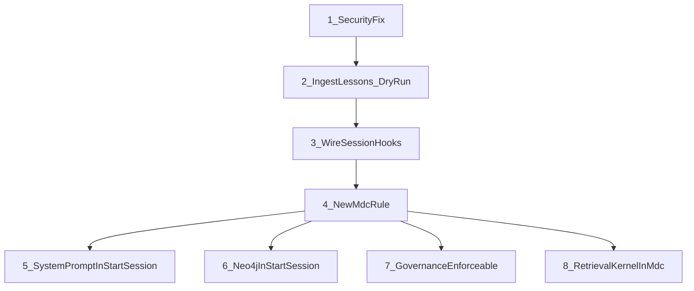

# Cursor Agent Enforcement Upgrade

## Context

The `agents/cursor/` directory has 10 files. Analysis showed:

- 2 files are **dormant** (retrieval kernel, session hooks) — not wired to anything
- 3 files have **wrong scopes** (fixed in prior session)
- 1 file has a **hardcoded Neo4j password** that slipped past all scanners
- Behavioral rules in the YAML kernel are descriptive-only, causing drift
- The lessons file (`repeated-mistakes.md`) is flat markdown, not in semantic memory

## Work Items (ordered by dependency)

### 1. Security Fix: Remove hardcoded Neo4j password

**File:** [agents/cursor/cursor_neo4j_query.py](agents/cursor/cursor_neo4j_query.py) line 74

**Current (VULNERABLE):**

```python
NEO4J_PASSWORD = os.getenv("NEO4J_PASSWORD", "FVmgaD1diPcz41zRbYLLP0UzyGvAi4E")
```

**Fix:** Remove the hardcoded default. If env var is missing, fail loudly:

```python
NEO4J_PASSWORD = os.getenv("NEO4J_PASSWORD", "")
if not NEO4J_PASSWORD:
    logger.error("NEO4J_PASSWORD env var not set")
```

**Why scanners missed it:** The pre-commit hook (GATE 1B) only scans for AWS keys, 64-char hex keys, and PostgreSQL DSNs. Neo4j passwords don't match those patterns. `ci/check_adr_compliance.py` (ADR-0090) skips `scripts/` and `agents/cursor/` paths. Fix: add `agents/cursor/` to the ADR-0090 scan scope and add a Neo4j password pattern to the pre-commit hook.

### 2. Ingest repeated-mistakes.md into MCP memory (dry run first)

**Source:** [.cursor-commands/learning/failures/repeated-mistakes.md](.cursor-commands/learning/failures/repeated-mistakes.md) — 23 lessons, each with Rule/Wrong/Right/Severity

**Approach:**

1. **Dry run:** Parse the file, extract each lesson, print what WOULD be written (kind, scope, tags, content preview) — no actual writes
2. **Review output** with user
3. **Live run:** Write each lesson as a separate packet via `cursor_memory_client.py write` with:
  - `--kind lesson`
  - `--scope cursor`
  - Tags: `["governance", "repeated-mistake", tier, lesson-id]`
  - Content: structured JSON with rule, wrong, right, severity

**Script:** Create a small ingestion script `agents/cursor/ingest_lessons.py` that:

- Parses the markdown structure
- Extracts individual lessons
- Has `--dry-run` flag (default) and `--live` flag
- Uses `mcp_call_tool("save_memory", ...)` from cursor_memory_client

### 3. Wire session hooks into session_startup.py

**Goal:** Make `CursorSessionHooks.on_session_start()` fire automatically when any session begins, not just via `/start-session` slash command.

**File:** [.cursor-commands/startup/session_startup.py](.cursor-commands/startup/session_startup.py)

**Integration point:** The `create_session_startup()` function already runs preflight checks. Add a step that:

1. Imports `CursorSessionHooks`
2. Calls `on_session_start(repo_id="l9", branch="main")`
3. Returns the hydrated context (intent, files, decisions, errors) as part of `StartupResult`

**For `on_session_end`:** Add to [.cursor-commands/commands/end-session.md](.cursor-commands/commands/end-session.md) execution steps. Also document in the kernel YAML that session hooks are now wired.

**For `on_action`:** This requires Cursor IDE to call it after each tool use. Since we can't modify Cursor's internal dispatch, add to the kernel YAML `must_read` section as a behavioral contract: "After significant tool actions (file writes, git operations, deployments), record the action via on_action()." This becomes enforceable through the .mdc rule (item 4).

### 4. New .mdc rule: cursor memory kernel enforcement

**File:** `.cursor/rules/87-cursor-memory-kernel.mdc` (new)

**Purpose:** Make the kernel YAML an always-applied authoritative source. This is the "supplement" approach — keep .mdc rules but point to memory as the behavioral authority.

**Content (key sections):**

- **Before memory operations:** Consult `cursor_memory_kernel.yaml` for correct scope (`cursor`) and kind
- **Session start:** Run health check, inject 5-layer context, activate session hooks
- **On user correction:** Extract lesson, dedupe-check, write to memory immediately
- **On error:** Run `fix-error` command before debugging from scratch
- **After significant work:** Write summary to memory with `scope: cursor`
- **Enforcement checklist:** Reference the YAML's enforcement section as binding

This rule bridges the gap between "descriptive YAML" and "enforced behavior" by making the .mdc always-applied rule say "follow the YAML."

### 5. Wire cursor_system_prompt.md into /start-session

**File:** [.cursor-commands/commands/start-session.md](.cursor-commands/commands/start-session.md)

**Change:** Add Step 0c after the existing Step 0b:

```
Step 0c: Load Cursor system prompt identity
Read agents/cursor/cursor_system_prompt.md
```

**Persistence:** The system prompt content will be in the agent's context for that session. It won't persist across sessions (Cursor resets context), but loading it at every `/start-session` ensures it's always present. The new .mdc rule (item 4) provides the always-applied enforcement layer.

### 6. Wire Neo4j query into /start-session for graph awareness

**File:** [.cursor-commands/commands/start-session.md](.cursor-commands/commands/start-session.md)

**Change:** Add to Step 6 (Index Freshness):

```bash
# Refresh graph awareness
python3 agents/cursor/cursor_neo4j_query.py --count-nodes
```

This gives the agent awareness of the current graph state (node counts by type) at session start.

### 7. Make governance-reference.md enforceable

**Approach:** The governance reference is already accurate. To make it enforceable:

1. Add it to the new .mdc rule (item 4) as a MUST-READ reference
2. Add a step in `/gmp` slash command to read it before Phase 0
3. Ingest the key rules (authority hierarchy, high-risk tools, protected systems) into MCP memory as `kind: rule` packets — this makes them searchable and discoverable

### 8. Wire retrieval kernel into 03-mcp-memory.mdc

**File:** [.cursor/rules/03-mcp-memory.mdc](.cursor/rules/03-mcp-memory.mdc)

**Change:** In the "PROACTIVE: Query Graph Before Searching" section, add reference to the retrieval kernel's 3-tier pattern:

```
### Retrieval Order (from cursor_retrieval_kernel.py)
1. Working memory (same session cache) — FASTEST
2. Long-term memory (semantic search via MCP) — FAST
3. Repo scan (grep/codebase_search) — SLOWEST, last resort

NEVER skip to repo scan without checking memory first.
```

This makes the retrieval kernel's pattern enforceable via the always-applied .mdc rule, even though the Python class itself isn't programmatically wired.

## Execution Order




Items 5-8 can run in parallel after item 4 since they're independent edits to different files.

## Files Modified


| File                                          | Action                               |
| --------------------------------------------- | ------------------------------------ |
| `agents/cursor/cursor_neo4j_query.py`         | Remove hardcoded password            |
| `agents/cursor/ingest_lessons.py`             | NEW — lesson ingestion script        |
| `.cursor-commands/startup/session_startup.py` | Wire session hooks                   |
| `.cursor/rules/87-cursor-memory-kernel.mdc`   | NEW — enforcement rule               |
| `.cursor-commands/commands/start-session.md`  | Add system prompt + neo4j steps      |
| `.cursor-commands/commands/end-session.md`    | Add session hook teardown            |
| `.cursor/rules/03-mcp-memory.mdc`             | Add retrieval kernel pattern         |
| `.cursor-commands/commands/gmp.md`            | Add governance-reference.md pre-read |
| `.git/hooks/pre-commit`                       | Add Neo4j password pattern           |


## NOT Changed (out of scope)

- `cursor_retrieval_kernel.py` — kept dormant as Python class; pattern enforced via .mdc rule instead
- `cursor_session_hooks.py` — wired via startup script, code unchanged
- Existing .mdc rules — kept as-is (supplement approach, not replace)
