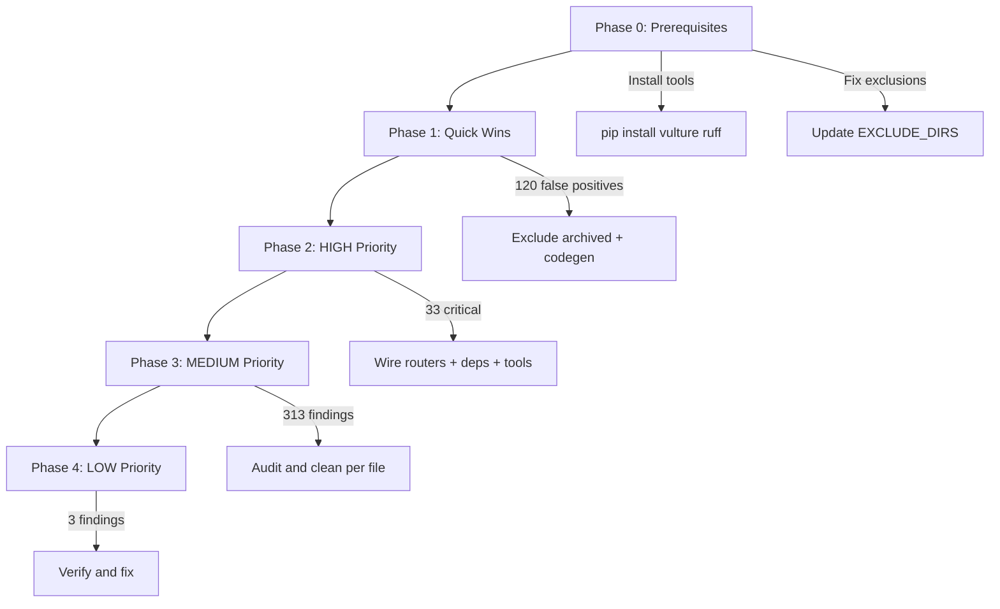

# Dead Code and Wiring Cleanup Plan

## Audit Summary

- **Total Findings:** 502
- **Files Scanned:** 760
- **Dataclass Fields Analyzed:** 2,239

| Category | Count | Confidence | Priority |

|----------|-------|------------|----------|

| dataclass_field | 292 | 95% HIGH | MEDIUM |

| unwired_agent | 104 | 70% MEDIUM | LOW (codegen specs) |

| unwired_background | 33 | 60% LOW | MEDIUM |

| unwired_router | 26 | 75% MEDIUM | HIGH |

| unwired_kernel | 16 | 95% HIGH | LOW (archived) |

| unwired_service | 12 | 70% MEDIUM | MEDIUM |

| unwired_orchestrator | 9 | 70% MEDIUM | MEDIUM |

| unwired_dependency | 6 | 85% HIGH | HIGH |

| unwired_event | 2 | 65% LOW | MEDIUM |

| unwired_tool | 1 | 85% HIGH | HIGH |

| unwired_pydantic | 1 | 80% HIGH | MEDIUM |

---

## Phase 0: Prerequisites

### 0.1 Install Missing Tools

```bash
pip install vulture ruff
```

The audit script was updated to use `python -m vulture` but tools still need to be installed.

### 0.2 Fix Scan Exclusions

Update [scripts/audit/find_dead_code.py](scripts/audit/find_dead_code.py) to exclude:

- `_archived` directories (kernels, agents)
- `docs/` directory (contains non-Python files named .py)
- `codegen/` directory (generated specs, not production code)
- `igor/` directory (audit tools, not production)

Add to `EXCLUDE_DIRS`:

```python
EXCLUDE_DIRS = {
    "tests", "_archived", "__pycache__", ".venv", "venv", ".git", 
    "node_modules", "docs", "codegen", "igor"
}
```

### 0.3 Fix False Positive Directories

These directories have `.py` extensions but are actually directories or non-Python:

- `docs/TODO/agent_persistence.py` (directory)
- `docs/DONE/consolidation.py` (directory)

Rename or delete these.

---

## Phase 1: Quick Wins (FALSE POSITIVES)

### 1.1 Exclude Archived Kernels (16 findings)

All 16 "unwired kernels" are in `private/kernels/00_system/_archived/`. These are intentionally archived and should not be flagged.

**Action:** Add `_archived` to exclusions in scan (already in Phase 0.2).

### 1.2 Exclude Codegen Agent Specs (104 findings)

All 104 "unwired agents" are generated specs in `agents/codegenagent/codegen+codegenAgent_specs/`. These are generated artifacts, not production code.

**Action:** Add pattern exclusion for `codegen+codegenAgent_specs` or exclude `agents/codegenagent/` entirely.

---

## Phase 2: HIGH Priority Fixes

### 2.1 Unwired Routers (26 findings)

These routers are defined but not mounted in [api/server.py](api/server.py).

| Router File | Action |

|-------------|--------|

| `api/os_routes.py` | Verify if needed, wire or delete |

| `api/webhook_twilio.py` | Wire to main app |

| `api/webhook_mac_agent.py` | Wire to main app |

| `api/world_model_api.py` | Wire to main app |

| `api/webhook_slack.py` | Wire to main app |

| `api/webhook_waba.py` | Wire to main app |

| `api/agent_routes.py` | Wire to main app |

| `api/tools/router.py` | Wire to main app |

| `api/memory/graph.py` | Wire to main app |

| `api/memory/cache.py` | Wire to main app |

| ... (16 more) | Audit each |

**GMP Required:** Wire all legitimate routers to `api/server.py` via `app.include_router()`.

### 2.2 Unwired Dependencies (6 findings)

All in [api/dependencies.py](api/dependencies.py):

- `get_agent_executor`
- `get_governance_engine`
- `get_neo4j_client`
- `get_redis_client`
- `get_observability_service`
- `get_world_model_service`

**Action:** Either wire these into routes via `Depends()` or delete if unused.

### 2.3 Unwired Tool (1 finding)

`AGENT_SELF_MODIFY_TOOL_DEFINITIONS` in [core/tools/agent_self_modify.py](core/tools/agent_self_modify.py).

**Action:** Register with ToolGraph or delete if not needed.

---

## Phase 3: MEDIUM Priority Fixes

### 3.1 Dataclass Fields (292 findings)

Grouped by file for batch processing:

| File | Unused Fields | Action |

|------|---------------|--------|

| `memory/hybrid_rag.py` | 13 | Audit, delete unused |

| `core/evaluation/evaluator.py` | 9 | Audit, delete unused |

| `memory/schema_introspection.py` | 7 | Audit, delete unused |

| `core/memory/virtual_context.py` | 3 | Audit, delete unused |

| `core/agents/selfreflection.py` | 3 | Audit, delete unused |

| `core/governance/quick_fixes.py` | 3 | Audit, delete unused |

| ... (280+ more in other files) | ... | Batch audit |

**Strategy:** Process file-by-file, remove truly unused fields, document fields kept for API compatibility.

### 3.2 Unwired Services (12 findings)

| Service | File | Action |

|---------|------|--------|

| `FailureAnalyzer` | `core/observability/failures.py` | Wire or delete |

| `MemoryStateManager` | `igor/audit-memory/` | Delete (audit tools) |

| `MemoryTimelineService` | `igor/audit-memory/` | Delete (audit tools) |

| `MemoryCheckpointManager` | `igor/audit-memory/` | Delete (audit tools) |

| `CursorExecutorService` | `agents/cursor/integrations/` | Wire or delete |

| `TwilioAdapterService` | `api/adapters/twilio_adapter/` | Wire or delete |

| `CalendarAdapterService` | `api/adapters/calendar_adapter/` | Wire or delete |

| `EmailAdapterService` | `api/adapters/email_adapter/` | Wire or delete |

| ... | ... | ... |

### 3.3 Unwired Orchestrators (9 findings)

| Orchestrator | File | Action |

|--------------|------|--------|

| `MetaOrchestratorInterface` | `orchestrators/meta/interface.py` | Wire or delete |

| `MetaOrchestrator` | `orchestrators/meta/orchestrator.py` | Wire or delete |

| `WorldModelInterface` | `orchestrators/world_model/interface.py` | Wire or delete |

| `WorldModelOrchestrator` | `orchestrators/world_model/orchestrator.py` | Wire or delete |

| `ReasoningInterface` | `orchestrators/reasoning/interface.py` | Wire or delete |

| `ResearchSwarmInterface` | `orchestrators/research_swarm/interface.py` | Wire or delete |

| `EvolutionInterface` | `orchestrators/evolution/interface.py` | Wire or delete |

| `EvolutionOrchestrator` | `orchestrators/evolution/orchestrator.py` | Wire or delete |

| `AgentExecutionInterface` | `orchestrators/agent_execution/interface.py` | Wire or delete |

### 3.4 Unwired Background Tasks (33 findings)

Functions named `*_async`, `*_background`, `*_task` but never scheduled.

| File | Count | Action |

|------|-------|--------|

| `runtime/gmp_worker.py` | 6 | Wire via `add_task()` or rename |

| `core/singleton_registry.py` | 3 | False positives (async methods) |

| `runtime/gmp_approval.py` | 3 | Wire or delete |

| `core/observability/l9_integration.py` | 2 | Wire or delete |

| ... | ... | ... |

---

## Phase 4: LOW Priority / Review

### 4.1 Unwired Events (2 findings)

- `startup_health` in `api/server.py:1898`
- `shutdown_runtime` in `services/research/graph_runtime.py:175`

**Action:** Verify these are decorated with `@app.on_event()` or wire them.

### 4.2 Unwired Pydantic Model (1 finding)

In `api/world_model_api.py` - a model defined but never used in routes.

**Action:** Use in route signatures or delete.

---

## Execution Strategy



---

## Estimated Effort

| Phase | Findings | Effort | GMPs |

|-------|----------|--------|------|

| Phase 0 | N/A | 30 min | 0 |

| Phase 1 | 120 | 15 min | 0 |

| Phase 2 | 33 | 2-3 hours | 2-3 |

| Phase 3 | 313 | 4-6 hours | 5-8 |

| Phase 4 | 3 | 30 min | 1 |

**Total:** ~8-10 hours across multiple GMPs

---

## Re-run Audit After Each Phase

After completing each phase, re-run:

```bash
python3 scripts/audit/find_dead_code.py --output reports/dead_code_audit_$(date +%Y%m%d_%H%M%S).json
```

Target: Reduce findings from 502 to under 50 (legitimate edge cases).