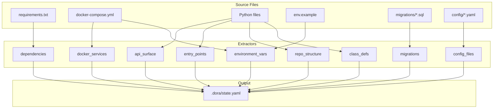

# DORA State Auto-Generator

## Architecture




## Implementation

### 1. Create the Generator Script

**File:** [`scripts/generate_dora_state.py`](scripts/generate_dora_state.py)Refactor extractors from [`tools/export_repo_indexes.py`](tools/export_repo_indexes.py) into YAML-native output:| Extractor | Source | Notes ||-----------|--------|-------|| `extract_dependencies()` | `generate_dependencies()` | Parse all `requirements*.txt` || `extract_docker_services()` | NEW | Parse `docker-compose.yml` services, ports, depends_on || `extract_api_surface()` | `generate_api_surfaces()` | Find APIRouter instances || `extract_entry_points()` | `generate_entrypoints()` | FastAPI apps + `__main__` scripts || `extract_environment_vars()` | `generate_env_refs()` | From code + `.env.example` + docker-compose || `extract_repo_structure()` | `generate_tree()` | Directory tree as nested dict || `extract_migrations()` | NEW | List `migrations/*.sql` || `extract_config_files()` | `generate_config_files()` | YAML/JSON/TOML configs || `extract_class_definitions()` | `generate_class_definitions()` | Optional, for LLM context |

### 2. YAML Output Structure

```yaml
# L9 DORA Workflow State
# AUTO-GENERATED - DO NOT EDIT MANUALLY
updated: "2025-12-18T12:00:00Z"
version: "2.0.0"

project:
  name: "L9 Unified Runtime"
  description: "AI Agent Runtime..."

dependencies:
  requirements.txt:
        - fastapi>=0.115.0
        - uvicorn[standard]>=0.30.0
  requirements_memory_substrate.txt:
        - asyncpg>=0.29.0

docker_services:
  postgres:
    image: pgvector/pgvector:pg16
    ports: ["5432:5432"]
    depends_on: []
  l9-api:
    build: deploy/Dockerfile.l9_api
    ports: ["8000:8000"]
    depends_on: [postgres, l9-memory-api]

environment_variables:
  from_code: [OPENAI_API_KEY, DATABASE_URL, ...]
  from_docker_compose: [POSTGRES_USER, POSTGRES_PASSWORD, ...]

api_surface:
  api:
        - {file: api/agent_routes.py, variable: router}
        - {file: api/webhook_slack.py, variable: router}
  services:
        - {file: services/research/research_api.py, variable: router}

entry_points:
    - file: api/server.py
    type: FastAPI
    title: "L9 Phase 2 Secure AI OS"
    routes: ["/", "/ws/agent", "/os/*", "/agent/*", "/memory/*"]
    - file: mac_agent/runner.py
    type: Script

migrations:
    - {file: "0001_init_memory_substrate.sql"}
    - {file: "0002_add_indexes.sql"}

repo_structure:
  api:
        - __init__.py
        - server.py
        - routes:
            - __init__.py
            - health.py
  memory:
        - substrate_models.py
        - substrate_service.py
```


### 3. Makefile Integration

Add to [`Makefile`](Makefile):

```makefile
dora-update:
	@echo "Regenerating .dora/state.yaml..."
	@python scripts/generate_dora_state.py

dora-check:
	@echo "Checking if .dora/state.yaml is stale..."
	@python scripts/generate_dora_state.py --check
```


### 4. Pre-commit Hook (Optional)

Create `.git/hooks/pre-commit` or add to existing:

```bash
#!/bin/bash
python scripts/generate_dora_state.py
git add .dora/state.yaml
```


### 5. Deprecate Old Export

After validation, the multi-file export in [`tools/export_repo_indexes.py`](tools/export_repo_indexes.py) can be:

- Marked as deprecated
- Refactored to read from `.dora/state.yaml` and format for external LLM use
- Or removed entirely if `.dora/state.yaml` serves all use cases

## Key Decisions

1. **Single file vs multi-file:** Single `.dora/state.yaml` for internal use; can still generate txt files for Dropbox export if needed
2. **Automation level:** Start with Makefile target, add pre-commit hook after validation
3. **Backward compatibility:** Keep `tools/export_repo_indexes.py` working until migration complete

## Not Included

- Manual phase/progress tracking (stays manual in a separate section)