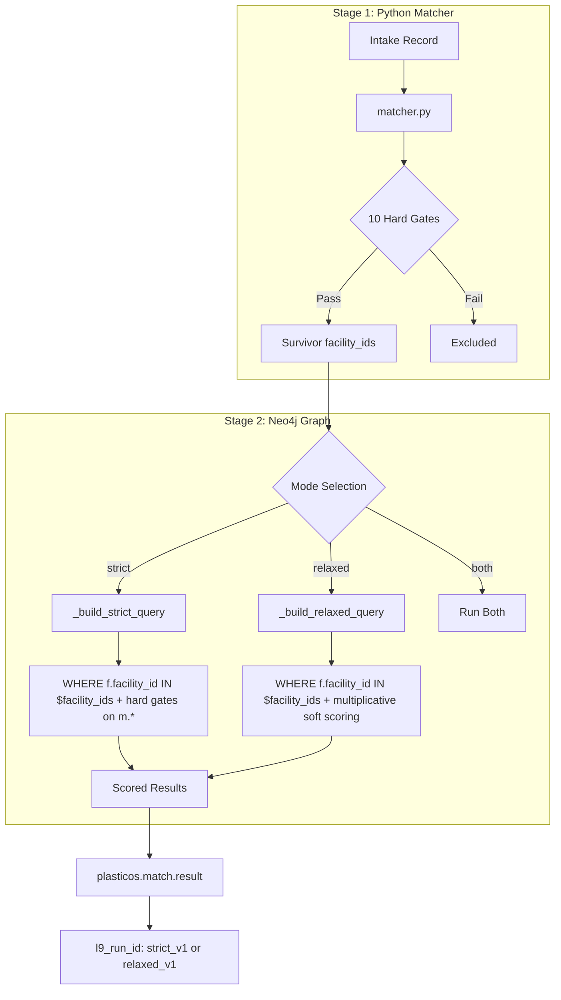

# Dual-Mode Cypher Query Implementation (REVISED v2)

## Critical Fixes from Agent Feedback


| Issue                   | Problem                                                                  | Fix                                                                                                                       |
| ----------------------- | ------------------------------------------------------------------------ | ------------------------------------------------------------------------------------------------------------------------- |
| Wrong file path         | Plan said `match_result.py` in `plasticos_buyer_match_engine`            | Canonical is `[plasticos_matching/models/match_result.py](plasticos_matching/models/match_result.py)`                     |
| Duplicate model         | `MatchResult` class exists in both modules (lines 273-294 of matcher.py) | Remove duplicate from `[matcher.py](plasticos_buyer_match_engine/models/matcher.py)`                                      |
| `run_id` vs `l9_run_id` | Plan proposed new field, but `l9_run_id` already exists (line 108)       | Use existing `l9_run_id` with values `strict_v1`, `relaxed_v1`                                                            |
| Property location       | Plan used `f.density_min` on Facility                                    | Properties live on MaterialProfile: `m.min_density`, `m.max_density`, `m.contamination_tolerance`, `m.moisture_tolerance` |
| Relaxed too lenient     | 0.3 floor for all failures = 25+ score                                   | Use **multiplicative** penalties so multiple failures compound                                                            |
| MFI-process removed     | Plan removed entirely from relaxed                                       | Keep as heavy soft penalty (×0.1) - physics constraint                                                                    |
| Missing facility_ids    | `match_buyers()` didn't receive Stage 1 survivors                        | Pass `facility_ids` from Stage 1 to Stage 2                                                                               |


## Pre-Existing Gaps Discovered (Need Separate Fix)


| Gap                         | Current State                                                                            | Required Fix                                                                 |
| --------------------------- | ---------------------------------------------------------------------------------------- | ---------------------------------------------------------------------------- |
| MFI not synced to Neo4j     | `melt_index_min/max` exist on `facility_profile` but not in `_build_material_payloads()` | Add MFI fields to MaterialProfile sync                                       |
| Density gates silently pass | `f.density_min` referenced in queries but never set on Facility node                     | Properties are on MaterialProfile (`m.min_density`) - queries must use `m.*` |


**Note:** These gaps mean the density/MFI gates have been **silently passing everything** because the properties don't exist where the queries look for them.

---

## Architecture




---

## Files to Modify


| File                                                                                                             | Changes                                                                                           |
| ---------------------------------------------------------------------------------------------------------------- | ------------------------------------------------------------------------------------------------- |
| `[plasticos_buyer_match_engine/models/matcher.py](plasticos_buyer_match_engine/models/matcher.py)`               | Remove duplicate MatchResult class (lines 273-294), add mode param, pass facility_ids             |
| `[plasticos_buyer_match_engine/models/graph_service.py](plasticos_buyer_match_engine/models/graph_service.py)`   | Add `_build_strict_query()`, `_build_relaxed_query()`, `match_buyers(intake, facility_ids, mode)` |
| `[plasticos_facility_profile/data/partner_type_data.xml](plasticos_facility_profile/data/partner_type_data.xml)` | Update gate_mode values, add missing partner types                                                |


**No changes needed:** `[plasticos_matching/models/match_result.py](plasticos_matching/models/match_result.py)` already has `l9_run_id` field (line 108).

---

## Phase 0: Fix Pre-Existing Issues

### 0.1 Remove duplicate MatchResult class

**File:** `plasticos_buyer_match_engine/models/matcher.py` lines 273-294

This duplicate declaration conflicts with the canonical model in `plasticos_matching`. Delete the entire class:

```python
# DELETE THIS BLOCK (lines 273-294)
class MatchResult(models.Model):
    _name = 'plasticos.match.result'
    # ... rest of duplicate class
```

### 0.2 Add MFI range to MaterialProfile sync

**MFI Field Location (per user fix):**


| Model                        | Field                  | Purpose                         |
| ---------------------------- | ---------------------- | ------------------------------- |
| `plasticos.material.profile` | `melt_flow_index`      | Measured MFI value              |
| `plasticos.material.profile` | `melt_index_min`       | Batch variability floor (NEW)   |
| `plasticos.material.profile` | `melt_index_max`       | Batch variability ceiling (NEW) |
| `plasticos.facility.profile` | ~~melt_index_min/max~~ | **REMOVED**                     |


**File:** `plasticos_buyer_match_engine/models/graph_service.py` method `_build_material_payloads()`

Add MFI range to the MaterialProfile payload (around line 475-490):

```python
# In _build_material_payloads() - add to the payload dict:
payloads.append({
    "material_id": mp.id,
    "facility_id": mp.partner_id.id,
    "polymer": mp.polymer_id.code if mp.polymer_id else (mp.polymer or ""),
    "form": mp.form_id.code if mp.form_id else (getattr(mp, "form", None) or ""),
    "color": getattr(mp, "color", None) or None,
    "min_density": getattr(mp, "min_density", None) or None,
    "max_density": getattr(mp, "max_density", None) or None,
    "contamination_tolerance": getattr(mp, "contamination_tolerance", None)
        or getattr(mp, "contamination_tolerance_pct", None),
    "moisture_tolerance": getattr(mp, "moisture_tolerance", None)
        or getattr(mp, "moisture_tolerance_pct", None),
    # ADD THESE (NEW fields on material.profile):
    "mfi": getattr(mp, "melt_flow_index", None) or None,
    "mfi_min": getattr(mp, "melt_index_min", None) or None,
    "mfi_max": getattr(mp, "melt_index_max", None) or None,
})
```

Also update the Cypher MERGE in `sync_material_nodes()` (around line 608) to include:

```cypher
mat.mfi = m.mfi, mat.mfi_min = m.mfi_min, mat.mfi_max = m.mfi_max,
```

**Gate Matrix:** MFI range gates use `m.mfi_min`, `m.mfi_max` on MaterialProfile node (correct as planned).

---

## Phase 1: Update Partner Types

### 1.1 Fix gate_mode values in `partner_type_data.xml`


| Code         | Current    | Target         | Reason                                                                                  |
| ------------ | ---------- | -------------- | --------------------------------------------------------------------------------------- |
| processor    | flexible   | **flexible**   | Keep as-is - processors run granulators/wash lines, wide input tolerance (per feedback) |
| broker       | flexible   | **optimistic** | Resells, doesn't process                                                                |
| manufacturer | strict     | strict         | Tight specs (correct)                                                                   |
| mrf          | optimistic | **flexible**   | Sorts/bales, moderate tolerance                                                         |
| compounder   | flexible   | flexible       | Correct                                                                                 |
| recycler     | optimistic | **flexible**   | Grinds/washes, moderate tolerance                                                       |
| distributor  | (missing)  | **optimistic** | Resells like broker                                                                     |
| other        | (missing)  | **flexible**   | Default                                                                                 |


### 1.2 Add missing partner types

```xml
<record id="partner_type_end_user" model="plasticos.partner.type">
  <field name="name">End User</field>
  <field name="code">end_user</field>
  <field name="gate_mode">strict</field>
  <field name="description">End user making finished products. Tight specs.</field>
</record>

<record id="partner_type_grinder" model="plasticos.partner.type">
  <field name="name">Grinder</field>
  <field name="code">grinder</field>
  <field name="gate_mode">flexible</field>
  <field name="description">Size reduction only, accepts wide range.</field>
</record>

<record id="partner_type_toll_processor" model="plasticos.partner.type">
  <field name="name">Toll Processor</field>
  <field name="code">toll_processor</field>
  <field name="gate_mode">flexible</field>
  <field name="description">Processes to customer spec, wide input tolerance.</field>
</record>

<record id="partner_type_converter" model="plasticos.partner.type">
  <field name="name">Converter</field>
  <field name="code">converter</field>
  <field name="gate_mode">strict</field>
  <field name="description">Makes film/sheet/bags from resin. Similar to manufacturer.</field>
</record>
```

---

## Phase 2: Implement Dual Cypher Queries

### Gate Matrix: All 14 Gates (CORRECTED)


| #   | Gate            | Strict | Relaxed  | Property Location                                                                                    |
| --- | --------------- | ------ | -------- | ---------------------------------------------------------------------------------------------------- |
| 1   | Polymer         | WHERE  | WHERE    | `m.polymer` (MaterialProfile)                                                                        |
| 2   | Density         | WHERE  | ×0.3     | `m.min_density`, `m.max_density` (MaterialProfile)                                                   |
| 3   | MFI Range       | WHERE  | ×0.3     | `m.mfi_min`, `m.mfi_max` (MaterialProfile)                                                           |
| 4   | MFI-Process     | WHERE  | **×0.1** | `f.process_type` (Facility) - physics constraint                                                     |
| 5   | Contamination   | WHERE  | ×0.3     | `m.contamination_tolerance` (MaterialProfile)                                                        |
| 6   | Moisture        | WHERE  | ×0.3     | `m.moisture_tolerance` (MaterialProfile)                                                             |
| 7   | Metal Removal   | WHERE  | ×0.3     | intake `$has_metal` → `f.can_remove_metal` (Facility)                                                |
| 8   | FR Filtering    | WHERE  | ×0.3     | intake `$has_fr` → `f.can_filter_fr` (Facility)                                                      |
| 9   | Wash Line/Dryer | WHERE  | ×0.3     | intake `$requires_wash_line` → `f.has_wash_line`, `$requires_dryer` → `f.can_reduce_moisture`        |
| 10  | Form-Equipment  | WHERE  | ×0.3     | intake form → facility equipment (bales→`f.has_granulator`, regrind→`f.handles_regrind`)             |
| 11  | PVC/Filler/Odor | WHERE  | ×0.3     | `$has_pvc`→`f.accepts_pvc`, `$has_filler`→`f.accepts_filled_materials`, `$has_odor`→`f.accepts_odor` |
| 12  | Lot Size        | WHERE  | ×0.3     | `f.min_lot_size_lbs`, `f.max_lot_size_lbs` (Facility)                                                |
| 13  | Geo Distance    | WHERE  | ×0.3     | `f.lat`, `f.lon` (Facility)                                                                          |
| 14  | Certifications  | WHERE  | ×0.3     | `f.food_grade_certified`, `f.medical_grade_capable` (Facility)                                       |


**Multiplicative Penalty Model:** In relaxed mode, penalties multiply:

```
final_score = base × density_mult × mfi_mult × mfi_process_mult × contamination_mult × ...
```

Example: Buyer failing 3 gates → `100 × 0.3 × 0.3 × 0.3 = 2.7` (not 25+)

### 2.1 Add `_build_strict_query()` to graph_service.py

All gates as WHERE predicates (hard exclusion). **Note:** Density/contamination/moisture use `m.*` (MaterialProfile), not `f.*` (Facility).

```python
def _build_strict_query(self):
    """Build Cypher query with all 14 gates as hard exclusions."""
    return """
    MATCH (f:Facility)-[:HAS_MATERIAL]->(m:MaterialProfile)
    WHERE f.facility_id IN $facility_ids
      AND m.polymer = $polymer
      
      // Gate 2: Density (MaterialProfile)
      AND (m.min_density IS NULL OR $density IS NULL OR m.min_density <= $density)
      AND (m.max_density IS NULL OR $density IS NULL OR m.max_density >= $density)
      
      // Gate 3: MFI Range (MaterialProfile)
      AND (m.mfi_min IS NULL OR $mfi IS NULL OR m.mfi_min <= $mfi)
      AND (m.mfi_max IS NULL OR $mfi IS NULL OR m.mfi_max >= $mfi)
      
      // Gate 4: MFI-Process compatibility (physics constraint)
      AND CASE f.process_type
        WHEN 'injection' THEN ($mfi IS NULL OR $mfi >= 1.0)
        WHEN 'blow_mold' THEN ($mfi IS NULL OR $mfi <= 2.0)
        WHEN 'film_blown' THEN ($mfi IS NULL OR ($mfi >= 0.5 AND $mfi <= 2.5))
        WHEN 'thermoform' THEN ($mfi IS NULL OR ($mfi >= 1.0 AND $mfi <= 8.0))
        ELSE true
      END
      
      // Gate 5: Contamination (MaterialProfile)
      AND (m.contamination_tolerance IS NULL OR $contamination_pct IS NULL 
           OR m.contamination_tolerance >= $contamination_pct)
      
      // Gate 6: Moisture (MaterialProfile)
      AND (m.moisture_tolerance IS NULL OR $moisture_pct IS NULL
           OR m.moisture_tolerance >= $moisture_pct)
      
      // Gate 7: Metal Removal (Facility capability)
      AND (NOT $has_metal OR f.can_remove_metal = true)
      
      // Gate 8: FR Filtering (Facility capability)
      AND (NOT $has_fr OR f.can_filter_fr = true)
      
      // Gate 9: Wash Line / Dryer (Facility capability)
      AND (NOT $requires_wash_line OR f.has_wash_line = true)
      AND (NOT $requires_dryer OR f.can_reduce_moisture = true)
      
      // Gate 10: Form-Equipment compatibility
      AND CASE $form
        WHEN 'bales' THEN (f.has_granulator = true OR f.has_shredder = true)
        WHEN 'regrind' THEN f.handles_regrind = true
        WHEN 'flake' THEN f.handles_flake = true
        WHEN 'rollstock' THEN f.handles_rollstock = true
        ELSE true
      END
      
      // Gate 11: PVC / Filler / Odor (Facility acceptance)
      AND (NOT $has_pvc OR coalesce(f.accepts_pvc, false) = true)
      AND (NOT $has_filler OR f.accepts_filled_materials = true)
      AND (NOT $has_odor OR coalesce(f.accepts_odor, true) = true)
      
      // Gate 12: Lot Size (Facility)
      AND (f.min_lot_size_lbs IS NULL OR $quantity IS NULL OR f.min_lot_size_lbs <= $quantity)
      AND (f.max_lot_size_lbs IS NULL OR $quantity IS NULL OR f.max_lot_size_lbs >= $quantity)
      
      // Gate 13: Geo Distance (Facility)
      AND (f.lat IS NULL OR $lat IS NULL OR 
           point.distance(point({latitude: f.lat, longitude: f.lon}),
                         point({latitude: $lat, longitude: $lon})) / 1609.34 <= $radius_miles)
      
      // Gate 14: Certifications (Facility)
      AND ($food_grade = false OR f.food_grade_certified = true)
      AND ($medical_grade = false OR f.medical_grade_capable = true)
    
    WITH f, m,
         // Scoring calculations...
         (material_score * $w_material + volume_score * $w_volume + 
          quality_score * $w_quality + geo_score * $w_geo + 
          compliance_score * $w_compliance + relationship_score * $w_relationship) AS total_score
    
    RETURN f.facility_id AS facility_id, f.name AS facility_name,
           total_score, m.polymer AS polymer
    ORDER BY total_score DESC 
    LIMIT $limit
    """
```

### 2.2 Add `_build_relaxed_query()` to graph_service.py

Only polymer is hard; everything else becomes **multiplicative** soft scoring. MFI-process gets heavy penalty (0.1).

```python
def _build_relaxed_query(self):
    """Build Cypher query with only polymer as hard gate, all 14 gates as multiplicative penalties."""
    return """
    MATCH (f:Facility)-[:HAS_MATERIAL]->(m:MaterialProfile)
    WHERE f.facility_id IN $facility_ids
      AND m.polymer = $polymer  // Gate 1: ONLY hard gate
    
    WITH f, m,
      // Gate 2: Density (MaterialProfile)
      CASE WHEN (m.min_density IS NULL OR $density IS NULL OR m.min_density <= $density)
            AND (m.max_density IS NULL OR $density IS NULL OR m.max_density >= $density)
           THEN 1.0 ELSE 0.3 END AS density_mult,
      
      // Gate 3: MFI range (MaterialProfile)
      CASE WHEN (m.mfi_min IS NULL OR $mfi IS NULL OR m.mfi_min <= $mfi)
            AND (m.mfi_max IS NULL OR $mfi IS NULL OR m.mfi_max >= $mfi)
           THEN 1.0 ELSE 0.3 END AS mfi_mult,
      
      // Gate 4: MFI-Process compatibility - HEAVY penalty (physics constraint)
      CASE WHEN f.process_type IS NULL OR $mfi IS NULL
                OR (f.process_type = 'injection' AND $mfi >= 1.0)
                OR (f.process_type = 'blow_mold' AND $mfi <= 2.0)
                OR (f.process_type = 'film_blown' AND $mfi >= 0.5 AND $mfi <= 2.5)
                OR (f.process_type = 'thermoform' AND $mfi >= 1.0 AND $mfi <= 8.0)
                OR f.process_type NOT IN ['injection', 'blow_mold', 'film_blown', 'thermoform']
           THEN 1.0 ELSE 0.1 END AS mfi_process_mult,
      
      // Gate 5: Contamination (MaterialProfile)
      CASE WHEN m.contamination_tolerance IS NULL OR $contamination_pct IS NULL
                OR m.contamination_tolerance >= $contamination_pct
           THEN 1.0 ELSE 0.3 END AS contamination_mult,
      
      // Gate 6: Moisture (MaterialProfile)
      CASE WHEN m.moisture_tolerance IS NULL OR $moisture_pct IS NULL
                OR m.moisture_tolerance >= $moisture_pct
           THEN 1.0 ELSE 0.3 END AS moisture_mult,
      
      // Gate 7: Metal Removal (Facility)
      CASE WHEN NOT $has_metal OR f.can_remove_metal = true
           THEN 1.0 ELSE 0.3 END AS metal_mult,
      
      // Gate 8: FR Filtering (Facility)
      CASE WHEN NOT $has_fr OR f.can_filter_fr = true
           THEN 1.0 ELSE 0.3 END AS fr_mult,
      
      // Gate 9: Wash Line / Dryer (Facility)
      CASE WHEN (NOT $requires_wash_line OR f.has_wash_line = true)
            AND (NOT $requires_dryer OR f.can_reduce_moisture = true)
           THEN 1.0 ELSE 0.3 END AS wash_mult,
      
      // Gate 10: Form-Equipment compatibility (Facility)
      CASE WHEN $form IS NULL
                OR ($form = 'bales' AND (f.has_granulator = true OR f.has_shredder = true))
                OR ($form = 'regrind' AND f.handles_regrind = true)
                OR ($form = 'flake' AND f.handles_flake = true)
                OR ($form = 'rollstock' AND f.handles_rollstock = true)
                OR $form NOT IN ['bales', 'regrind', 'flake', 'rollstock']
           THEN 1.0 ELSE 0.3 END AS form_equip_mult,
      
      // Gate 11: PVC / Filler / Odor (Facility)
      CASE WHEN (NOT $has_pvc OR coalesce(f.accepts_pvc, false) = true)
            AND (NOT $has_filler OR f.accepts_filled_materials = true)
            AND (NOT $has_odor OR coalesce(f.accepts_odor, true) = true)
           THEN 1.0 ELSE 0.3 END AS pvc_filler_mult,
      
      // Gate 12: Lot size (Facility)
      CASE WHEN (f.min_lot_size_lbs IS NULL OR $quantity IS NULL OR f.min_lot_size_lbs <= $quantity)
            AND (f.max_lot_size_lbs IS NULL OR $quantity IS NULL OR f.max_lot_size_lbs >= $quantity)
           THEN 1.0 ELSE 0.3 END AS lot_mult,
      
      // Gate 13: Geo distance (Facility)
      CASE WHEN f.lat IS NULL OR $lat IS NULL 
                OR point.distance(point({latitude: f.lat, longitude: f.lon}),
                                 point({latitude: $lat, longitude: $lon})) / 1609.34 <= $radius_miles
           THEN 1.0 ELSE 0.3 END AS geo_mult,
      
      // Gate 14: Certifications (Facility)
      CASE WHEN ($food_grade = false OR f.food_grade_certified = true)
            AND ($medical_grade = false OR f.medical_grade_capable = true)
           THEN 1.0 ELSE 0.3 END AS cert_mult
    
    // Multiplicative penalty stacking (all 14 gates)
    WITH f, m, 
         density_mult, mfi_mult, mfi_process_mult, contamination_mult, moisture_mult,
         metal_mult, fr_mult, wash_mult, form_equip_mult, pvc_filler_mult,
         lot_mult, geo_mult, cert_mult,
         100.0 * density_mult * mfi_mult * mfi_process_mult * contamination_mult * 
                 moisture_mult * metal_mult * fr_mult * wash_mult * form_equip_mult *
                 pvc_filler_mult * lot_mult * geo_mult * cert_mult AS total_score
    
    RETURN f.facility_id AS facility_id, f.name AS facility_name,
           total_score, m.polymer AS polymer,
           {density: density_mult, mfi: mfi_mult, mfi_process: mfi_process_mult,
            contamination: contamination_mult, moisture: moisture_mult,
            metal: metal_mult, fr: fr_mult, wash: wash_mult, form_equip: form_equip_mult,
            pvc_filler: pvc_filler_mult, lot: lot_mult, geo: geo_mult, cert: cert_mult} AS score_breakdown
    ORDER BY total_score DESC 
    LIMIT $limit
    """
```

### 2.3 Add `match_buyers()` method with mode parameter

```python
def match_buyers(self, intake, facility_ids, mode="both"):
    """Run buyer match in strict, relaxed, or both modes.
    
    Args:
        intake: plasticos.intake record
        facility_ids: list of facility IDs that passed Stage 1 (Python) gates
        mode: 'strict' | 'relaxed' | 'both' (default)
    
    Returns:
        dict: {'strict': [...], 'relaxed': [...]} depending on mode
    """
    params = self._intake_to_match_params(intake)
    params['facility_ids'] = facility_ids  # Stage 1 survivors
    results = {}
    
    if mode in ("strict", "both"):
        query = self._build_strict_query()
        rows = self._execute_cypher(query, params)
        self._persist_match_results(intake, rows, l9_run_id="strict_v1")
        results["strict"] = rows
    
    if mode in ("relaxed", "both"):
        query = self._build_relaxed_query()
        rows = self._execute_cypher(query, params)
        self._persist_match_results(intake, rows, l9_run_id="relaxed_v1")
        results["relaxed"] = rows
    
    return results
```

---

## Phase 3: Wire Mode Through Pipeline

### 3.1 Update `matcher.py`

Modify `find_matches_for_supplier()` to:

1. Collect `facility_ids` from Stage 1 survivors
2. Pass them to `graph_svc.match_buyers()`
3. Accept `mode` parameter

```python
def find_matches_for_supplier(self, supplier_partner_id, intake_id=None, 
                               max_results=20, mode="both"):
    """Find matching buyers for a supplier's material.
    
    Args:
        supplier_partner_id: res.partner ID of supplier
        intake_id: plasticos.intake ID (optional)
        max_results: max matches to return
        mode: 'strict' | 'relaxed' | 'both' (default)
    """
    # ... existing Stage 1 gate logic ...
    
    # Collect facility_ids that passed Stage 1
    facility_ids = [fp.partner_id.id for fp in surviving_profiles]
    
    # Call graph service with facility_ids and mode
    graph_results = graph_svc.match_buyers(
        intake=intake, 
        facility_ids=facility_ids,
        mode=mode
    )
    
    return graph_results
```

---

## Out of Scope (per user request)

- `buyer.capability` model (already deleted)
- Any `l9_` prefixes in new code (use existing `l9_run_id` field)
- `is_buyer` filtering in Cypher (handled by Python Stage 1 via `customer_rank > 0`)
- Creating new `run_id` field (use existing `l9_run_id`)

---

## Validation Checklist

- Duplicate `MatchResult` class removed from `matcher.py`
- Cypher queries use `m.*` for density/contamination/moisture (MaterialProfile)
- Cypher queries use `f.*` for lot_size/geo/certifications (Facility)
- Relaxed query uses multiplicative penalties (not additive 0.3 floor)
- MFI-process compatibility kept in relaxed mode with 0.1 penalty
- `facility_ids` passed from Stage 1 to Stage 2
- Results written with `l9_run_id` = `strict_v1` or `relaxed_v1`
- New partner types added: end_user, grinder, toll_processor, converter

