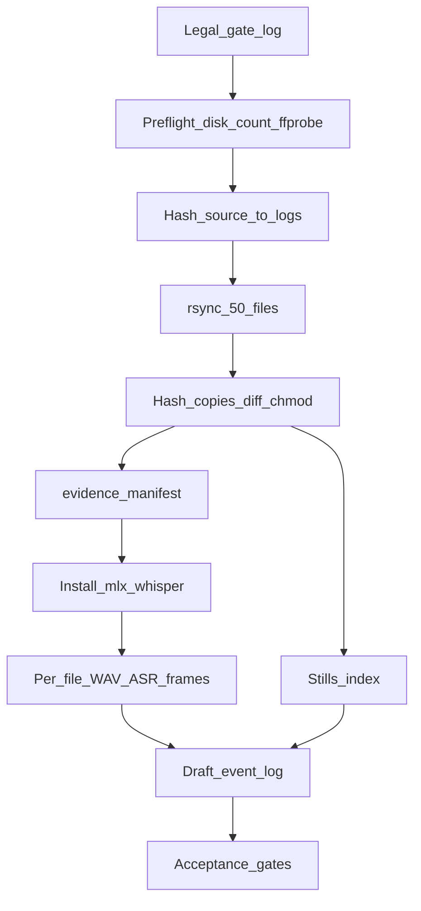

# Evidence ingest for 26CR294791-170 (local, OSS)

Execute [EVIDENCE_INGEST_SKILL_v2_STANDALONE.md](WIP/Legal%20Defense/EVIDENCE_INGEST_SKILL_v2_STANDALONE.md) plus [EVIDENCE_INGESTION_PROTOCOL_26CR294791-170.md](WIP/Legal%20Defense/EVIDENCE_INGESTION_PROTOCOL_26CR294791-170.md) against `/Users/ib-mac/BODYCAM,PHOTOS` for [active_case.md](WIP/Legal%20Defense/defense-attorney-skill/references/cases/26CR294791-170/active_case.md).

This is not legal advice. Derivatives are investigation artifacts, not current-record facts ([record_boundary.yaml](WIP/Legal%20Defense/defense-attorney-skill/references/cases/26CR294791-170/record_boundary.yaml)).

## Bound target

- Source (read-only): `/Users/ib-mac/BODYCAM,PHOTOS` — MUST remain byte-identical
- Custody (write): [WIP/Legal Defense/Evidence](WIP/Legal%20Defense/Evidence) — all ingest output (originals, working, derived, logs, `.venv`). Absolute: `/Users/ib-mac/Cursor-Governance/WIP/Legal Defense/Evidence`
- Case overlay (read-only): [operator_fact_overlay.yaml](WIP/Legal%20Defense/defense-attorney-skill/references/cases/26CR294791-170/operator_fact_overlay.yaml)
- Search hints only: [compiled/video_findings.yaml](WIP/Legal%20Defense/defense-attorney-skill/references/cases/26CR294791-170/compiled/video_findings.yaml) (`raw_media_directly_revalidated: false`)

## Scope

In: 4 Axon Body 4 MP4s fully processed; 46 stills copied, hashed, and indexed (45 `Axon_Capture_Photo_*.jpg` + `IMG_7261_2.jpeg`). Expected copy count: **50 files**.

Out: HEIC conversion (already JPG). Dashcam / 5th video (compiled index expected 5 videos; this folder has 4). Compiled corpus rewrite. Git add of Evidence media/derivatives (folder is inside tracked `WIP/`). Cloud STT. Second full MP4 working copy. Human second-listen / 0.75x passes (operator-owned). `~/Legal-Defense/` is unused.

Unknown: § 15A-908 protective-order text (not provided). True DA receipt date (folder mtime is not receipt). Officer-to-device mapping until audio/visual confirmation. Duration of each MP4 until ffprobe.

## Authority (highest first)

1. Operator: DA formal request; process locally; four MP4s + 46 stills
2. Skill §0 legal gate, then §1–§10 in order
3. Protocol priority windows and local-ffmpeg/Whisper rule
4. This plan’s MUST / MUST NOT
5. Derivative compiled findings = search hints only

MUST NOT invent a unified master clock (contradiction CC004). MUST use per-file elapsed time plus filename clock.



## Contracts

### MUST

- Log legal gate before copy or conversion
- Process on this machine only; recordings MUST NOT leave the host
- Hash source first (logs only), copy, hash copies, **diff**, then `chmod 444` copies
- Write manifest before WAV/ASR/frames
- Treat Whisper as pass-1 draft; mark uncertain words `[INAUDIBLE]`; never guess
- Tag event-log quotes from ASR as `WHISPER_DRAFT` with confidence `low` or `med` (never `high`)
- Flag overlay/handoff mismatches as `CONFLICT`; do not edit overlay or affidavit
- Write every ingest artifact under `WIP/Legal Defense/Evidence/` (quote paths; space in `Legal Defense`)
- `git add` of `originals/`, `working/`, `derived/`, `.venv/`, or any media/transcript in that tree is forbidden; create `WIP/Legal Defense/Evidence/.gitignore` that ignores `*` except itself
- After each file’s draft transcript, extract that file’s priority frames **before** starting the next file’s ASR
- Process files in filename-time order: `0153` → `0211` → `0312` → `0426`

### MUST NOT

- Rename, chmod, crop, rotate, re-encode, or write into `/Users/ib-mac/BODYCAM,PHOTOS`
- Hardlink copies (chmod would mutate source inodes)
- Seed `EVENT_LOG_20260430.csv` with protocol sample rows (those are examples, not this batch)
- Assign “McMurtry” / “supporting officer” in the manifest until that file’s audio/visual confirms it
- Upload media to OpenAI Whisper API, ChatGPT, Hugging Face Spaces, or any conversion SaaS
- Install ASR into Cursor-Governance’s locked uv project
- Claim transcripts, frames, or the event log are court-ready
- Rewrite `compiled/video_findings.yaml` in this pass

## 0. Legal gate

Write `WIP/Legal Defense/Evidence/logs/legal_gate_20260813.md` first:

- Source: criminal discovery / DA formal request (N.C.G.S. § 15A-903) — operator statement this session
- Protective order: **Unknown** — if a § 15A-908 order appears, STOP dissemination and re-read it
- Processing: local only
- Dissemination: no frame, clip, or transcript posted or shared outside this matter
- Case: `26CR294791-170` | hearing snapshot 2026-08-21 (live docket Unconfirmed)

## 1. Preflight

Record `df -h /Users/ib-mac` and file counts in `logs/preflight.txt`.

Disk (home volume was ~32 GB free on 2026-08-13; re-measure at execution):

- MUST have ≥ **15 GB** free before copy (10 GB copy + 3 GB model + margin)
- MUST have ≥ **8 GB** free after copy before model download
- STOP if free would drop below **5 GB** during ASR

Count: `find "/Users/ib-mac/BODYCAM,PHOTOS" -type f | wc -l` MUST equal 50 matching `*.mp4|*.jpg|*.jpeg` (case-insensitive). STOP on mismatch.

Install (Homebrew already at `/opt/homebrew`, arch `arm64`):

```bash
brew install ffmpeg exiftool
```

Then probe **source** MP4s (read-only):

```bash
ffprobe -hide_banner -v error -show_entries format=duration,size,bit_rate \
  -show_entries stream=codec_type,codec_name,width,height,r_frame_rate,sample_rate,channels \
  -of json "$SRC_MP4"
```

STOP if any MP4 is unreadable. Durations go into the manifest. Network is allowed only for Homebrew formulae and later model weights — never for media.

## 2. Custody copy and hashes

```bash
CUSTODY="/Users/ib-mac/Cursor-Governance/WIP/Legal Defense/Evidence"
mkdir -p "$CUSTODY"/{originals,working,derived/transcripts,derived/frames,logs}
printf '%s\n' '*' '!.gitignore' > "$CUSTODY/.gitignore"

# Hash source in place; write ONLY into custody logs
( cd "/Users/ib-mac/BODYCAM,PHOTOS" && shasum -a 256 *.mp4 *.jpg *.jpeg *.JPG *.JPEG 2>/dev/null | sort ) \
  > "$CUSTODY/logs/source_hashes_precopy.txt"

rsync -a --progress \
  --include='*.mp4' --include='*.MP4' \
  --include='*.jpg' --include='*.jpeg' --include='*.JPG' --include='*.JPEG' \
  --exclude='*' \
  "/Users/ib-mac/BODYCAM,PHOTOS/" "$CUSTODY/originals/"

STAMP=$(date +%Y%m%d_%H%M%S)
( cd "$CUSTODY/originals" && shasum -a 256 * | sort ) \
  > "$CUSTODY/logs/original_hashes_${STAMP}.txt"

diff -u "$CUSTODY/logs/source_hashes_precopy.txt" "$CUSTODY/logs/original_hashes_${STAMP}.txt"
# MUST be empty. On mismatch: STOP, do not chmod, do not convert.

chmod 444 "$CUSTODY/originals/"*
```

Idempotent: if `originals/` already has 50 files and hashes match `source_hashes_precopy.txt`, skip rsync.

`logs/derivation_log.csv` columns: `derived_filename,source_filename,source_hash,operation,timestamp_created,operator`

Operator value: `ib-mac`.

## 3. Manifest (before conversion)

`logs/evidence_manifest.csv` columns: `filename,type,duration_or_pages,source,hash,date_recorded,fs_mtime,date_received,notes`

- `source`: `DA formal request / criminal discovery` for every present file
- `date_received`: **Unknown** (do not treat Jun 4 15:26 mtime as DA receipt)
- `fs_mtime`: from source listing (2026-06-04/05)
- `date_recorded`: filename + ffprobe / ExifTool
- Device IDs from names only: `D01AQ340U` (`0153` 4.2G, `0426` 2.7G), `D01AQ223T` (`0211` 1.7G, `0312` 1.5G)
- Add one row: `DASHCAM_OR_FIFTH_VIDEO,absent,,,,Unknown,Unknown,Unknown,compiled index expected 5 videos; not in this batch`
- `IMG_7261_2.jpeg`: note non-Axon filename / provenance Unknown relative to Axon Capture set

## 4. ASR toolchain (after manifest)

Dedicated venv: `WIP/Legal Defense/Evidence/.venv` (not the governance lockfile; gitignored). Hugging Face model cache stays in `~/.cache` (not ingest output).

```bash
python3 -m venv "$CUSTODY/.venv"
source "$CUSTODY/.venv/bin/activate"
pip install -U mlx-whisper
mlx_whisper -h | tee "$CUSTODY/logs/mlx_whisper_help.txt"
```

Pin observed flags into `logs/tool_versions.txt` (`ffmpeg -version`, `mlx_whisper` version, model id).

Intended invocation (adjust to `-h` output; do not invent flags):

```bash
mlx_whisper "$CUSTODY/working/<stem>_audio.wav" \
  --model mlx-community/whisper-large-v3-mlx \
  --language en \
  --word-timestamps True \
  -f all \
  --output-dir "$CUSTODY/derived/transcripts" \
  --output-name "<stem>"
```

Fallback if mlx-whisper cannot emit word timestamps: `pip install -U openai-whisper` then the skill’s CLI (`--model large-v3 --word_timestamps True --output_format all`). MUST NOT call a hosted Whisper API.

After the model is cached, prefer offline ASR (`HF_HUB_OFFLINE=1` if mlx-whisper honors it). If that breaks local cache loads, log Unknown and continue online **weights-only**.

## 5. Per-file WAV, draft transcript, then frames

Do not duplicate MP4s into `working/`. ffmpeg reads `originals/` (now 444).

```bash
ffmpeg -nostdin -hide_banner -y \
  -i "$CUSTODY/originals/<file>.mp4" \
  -vn -ac 1 -ar 16000 -c:a pcm_s16le \
  "$CUSTODY/working/<stem>_audio.wav"
```

Skip ASR when `derived/transcripts/<stem>.json` exists and its header `source_hash` matches the current originals hash.

Every transcript file MUST start with: source filename, source SHA-256, model id, date, operator, `DRAFT — not court-ready`. Body uses `[INAUDIBLE]` rather than guesses.

Priority windows (protocol), located from **this file’s** draft transcript, not from guessed clocks. Derivative hints (e.g. SRC013 odor ~`00:01:58` on primary analysis) are search strings only. Direct media wins.

1. 90 seconds around first odor statement
2. Opening 120 seconds of the stop
3. Exit-order / handcuffing vs search resumption
4. Trunk opening and every recovery event (mandatory)
5. Remainder last

Frame pair per located moment (`-ss` before `-i`):

```bash
FONT="/System/Library/Fonts/Supplemental/Arial.ttf"
# if missing: /Library/Fonts/Arial.ttf — if still missing, skip burned, log Failed for burned only

ffmpeg -nostdin -hide_banner -y -ss <TS> -i "$CUSTODY/originals/<file>.mp4" \
  -frames:v 1 -q:v 2 "$CUSTODY/derived/frames/T<hh-mm-ss>_<event>_<stem>_clean.png"

ffmpeg -nostdin -hide_banner -y -ss <TS> -i "$CUSTODY/originals/<file>.mp4" \
  -vf "drawtext=fontfile=${FONT}:text='%{pts\:hms}':x=10:y=10:fontsize=28:fontcolor=yellow:box=1:boxcolor=black@0.6" \
  -frames:v 1 -q:v 2 "$CUSTODY/derived/frames/T<hh-mm-ss>_<event>_<stem>_burned.png"
```

Cap: a few dozen frames total. Name descriptively. Log every grab. Stills catalog MAY run in parallel with file `0153` ASR.

## 6. Stills and event log

Copy stills as-is. MUST NOT crop, rotate, enhance, or convert.

`logs/stills_index.csv`: filename, hash, filename-clock (`070617`–`074844`, plus `201903` / `202438` / `202746`), ExifTool datetime, short object/location description. Recovery window 07:06–07:48 is highest-value for trunk/items. MUST NOT record third-party names, faces, DOB, DL, or SSN in catalog text; write `REDACTED` if visible.

`BEYLIN_AFFIDAVIT_26CR294791-170.md` is **absent** from the repo. Overlay refs: `F001`… and handoff paras in operator_fact_overlay. Use `UNKNOWN` when no overlay id fits.

`logs/EVENT_LOG_20260430.csv` columns: `timestamp,source_file,timebase,actor,type,content,direct_quote,quote_source,overlay_ref,confidence,conflict_flag`

- `timebase`: `file_elapsed` or `filename_clock` (stills)
- `quote_source`: `WHISPER_DRAFT` | `STILL_VISUAL` | `NONE`
- Build only from this batch. Protocol sample CSV is not input.

## 7. Agent vs operator

Agent produces: legal gate, hashes, manifest, derivation log, pass-1 transcripts, priority frames, stills index, draft event log, `logs/INGEST_STATUS.md`.

Operator owns: second listen, 0.75x on odor/consent/recovery lines, protective-order check, later corpus promotion.

## 8. Acceptance gates

Write each as Passed / Failed / Skipped / Unknown in `logs/INGEST_STATUS.md`. Execution is **not** complete unless every applicable gate is Passed or an explicit Unknown/Skipped with reason.

- Source folder hash-identical to preflight listing
- 50 files in `originals/`; source vs copy hash diff empty; copies mode 444
- Manifest has 50 present rows + 1 ABSENT dashcam row; `date_received=Unknown`
- Each MP4 has WAV whose derivation log cites that file’s SHA-256
- Each processed MP4 has header-blocked draft transcript (json + txt at minimum)
- Priority frames exist for odor window on whichever file actually contains it, or Unknown with search evidence
- Event log has zero protocol-sample seed rows; Whisper quotes are `WHISPER_DRAFT`
- `WIP/Legal Defense/Evidence/.gitignore` exists (`*` / `!.gitignore`); `git check-ignore -q` on an `originals/` MP4 is Passed; that tree is not staged
- No cloud STT invocation in the command log
- No files written under `~/Legal-Defense/`

## 9. Hard stops

- Protective order forbidding copies found
- Hash mismatch after rsync
- Source file count ≠ 50
- ffprobe cannot read an MP4
- Disk below the thresholds in §1
- Any path that would upload media off-box

On stop: leave source untouched, write the failure into `INGEST_STATUS.md`, do not chmod source, do not delete custody files.

## Improve-kernel delta (plan hardening)

Verified issues closed in this revision:

- Copy without hash-diff (custody break) → source hash, rsync, copy hash, diff, then chmod
- ASR “all files then frames” vs “priority first” contradiction → per-file WAV→ASR→frames in time order
- Protocol sample event-log treated as reusable data → forbidden; this-batch only
- `date_received` inferred from mtime → Unknown; `fs_mtime` separate
- Whisper quotes as high-confidence `direct_quote` → `WHISPER_DRAFT`, never `high`
- Missing executable flags (`-nostdin`, fontfile, idempotent skip, file count 50)
- Missing validation honesty → `INGEST_STATUS.md` result states
- Unified timeline risk vs CC004 → per-file timebase required
- Dashcam gap implicit → explicit ABSENT manifest row
- Hardlink / chmod-source risk → forbidden

Operator path change (2026-08-13): all output retargeted from `~/Legal-Defense/26CR294791-170/evidence/` to `WIP/Legal Defense/Evidence`. Nested `.gitignore` required because `WIP/` is git-tracked; media still MUST NOT be committed.

Residual Unknowns left labeled: protective order, DA receipt date, device-to-officer map, MP4 durations until ffprobe, mlx CLI flag names until `mlx_whisper -h`.
