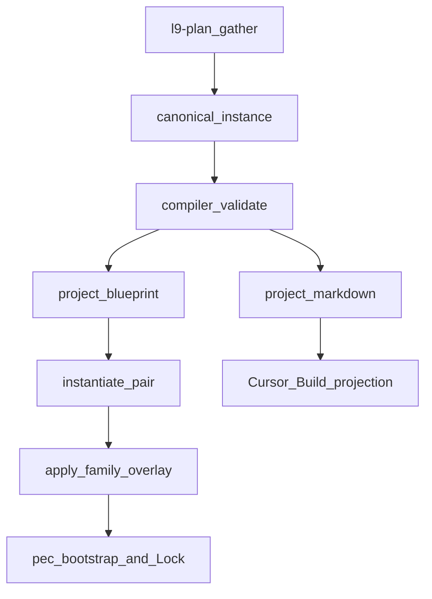

# Execution-family compiler (invert SSOT) — improved

Improve.md applied to the prior plan (inspect_only on the plan artifact). Decision is unchanged. Contracts, wave boundaries, and validation honesty are tightened.

## Improve ledger (why this revision)

Verified defects in the previous plan:

- `project` meant both Blueprint overlay and `.plan.md` render. Two operations, one name.
- Wave C said `apply_family_projection` “calls `instantiate_pair`.” [instantiate.py](environment/program-execution/core/program-execution-blueprint-template/scripts/instantiate.py) only copies the template tree and substitutes `{{id}}`. Overlay apply is a second step.
- `validate.py` “enforce listed `validation_rules`” overclaimed. WIP rules are prose (`PLAN-SCHEMA-001` … `015`). Only a named machine subset is executable in Wave A.
- Pipeline steps 1–9 described full instantiation, then “stop after C.” First landing scope was contradictory.
- “Wrap `validate_plan_document.py` around the compiler” would drop existing `G_*` gates in [validate_plan_document.py](skills/l9-plan/scripts/validate_plan_document.py) and cannot accept [plan_pass.json](skills/l9-plan/fixtures/plan_pass.json) (different shape from canonical sections).
- “Start with plan + one primitive” was a stub. Improve forbids incomplete artifacts presented as done.
- No instance envelope. Schema YAML is `schema_not_instance`. Compiler input was Unknown.

Entropy removed: one overloaded `project`, fake full-family enforcement, Wave D treated as first-landing work.

## Decision (unchanged)

Do **not** hard-sever `l9-plan` from authoring plans. Do **invert ownership**.

[kernels/Leverage.md](kernels/Leverage.md) single ingress: `l9-plan`, Cursor Build, PE Controller, `/autonomy` share one normalize → validate → project → instantiate path. One compiler, ten registered schemas, not nine skills, not PE-core YAML copies, not YAML→JSON Schema conversion.

```text
Human / l9-plan / Cursor Build     gather only (thin invokers)
        │  canonical instance
        ▼
environment/contracts/execution    SSOT: 10 YAML schemas + compiler
  validate → project-blueprint | project-markdown
        │  overlay (no Program state)
        ▼
environment/program-execution      instantiate_pair THEN apply overlay
        │  $HOME/.l9/programs/<id>/
        ▼
pec.py bootstrap / Lock / claim    runtime authority
        │
        ▼
/autonomy + thin provider          admitted Rendered Contract only
```

`l9-plan` keeps doctrine, depth routing, stress-test, and `G_*` gather gates. It stops owning schema SSOT. `/autonomy` stays the execute invoker. No `l9-coding-contract`.

## Ownership

| Layer | Owns | Must not own |
|---|---|---|
| [environment/contracts/execution/](environment/contracts/execution/) | 10 `canonical.schema.*.v1` YAML files, compiler, MANIFEST, ADR-0023 | Program Lock, leases, receipts, `$HOME/.l9` runtime |
| [environment/program-execution/](environment/program-execution/) | `instantiate_pair`, overlay apply, Lock, claim/render/verify/handoff, existing JSON Schema receipts | Canonical YAML, skill schemas |
| `l9-plan` | Gather, `G_*` quality gates, invoke compiler, optional `.plan.md` | Schema SSOT, Blueprint files, Program state |
| `/autonomy` | Subordinate packet under Program lease | Schema instances, Program state |

## Instance envelope (missing from prior plan)

Every compiler input/output is:

```yaml
schema_id: canonical.schema.plan_document.v1   # or other family id
schema_version: "1.0.0"
status: draft | preflight_blocked | executable | ...
body: {}   # section map matching that schema's required_sections
```

- Schema YAML stays `schema_not_instance` (ontology, `required_sections`, `validation_rules`, `schema_dependency_direction`).
- Instance `body` for `plan_document` uses the 20 section ids already in the WIP schema: `metadata`, `todos`, `architect_framing`, `immutable_baseline`, `objective`, `capability_preflight`, `execution_envelope`, `side_effects_and_idempotency`, `architecture_impact`, `rollback`, `complexity_and_uncertainty`, `inventory_and_classification`, `gated_write_pipeline`, `regeneration_extinguishment`, `execution_DAG`, `property_evidence_matrix`, `stress_and_disconfirm`, `out_of_scope`, `follow_on_milestone`, `convergence`.
- Optional sections stay optional (`inventory_and_classification`, `gated_write_pipeline`, `regeneration_extinguishment`, `follow_on_milestone`) per schema flags — do not invent a new required set.
- Old skill `PLAN_DOCUMENT` JSON is **not** this envelope. Wave B translates or replaces fixtures; it does not feed `plan_pass.json` to the compiler unchanged.

## Compiler contract (Wave A — complete, not stubbed)

Path: `environment/contracts/execution/compiler/`

| Command | Input | Output | Wave A completeness |
|---|---|---|---|
| `validate` | instance envelope | PASS / FAIL + rule ids | **Complete** for `plan_document` machine subset + structural section presence for the other nine registered schemas + family acyclicity |
| `project-blueprint` | validated `plan_document` instance | overlay dict keyed by existing Blueprint filenames | **Complete** for the template Pipeline step 2 map only |
| `project-markdown` | validated `plan_document` instance | Cursor `.plan.md` (Build frontmatter + body) | **Complete** (replaces template-append renderer) |
| `derive` | instance + target schema_id | derived instance | **Interface + fail-closed only**: refuse unknown target; refuse plan→coding/execution/packet until Wave D; refuse cycles. Do not emit coding_contract in Wave A |

Machine-enforced on `plan_document` in Wave A (maps to existing prose rules):

- `PLAN-SCHEMA-001` — `immutable_baseline.commit_sha` is 40-hex (or documented equivalent).
- `PLAN-SCHEMA-007` — `execution_DAG` / todos `depends_on` acyclic.
- `PLAN-SCHEMA-004` — mutating todos have envelope path/command refs (structural presence).
- Required-section presence for non-optional sections.
- `schema_dependency_direction` of the **family** is acyclic; plan `must_not_depend_on` coding/execution/mutation/packet.

Agent-enforced (compiler reports `NOT_MACHINE` / does not claim PASS on these): `PLAN-SCHEMA-002` drift-at-start, `003` live probes, `005/006` side-effect honesty, `008` property evidence vs exit-0, `009/010` typed rollback completeness, `011` retirement, `012` dirty overlap at execute time, `013` unknown honesty, `015` convergence evidence. Those stay plan-status law for PE admit / human fill.



## First landing vs later full instantiation

**First landing (this plan’s execute scope): Waves A–C only.**

| Full-instantiation step | First landing |
|---|---|
| 1 Author plan_document | Yes — thin `l9-plan` or filled template |
| 2 Validate machine subset | Yes — compiler |
| 3 Primitive instances | Structural refs only; no derive engine |
| 4 Derive coding_contract | Wave D |
| 5 Derive execution_contract | Wave D |
| 6 Project Blueprint overlay | Yes — existing PE fields only |
| 7 instantiate_pair + apply overlay + pec bootstrap | Yes |
| 8 mutation_authorization → lease | Wave D |
| 9 execution_packet → peer request | Wave D — packet **is** Rendered Contract + `l9.peer-execution.request.v1` already |

`.plan.md` remains a Cursor Build **projection**, not SSOT.

## Wave A — family SSOT + compiler

New branch from `origin/main` (ff-only). No legal ingest or other WIP.

- Copy 10 YAML files from `WIP/Execution Schemas/environment/contracts/execution/schemas/` → [environment/contracts/execution/schemas/](environment/contracts/execution/schemas/).
- Register all ten in [MANIFEST.yaml](environment/contracts/execution/MANIFEST.yaml). Update [README.md](environment/contracts/execution/README.md): schemas + compiler are SSOT; template remains a projection.
- Add [environment/contracts/execution/adr/ADR-0023-execution-family-compiler-owns-schemas.md](environment/contracts/execution/adr/ADR-0023-execution-family-compiler-owns-schemas.md): contracts own family; PE consumes overlay; skills invoke; PE JSON Schema stays runtime-only; `derive` of downstream schemas is a later authorized change.
- Compiler modules: `validate.py`, `project_blueprint.py`, `project_markdown.py`, `derive.py` (fail-closed stub), `cli.py`, tests, one canonical `plan_document` PASS fixture and one FAIL fixture (missing SHA / cyclic DAG).
- `project_blueprint` keys (only these; do not invent PE files): `PROGRAM.yaml`, `CURRENT_STATE_DELTA.yaml`, `DEPENDENCY_GRAPH.yaml`, `TASK_CARDS.yaml`, `EXECUTION_WAVES.yaml`, `EVIDENCE_CATALOG.yaml`, `CUTOVER_AND_ROLLBACK.yaml`, `CONVERGENCE_GATES.yaml`, `UNKNOWN_REGISTER.yaml`.
- Overlay values must be valid against the **existing** PE JSON Schema shapes already in `environment/program-execution/core/program-execution-blueprint-template/schemas/`. If a canonical field has no PE receiver, omit it and record it in the ADR as unprojected — do not fork a PE schema.

Acceptance: compiler CLI validate PASS/FAIL fixtures; family graph test; `derive --to coding_contract` exits non-zero; no file under `environment/program-execution/core/**/schemas` added.

## Wave B — thin `l9-plan` (stacked after A)

Preserve: spec mode, ticket mode, legacy [plan-workflow.md](skills/l9-plan/references/plan-workflow.md) + `render_plan_markdown.py`, doctrine, router, stress-test, `G_*` gather gates.

Change:

- Plan-mode machine SSOT becomes the canonical instance + `compiler validate`.
- [SKILL.md](skills/l9-plan/SKILL.md), [plan-workflow-pe-autonomy.md](skills/l9-plan/references/plan-workflow-pe-autonomy.md), [commands/l9-plan.md](commands/l9-plan.md), template [`.meta.md`](environment/contracts/execution/templates/canonical.template.executable_plan.v1.plan.md.meta.md): skill is invoker, not schema owner.
- `render_plan_pe_autonomy.py` calls `project-markdown` (no template-append).
- `validate_plan_document.py` keeps the CLI name (pack structure and docs reference it) and becomes: run skill `G_*` on gather fields **then** `compiler validate` on the canonical instance. Reject raw legacy JSON that is not translated.
- [validate_pack_structure.py](skills/l9-plan/scripts/validate_pack_structure.py) today requires `schemas/plan-document.schema.json`. Replace that requirement with the contracts schema path + compiler CLI. Do not leave a zombie JSON schema as fake SSOT.
- Migrate fixtures: add canonical PASS/FAIL instances. Update or retire `fixtures/plan_pass.json` et al. so `self_test.py` exercises the compiler. Authorized skill-internal fixture break; public `/l9-plan` still emits a plan.

Acceptance: `python3 skills/l9-plan/scripts/self_test.py` PASS; pack structure PASS; no `plan-document.schema.json` as authority.

## Wave C — PE apply overlay (stacked after B)

Two PE operations, never collapsed:

1. `instantiate_pair` — copy Blueprint + Controller templates to `$HOME/.l9/programs/<id>/` (existing).
2. `apply_family_overlay` — write compiler overlay onto that copy; regenerate Blueprint manifest hashes the way instantiate already does; leave Controller sealed until `pec.py bootstrap`.

- New thin script only: `environment/program-execution/core/scripts/apply_family_overlay.py`.
- Do not add YAML under PE `core/**/schemas`.
- Do not implement a new PE capability-census object. Adapter `capability-receipt` remains Gate B. Overlay may fill `CURRENT_STATE_DELTA` / `UNKNOWN_REGISTER` only.
- Git does not store program instances.

Acceptance: overlay apply on the Wave A PASS fixture produces a tree that `validate_blueprint.py --mode instantiated` can be run against after placeholders required by PE are filled **or** the apply step fails closed naming the missing PE-required fields (honest BLOCKED, not a fake accepted Blueprint). Document the exact remaining PE placeholders; do not claim `definition_status: accepted` unless instantiated validation actually passes.

## Wave D — deferred (not this landing)

Only after A–C have a real consumer (a plan that needs file-emission / packet partition):

- `derive` coding_contract via `plan_alignment.required_mappings`.
- `derive` execution_contract → Lock ceilings / waves.
- mutation_authorization → lease expiry on existing `action-authorization`.
- execution_packet as facade over Rendered Contract + `l9.peer-execution.request.v1`.

## Preserved contracts

- PE Blueprint / Controller JSON Schema ids and filenames.
- `instantiate_pair` CLI.
- `/l9-plan` and `/autonomy` command names.
- Cursor `.plan.md` frontmatter (`name`, `overview`, `todos`, `isProject`).
- Thin-adapter law and PEER_EXECUTION authority chain.
- l9-plan spec/ticket/legacy markdown paths.

Authorized breaks: skill-internal plan JSON schema as SSOT; skill fixtures shape; MANIFEST gains schema artifacts.

## Explicit non-goals

- New skills or slash commands per schema.
- PE-core schema forks or YAML copies.
- Second Program-state machine.
- Format-unifying ontology YAML into JSON Schema.
- Implementing `derive` for coding/execution/packet in the first landing.
- Claiming all 15 `PLAN-SCHEMA-*` rules are machine-enforced.
- Mixing this landing with unrelated WIP.

## Validation (honest)

Wave A (structural + compiler unit):

```bash
python3 environment/contracts/execution/compiler/cli.py validate --instance fixtures/plan_pass.yaml
python3 environment/contracts/execution/compiler/cli.py validate --instance fixtures/plan_fail_sha.yaml  # expect FAIL
python3 environment/contracts/execution/compiler/cli.py derive --to coding_contract  # expect non-zero
```

Wave B:

```bash
python3 skills/l9-plan/scripts/self_test.py
python3 skills/l9-plan/scripts/validate_pack_structure.py skills/l9-plan
```

Wave C:

```bash
make program-execution-core-validate
make program-execution-conformance
```

Landing gate: `make pr-check` on the feature branch.

Label as **Unknown** until run: live `pec.py bootstrap` against a real repo SHA; live capability probes (`PLAN-SCHEMA-003`).

## Convergence of this plan artifact

Converged as an implementation plan when: first-landing scope is A–C only; compiler operations are named and complete-or-fail-closed; instance envelope is specified; machine vs agent rules are split; instantiate ≠ apply; l9-plan migration does not drop `G_*` or spec/ticket; Wave D cannot sneak into the first PR.

Next action after user confirms: execute Waves A–C on a new branch from `origin/main`.
