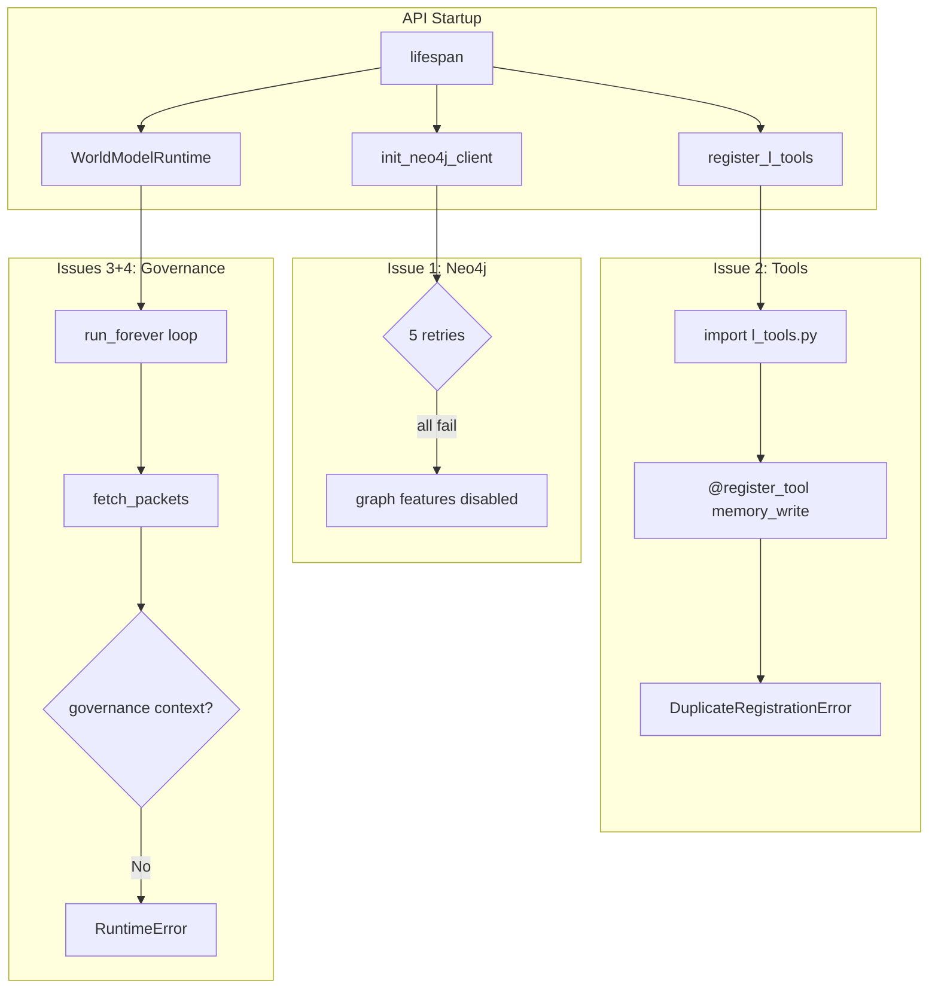

# Fix C1 Deployment Blockers

## Problem Summary

The L9 deployment on C1 has 4 critical blockers:
1. Neo4j connection fails despite healthy container
2. Duplicate tool registration crashes tool graph
3. World Model runtime lacks governance context for query_packets
4. Seed loader lacks governance context for write_packet

## Architecture Overview



---

## Fix 1: Duplicate Tool Registration

**Root Cause:** `memory_write` is registered twice:
- In [runtime/l_tools.py](runtime/l_tools.py) line 107 via `@register_tool` decorator
- In [core/tools/memory_tools.py](core/tools/memory_tools.py) line 405-407 via executor mapping

**Fix:** Remove the `@register_tool` decorator from `runtime/l_tools.py` for `memory_write`, similar to the fix already applied for `memory_search`.

**File:** `runtime/l_tools.py`

```python
# Line 107 - REMOVE this decorator:
@register_tool(category="memory", priority=10, description="memory_write tool")

# Add comment like memory_search:
# Note: memory_write is registered in core/tools/memory_tools.py
```

---

## Fix 2: Neo4j Connection

**Root Cause:** Neo4j container is healthy and auth works via `cypher-shell`, but Python driver connection fails. Likely causes:
- Docker network DNS resolution timing
- Connection timeout too short during startup race condition

**Investigation needed:** Test from inside l9-api container:
```bash
docker exec l9-l9-api-1 python -c "
from neo4j import GraphDatabase
d = GraphDatabase.driver('bolt://neo4j:7687', auth=('neo4j', 'password'))
d.verify_connectivity()
print('OK')
"
```

**Potential fixes in [api/server.py](api/server.py):**

Option A: Increase retry delay and count
```python
# Line 1620-1621
neo4j_max_retries = int(os.getenv("NEO4J_MAX_RETRIES", "10"))  # was 5
neo4j_retry_delay = float(os.getenv("NEO4J_RETRY_DELAY", "5.0"))  # was 3.0
```

Option B: Add explicit DNS wait before first attempt
```python
# Before retry loop, add:
import socket
for _ in range(5):
    try:
        socket.gethostbyname("neo4j")
        break
    except socket.gaierror:
        await asyncio.sleep(1)
```

---

## Fix 3: World Model Governance Context

**Root Cause:** `WorldModelRuntime.run_forever()` calls `substrate_service.query_packets()` which requires governance context. The RLS scope is set on `MemorySubstratePacketSource`, but the `substrate_service` method requires a governance context in the ContextVar.

**Error location:** [memory/governance_gate.py](memory/governance_gate.py) line 242-249
```python
def require_governance_context(operation: str) -> MemoryGovernanceContext:
    ctx = _governance_context.get()
    if ctx is None:
        raise RuntimeError(f"Governance context required for memory operation: {operation}")
```

**Fix in [world_model/runtime.py](world_model/runtime.py):**

Wrap `fetch_packets` call with governance context using existing pattern from [memory/slack_ingest.py](memory/slack_ingest.py) lines 216-228:

```python
# In MemorySubstratePacketSource.fetch_packets() around line 243:
async def fetch_packets(self, ...):
    if not self.substrate_service:
        return []

    try:
        self._ensure_scope(self.tenant_id, self.org_id, self.user_id)

        # ADD: Wrap with governance context
        from memory.governance_gate import build_governance_context, governance_context

        gov_ctx = build_governance_context(
            caller_id="world_model_runtime",
            role="system",
            scope="agent",
            project_id=os.getenv("L9_PROJECT_ID", "l9"),
            allowed_scopes=["agent", "memory", "global"],
            tenant_id=self.tenant_id,
            org_id=self.org_id,
            user_id=self.user_id,
            creator="world_model",
            source="runtime_fetch",
        )

        async with governance_context(gov_ctx):
            result = await self.substrate_service.query_packets(...)
```

---

## Fix 4: Seed Loader Governance Context

**Root Cause:** Same as Fix 3 - `write_packet` requires governance context.

**Fix in [world_model/seed_loader.py](world_model/seed_loader.py):**

Wrap `write_packet_to_substrate()` with governance context:

```python
# In write_packet_to_substrate() around line 202:
async def write_packet_to_substrate(self, packet: PacketEnvelope) -> bool:
    try:
        from memory.governance_gate import build_governance_context, governance_context
        from config.rls_config import get_rls_config

        rls_config = get_rls_config()
        gov_ctx = build_governance_context(
            caller_id="seed_loader",
            role="system",
            scope="agent",
            project_id=os.getenv("L9_PROJECT_ID", "l9"),
            allowed_scopes=["agent", "memory", "global"],
            tenant_id=rls_config.tenant_uuid,
            org_id=rls_config.org_uuid,
            user_id=rls_config.user_uuid,
            creator="seed_loader",
            source="write_packet",
        )

        async with governance_context(gov_ctx):
            # existing write_packet logic
```

---

## Execution Order

1. **Fix 1 (duplicate tools)** - Simple, unblocks tool graph
2. **Fix 2 (Neo4j)** - Requires investigation first, unblocks 5 features
3. **Fixes 3+4 (governance)** - Can be done together, unblocks background processing

## Verification

After each fix:
```bash
# Rebuild and restart
ssh c1 "cd /opt/l9 && git pull && \
  docker compose -f docker-compose.yml -f docker-compose.prod.yml build l9-api && \
  docker compose -f docker-compose.yml -f docker-compose.prod.yml up -d --no-deps l9-api"

# Check logs
ssh c1 "docker logs l9-l9-api-1 2>&1 | grep -E 'error|ERROR|failed|Neo4j|Governance' | tail -20"

# Health check
ssh c1 "curl -s http://127.0.0.1:8000/health"
```

## Success Criteria

- No "DuplicateRegistrationError" in logs
- "Neo4j connected" or successful graph operations
- No "Governance context required" errors
- World Model runtime processes packets without errors
- All 8 containers healthy
