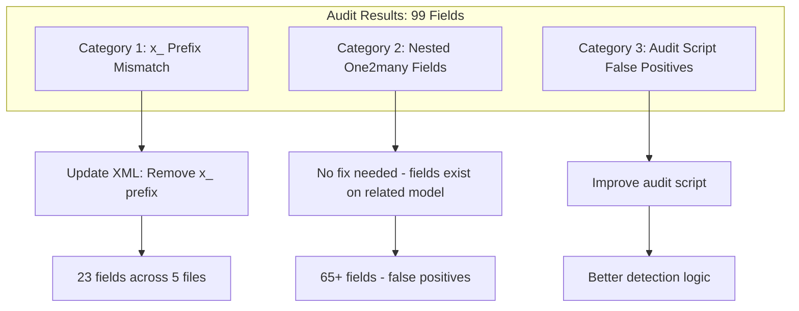

# Fix XML Field Reference Audit Issues

## Analysis Summary

The audit identified 99 "missing" fields, but investigation reveals three distinct categories:



---

## Category 1: x_ Prefix Mismatch (REAL ISSUES - 23 fields)

These are actual bugs where migrations renamed fields but views were not updated.

### 1.1 plasticos_automation module (12 fields)

**Root Cause:** Migration `19.0.1.1.0/pre-migrate.py` renamed columns from `x_*` to non-`x_*`, but views still reference old names.

**Files to fix:**

- [plasticos_automation/views/purchase_order_views.xml](plasticos_automation/views/purchase_order_views.xml)
  - `x_ready_for_pickup` -> `ready_for_pickup`
  - `x_ready_confirmed_on` -> `ready_confirmed_on`
  - `x_buyer_id` -> `buyer_id`
  - `x_followup_count` -> `followup_count`
  - `x_last_followup_on` -> `last_followup_on`

- [plasticos_automation/views/sale_order_views.xml](plasticos_automation/views/sale_order_views.xml)
  - `x_delivery_term` -> `delivery_term`
  - `x_appt_requested` -> `appt_requested`
  - `x_appt_requested_on` -> `appt_requested_on`

- [plasticos_automation/views/stock_picking_views.xml](plasticos_automation/views/stock_picking_views.xml)
  - `x_trucker_id` -> `trucker_id`
  - `x_receipt_confirmation` -> `receipt_confirmation`
  - `x_trucker_notified_on` -> `trucker_notified_on`
  - `x_trucker_followup_count` -> `trucker_followup_count`

### 1.2 plasticos_documents_native module (11 fields)

**Root Cause:** Same migration pattern - fields renamed but views/sync code not updated.

**Files to fix:**

- [plasticos_documents_native/views/document_native_views.xml](plasticos_documents_native/views/document_native_views.xml)
  - `x_doc_type` -> `doc_type`
  - `x_polymer_id` -> `polymer_id`
  - `x_transaction_id` -> `transaction_id`
  - `x_load_id` -> `load_id`
  - `x_intake_id` -> `intake_id`
  - `x_verified` -> `verified`
  - `x_verified_by` -> `verified_by`
  - `x_verified_at` -> `verified_at`
  - `x_override` -> `override`
  - `x_override_reason` -> `override_reason`
  - `x_plasticos_doc_id` -> `plasticos_doc_id`

- [plasticos_documents_native/models/document_sync.py](plasticos_documents_native/models/document_sync.py) - Also uses `x_*` names

---

## Category 2: Nested One2many Fields (FALSE POSITIVES - 65+ fields)

These fields exist on related models and are correctly referenced inside One2many/Many2many sub-views. The audit script incorrectly attributes them to the parent model.

### Examples:

| XML File | Parent Model | Field | Actual Model |
|----------|--------------|-------|--------------|
| transaction_views.xml | plasticos.transaction | detail_id, grade_id, sale_weight, etc. | plasticos.transaction.line (via `line_ids`) |
| facility_profile_views.xml | res.partner | max_monthly_throughput_lbs, process_type, etc. | plasticos.facility.profile (via `facility_profile_ids`) |
| partner_material_ux.xml | res.partner | polymer_id, form_id, color_id, etc. | plasticos.material.profile (via `material_profile_ids`) |
| crm_lead_views.xml | crm.lead | lead_id, decision, state, etc. | plasticos.web.lead (via `web_lead_ids`) |
| enrichment_run_views.xml | plasticos.enrichment.run | url, source_type, crawl_status, etc. | plasticos.enrichment.source (via `source_ids`) |
| intake_views.xml | plasticos.intake | selected, buyer_name, match_score, etc. | plasticos.intake.match (via `match_ids`) |
| purchase_order_views.xml | purchase.order | material_description, material_profile_id, etc. | purchase.order.line (via `order_line`) |
| sale_order_views.xml | sale.order | material_description, material_profile_id, etc. | sale.order.line (via `order_line`) |

**No code changes needed** - these are audit script limitations.

---

## Category 3: Cross-Module Field Definitions (FALSE POSITIVE - 1 field)

- `product_id` on `plasticos.polymer` - Defined in [plasticos_product/models/product_template.py](plasticos_product/models/product_template.py) line 42, but audit only scanned `plasticos_material_profile/models/`.

**No code changes needed** - audit script should scan all modules.

---

## Implementation Tasks

### Task 1: Fix plasticos_automation XML views

Update 3 XML files to remove `x_` prefix from 12 field references.

**Pattern:**
```xml
<!-- Before -->
<field name="x_ready_for_pickup"/>

<!-- After -->
<field name="ready_for_pickup"/>
```

### Task 2: Fix plasticos_documents_native XML and Python

Update 1 XML file and 1 Python file to remove `x_` prefix from 11 field references.

### Task 3: Improve audit script (optional)

Enhance [scripts/audit/xml_field_audit.py](scripts/audit/xml_field_audit.py) to:
- Detect One2many/Many2many fields and resolve comodel
- Check fields inside sub-views against the related model, not the parent
- Scan all plasticos_* modules for field definitions, not just the module containing the view

---

## Verification

After fixes, re-run:
```bash
python3 scripts/audit/xml_field_audit.py
```

Expected result: 0 missing fields in known models (remaining will be false positives from nested views until audit script is improved).

---

## Risk Assessment

| Task | Risk | Mitigation |
|------|------|------------|
| XML field renames | Low | Fields already exist with correct names |
| Python sync code | Medium | Test document sync after changes |
| Audit script | None | Read-only improvement |
