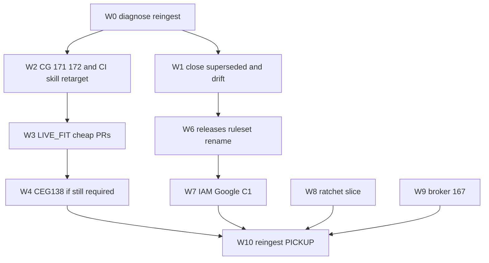

# Fleet issue closeout (diagnose-first)

## Operating kernel

Apply [kernels/Diagnose First Kernel.md](kernels/Diagnose First Kernel.md) to every issue:

- An open GitHub issue is a **claim**, not a root cause and not mutation authority.
- Inspect current state (API, tip SHA, ADRs, merged PRs) before proposing a fix.
- Do not execute the issue's requested work when it conflicts with verified architecture.
- Label stale, contradictory, or agent-invented tickets as such. Close with evidence; do not "complete" them.

## Verified architecture (CI)

**Expected (operator, 2026-08-16):** `Quantum-L9/.github` is **not** the CI hub. `Quantum-L9/l9-ci-core` owns CI orchestration and will distribute its own consumer CI. `.github` keeps org community-health / advisory metadata only.

**Observed:**

- [Quantum-L9/.github#49](https://github.com/Quantum-L9/.github/pull/49) merged 2026-08-16T05:32:11Z — `TASK-002 retire L9 CI distribution surfaces from .github` (+ TASK-003/004/005). This is the controlling change record.
- [l9-ci-core AGENTS.md](https://github.com/Quantum-L9/l9-ci-core/blob/main/AGENTS.md) — Core is the thin GHA control plane; consumers call Core kernels (`analyze-semgrep.yml`, legacy `pr-pipeline.yml`, …). Kernel callers use **`@v1`**, not floating `@main` and not a SHA-pin sweep of those refs.
- [l9-ci-core#91](https://github.com/Quantum-L9/l9-ci-core/pull/91) is already open for issue #57. Core may still have unpublished distribution work — **do not compensate by reseeding from `.github`**.
- [Quantum-L9/.github#48](https://github.com/Quantum-L9/.github/pull/48) is still open (`feat(seed): fan out locked Biome contract with l9-ci-pack`). That continues the **retired** hub. Do **not** merge or execute it from this campaign.
- `.github` `docs/BOUNDARIES.md` on `main` still says this repo "ships l9-ci-pack via the seeder". Treat that paragraph as **stale derived docs** vs #49 + operator instruction. Do not use it as SSOT.

**Constellation (unchanged):** Core orchestrates; SDK observes; Assurance decides; Debt Resolver diagnoses; PR_Repair mutates. Cursor-Governance [AGENTS.md](AGENTS.md) §2.3: when sdk and core disagree on a tool version, **sdk wins**.

## What this plan no longer does

Dropped from the prior draft (those were "do what the ticket says"):

- Fleet-run `seed-governance.yml` / live seed of `l9-ci-pack` from `.github`.
- Create or re-wire `l9-governance-seeder` as a CI distributor (App already exists; CI distribution is not its job).
- Org-wide SHA-pin of 280 workflow refs from `.github#47` (audit assumes `.github` is the hub; HIGH rows also fight the `@v1` kernel-tip contract).
- Bind `l9-graphiti-memory` to `constellation-node-sdk` or run RP-001–RP-010 "production proof" (ports/injected constellation is the package architecture; the RP pack is a July agent release-theater).
- Merge or land `.github#48`.

`l9-governance-seeder` existing (app_id `4562073`, install `153005222`) is a **fact**, not a reason to keep seeding CI from `.github`.

## Per-issue diagnosis (48)

Verdicts: `CLOSE_SUPERSEDED` | `CLOSE_DUPLICATE` | `CLOSE_ADVISORY` | `LIVE_FIT` | `DO_NOT_EXECUTE` | `HUMAN` | `EXTERNAL`.

### Quantum-L9/.github (old hub / community)

- **#20** Unblock governance seeding / create GitHub App — `CLOSE_SUPERSEDED`. App + env secrets already wired (2026-08-11). Seeding CI/governance callers from this repo is retired by #49. Do not dispatch seed.
- **#19** Weekly governance posture (CODEOWNERS / governance caller / dependabot %) — `CLOSE_ADVISORY` + `CLOSE_SUPERSEDED`. Generated coverage report of the old hub. Not a defect.
- **#47** SHA-pin audit 280 findings — `CLOSE_SUPERSEDED` / architecture misfit. Generated by `.github` monthly pin audit. HIGH rows demand SHA-pinning `.github` governance.yml `@v1` and `l9-ci-core` `@v1` kernels; Core AGENTS + this org's PR template require **`@v1` tip**, not SHA. Do not execute the sweep.
- **#6** Org issue_template cascade — `LIVE_FIT`. Community-health org default (GitHub `.github` repo role). Not CI distribution. Fix template path only.

### l9-graphiti-memory (RP pack, 2026-07-22)

Package is a memory control plane with **injected** `TransportPacketPort` / `GateClientPort` (ADR-026/060). Hosts inject; the library does not import Gate_SDK. The RP issues are a recursive-alignment "external production proof" pack.

- **#1 RP-001** pin TransportPacket — `DO_NOT_EXECUTE`. Would violate injected-port architecture. Comment + close as superseded by ADRs.
- **#2 RP-002** pin Gate client — `DO_NOT_EXECUTE`. Same.
- **#3 RP-003** Gate staging rehearsal — `DO_NOT_EXECUTE` / `EXTERNAL`. No product requirement observed to ship constellation lifecycle from this library.
- **#4 RP-004** live Graphiti proof — `DO_NOT_EXECUTE`. Cursor-Governance already operates live Graphiti; this ticket is package-release theater, not a fleet blocker.
- **#5 RP-005** live Zep — `DO_NOT_EXECUTE`. No Zep ref in AWS/Infisical inventory; Zep is not a current plane.
- **#6 RP-006** migration rehearsal — `DO_NOT_EXECUTE` unless a current release still claims v0.2→v2.2 (Unknown; do not invent a release).
- **#7 RP-007** prove hosted CI / branch protection — `CLOSE_SUPERSEDED`. Hosted CI owner is `l9-ci-core` if/when this repo adopts it. Do not build a custom proof program.
- **#8 RP-008** secret-manager proof — `CLOSE_SUPERSEDED`. Infisical is the agent vault SSOT (2026-08-13). Do not add a second manager inside the package.
- **#9 RP-009** / **#10 epic** — `CLOSE_SUPERSEDED`. Rollup of the above. Close after comments on #1–#8.

### l9-ci-core / sdk / debt (the actual CI plane)

- **l9-ci-core#57** hardcoded pip pins in `pr-pipeline.yml` — `LIVE_FIT`. Owner is Core. **Join [PR #91](https://github.com/Quantum-L9/l9-ci-core/pull/91)**; do not open a second fix.
- **l9-ci-core#24** cut v2.0.0 tag — `LIVE_FIT`. Core's own release, not `.github` hub work. Try `gh release create` with the openclaw PAT; if tag gateway 403, that is an ask.
- **l9-ci-sdk#50** pre-commit ruff `v0.15.5` vs `requirements-ci` `0.16.0` — `LIVE_FIT`. Sdk is pin SSOT.
- **l9-ci-debt-intelligence#14** `requirements/snapshot.txt` outside lock — `LIVE_FIT`. Local to that repo.

### Cursor-Governance

- **#171** memory gates lie — `LIVE_FIT`. Observed in [compile_session_packet.py](ops/graphiti/hydration/compile_session_packet.py) and [graphiti_memory_client.py](ops/graphiti/graphiti_memory_client.py) `cmd_conflicts`.
- **#172** unpopulated `make pr` template — `LIVE_FIT`. Observed in [open_pr_after_gate.sh](ops/scripts/open_pr_after_gate.sh).
- **#167** zero-static-secret broker — `LIVE_FIT` (remaining infra). Architecture already landed; do not implement the withdrawn "paste UA into every surface" model. Broker deploy is a later wave, not a reason to touch `.github` CI.

Also in this clone (not an issue, but drift): [skills/l9-setting-up-ci/SKILL.md](skills/l9-setting-up-ci/SKILL.md) still says prefer the `.github` seeder for `l9-ci-pack`. Retarget to `l9-ci-core` stamp/distribution in W2 so agents stop recreating #20/#48.

### Other LIVE_FIT product defects

- **PR_Repair#6** per-finding apply column — `LIVE_FIT`.
- **PR_Repair#14** pin llm-router — `LIVE_FIT` (fetch SHA; do not invent).
- **PR_Repair#16** Sonar C rating — `LIVE_FIT` via Sonar API + vault `openclaw-igorbot/sonarcloud#token` (not the dashboard).
- **Cognitive.Engine.Graphs#138** PacketEnvelope → TransportPacket — `LIVE_FIT` **if** current `docs/contracts/SHARED_MODELS.md` still requires it. Re-read on CEG main before mutating. Owner remains CEG + Gate_SDK, not graphiti-memory.
- **CEG#139** / **EIE#139** ratchet ledgers — `LIVE_FIT` as trackers. First shrink-slice only; no fake-close.
- **l9-constellation-topology#5** merge-gate bypass — `LIVE_FIT`. `main` protection 404 observed. Ruleset via API. Not a `.github` CI-hub issue.
- **l9-meta-injector#55/#56** release + npm evidence — `LIVE_FIT` for that package.
- **l9-infra#4** rename to `l9-infisical-control-plane` — `LIVE_FIT` (low). `gh repo rename`.
- **igorbot#37** Google DWD — `HUMAN`. No Admin API.
- **igorbot#41** IAM write — `LIVE_FIT` try AWS API; ask only on AccessDenied.
- **l9-cognitive-runtime#30** OAuth/staging — `HUMAN`. No IdP in vault. Leave open with one-line ask; do not invent an issuer.
- **l9-codegraph#27/#28** Jul secret rotation — `LIVE_FIT` for GitHub Actions secrets via `gh secret set` from vault. VPS Neo4j/Redis = `HUMAN` (C1 APPROVE). **#11/#12** Apr dupes — `CLOSE_DUPLICATE`.

### Drifting bots

- **L9-Ops-MCP#8–17** daily "CODEOWNERS missing" — `CLOSE_DUPLICATE` / bot drift. Do **not** run `MODE=reconcile ./DEPLOY.sh`. One CODEOWNERS file only if that repo's own policy requires it (Unknown until W1 inspect). Close #9–#17 as dupes of #8 regardless.

## Waves (revised)



W5 (graphiti RP proof) is **deleted**.

## Authority / execute path

Planning-only until you Build. Then Diagnose First discovery on each wave before mutation.

```text
.plan.md
  → @environment/program-execution
  → @autonomy (subordinate)
  → PE adapter cursor-foreground
```

- Campaign `fleet-issue-closeout-v1` (execute_order 6) from `origin/main`. No WIP mix.
- Per-repo exclusive worktrees under `$HOME/.l9/program-worktrees/fleet-issue-closeout-v1/`.
- Publish: `PR_BASE=origin/campaign/fleet-issue-closeout-v1 PR_REMEDIATE=0 make pr`.
- Merge only via `/l9-pr-remediation` after green.
- First execute step: `validate_plan_document.py` + `render_plan_pe_autonomy.py`. Depth = deep.

API-first, no human GitHub UI ([CANONICAL_LAW.md](CANONICAL_LAW.md) §14). `l9-ui-operator` unused (`ui-session-github` unprovisioned).

## Irreducible asks

1. **Google Admin DWD** (`igorbot#37`) — existing SA client ID + four scopes. No API.
2. **C1 DB rotation** — only if you reply `APPROVE: c1-secret-rotation`.
3. **Claude.ai env name deletion** (`#167`) — only if no Anthropic admin API.
4. **L9CR OAuth issuer** (`l9-cognitive-runtime#30`) — one line, or leave the issue open.
5. **IAM write** / **Core tag 403** — only if the API probe fails.

You will not be asked to create a GitHub App, accept seeder permissions, run the old org seed, or click Sonar/npm settings.

## Success properties

- Re-ingest: every issue is **closed with a diagnosis comment** or **open as HUMAN/EXTERNAL/LIVE_FIT-in-progress**.
- Zero new PRs that restore `.github` as CI distributor. `.github#48` remains unmerged by this campaign.
- Zero SHA-pin PRs justified only by `.github#47`.
- Zero `constellation-node-sdk` dependency added to `l9-graphiti-memory`.
- `#171` / `#172` green; `make pr-check` PASS.
- `l9-setting-up-ci` no longer instructs agents to `gh workflow run seed-governance.yml` for CI pack.
- `l9-ci-core#57` tracked via PR #91 (merged or still the single fix), not a second branch.
- No secret values in git, comments, or chat.

## Envelope / rollback / out of scope

- FS: campaign YAML + listed worktrees. No `WIP/` scoop. No `environment/program-execution/core/`.
- Forbidden: force-push, admin-merge, inventing Zep/Gate URLs, fake-closing ratchet ledgers, executing superseded tickets, merging `.github#48`.
- Rollback: revert LIVE_FIT PRs bottom-up; ruleset delete via API; secret version restore. Closing a superseded issue is reversed by reopen + comment, not by performing the retired work.
- Out of scope: `.github` CI distribution, RP-001–010 execution, org SHA-pin sweep, 152-test full burn-down, 10X/C1 docker, pasting UA into agent envs.

## Unknowns

- Whether CEG `SHARED_MODELS.md` on current `main` still requires the #138 migration (re-read before W4).
- Whether L9-Ops-MCP policy requires CODEOWNERS (inspect; default = close bot dupes only).
- Whether local AWS can `iam:PutUserPolicy`.
- Whether Coolify already has a broker target.
- Whether this PAT can push `l9-ci-core` tags.
- Whether l9-ci-core consumer-stamp/distribution has landed on `main` yet (PR #92 typescript preset still open). Absence does **not** authorize `.github` to keep distributing.

## YNP

**YES:** Build / PE + `/autonomy` starting W0 → W1 (superseded closes) and W2 (this-repo LIVE_FIT).
**NO:** Do not seed from `.github`, merge #48, SHA-pin from #47, or bind graphiti-memory to Gate_SDK.
**PROCEED:** Program Execution Controller; Diagnose First on each ticket before any mutate.
