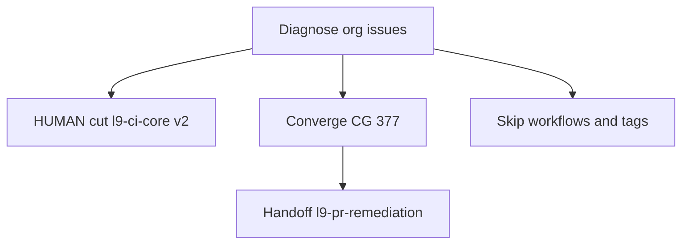

# Fleet Issues Diagnose: Quantum-L9

**Intent:** Diagnose (you pointed at the org URL with no fix/unblock language). No commit, push, close, or worktree mutation until you confirm Converge.

**Repos scanned:** 60 non-archived `Quantum-L9/*` (61 listed, `golden-repo` archived and excluded from fleet). **Open issues:** 70 in-fleet + 4 leftover on archived `golden-repo`. **Clusters:** 8 named below.

Evidence: `gh repo list` + `gh search issues --owner Quantum-L9 --state open` (74 hits, limit 100 so complete).

## Top blockers

| # | Issue | Ownership guess | Why blocking | Linked |
|---|-------|-----------------|--------------|--------|
| 1 | [l9-ci-core#112](https://github.com/Quantum-L9/l9-ci-core/issues/112) (+ [#24](https://github.com/Quantum-L9/l9-ci-core/issues/24), [#98](https://github.com/Quantum-L9/l9-ci-core/issues/98)) | **HUMAN** | No `v2`/`v2.0.0` tag. Seeded consumers fail in Set up job: `Unable to resolve action quantum-l9/l9-ci-core@v2`. Tags today: `v1.0.0`, `v1`, `v0.1.0`. Author already said automation cannot cut the tag. | Same cluster as #24 (release script) |
| 2 | [.github#60](https://github.com/Quantum-L9/.github/issues/60) | **CI_PIPELINE** → likely **FALSE_POSITIVE** | Was S1/P0: 15-min force-push destroyed consumer seed-PR commits. **Fix merged** as [.github#63](https://github.com/Quantum-L9/.github/pull/63) (2026-08-25). Live `auto-seed-new-repo.yml` is hourly (`20 * * * *`), `force: true` count is 0, `ops/seed-branch-safety.js` is documented. Issue still open; Diagnose does not close. | Historical: l9-ci-sdk#71, l9-ci-core#110/#111 |
| 3 | [.github#20](https://github.com/Quantum-L9/.github/issues/20) | **HUMAN / EXTERNAL** | GitHub App + `GOVERNANCE_APP_ID` / `GOVERNANCE_APP_PRIVATE_KEY` for seed phases 10–12. Org secrets / App install. | — |
| 4 | [l9-graphiti-memory#10](https://github.com/Quantum-L9/l9-graphiti-memory/issues/10) epic (#3–#9) | **EXTERNAL** | P0 release-blocker evidence packs (Gate staging, live Graphiti/Zep, secrets rotation, hosted CI). Not a source patch. | RP-003…RP-009 |
| 5 | [Cursor-Governance#377](https://github.com/Quantum-L9/Cursor-Governance/issues/377) | **CODEBASE** | 12 live plans lack `kernel_pass`; 10/12 PLAN_DOCUMENTs fail `G_PRECOMMIT_CONFIG`. Latent: fails whoever next edits a plan. Precedent: #376. | Adjacent: #374 (hook exclude, protected `.pre-commit-config.yaml`) |
| 6 | [l9-ci-sdk#50](https://github.com/Quantum-L9/l9-ci-sdk/issues/50) | **CODEBASE** | pre-commit ruff `rev: v0.15.5` vs `requirements-ci.txt` `ruff==0.16.0`. Still true on current default. Governance is now `0.16.1` — confirm target pin at fix time. | Follow-up in l9-ci-core if still on older ruff |

## Cross-repo clusters

- **cluster-ci-core-v2-tag:** `l9-ci-core#24` + `#98` + `#112` — shared cause: floating `@v2` contract with no tag. Owner: human release on `l9-ci-core` (`docs/release/tag-and-release.sh`). Unblocks every seeded consumer CI.
- **cluster-seeder-clobber:** `.github#60` — root cause patched on `main` via PR 63. Residual: issue still open; optional evidence comment only.
- **cluster-graphiti-v22-proof:** `l9-graphiti-memory#3`–`#10` — external production proof, not codebase.
- **cluster-l11-codeowners:** 22 identical `L9-Ops-MCP` issues (#8–#33, bot) — `WARN: .github/CODEOWNERS missing`. One file would address the root; do not mass-close.
- **cluster-cg-plan-gates:** `Cursor-Governance#377` (+ `#374` protected-root, do not mix unless `ALLOW-ROOT-DELETION` is authorized).
- **cluster-broker-identity:** `Cursor-Governance#167`, `#184`, `#301`, `#302`, `#303` — broker/npm/session identity. **EXTERNAL / HUMAN**.
- **cluster-secret-rotation:** `l9-codegraph` + archived `golden-repo` quarterly rotation issues — **HUMAN**.
- **cluster-ceg-debt:** `Cognitive.Engine.Graphs#138`/#139 — ledgered test/model debt, large, not sticky this invoke.

## Warnings

- This skill **must not** edit `.github/workflows/**` (so even if #60 were still live, Converge would only hand off to `l9-pr-remediation`).
- `.pre-commit-config.yaml` and `CANONICAL_LAW.md` are `additive_only` root files. [#374](https://github.com/Quantum-L9/Cursor-Governance/issues/374) rewrites an `exclude` line — needs `ALLOW-ROOT-DELETION` plus protected-root PR template. [#368](https://github.com/Quantum-L9/Cursor-Governance/issues/368) is append-only successor text — allowed without deletion marker if we only append.
- `L9-Ops-MCP` 22 issues are bot spam of one WARN; treating them as 22 independent defects would be theater.
- `gh search` included archived `golden-repo`; those 4 issues are out of fleet.

**Diagnose Verdict:** **ACTIONABLE** (CODEBASE clusters exist). Org-wide blast is **BLOCKED_HUMAN** on the v2 tag. Highest labeled S1 is **likely already fixed**.

### YNP

- **YES:** Human runs `docs/release/tag-and-release.sh` on `l9-ci-core` main (issues #24/#112). That unblocks the most dependents and is out of Converge authority.
- **CODEBASE Converge (this skill, max 1 cluster, max 3 cycles):** [Cursor-Governance#377](https://github.com/Quantum-L9/Cursor-Governance/issues/377) — this checkout, obvious owner, precedent #376. Default: add `final_validation` `.pre-commit-config.yaml` entries (status `not_applicable` where it is an execution-time gate, matching #376); re-apply plan kernels and stamp `kernel_pass` on the 12 missing; resolve exclusive lock on `in-flight_pr_census_8-20-26.plan.md:80`; leave `_TEMPLATE.plan.md` exempt. Do **not** fold #374 into the same commit.
- **NO:** Do not cut tags, merge PRs, edit workflows, or mass-close L11 issues from Diagnose.
- **PROCEED:** After you accept this plan, run `l9-issue-remediation` **Converge** on `Quantum-L9/Cursor-Governance#377`.

## Converge execution (only after you confirm)

Hot path from [skills/l9-issue-remediation/SKILL.md](skills/l9-issue-remediation/SKILL.md) + [references/fix-engine.md](skills/l9-issue-remediation/references/fix-engine.md):

0. Dedicated worktree (`ops/scripts/agent_worktree_start.sh`); resume any `<!-- l9-issue-remediation:... -->` markers (none on #377 yet).
1. Lesson recall against `learning/failures/repeated-mistakes.md` and `learning/patterns/quick-fixes.md` for plan-kernel / precommit-config.
2. Fix the #377 corpus only (`docs/plans/**` listed in the issue). Skip `.pre-commit-config.yaml` (#374). Skip `CANONICAL_LAW.md` unless you explicitly widen to #368 as a separate later cluster.
3. Local verify: `skills/l9-plan/scripts/validate_plan_kernel_receipt.py` sweep + `ops/autonomy/kernel_gate.py` on changed plans. Cursor path: `make precommit-repo` (no `make pr` unless you type it).
4. One commit + one push with trailer `Issue-Remediation-Cycle: Quantum-L9/Cursor-Governance#377/cycle-1`.
5. If a PR opens: hand off to `l9-pr-remediation` (never merge here).
6. Breadcrumbs: Graphiti PICKUP (fail closed as `BLOCKED_PICKUP` if write fails) + canonical comment on #377 + update `TODO.md` only if it already exists.

**Not in this Converge:** `.github#60` close, v2 tags, GitHub App secrets, L11 mass-close, CEG 39 tests, broker/k8s.

