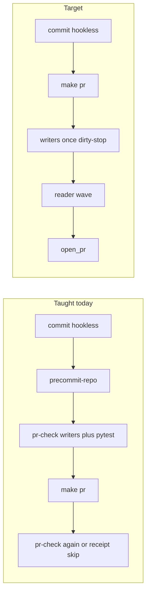

# Fold pr-check into make pr

## Reasoning

**Abductive.** Agents still run three ceremonies for one pipeline. `.pre-commit-config.yaml` is the live catalog. `make precommit-repo` runs it. `make pr-check` runs it again plus pytest, security, and wiring. `make pr` then runs `pr-check` again (`pr: pr-preflight pr-check` in [Makefile](Makefile)). Receipt skip only helps when the digest matches; the taught sequence `precommit-repo` then `pr-check` then commit then `make pr` often does not.

The smoking-gun teachers still in tree:

- [AGENTS.md](AGENTS.md) `PRECOMMIT_REPO_OWNS_RUFF_V1`: “After every local commit, run `make precommit-repo` … `make pr-check` still runs pytest…”
- [AGENTS.md](AGENTS.md) §4 failure loop: `make pr-check` → `make pr` once
- [ops/scripts/open_pr_after_gate.sh](ops/scripts/open_pr_after_gate.sh): prints `make pr-check && make pr`
- [ops/scripts/run_pr_precommit.sh](ops/scripts/run_pr_precommit.sh): “Public quality gate: make pr-check”
- [ops/autonomy/surface_profile.yaml](ops/autonomy/surface_profile.yaml): “`make pr-check` is the local validation path”

**Deductive.** [ops/scripts/run_pr_gate.sh](ops/scripts/run_pr_gate.sh) already runs writers first (`PR_PRECOMMIT_STAGE=writers`), hard-stops on tracked dirt, then the reader wave. A prior `make precommit-repo` cannot add safety; it only doubles the writer pass. Deleting the `pr-check` Make target would rewrite a protected recipe (`pr: pr-preflight pr-check`) and need `ALLOW-ROOT-DELETION`. Keep the leaf. Demote the PUBLIC verb. Stop the post-commit ritual.

**Inductive.** Landed ceremony plans (repair gate, precommit-before-pr, velocity, phase two, ceremony-speed on this branch) all added SKIP lists and receipts. The repeating leftover is a positive extra command, the same class as remediator leftover “gate is pr-check”.

**Confidence:** high on teachers and Make graph (text in tree). Typical extra wall is one writer pass plus a second pytest when the receipt misses. Action: proceed.

## Immutable baseline

- Workspace: `/Users/ib-mac/Cursor-Governance` on `feat/ceremony-speed-plan` @ `d0b0be4d`
- Ceremony-speed already landed on this unpublished branch (xdist, fetch-receipt, timings). Stay on this worktree. Do not restack onto `origin/main` (would drop those commits). Do not open a second worktree.
- Foreign dirty, write_deny: `.claude/settings.json`, plan shelf moves under `docs/plans/`, generated skill-registry companions unless this Build’s own `sync_generated_artifacts.py --force`, `docs/plans/remediator_remaining_speed_bb4c2204.plan.md`
- Do not write `Lock: origin/main = <sha>`
- At Build start: `git switch -c feat/pr-check-folded` from this HEAD (same worktree) so the ownership commits have a named branch. Pathspecs only.

## Ownership matrix (locked)

One owner per concern. Complementary SKIP lists already exist in `run_pr_precommit.sh`; this plan stops extra verbs from re-entering.

- **Catalog SSOT:** [.pre-commit-config.yaml](.pre-commit-config.yaml) — hook ids only. Never a public verb. Never a git commit hook (`pre-commit install` stays forbidden).
- **Public ceremony:** `make pr` — pr-preflight, writers, dirty-stop, overlap (early), parallel readers (cheap hooks + pytest + security + wiring + projection --check), receipt, open. Type this once after finished work is committed.
- **Internal gate leaf:** `make pr-check` — same `run_pr_gate.sh`. Diagnose = `OPEN_PR=0 make pr` (already documented in Makefile). Do not type `pr-check` after `precommit-repo`. Do not delete the target (Make graph stays `pr: pr-preflight pr-check`).
- **Remediator / backup / INTERNAL lint:** `make precommit-repo` — writers + cheap readers, no pytest. `L9_REMEDIATOR=1` still fail-closes `run_pr_gate.sh`. `make push` stays `precommit-repo backup`.
- **Corpus / nightly:** `make precommit` (`--all-files`) and `make pr-full`. Velocity SKIP already drops `repo-hygiene`, `legacy-doctrine-residue`, `rules-check`, `skills-check`, `symlinks-check`, pre-commit `ruff`/`ruff-format`.
- **Not on this path:** DAGs, `make lint` / `lint-ruff`, `make pr-security` as a standalone pre-step (security stays inside the reader wave), `lint-autofix.yml` (post-merge janitor only).

## Success properties

- SP-01: Live teachers outside historical AGENTS append-only blocks do not contain unnegated `make pr-check && make pr` or “after every local commit, run `make precommit-repo`”.
- SP-02: AGENTS.md has a new append `PR_CHECK_FOLDED_V1` that names `make pr` as the only public ceremony and demotes `pr-check` to the internal leaf / `OPEN_PR=0 make pr`.
- SP-03: Makefile recipe graph is still `pr: pr-preflight pr-check` (no target deletion; no `precommit-repo` Make prereq on `pr` or `pr-check`).
- SP-04: `OPEN_PR=0 make pr` (or leftover `make pr-check`) still runs writers once then the reader wave; remediator `L9_REMEDIATOR=1 make pr-check` still exits 1 in milliseconds.
- SP-05: Targeted tests PASS on this change set.

## Todos

1. **kill-positive-strings** — Replace leftover “run pr-check then pr” copy in live (rewritable) surfaces: [ops/scripts/open_pr_after_gate.sh](ops/scripts/open_pr_after_gate.sh) (the `make pr-check && make pr` help line), [ops/scripts/run_pr_precommit.sh](ops/scripts/run_pr_precommit.sh) (“Public quality gate”), [ops/autonomy/surface_profile.yaml](ops/autonomy/surface_profile.yaml) (local validation path is `make pr`; `pr-check` is the leaf), [ops/config/commit-verification-contract.json](ops/config/commit-verification-contract.json), [ops/scripts/compose_pr_body.py](ops/scripts/compose_pr_body.py) + [tests/ops/scripts/test_compose_pr_body.py](tests/ops/scripts/test_compose_pr_body.py), [commands/l9-plan.md](commands/l9-plan.md). Add one sentence to [rules/48-make-pr-remediation.mdc](rules/48-make-pr-remediation.mdc): Diagnose is `OPEN_PR=0 make pr`; do not run `pr-check` after `precommit-repo`. Then `sync_generated_artifacts.py --force` for llm-rules / skill-registry companions this Build actually dirties.

2. **agents-append** — Append-only [AGENTS.md](AGENTS.md) marker `PR_CHECK_FOLDED_V1` that supersedes `PRECOMMIT_REPO_OWNS_RUFF_V1` and the §4 “pr-check then pr” failure loop without deleting those lines. Public verbs: `improve`, `pr`. `pr-check` is INTERNAL. Do not run `precommit-repo` after every commit on the ceremony path; writers live inside `make pr` and hard-stop if dirty. Remediator / `make push` keep `precommit-repo`. Append one Makefile help echo (do not rewrite existing help or `pr:` / `pr-check:` recipes). Optional managed [INVARIANTS.md](INVARIANTS.md) pointer row.

3. **residue-test** — Add [tests/ops/scripts/test_ceremony_ownership.py](tests/ops/scripts/test_ceremony_ownership.py) (or extend an existing residue test). Scan live teachers: `rules/`, `ops/autonomy/surface_profile.yaml`, `ops/scripts/open_pr_after_gate.sh`, `ops/scripts/run_pr_precommit.sh`, `commands/*.md`, `ops/config/commit-verification-contract.json`. Fail on unnegated `make pr-check && make pr` and unnegated post-commit `make precommit-repo` ritual. Skip `AGENTS.md` historical blocks (additive_only; superseded by the new append). Skip remediator pack files that already say “do not run make pr-check”. Assert Makefile still has `pr: pr-preflight pr-check` and does not have `pr-check: precommit-repo`.

4. **prove** — Run the new test plus `OPEN_PR=0 make pr` on this change set. Pathspecs only. Protected-root template because AGENTS.md is in the PR (`<!-- L9_PROTECTED_ROOT_PR -->`). Do not stage foreign dirty.

## Doc / root surface

- AGENTS.md — append `PR_CHECK_FOLDED_V1` (todo agents-append)
- Makefile — append help echo only; no recipe rewrite
- INVARIANTS.md — optional pointer row (managed)
- CANONICAL_LAW.md — N/A (do not fold §6.2 in this Build)
- CLAUDE.md / README.md — N/A

## Stress and disconfirm

- If agents keep typing `make pr-check` then `make pr` on an unchanged tree, receipt skip must still prevent a second pytest; the new law names that sequence as wrong.
- If Diagnose users lose the name `pr-check`, `OPEN_PR=0 make pr` and leftover `make pr-check` must remain the same leaf. Do not deny `make pr-check` in `local_execution_gate.py`.
- If formatter dirt appears during the reader wave, writers already hard-stopped; do not revive a post-commit `precommit-repo` ritual.
- Assumed false if: `pr: pr-preflight pr-check` is deleted “for simplicity”; `precommit-repo` is added back as a Make prereq of `pr-check`; remediator is pointed at `pr-check`; AGENTS historical lines are rewritten without `ALLOW-ROOT-DELETION`; foreign dirty is staged; this Build executes sibling remediates=1 / CI selector / remediator census work.

Blast radius: every governed agent publish path and Diagnose copy. `git commit` stays hookless. Remediator verify stays `make precommit-repo`. CI workflows unchanged.

Rollback: revert the feature-branch commits. Historical AGENTS append remains until a later supersession append.

## Leverage

Highest first: kill-positive-strings → agents-append → residue-test → prove.

Shared cause: extra PUBLIC verbs for a catalog that `make pr` already runs.

Deletions: the taught post-commit `precommit-repo` ritual; the taught `pr-check && make pr` pair; “Public quality gate: make pr-check”. Do not delete the `pr-check` target, the hook catalog, or the writers/readers split.

## Out of scope

- [docs/plans/publish_ceremony_once_d08758b6.plan.md](docs/plans/publish_ceremony_once_d08758b6.plan.md) remediates-default / CI changed-file selector
- [docs/plans/ceremony_speed_f8580fa5.plan.md](docs/plans/ceremony_speed_f8580fa5.plan.md) (already committed on this branch)
- Remediator pack / [docs/plans/remediator_remaining_speed_bb4c2204.plan.md](docs/plans/remediator_remaining_speed_bb4c2204.plan.md)
- Installing a git commit hook or `pre-commit install`
- Weakening scanners or pytest
- Deleting `make pr-check` or rewriting Makefile `pr:` / `pr-check:` recipes
- Folding CANONICAL_LAW.md or rewriting existing AGENTS.md lines
- `make campaign`, Program Lock, new worktree from tip

## Execute via Cursor Build

Press **Build**. Work in the **current checkout**.

- Do not run `make campaign`.
- Do not admit a Program Lock or Controller lease.
- Do not write `Lock: origin/main = <sha>`.
- Do not open a new worktree from tip as a planning requirement.
- At Build start, `git switch -c feat/pr-check-folded` on this worktree. Pathspecs only.
