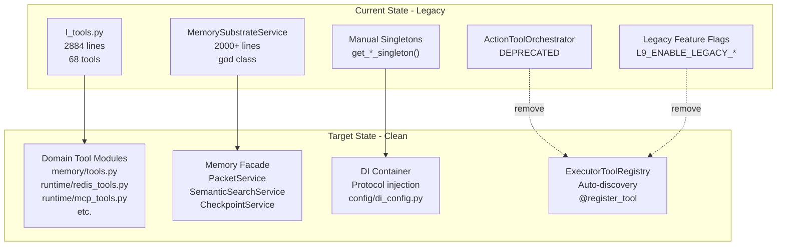
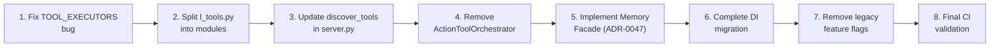

# Full Legacy Code Cleanup Plan

## Objective

Eliminate technical debt from incomplete architectural migrations by cleaning up all legacy code in a single coordinated PR. This ensures consistency and prevents partial states.

## Architecture Overview



## Execution Order (Dependency-Driven)

The cleanup must proceed in this order to avoid breaking dependencies:



## Track 1: Tool System Cleanup

### 1.1 Fix TOOL_EXECUTORS Bug (Critical)

The undefined variable bug in [runtime/l_tools.py](runtime/l_tools.py) lines 2803-2823.

**Option A (Quick Fix):** Add lazy initialization:

```python
# At module level, after all @register_tool functions
from runtime.tool_registry import get_tool_executors
TOOL_EXECUTORS = get_tool_executors()
```

**Option B (Clean Fix):** Update accessor functions to use registry directly:

```python
def get_tool_executor(tool_name: str):
    from runtime.tool_registry import tool_executor_registry
    return tool_executor_registry.get(tool_name)
```

Recommend **Option B** since it eliminates the redundant dictionary.

### 1.2 Split l_tools.py into Domain Modules

Create 10 new files, move 68 functions:

| New File | Tools Count | Source Lines |

|----------|-------------|--------------|

| `memory/tools.py` | 18 | ~500 |

| `runtime/redis_tools.py` | 11 | ~350 |

| `runtime/mcp_tools.py` | 8 | ~300 |

| `core/worldmodel/tools.py` | 9 | ~350 |

| `core/tools/introspection_tools.py` | 8 | ~300 |

| `runtime/governance_tools.py` | 3 | ~150 |

| `runtime/slack_tools.py` | 1 | ~60 |

| `runtime/llm_tools.py` | 1 | ~60 |

| `core/tools/neo4j_tools.py` | 1 | ~60 |

| `core/tools/simulation_tools.py` | 1 | ~60 |

Each file keeps the `@register_tool` decorator - auto-discovery handles registration.

### 1.3 Update Discovery in server.py

Update [api/server.py](api/server.py) lines 629-658 to discover all new packages:

```python
discover_tools("runtime")      # redis_tools, mcp_tools, slack_tools, llm_tools, governance_tools
discover_tools("memory")       # memory/tools.py
discover_tools("core.tools")   # introspection, neo4j, simulation
discover_tools("core.worldmodel")  # worldmodel tools
```

### 1.4 Update CI Tool Wiring Check

Modify [ci/check_tool_wiring.py](ci/check_tool_wiring.py) to validate new module structure instead of checking `l_tools.py`.

### 1.5 Delete l_tools.py

After all tools migrated and tests pass, delete [runtime/l_tools.py](runtime/l_tools.py).

## Track 2: Orchestrator Cleanup

### 2.1 Remove ActionToolOrchestrator

Files to delete:

- `orchestrators/action_tool/orchestrator.py`
- `orchestrators/action_tool/__init__.py`
- `tests/orchestrators/test_action_tool_orchestrator.py`

Update [core/tools/registry_adapter.py](core/tools/registry_adapter.py) docstring to remove references.

## Track 3: Memory Facade (ADR-0047)

### 3.1 Create Service Directory

```
memory/services/
    __init__.py
    packet_service.py        # ~250 lines
    semantic_search_service.py  # ~250 lines
    reasoning_trace_service.py  # ~250 lines
    checkpoint_service.py    # ~250 lines
    knowledge_service.py     # ~250 lines
```

### 3.2 Refactor MemorySubstrateService

Convert [memory/substrate_service.py](memory/substrate_service.py) to a facade dataclass that delegates to mini-services. Keep all method signatures for backwards compatibility.

## Track 4: DI Container Completion

### 4.1 Identify Remaining Direct Singleton Calls

Search for patterns:

- `get_redis_singleton()`
- `get_neo4j_client()`
- Direct singleton access in constructors

### 4.2 Convert to Protocol Injection

For each singleton call:

1. Add protocol parameter to constructor
2. Update callers to inject via DI container
3. Update tests to inject mocks

Key files:

- [config/di_config.py](config/di_config.py) - add bindings
- [core/abstractions/](core/abstractions/) - verify protocols exist

## Track 5: Legacy Feature Flag Removal

### 5.1 Remove Deprecated Flags

From [config/settings.py](config/settings.py) and environment:

- `L9_ENABLE_LEGACY_CHAT` - remove, use new endpoint only
- `L9_ENABLE_LEGACY_SLACK_ROUTER` - remove, use AgentTask router
- References to `create_agent_legacy()` - remove

### 5.2 Remove Gated Code

Delete code paths that were gated by these flags (after confirming new paths work).

## Track 6: Schema Cleanup

### 6.1 PacketEnvelope v1 Removal

- Verify all code uses v2 schema
- Remove [core/schemas/packet_envelope.py](core/schemas/packet_envelope.py) v1 classes
- Update any remaining imports

## Test Strategy

### Unit Tests

- Each new tool module needs import test
- Memory services need isolation tests
- DI bindings need resolution tests

### Integration Tests

- Tool dispatch end-to-end
- Memory facade delegation
- Startup bootstrap sequence

### CI Validation

- `ci/check_tool_wiring.py` must pass
- `ci/check_no_deprecated_services.py` must pass
- Full test suite green

## Rollback Strategy

If issues discovered post-merge:

1. Git revert the PR
2. Legacy code still works (no breaking changes to external APIs)
3. Feature flags can be re-enabled temporarily

## Files Summary

### Files to Create (16)

- `memory/tools.py`
- `memory/services/__init__.py`
- `memory/services/packet_service.py`
- `memory/services/semantic_search_service.py`
- `memory/services/reasoning_trace_service.py`
- `memory/services/checkpoint_service.py`
- `memory/services/knowledge_service.py`
- `runtime/redis_tools.py`
- `runtime/mcp_tools.py`
- `runtime/slack_tools.py`
- `runtime/llm_tools.py`
- `runtime/governance_tools.py`
- `core/tools/introspection_tools.py`
- `core/tools/neo4j_tools.py`
- `core/tools/simulation_tools.py`
- `core/worldmodel/tools.py`

### Files to Delete (4)

- `runtime/l_tools.py`
- `orchestrators/action_tool/orchestrator.py`
- `orchestrators/action_tool/__init__.py`
- `tests/orchestrators/test_action_tool_orchestrator.py`

### Files to Modify (8)

- `api/server.py` - update discover_tools calls
- `runtime/execution_gate.py` - update tool resolution
- `ci/check_tool_wiring.py` - update validation logic
- `memory/substrate_service.py` - convert to facade
- `config/di_config.py` - add DI bindings
- `config/settings.py` - remove legacy flags
- `core/tools/registry_adapter.py` - update docstrings
- `core/schemas/packet_envelope.py` - remove v1

## Risks and Mitigations

| Risk | Impact | Mitigation |

|------|--------|------------|

| Tool not discovered after split | HIGH | CI check catches missing tools |

| Import cycles in new modules | HIGH | Keep tools in leaf modules, lazy imports |

| Memory facade breaks callers | MEDIUM | Keep method signatures identical |

| DI resolution failures | MEDIUM | Fallback helpers in di_config.py |

| Test failures from removal | MEDIUM | Update tests before deletion |