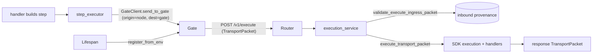

# Gate Node Integration Layer for L9-Node-Template

## Goal

Make the template a fully compliant Constellation node: it **registers with the Gate**, **accepts `TransportPacket`** on `/v1/execute` (+ `/v1/relay`), **honors provenance laws** (inbound must be Gate-mediated; outbound must be node-origin → Gate-only), and can act as both **worker** (action handlers) and **orchestrator** (multi-step composition via Gate). This is a thin layer over `constellation-node-sdk` (local at `../Gate_SDK`, import `constellation_node_sdk`), keeping L9's `create_app()`, observability, and unauthenticated `healthz`/`readyz` intact.

## Architecture decision

Native integration (not `create_node_app()`): we keep L9's [`src/l9_service/main.py`](src/l9_service/main.py) app + observability and add our own `APIRouter`, service layer, settings, and lifespan wiring that **delegate to SDK primitives** (`execute_transport_packet`, `validate_execute_ingress_packet`, `validate_relay_ingress_packet`, `GateClient`, `StepExecutor`, `register_from_env`). This satisfies `.cursor/rules/fastapi.mdc` (routes on `APIRouter`, no business logic in handlers, I/O wrapped in `span()`, `get_logger`) and the `healthz/readyz` invariant.



## Scope: roles

Worker + Orchestrator. Worker = inbound `/v1/execute` with registered action handlers. Orchestrator = outbound `GateClient` + `StepExecutor` (used inside handlers) + inbound `/v1/relay`.

Authority-boundary rule (do not blur layers): orchestrator capability is **opt-in** via `L9_ORCHESTRATOR_ENABLED` (default `false`). When disabled, the Gate client is not constructed, `/v1/relay` is not mounted, and the node is a pure worker. Outbound work MUST always target `destination_node="gate"` — peer node URLs MUST NOT appear anywhere in `src/`.

### Out of scope (explicit)

- Replay (`replay_request`/`replay_response`, `header.replay_mode`) and delegation-chain authoring — SDK supports them; not wired by this template. `L9_REPLAY_ENABLED` left at SDK default; document as a follow-up.
- Idempotency persistence — `idempotency_key` is passed through but no dedup store is added. Note `L9_REQUIRE_IDEMPOTENCY_FOR_ACTIONS` as future config.
- Editing `src/l9_service/observability/*` or `bootstrap.py` (protected; Fix-B invariant).

## New / changed package layout (under `src/l9_service/`)

- `config/settings.py` — `NodeSettings(BaseSettings)` bridging `L9_*` / `GATE_*` env vars (node_name, service_name, gate_url, gate_node_name, signing key/id/algorithm, require_signature, enforce_gate_only_ingress, allowed_actions, spec_path, admin_token, registration toggles, `orchestrator_enabled`). Reuses existing `pydantic-settings` dep. Single `@lru_cache get_settings()` accessor. MUST validate at construction that `node_name` is non-empty and `!= "gate"` (a node may not impersonate the Gate).
- `routes/gate.py` — `APIRouter(prefix="/v1", tags=["gate"])` with `async def execute` (POST `/execute`), `async def relay` (POST `/relay`, mounted only when `orchestrator_enabled`), and `async def gate_health` (GET `/health`). `/v1/health` exists because the Gate registry probes the `health_endpoint` from the spec (SDK convention is `/v1/health`, while L9 keeps `/healthz`+`/readyz`); it returns the same readiness signal as `/readyz` and stays unauthenticated. Execute/relay accept a raw `TransportPacket` body (SDK Pydantic model is the canonical contract — documented exception to the generic `*Request`/`*Response` rule, recorded in the route docstring per `.cursor/rules/fastapi.mdc`). Handlers delegate to services and return `JSONResponse(packet.model_dump_json_dict())`.
- `services/execution_service.py` — `ExecutionService.execute(packet, *, mode)`. Validation order is fixed and fail-closed: (1) `validate_execute_ingress_packet` / `validate_relay_ingress_packet` for Gate-mediated provenance, then (2) `execute_transport_packet(..., node_name=settings.node_name, signing_*=...)` (which itself runs full transport validation + handler dispatch). Skip step 1 only when `enforce_gate_only_ingress=false` (dev). Wrap in `span("gate.execute", attributes={packet_id, action})`, log via `get_logger(__name__)`. Logs MUST include only `packet_id`/`trace_id`/`action`/`source_node` — never `packet.payload`, tenant identity beyond `org_id`, or signing key material.
- `services/gate_client_service.py` — owns a single `GateClient(get_gate_client_config_from_env())` (httpx client) for orchestrator egress, plus a `StepExecutor(gate_client, source_node=node_name)`. Exposes `send_to_gate(packet)` and `execute_step(parent, action, payload)`. Constructed in lifespan **only when `orchestrator_enabled`**, stored on `app.state.gate_client`, closed on shutdown. A `get_gate_client(request)` FastAPI dependency reads `request.app.state.gate_client` and raises 503 if orchestration is disabled.
- `services/registration_service.py` — wraps `register_from_env()` (POST `{GATE_URL}/v1/admin/register?overwrite=...`, `X-Admin-Token`) with retry/log; no-op (logged at WARNING) when `GATE_REGISTRATION_ENABLED=false` or `GATE_URL` unset. Registration is best-effort by default but MUST NOT crash startup; readiness ties to `app.state.runtime_ready`, not to registration success (configurable via `GATE_REGISTER_REQUIRED`).
- `errors.py` (or handlers in `routes/gate.py`) — central mapping of SDK exceptions to HTTP: `TransportValidationError`→422, provenance/authority rejections (`assert_*`/ingress policy)→403, `TransportAuthenticationError`→401, handler timeout→504, unknown action→404. Error bodies MUST be generic unless `L9_EXPOSE_INTERNAL_ERRORS=true`; default returns a transport `failure` packet or `{"detail": "..."}` without stack traces.
- `handlers/__init__.py` — sample `@register_handler("echo")` worker handler and (orchestrator build) a `full_pipeline` handler using the `StepExecutor` from `app.state` (demonstrates multi-step composition through Gate). Imported during lifespan startup so the SDK module-level registry is populated before readiness is set.
- `node_spec.yaml` (repo root; `GATE_NODE_SPEC_PATH=node_spec.yaml`) — registration spec: `node.id` (MUST equal `L9_NODE_NAME`), `node.actions` (MUST be the set returned by `registered_actions()`), `node.internal_url` (Gate-reachable), `type`, `priority_class`, `max_concurrent`, `health_endpoint: /v1/health`, `timeout_ms`, `version`. If the SDK reads YAML, it uses `yaml.safe_load`; any local read MUST also use `safe_load`.

## Changes to existing files

- [`src/l9_service/main.py`](src/l9_service/main.py): add an async `lifespan` to `create_app()`. Startup order is significant and MUST be: (1) run identity preflight (see Critical invariants); (2) import `l9_service.handlers` so `register_handler` populates the registry; (3) if `orchestrator_enabled`, construct the Gate client on `app.state.gate_client`; (4) set `app.state.runtime_ready = True` so the node can serve `/v1/execute` before announcing itself; (5) run `registration_service.register()` (best-effort). Shutdown closes the Gate httpx client. Include the `gate` router via `app.include_router(...)`. Keep `healthz`/`readyz` exactly as-is (unauthenticated, 200) and `setup_telemetry(app)`. `/readyz` SHOULD reflect `app.state.runtime_ready`.
- [`.env.example`](.env.example): add `L9_NODE_NAME`, `L9_ORCHESTRATOR_ENABLED=false`, `GATE_URL`, `L9_GATE_NODE_NAME=gate`, `GATE_ADMIN_TOKEN`, `GATE_NODE_SPEC_PATH=node_spec.yaml`, `GATE_REGISTRATION_ENABLED`, `GATE_REGISTER_REQUIRED=false`, `L9_SIGNING_ALGORITHM`, `L9_SIGNING_KEY`/`L9_SIGNING_KEY_ID`, `L9_VERIFYING_KEYS_JSON`, `L9_REQUIRE_SIGNATURE`, `L9_ENFORCE_GATE_ONLY_INGRESS`, `L9_EXPOSE_INTERNAL_ERRORS=false`, `L9_ALLOWED_ACTIONS`. Document that `L9_NODE_NAME` and `OTEL_SERVICE_NAME` are distinct knobs that SHOULD share a value.
- `pyproject.toml` / `uv.lock` (PROTECTED — requires approval): add dependency `constellation-node-sdk` via `uv add` as a uv path source pointing at `../Gate_SDK` (it is not on PyPI; build backend is setuptools, package `src/constellation_node_sdk`). Run `uv lock` after. Note SDK already pulls `cryptography`, `prometheus-client`, `pyyaml`. Add `respx` (or `pytest-httpx`) to the `dev` group for mocking Gate egress in tests.

## Critical invariants (fail-closed)

These are the integration's highest-risk correctness points; each gets an explicit guard and a test:

- **Node identity unification.** `node_spec.yaml:node.id` == `L9_NODE_NAME` == the `local_node` passed to all SDK validators == the registry key Gate dispatches to. A startup preflight MUST raise and abort if these disagree (a mismatch means Gate dispatches to a name the node rejects as non-local → every request 403s). Also assert `node.actions` matches `registered_actions()`.
- **Health endpoint reachability.** The `health_endpoint` advertised at registration (`/v1/health`) MUST be a route that actually exists and returns 200 when ready; otherwise Gate marks the node unhealthy and stops routing. Covered by adding `/v1/health` and a test.
- **SDK version guard.** Import MUST resolve to the root `../Gate_SDK/src/constellation_node_sdk` (has `route_kind`, `inbound_policy`, `/v1/relay`), not the older nested copy. A test asserts `hasattr(RoutingProvenance, 'model_fields') and 'route_kind' in RoutingProvenance.model_fields`.
- **Signature posture consistency.** If `L9_REQUIRE_SIGNATURE=true`, inbound execute MUST verify signatures (`verifying_keys` from `L9_VERIFYING_KEYS_JSON`) and outbound MUST sign; a half-configured state (require on, no keys) MUST fail preflight, not at first request.
- **No peer egress.** Gate is the sole egress target. An architecture test asserts no `httpx`/`requests` call in `src/` targets anything but the configured `GATE_URL` (scan for direct URL construction outside `GateClient`).

## Provenance law enforcement (the core)

- Inbound `/v1/execute`: `validate_execute_ingress_packet(packet, local_node=node_name, gate_node_name="gate")` → requires `address.source_node=="gate"`, `address.destination_node==node_name`, `provenance.resolved_by_gate is True`, `route_kind in {"external_ingress","gate_relay"}`. Reject (fail-closed → HTTP 403) otherwise.
- Inbound `/v1/relay`: `validate_relay_ingress_packet(...)` analogous, with relay-specific allowed actions.
- Outbound (orchestrator): `GateClient.send_to_gate` runs `validate_outbound_gate_packet` (origin_kind==node, destination==gate, source_node==local). `StepExecutor`/`build_step_packet` produce child packets via `derive()` (new lineage generation, fresh hashes) with `provenance.original_source_node=node_name`. The node MUST NOT set `resolved_by_gate` or `origin_kind="gate"` on any outbound packet — only Gate may stamp Gate authority.
- Never construct hashes by hand; always use `create_transport_packet` / `derive()` / `with_hop()`. Packets are immutable: response/child packets come from `derive()` (semantic change → new packet_id, `generation+1`, `causation_id=parent.packet_id`, fresh hashes, cleared signature); hop-trace entries come from `with_hop()` (observational → `transport_hash` and signature preserved). `trace_id`, `correlation_id`, and lineage `root_id` MUST be preserved across the response.
- Tenant immutability: derived packets MUST carry the parent's `tenant` unchanged (the SDK enforces this; do not override).

## Tests (new, under `tests/gate/`)

Behavior tests (not grep theater). Each maps to an invariant above:

- `test_execute_endpoint.py`: valid Gate-mediated packet (`source_node=gate`, `resolved_by_gate=true`, `route_kind=external_ingress`, `destination_node=node_name`) → handler runs → 200 + response `TransportPacket` (TestClient).
- `test_provenance.py`: fail-closed cases each return 403 with no handler side effects — `source_node!=gate`, `resolved_by_gate=false`, wrong `destination_node`, missing/invalid `route_kind`, node-origin packet hitting `/v1/execute` directly.
- `test_packet_invariants.py`: response packet preserves `trace_id`/`correlation_id`/`lineage.root_id`, increments `generation`, sets `causation_id=request.packet_id`; `with_hop` leaves `transport_hash` unchanged; tampered `payload_hash`/`transport_hash` rejected.
- `test_relay_endpoint.py`: relay ingress accepted when orchestrator enabled; route absent (404) when `orchestrator_enabled=false`.
- `test_registration.py`: mocked Gate (`respx`) → correct payload to `/v1/admin/register?overwrite=...` with `X-Admin-Token`; `node.id` keyed; disabled-toggle is a logged no-op; registration failure does not abort startup (unless `GATE_REGISTER_REQUIRED`).
- `test_orchestrator.py`: `StepExecutor.execute_step` posts to Gate `/v1/execute` with `origin_kind=node`/`destination_node=gate`/`original_source_node=node_name` (mocked Gate); asserts no non-Gate host is contacted.
- `test_identity_preflight.py`: spec `node.id` ≠ `L9_NODE_NAME` → startup raises; `node_name=="gate"` rejected; `require_signature` without keys rejected.
- `test_sdk_version_guard.py`: `route_kind` present on `RoutingProvenance` (correct SDK copy resolved).
- `test_no_peer_egress.py`: source scan — no hardcoded node URLs / direct httpx calls outside `GateClient`.
- `test_signing.py`: with `require_signature`, unsigned inbound rejected (401), outbound signed and verifiable; round-trip with `hmac-sha256`.
- `test_health.py`: `/healthz`, `/readyz`, and `/v1/health` return unauthenticated 200 with the router mounted; `/readyz` reflects `runtime_ready`.

Test hygiene: preserve existing observability Fix-B tests untouched; add an autouse fixture calling `clear_handlers()` between tests; reset `get_settings` cache and env between tests.

## Validation ladder (must pass before done)

`uv run ruff format --check src/ tests/` → `uv run ruff check src/ tests/` → `uv run pyright src/` → `uv run pytest tests/ -v --tb=short`. Coverage stays ≥70%.

## Notes / risks

- **SDK source ambiguity.** Two copies exist; depend on root `../Gate_SDK/src/constellation_node_sdk` (has `inbound_policy.py`, `route_kind`, `/v1/relay`). The nested `Gate_SDK/Gate_SDK` copy is older — never import it. Guarded by `test_sdk_version_guard.py`. A uv path dep against a sibling dir is non-portable for CI/Docker — flag for follow-up (vendored wheel or git source).
- **Cross-repo contract drift.** This depends on SDK transport/provenance semantics (`AGENTS.md` §8). If the Gate's `ROUTING_POLICY_SPEC` or SDK provenance fields change, ingress validation breaks. Pin the SDK version; treat `route_kind`/`resolved_by_gate` as a coordinated contract.
- **Env var bridging.** L9 uses `OTEL_SERVICE_NAME`; SDK uses `L9_NODE_NAME`. Settings map both; keep them equal to avoid trace/registry name skew.
- **Protected paths.** `pyproject.toml`/`uv.lock` and `observability/`+`bootstrap.py` are protected — I will stop and confirm the exact `uv add` source spec before running it, and will not touch observability internals.

## Convergence block

```yaml
mode: optimize
recursive_passes_run: 10
align_improve_cycles_run: 1
max_cycles: 3
cycles_exhausted: false
same_output_after_multiple_passes: false
violations_fixed_in_session: 8
violations_deferred: 2
source_intent_preserved: true
scope_drift_detected: false
constraints_strengthened_not_weakened: true
execution_readiness: pass
convergence_status: converged
remaining_unknowns:
  - Gate's exact admin-register response schema/status codes (validated at integration time against a live Gate)
  - CI/Docker packaging of the local-path SDK dependency (deferred; needs user decision on vendoring vs git source)
minimum_safe_next_action: Approve plan, then begin with the `deps` todo (confirm uv path-source spec for constellation-node-sdk before editing protected pyproject.toml/uv.lock).
```

### Violations fixed this pass

1. Missing node-identity unification invariant (`node.id`==`L9_NODE_NAME`==`local_node`) — added fail-closed preflight + test. *(critical)*
2. Health-endpoint mismatch (`/v1/health` vs `/healthz`) would mark node unhealthy — added `/v1/health` route + test. *(high)*
3. Authority-boundary blur — orchestrator now opt-in (`L9_ORCHESTRATOR_ENABLED`); relay/egress gated. *(high)*
4. PII/secret logging risk — explicit logging discipline (no payload/keys). *(high)*
5. Internal-error leakage — error mapping respects `L9_EXPOSE_INTERNAL_ERRORS=false`. *(medium)*
6. Validation ordering ambiguity (ingress policy vs `execute_transport_packet`) — fixed, explicit order. *(medium)*
7. Packet-immutability/lineage rules underspecified — added `derive` vs `with_hop` contract + invariant tests. *(medium)*
8. Wrong-SDK-copy risk + no peer-egress proof — added version guard + no-peer-egress architecture test. *(high)*

Deferred: replay/idempotency wiring; CI/Docker SDK packaging.