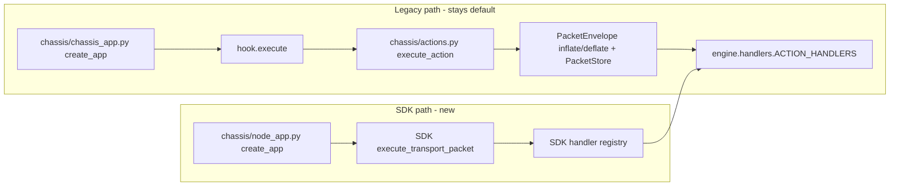

# Gate_SDK chassis instantiation (dual-run behind flag, gate-only ingress)

## What already lines up

- `constellation-node-sdk` is already a dependency in [pyproject.toml](pyproject.toml) (line 27, git, unpinned).
- SDK `execute_transport_packet` invokes a 2-arg handler as `handler(packet.tenant.org_id, packet.payload)` — exactly the CEG handler signature `async def handle_X(tenant: str, payload: dict) -> dict` in [engine/handlers.py](engine/handlers.py). No handler rewrites needed.
- SDK `LifecycleHook` is `startup()` / `shutdown()` only; `GraphLifecycle` in [engine/boot.py](engine/boot.py) already satisfies that shape.
- Every symbol we need (`create_node_app`, `register_handler`, `clear_handlers`, `registered_actions`, `LifecycleHook`, `NodeRuntimeConfig`, `get_runtime_config`) is exported from the `constellation_node_sdk` top-level package.
- [.env.template](.env.template) already carries `GATE_URL` and `L9_NODE_NAME` (lines 68-76), so Step 4 extends an existing block rather than adding a new one.

## What does not line up (the actual work)



| Concern | Legacy | SDK | Action |
|---|---|---|---|
| Wire format | `{action,tenant,payload}` | `TransportPacket` | Breaking — gate-mediated only |
| Handler routing | dict in `chassis/actions.py` | `register_handler(action, fn)` | Both consume `ACTION_HANDLERS` |
| PacketEnvelope + `PacketStore.persist` | inside `execute_action` ([chassis/actions.py](chassis/actions.py) lines 147-153) | absent | Re-implement as handler wrapper |
| Errors | HTTP 400/422/500/503 via `_raise_for_failed_result` | failure `TransportPacket`, HTTP 200 | Accept transport-error semantics |
| Auth | bearer API key middleware | gate-only ingress + signature | Chosen: gate-only, no API-key middleware on SDK app |
| Ingress routes | `/v1/execute` only | `/v1/execute` **and** `/v1/relay` | Disable relay — CONTRACT-01 |
| `/v1/health` | `hook.health`, 503 when unhealthy | always HTTP 200, `{"ready": bool}` | Harden probes to read `ready` |

---

## Step 1 — Single source of truth for the action map

Without this, the 8-action list lives in four places (`register_all`, `chassis/actions._init_engine`, the new SDK registration module, and `L9_EXECUTE_ALLOWED_ACTIONS`) and drifts silently.

In [engine/handlers.py](engine/handlers.py), add a module-level public mapping and rewrite `register_all()` (line 2010) to iterate it:

```python
ACTION_HANDLERS: dict[str, Callable[[str, dict[str, Any]], Awaitable[dict[str, Any]]]] = {
    "match": handle_match,
    "sync": handle_sync,
    "admin": handle_admin,
    "outcomes": handle_outcomes,
    "resolve": handle_resolve,
    "health": handle_health,
    "healthcheck": handle_healthcheck,
    "enrich": handle_enrich,
}
```

Then change `_init_engine()` in [chassis/actions.py](chassis/actions.py) (lines 38-63) to import `ACTION_HANDLERS` instead of rebuilding the dict. This keeps the legacy path behaviourally identical while removing the duplicate. `engine/handlers.py` remains free of chassis imports, so CONTRACT-01 is unaffected.

## Step 2 — Handler registration module

New `chassis/handler_registration.py`:

- `register_engine_handlers()` iterates `ACTION_HANDLERS` and calls SDK `register_handler(action, wrapped)`.
- Each handler is wrapped by `_with_packet_audit(action, fn)` reproducing the audit side effect in `execute_action`: build request/response `PacketEnvelope` via `inflate_ingress` / `deflate_egress` from `engine.packet.chassis_contract`, call `get_packet_store().persist(...)`, swallow store failures as warnings.
- The wrapper must declare an explicit `async def wrapped(tenant: str, payload: dict[str, Any]) -> dict[str, Any]` — SDK `_invoke_handler` dispatches on `len(inspect.signature(handler).parameters)`, so `*args` breaks routing.

## Step 3 — SDK app factory

New `chassis/node_app.py`:

- `class _SdkLifecycleAdapter(sdk.LifecycleHook)` wrapping `GraphLifecycle`, delegating `startup`/`shutdown`. `chassis/` is not in the mypy `exclude` list ([pyproject.toml](pyproject.toml) lines 213-219), so the adapter must be fully typed. This also avoids touching [engine/boot.py](engine/boot.py), keeping the legacy path byte-identical during dual-run.
- `def create_app() -> FastAPI:` calls `register_engine_handlers()` then `create_node_app(lifecycle_hook=..., auto_register_with_gate=False)`.
- `auto_register_with_gate=False` is required: `GraphLifecycle.startup` already calls `register_node_with_gate()`, and the SDK lifespan would otherwise call `register_from_env()` a second time whenever `GATE_URL` is set.

## Step 4 — Entrypoint flag (four launch sites, not two)

New `chassis/entrypoint.py` exposing `create_app()` that dispatches on `L9_CHASSIS` (`legacy` default, `sdk` opt-in). Retarget every uvicorn reference to `chassis.entrypoint:create_app` so the launch commands never change again:

| Site | Current |
|---|---|
| [scripts/entrypoint.sh](scripts/entrypoint.sh) line 42 | `uvicorn chassis.chassis_app:create_app` — used by `Dockerfile` ENTRYPOINT and `chassis/Dockerfile.chassis` |
| [Dockerfile.prod](Dockerfile.prod) line 64 | `CMD ["uvicorn", "chassis.chassis_app:create_app", ...]` |
| [Makefile](Makefile) line 82 | `local-api` target |

Leave `chassis/__init__.py` exporting `create_app` from `chassis_app` unchanged — [engine/boot.py](engine/boot.py) line 29 and the existing tests import `LifecycleHook` from there.

Add a `local-api-sdk` Makefile target setting `L9_CHASSIS=sdk` plus the minimum SDK env for local runs.

## Step 5 — Gate-only security config

`NodeRuntimeConfig` is env-driven, frozen, `extra="forbid"`, and `get_runtime_config` is `@lru_cache`d. Extend the Gate block in [.env.template](.env.template) (lines 68-76) and the `api` service env in [docker-compose.yml](docker-compose.yml) (lines 28-58):

- `L9_ENVIRONMENT` (one of `local|dev|test|staging|prod`), `L9_SERVICE_NAME`, `L9_SERVICE_VERSION`
- `L9_ENFORCE_GATE_ONLY_INGRESS=true`, `L9_REQUIRE_GATE_MEDIATION_PROVENANCE=true`, `L9_GATE_NODE_NAME=gate`
- **`L9_ENABLE_RELAY_ROUTE=false`** — defaults to `true`, which would mount a second ingress route `POST /v1/relay` and violate CONTRACT-01 (Single Ingress)
- `L9_REQUIRE_SIGNATURE=true`, `L9_SIGNING_ALGORITHM`, `L9_SIGNING_KEY` (or `L9_SIGNING_PRIVATE_KEY` for ed25519), `L9_SIGNING_KEY_ID`, `L9_VERIFYING_KEYS_JSON`
- `L9_EXECUTE_ALLOWED_ACTIONS=match,sync,admin,outcomes,resolve,health,healthcheck,enrich` — generate from `ACTION_HANDLERS` in the `local-api-sdk` target so it cannot drift
- `HOST=0.0.0.0` — the SDK config defaults to `127.0.0.1`, which is what the node advertises to the gate
- Keep `GATE_URL` as-is (already present)

`validate_security_profile` rejects `dev_mode` in staging/prod, requires a signing key when `require_signature=true`, and requires every `require_idempotency_for_actions` entry to appear in the allowed-actions set. `run_preflight` executes inside the lifespan, so a misconfigured secret fails startup rather than silently downgrading.

**Tenant invariant:** `packet.tenant.org_id` is the CEG `domain_id` (the `DomainPackLoader` key). `ensure_tenant_context` maps a bare tenant string onto `org_id`, so gate-authored packets carrying `tenant: "plasticos"` resolve correctly. This is an invariant, not an inference — Step 7 asserts it.

## Step 6 — Health probe hardening

The SDK `/v1/health` returns HTTP 200 unconditionally with `{"status": "healthy"|"starting", "ready": bool}`. All four existing probes only assert `status_code == 200`, so on the SDK path a container reports healthy before the engine is ready — a regression against the legacy 503. Update each to assert the `ready` field:

- [Dockerfile](Dockerfile) line 53, [Dockerfile.prod](Dockerfile.prod) line 62, [chassis/Dockerfile.chassis](chassis/Dockerfile.chassis) line 64, [docker-compose.yml](docker-compose.yml) line 71.

Deep engine health (Neo4j connectivity) remains reachable on the SDK path only via the `health` action through `/v1/execute`.

## Step 7 — Tests

New `tests/unit/test_node_app.py`. Build `NodeRuntimeConfig(...)` explicitly and pass it to `create_node_app(config=...)` rather than relying on env — `get_runtime_config` is `@lru_cache`d and leaks across tests. Call `clear_handlers()` in teardown.

1. `registered_actions()` equals `set(ACTION_HANDLERS)`.
2. A gate-authored `TransportPacket` for `match` routes to `handle_match` and returns a `response` packet.
3. Tenant invariant: a packet with `tenant="plasticos"` reaches the handler with `tenant == "plasticos"`.
4. A non-gate-authored packet is rejected when `enforce_gate_only_ingress=true`.
5. `POST /v1/relay` returns 404 when `enable_relay_route=false`.
6. A raising handler returns a `failure` packet (not HTTP 500) when `return_transport_errors=true`.
7. `PacketStore.persist` is invoked once per execute.
8. `NodeRuntimeConfig(require_signature=True, signing_key=None)` raises — proves preflight fails closed.

`tests/contracts/test_chassis_parity.py` asserts the SDK registry action set equals `set(ACTION_HANDLERS)` and that `chassis/actions.py` routes the same set. With Step 1 in place this is a cheap tautology check against future edits, not a drift detector papering over duplication.

## Step 8 — Housekeeping

- Add `FileMeta` entries for `chassis/node_app.py`, `chassis/entrypoint.py`, `chassis/handler_registration.py` in [tools/l9_meta_injector.py](tools/l9_meta_injector.py).
- Note the second ingress shape in [docs/contracts/api/openapi.yaml](docs/contracts/api/openapi.yaml) and the SDK registry path in `contracts/contract_02.yaml`, which currently names only `chassis.router.register_handler()`.
- Record in [DEFERRED.md](DEFERRED.md): on the SDK path the API-key middleware and HTTP status-code mapping are intentionally absent, and `/v1/health` is shallow readiness.

## Residual risks and unknowns

- `constellation-node-sdk` is an unpinned git dependency; any upstream change to `execute_transport_packet`, `NodeRuntimeConfig`, or the health payload lands without warning. Pinning to a commit is out of scope here but worth a follow-up.
- The SDK calls `configure_logging(resolved_config)` in its lifespan. Interaction with the chassis structlog setup is untested on the SDK path — verify log shape before flipping the default.
- `/metrics` is served by the SDK app. The legacy chassis has no `/metrics` route (only timing in [chassis/middleware.py](chassis/middleware.py)), so scrape targets change on flip.

## Out of scope (follow-up once parity holds)

Flipping `L9_CHASSIS` default to `sdk`, migrating clients off `{action,tenant,payload}`, and deleting `chassis/chassis_app.py` + `chassis/actions.py` + `chassis/middleware.py`.
