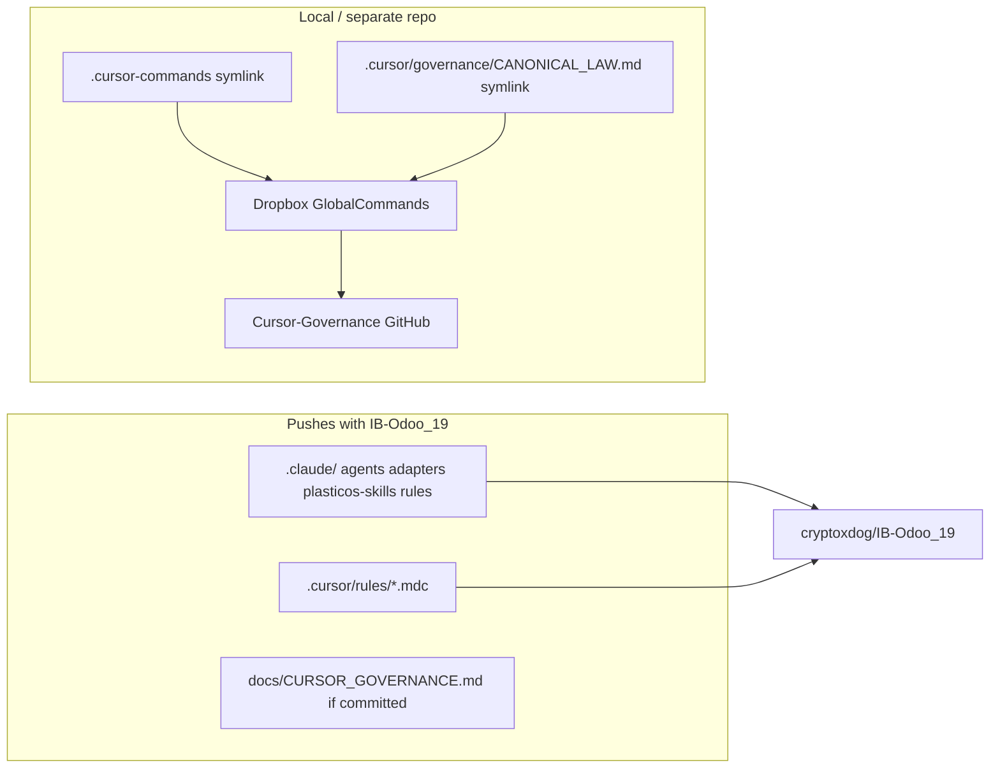

# What pushes to GitHub: `.claude` vs `.cursor`

## Short answer

| Path | Pushes to `cryptoxdog/IB-Odoo_19`? | Why |
|------|-----------------------------------|-----|
| [`.claude/`](.claude/) | **Yes** (once committed) | Not in [`.gitignore`](.gitignore) — already **43 tracked files** on remote |
| [`.cursor/rules/*.mdc`](.cursor/rules/) | **Yes** (once committed) | Explicitly **un-ignored** via `!.cursor/rules/` |
| [`.cursor/README.md`](.cursor/README.md) | **No today** | Blocked by `.cursor/*` — only `rules/` is whitelisted |
| [`.cursor/governance/`](.cursor/governance/) | **No** | Gitignored + symlink to Dropbox (machine-local) |
| [`.cursor-commands`](.cursor-commands) | **No today** (untracked) | Symlink only — would store pointer, **not** GlobalCommands content |
| L9 globals (`l9-*` skills, slash commands) | **No** (by design) | Live in Dropbox SSOT + backup repo [`cryptoxdog/Cursor-Governance`](https://github.com/cryptoxdog/Cursor-Governance) |

**Bottom line:** Repo-specific PlasticOS agent config **does** push — mainly `.claude/**` and `.cursor/rules/**`. Universal L9 governance **should not** duplicate inside IB-Odoo_19; clones wire it via symlinks + setup script.



---

## Current git state (important)

Your working tree has **uncommitted migration work** — nothing new reaches GitHub until `make push` / commit:

**Will push after commit:**
- Modified [`.claude/README.md`](.claude/README.md), agents, [`.cursor/rules/`](.cursor/rules/) (including moved kernels → skills)
- **New untracked** (not on remote yet):
  - [`.claude/adapters/`](.claude/adapters/)
  - [`.claude/skills/plasticos-*`](.claude/skills/) (8 project skills)
  - [`.cursor/rules/01-cursor-governance-law.mdc`](.cursor/rules/01-cursor-governance-law.mdc)
  - [`.cursor/rules/95-plasticos-test-fix-policy.mdc`](.cursor/rules/95-plasticos-test-fix-policy.mdc)
  - [docs/CURSOR_GOVERNANCE.md](docs/CURSOR_GOVERNANCE.md)
  - [scripts/validate_l9_skill_wiring.sh](scripts/validate_l9_skill_wiring.sh)

**Deletes pending commit** (old duplicates removed on purpose):
- `.claude/skills/{structured-reasoning,gmp-protocol,skill-compiler,...}` → migrated to L9 globals
- `.cursor/rules/{15,20,25,60}-plasticos-*-kernel.mdc` → moved to `.claude/skills/plasticos-*`

---

## What `.gitignore` does today

```8:9:.gitignore
.cursor/*
!.cursor/rules/
```

- **`.claude/`** — not listed → entire tree is eligible for git
- **`.cursor/*`** — ignores everything under `.cursor/` **except** `rules/`
- **`.cursor-commands`** — not ignored, but never committed (symlink to absolute Dropbox path)

[`.claude/settings.json`](.claude/settings.json) is safe to push (Odoo hook guards only, no secrets).

---

## Architecture: repo overlay vs global SSOT

Per [docs/CURSOR_GOVERNANCE.md](docs/CURSOR_GOVERNANCE.md):

| Layer | Location | In IB-Odoo_19 git? |
|-------|----------|-------------------|
| PlasticOS rules | `.cursor/rules/*.mdc` | Yes |
| PlasticOS skills/agents | `.claude/skills/plasticos-*`, `.claude/agents/` | Yes |
| L9 universal skills | `.cursor-commands/skills/l9-*/` (Dropbox) | No — symlink |
| Global slash commands | `.cursor-commands/commands/` | No — symlink |
| Canonical law | Dropbox `CANONICAL_LAW.md` | No — symlink |

After clone on a new machine, developers run:

```bash
bash .cursor-commands/ops/scripts/setup_workspace_symlinks.sh
bash scripts/validate_l9_skill_wiring.sh
```

(Requires Dropbox at `$HOME/Dropbox/cursor governance/` **or** clone [`Cursor-Governance`](https://github.com/cryptoxdog/Cursor-Governance) and point symlinks — see setup script.)

---

## Recommended fixes (so “valuable repo config” fully reaches GitHub)

### 1. Widen `.gitignore` whitelist (minimal)

Add exceptions so repo docs under `.cursor/` push without opening the whole folder:

```gitignore
.cursor/*
!.cursor/rules/
!.cursor/README.md
```

Keep **`.cursor/governance/` ignored** — it is a Dropbox symlink, not portable content.

### 2. Do **not** commit `.cursor-commands` as a symlink

Git would store `/Users/ib-mac/Dropbox/...` — broken on every other machine. Instead:
- Document clone setup in [docs/CURSOR_GOVERNANCE.md](docs/CURSOR_GOVERNANCE.md) (already started)
- Optionally add a one-line [`.cursor-commands.placeholder`](.cursor-commands.placeholder) or Makefile target `make governance-setup` that runs the setup script

### 3. Commit the pending migration in one conventional commit

Suggested scope: `docs(governance): sync claude/cursor overlay after L9 migration`

Include:
- All `.claude/` adapter + `plasticos-*` skill adds
- All `.cursor/rules/` adds/deletes/renames
- `docs/CURSOR_GOVERNANCE.md`, `scripts/validate_l9_skill_wiring.sh`
- Updates to [AGENTS.md](AGENTS.md), [`.claude/README.md`](.claude/README.md), [`.cursor/rules/00-plasticos-master-context.mdc`](.cursor/rules/00-plasticos-master-context.mdc) if not already staged

Then: `make push m="docs(governance): ..."` per repo workflow.

### 4. Optional CI guard

Add to `make pr-check` or a lightweight script hook:
- `bash scripts/validate_l9_skill_wiring.sh` — ensures no unprefixed skills creep back into `.claude/skills/`
- Fails if `.cursor/governance` becomes a full Dropbox root symlink again

---

## What a fresh clone gets vs what it needs

| After `git clone` | Works out of the box? |
|-------------------|----------------------|
| PlasticOS `.mdc` rules | Yes |
| `.claude` agents + `plasticos-*` skills | Yes (after commit above) |
| L9 `structured-reasoning`, `wire-skill-into-repo`, etc. | **No** — run governance setup |
| Slash commands under GlobalCommands | **No** — same |
| `@.cursor/governance/CANONICAL_LAW.md` | **No** — symlink; run setup |

This split is intentional: **repo-specific** config travels with PlasticOS; **universal** L9 packs stay in one global place shared across repos.

---

## Devil's Advocate

If you vendor GlobalCommands into IB-Odoo_19, clones become self-contained but you reintroduce duplication and drift vs Dropbox/Cursor-Governance. The current symlink model is correct for multi-repo L9 governance — just ensure overlay files are committed and clone docs are clear.
