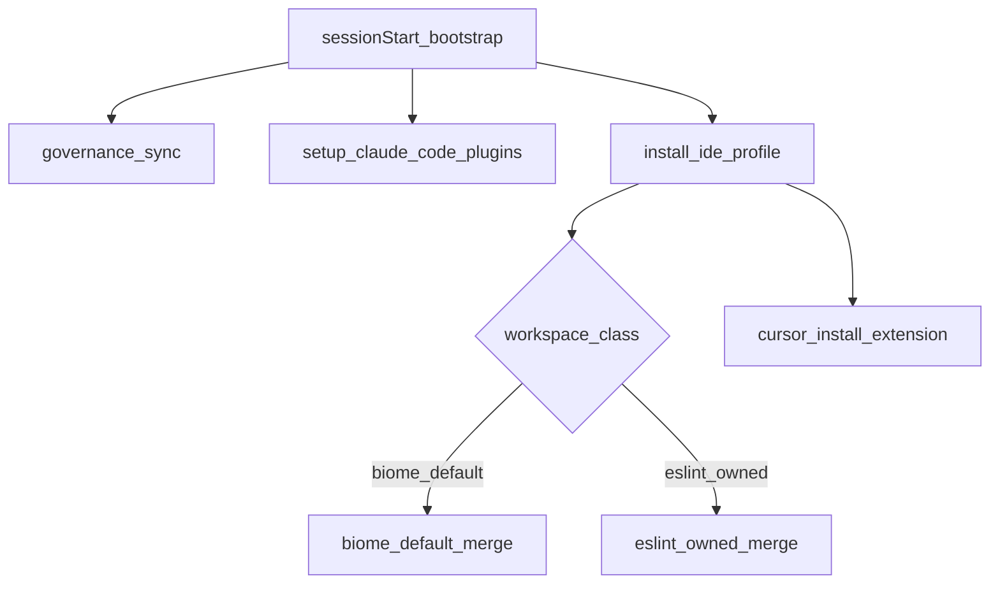

# PLAN: Cursor-Governance IDE profile + every-session activation (Improved)

**plan_status:** Ready
**planning_mode:** Standard
**kernels:** PLAN.md BIND→HANDOFF; Improve.md passes 1–3+5+7 applied to this plan artifact
**implementation:** not started (await CHANGE authorization)
**improve_revision:** 2026-07-24 — contract hardening after Improve.md

## Improve.md pass log (plan artifact)

| Pass | Name | Result |
|------|------|--------|
| 1 | target_binding_and_inventory | Target = `$HOME/.cursor-governance` only. Confirmed `cursor --install-extension` exists. `.vscode/` often gitignored (CEG + governance). |
| 2 | baseline_and_issue_discovery | Ranked plan defects below; none block Ready after remediation into plan text. |
| 3 | contract_and_boundary_hardening | Managed-key merge + formatter exclusivity + exception detection hardened. |
| 5 | entropy_reduction | Split PI-01 verify vs Founder commit; removed Prettier from Biome-default extension set; clarified .vscode local-vs-git. |
| 7 | convergence | Plan Ready; no Critical/High planning defects remain. |

### Verified plan defects (remediated in this revision)

| ID | Severity | Defect | Remediation in plan |
|----|----------|--------|---------------------|
| D1 | High | Recommending **Prettier + Biome** together recreates dual-formatter risk | Prettier only in `extensions.eslint_owned.json`; Biome-default path has no Prettier |
| D2 | High | “Deep-merge everything” can clobber user keys or fight forever | **Managed-key allowlist** + `l9IdeProfile.*` markers; only update keys owned by profile |
| D3 | Medium | Basename-only exceptions miss renamed/nested workspaces | Exceptions: basename match **or** path segment match **or** (`eslint.config.*` present and no `biome.json`) |
| D4 | Medium | Writing `.vscode/` when gitignored looks “broken” for team sync | Document: workspace files are **local editor activation**; extensions still install user-global; team share = clone governance, not commit `.vscode` |
| D5 | Low | PI-01 mixed “verify” with “commit” | Split: verify Required; commit Founder-gated / not an implementation gate |
| D6 | Low | Validation underspecified for merge behavior | PI-08 TMPDIR fixture selftest |

## BIND — target and objective

| Field | Value |
|-------|--------|
| **Objective** | Every Cursor session in a repo wired to Quantum-L9/Cursor-Governance gets a consistent, low-cost editor quality stack (Python LSP + Ruff; Node default Biome; ESLint available) without Biome owning format in Website-Bot/SEO-Bot. |
| **Target root** | [`$HOME/.cursor-governance`](file:///Users/ib-mac/.cursor-governance) (`Quantum-L9/Cursor-Governance`) |
| **Working tree (observed)** | Branch `l9-ci-core-integration-audit`; uncommitted Claude-plugin reconcile already present — include in same change set |
| **Consumers** | All repos with `.cursor-commands` → governance |
| **Excluded** | ESLint/Prettier **project** configs inside Website-Bot and SEO-Bot |
| **Non-overlap** | [`profiles/`](file:///Users/ib-mac/.cursor-governance/profiles) Suite-6 **agent reasoning/mode** docs — unrelated; do not put IDE SSOT there |

### Clarification: `profiles/` vs planned `environment/ide/` (2026-07-24)

**No — the IDE profile is not the same thing as `.cursor-commands/profiles/`.**

| | Existing `profiles/` | Planned `environment/ide/` |
|--|----------------------|----------------------------|
| **What** | Markdown **agent mode / reasoning / protocol** docs (Suite-6 era) | JSON/YAML **editor** SSOT: Cursor extensions + `.vscode` settings |
| **Audience** | The LLM agent (how to reason, YNP, orchestrate, GMP-ish startup reads) | The IDE (Biome/Ruff/ESLint/Pyright install + format ownership) |
| **Path** | `$GOV_ROOT/profiles/*.md` (visible as `.cursor-commands/profiles` via symlink) | `$GOV_ROOT/environment/ide/` |
| **Activation today** | Mostly **legacy / on-demand `@` reads**; Suite-6 `verify-startup-files` + setup-new-workspace path is **archived**; TODO notes `session-startup-protocol.md` may reference a deleted startup stack. Live sessionStart is `ops/hooks/session_start_bootstrap.sh`, not a full profiles load. | New: `install_ide_profile.sh` from bootstrap + symlink setup |
| **Examples** | `reasoning_l9.md`, `dev_mode.md`, `ynp_mode.md`, `orchestrator.md`, `session-startup-protocol.md` | `extensions.core.json`, `settings.node.json`, `exceptions.yaml` |

**Do not** place IDE extension manifests under `profiles/`. **Do not** rename or migrate `profiles/` as part of this plan. Naming collision is accidental English (“profile”); docs in `environment/ide/README.md` must say **IDE profile** vs **agent profiles**.

**Desired outcomes (Required):**
1. Declarative IDE SSOT under `environment/ide/` (new purpose; do not revive Suite-6 `_archived`; do not reuse `profiles/`).
2. Idempotent `install_ide_profile.sh` on sessionStart (background `--quiet`) and symlink setup (foreground).
3. Extensions installed via `cursor --install-extension` when CLI available; fail-open + HINT otherwise.
4. Per-workspace `.vscode/` **managed-key merge**; Biome default Node formatter except eslint-owned workspaces.
5. Docs + agent rule for exceptions; soft wiring WARN; TMPDIR selftest for merge/exceptions.
6. Claude Code plugin reconcile (already local) verified and kept in the same change set.

## INSPECT — verified current state

**Facts:**
- Activation: [`ops/hooks/session_start_bootstrap.sh`](file:///Users/ib-mac/.cursor-governance/ops/hooks/session_start_bootstrap.sh) → `~/.cursor/hooks/session-start-bootstrap.sh` (30s sessionStart timeout); [`ops/scripts/setup_workspace_symlinks.sh`](file:///Users/ib-mac/.cursor-governance/ops/scripts/setup_workspace_symlinks.sh).
- Claude plugins reconcile already patched locally; stamp under `~/.claude/plugins/`; **not pushed**.
- `environment/` = `_archived/` + `logs/` only.
- Extensions present: Pyright, Python, debugpy. Missing: Biome, Ruff, ESLint. (Prettier not required for Biome-default path.)
- `cursor` CLI supports `--install-extension` / `--list-extensions` (verified).
- Stale npm Claude `2.0.76` at `/usr/local/bin/claude`; bootstrap already prefers `$HOME/.local/bin`.
- Many consumer repos gitignore `.vscode/` (e.g. CEG) — workspace writes still affect **local** Cursor; they may not be committed.

**Locked decisions:**
- Node default = Biome; Website-Bot + SEO-Bot = ESLint-owned (project config out of scope).
- Hybrid strategy: user-global extensions + per-workspace managed `.vscode` merge.
- No dual formatters in one ownership class.

## DEFINE — contracts and invariants

### Preserved
- Governance activation purpose (symlinks, Graphiti, Claude plugins).
- `environment/_archived/**` read-only.
- Website-Bot / SEO-Bot lint ownership (Founder).
- No wholesale rewrite of `~/Library/Application Support/Cursor/User/settings.json`.
- No `biome.json` injection into consumer repos.
- No auto `npm -g uninstall`.

### New contracts (precise)

**SSOT layout:**
```
environment/ide/
  README.md
  extensions.core.json          # biome, ruff, eslint, pyright, python, debugpy, yaml — NO prettier
  extensions.eslint_owned.json  # eslint + prettier (+ core without biome as default formatter)
  settings.base.json            # only non-formatter shared keys (explicit allowlist in README)
  settings.python.json          # Ruff formatter/lint for python; cursorpyright/python analysis mode
  settings.node.json            # Biome defaultFormatter for javascript/typescript/jsonc — not used on eslint-owned
  exceptions.yaml               # names + detection rules
```

**Exception detection (ordered, first match wins eslint-owned):**
1. `basename(workspace)` equals or case-fold-equals an entry in `exceptions.yaml` `eslint_owned_repos`.
2. Any path segment of workspace equals an entry (handles nested/open-parent folders).
3. Heuristic: workspace contains `eslint.config.*` or `.eslintrc.*` at depth ≤2 **and** no `biome.json` / `biome.jsonc` at depth ≤2.

**Managed-key merge algorithm (required for PI-03):**
1. Compute `DESIRED_HASH` over all `environment/ide/*` desired files.
2. Load existing `$WS/.vscode/settings.json` (or `{}`).
3. Read `l9IdeProfile.managedKeys` (array) and `l9IdeProfile.hash` if present.
4. For each key in the profile payload for this workspace class:
   - If key absent → set from profile.
   - If key present and listed in `managedKeys` and prior hash matches last applied profile → update to new profile value.
   - If key present and **not** managed (user/repo owned) → **leave unchanged**.
5. Write back `l9IdeProfile.schema: 1`, `l9IdeProfile.hash`, `l9IdeProfile.managedKeys`, `l9IdeProfile.class: biome_default|eslint_owned`.
6. Same ownership rules for `.vscode/extensions.json` recommendations: union recommendations; never remove unrelated recommendations.

**Formatter exclusivity:**
- `biome_default` class: Biome owns JS/TS/JSON format-on-save; do **not** install or recommend Prettier.
- `eslint_owned` class: do **not** set Biome as `editor.defaultFormatter`; recommend ESLint (+ Prettier optional for when Founder wires project Prettier later); do not enable Biome format-on-save keys.

**Stamp:** `$HOME/.cursor/ide-profile/.l9-ide-desired-hash` (machine-local; not consumer git).

## Recommended strategy

Hybrid IDE profile + activation mirror of Claude plugins, with **managed-key ownership** and **formatter exclusivity**.

Rejected (unchanged + reinforced):
- User-global-only full settings rewrite.
- Injecting `biome.json` into all repos.
- Reviving Suite-6 env-manager.
- Recommending Prettier globally alongside Biome.



## DECOMPOSE — plan items

### Wave 0 — Claude plugin change-set hygiene
**PI-01** Verify Claude plugin reconcile already in working tree
- Artifacts: `setup_claude_code_plugins.sh`, bootstrap, symlink setup, AGENTS/README/Makefile
- Actions: run `--quiet`; confirm 6 plugins enabled; ensure bootstrap prefers `$HOME/.local/bin`
- Acceptance: quiet exit 0; list shows 6 enabled
- Commit/push: **Founder-gated only** (not Required for code completeness)

### Wave 1 — IDE SSOT
**PI-02** Create `environment/ide/` as specified under Contracts
- Explicit: `extensions.core.json` has **no** `esbenp.prettier-vscode`
- Explicit: `extensions.eslint_owned.json` may include Prettier + ESLint
- `exceptions.yaml` lists `Website-Bot`, `SEO-Bot` and documents detection order
- Prohibited: edits under `environment/_archived/`

### Wave 2 — reconcile script + selftest
**PI-03** Add `ops/scripts/install_ide_profile.sh`
- Flags: `--quiet`; optional workspace path arg / `CURSOR_PROJECT_DIR`
- Install: `cursor --install-extension <id>` for class-appropriate IDs; fail-open
- Merge: managed-key algorithm above
- Paths: `$HOME` only (path-lint clean)
- Risk: Medium → mitigated by managed keys + exceptions

**PI-08** Fixture selftest (Required)
- `make ide-profile-test` or `bash ops/scripts/install_ide_profile.sh` against two TMPDIR trees:
  - `.../SomeService` → settings contain Biome defaultFormatter; no Prettier recommendation required
  - `.../Website-Bot` → settings must **not** contain Biome as defaultFormatter; class `eslint_owned`
- Also assert managedKeys round-trip (second run does not clobber a user key outside allowlist)

### Wave 3 — activation
**PI-04** Wire into bootstrap (background) + `setup_workspace_symlinks.sh` (foreground after Claude block)
- PARTS: `ide-profile: stamped|reconciling|cursor CLI missing|eslint_owned|biome_default`
- Keep under sessionStart 30s budget via background + stamp fast-path
- Sync `~/.cursor/hooks/session-start-bootstrap.sh` via existing copy/self-heal

**PI-05** Soft WARN in `check_governance_wiring.sh` if script/stamp missing — **must not** flip PASS→FAIL alone

### Wave 4 — docs / agent law
**PI-06** AGENTS.md §2, README TL;DR, Makefile `ide-profile` + `ide-profile-test`, `rules/97-ide-profile-exceptions.mdc`
- Rule: agents must not add `biome.json` / Biome format-on-save to Website-Bot or SEO-Bot

**PI-07** Document npm Claude uninstall in `environment/ide/README.md` only — never auto-run

## Execution waves / critical path

```
PI-02 → PI-03 → PI-08 → PI-04 → PI-05 → PI-06
PI-01 parallel with PI-02 (same change set)
PI-07 with PI-02 README
```

**Critical path:** PI-02 → PI-03 → PI-08 → PI-04

## Validation matrix

| Item | Closing validation | Pass criteria |
|------|-------------------|---------------|
| PI-01 | `bash ops/scripts/setup_claude_code_plugins.sh --quiet`; `claude plugin list` | exit 0; 6 enabled |
| PI-02 | file inventory + grep | no prettier in `extensions.core.json`; exceptions list both bots |
| PI-03/08 | TMPDIR fixtures via make/script | biome_default vs eslint_owned assertions; user unmanaged key preserved |
| PI-04 | bootstrap contains IDE call; cmp/copy to `~/.cursor/hooks/` after setup | PARTS keys documented |
| PI-05 | run check on a wired repo with stamp deleted | exit 0 + WARN text |
| PI-06 | files present; rule mentions both bots | grep hits |
| Final | `bash ops/scripts/validate_governance_no_hardcoded_paths.sh` | exit 0 for new scripts |

**NotApplicable:** consumer ESLint CI green (out of scope).
**Unknown until runtime:** whether every machine has `cursor` on PATH in non-interactive hooks (mitigated fail-open).

## Rollback / recovery

- Revert governance files (`environment/ide/`, install script, hook call sites, rule, docs).
- Consumer `.vscode/`: restore from consumer git if tracked; else delete managed keys / remove `l9IdeProfile.*` markers.
- Delete `$HOME/.cursor/ide-profile/.l9-ide-desired-hash` to force re-reconcile.
- Extensions: manual `cursor --uninstall-extension` if desired — not automated.
- Irreversible in-repo steps: none.

## Risk register

| Risk | L | I | Mitigation |
|------|---|---|------------|
| Dual formatters | Med | High | Formatter exclusivity + split extension manifests |
| Clobber user settings | Med | High | Managed-key allowlist + hash ownership |
| Missed exception workspace | Med | Med | Triple detection (basename, segment, eslint-without-biome) |
| `.vscode` gitignored → “not in repo” confusion | High | Low | README clarifies local activation vs git |
| Hook timeout | Med | Med | Background quiet + stamp skip |
| Uncommitted Claude work dropped | Med | Med | PI-01 same change set |

## Excluded scope traps

- Do not author ESLint configs in Website-Bot/SEO-Bot.
- Do not inject `biome.json` into consumers.
- Do not recommend Prettier on the Biome-default path.
- Do not revive Suite-6 env-manager.
- Do not auto-uninstall npm Claude.
- Do not fail `check_governance_wiring` solely for missing IDE stamp.
- Do not put IDE SSOT under `profiles/` or edit agent reasoning profiles for this work.
- Do not “fix” Suite-6 profile startup loading as part of this plan.

## Leverage (Improve)

- Highest unlock: **managed-key merge** (makes Hybrid safe).
- Highest deletion: drop global Prettier from core recommendations.
- Highest validation add: **PI-08 TMPDIR fixtures** (prevents silent dual-format bugs).

## Implementation handoff

- **Profile:** CHANGE / Agent implementation in Cursor-Governance clone
- **First executable item:** PI-02 create `environment/ide/` files per contracts above
- **Blocking decisions:** none
- **Auth:** Founder plan approval; separate explicit commit/push
- **minimum_safe_next_action:** On approval, implement PI-02 → PI-03 → PI-08 in Agent mode

## Convergence

**Converged (planning):** Improve defects D1–D6 folded into contracts; Required items have closing validation; High risks mitigated; ESLint project work in two bots remains explicitly excluded.
