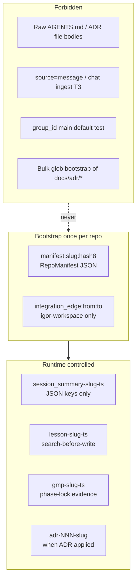
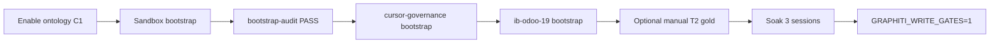

# Graphiti Pre-Bootstrap Readiness Plan

**GMP_RUN_ID:** `GMP-GRAPHITI-BOOTSTRAP-004`
**Authority:** [Graphiti Global Memory Integration Plan v2](Current Work - IGNORE/06-07-2026/Graphiti Global Memory Integration Plan.md) + live ground truth in [`.cursor-commands/ops/graphiti/`](.cursor-commands/ops/graphiti/) + [GMP-GRAPHITI-FILEPACK-003](.cursor-commands/reports/GMP-GRAPHITI-FILEPACK-003.md)

**Decision:** Do **not** run production `bootstrap` until **ontology + allowlist** are live on C1 and **sandbox entity audit** passes. Bootstrap writes **3–5 labeled JSON episodes per repo max** (1 manifest + N integration edges)—never raw file globs.

---

## 1. Required Component Inventory

### A. Infrastructure (C1 VPS)

| Component | Purpose | Status |
|-----------|---------|--------|
| Neo4j 5.26 loopback | Dedicated Graphiti DB | **DONE** — default `neo4j` DB per DEPLOY fix |
| Graphiti MCP `:8100` | Episode read/write | **DONE** — health green via tunnel |
| `graphiti.env` (VPS + Mac) | Secrets, flags | **DONE** — `GRAPHITI_MEMORY_ENABLED=1`, gates `0` |
| SSH tunnel Mac→C1 | MCP access | **DONE** (operational) |
| Bearer auth `GRAPHITI_MCP_TOKEN` | Defense in depth | **DONE** |
| **Custom ontology mount** | `allowlist_only` entity types | **GAP — BLOCKER** — commented in [`docker-compose.yml`](.cursor-commands/ops/graphiti/docker-compose.yml) |
| **`domain_packs.yaml` server wiring** | Reject IgorBot/noise entities | **GAP — BLOCKER** — file exists client-side only |
| Weekly `prune.py` cron on C1 | Stale-edge report | **GAP** — script exists; no cron |
| OTel metrics (optional) | Gate/prune telemetry | **DEFERRED** — Phase 6 |

### B. Kernel (GlobalCommands `ops/graphiti/`)

| Component | Purpose | Status |
|-----------|---------|--------|
| [`graphiti_memory_client.py`](.cursor-commands/ops/graphiti/graphiti_memory_client.py) | CLI: health/search/write/inject/bootstrap/stats/conflicts/phase-lock/prune | **DONE** (surgical port) |
| [`episode_contract.py`](.cursor-commands/ops/graphiti/episode_contract.py) | PII redaction, forbidden groups, payload shape | **PARTIAL** — no `kind` allowlist; `source=message` still allowed |
| [`group_registry.yaml`](.cursor-commands/ops/graphiti/group_registry.yaml) | Slug resolution, integrates_with | **DONE** |
| [`group_resolver.py`](.cursor-commands/ops/graphiti/group_resolver.py) | Fail-closed resolver | **DONE** |
| [`ontology_coding.py`](.cursor-commands/ops/graphiti/ontology_coding.py) | RepoManifest, ADRDecision, CIGotcha, etc. | **DONE** — not deployed to MCP |
| [`domain_packs.yaml`](.cursor-commands/ops/graphiti/domain_packs.yaml) | `coding` allowlist_only | **DONE** — not enforced server-side |
| [`circuit_breaker.py`](.cursor-commands/ops/graphiti/circuit_breaker.py) / [`rate_limiter.py`](.cursor-commands/ops/graphiti/rate_limiter.py) | Degrade + write caps | **DONE** |
| [`prune.py`](.cursor-commands/ops/graphiti/prune.py) | Dry-run retention report | **DONE** |
| [`memory-bank-template/`](.cursor-commands/ops/graphiti/memory-bank-template/) | T0 git resume | **DONE** |
| [`MEMORY_BANK_POLICY.md`](.cursor-commands/ops/graphiti/MEMORY_BANK_POLICY.md) | Git-track policy | **DONE** |
| [`test_gate_e2e_full.sh`](.cursor-commands/ops/graphiti/test_gate_e2e_full.sh) | Gate logic self-test | **DONE** |
| [`DEPLOY.md`](.cursor-commands/ops/graphiti/DEPLOY.md) / [`GATES-002-ACTIVATION.md`](.cursor-commands/ops/graphiti/GATES-002-ACTIVATION.md) | Runbooks | **DONE** |
| `_search_group()` fallback | MCP tool compatibility | **PARTIAL** — write/search/conflicts use it; **`inject` still calls `search_facts` only** |
| Token-budgeted search | Cap prefetch noise | **PARTIAL** — char cap exists; no ranked/budgeted search helper |
| `search_budgeted` | Plan-specified search path | **GAP** — not implemented |
| Sandbox group in registry | Safe dry-run namespace | **GAP** — `sandbox-test` used in E2E but **not** in `group_registry.yaml` |
| Bootstrap entity audit script | Post-write quality gate | **GAP** — no `bootstrap-audit` command |

### C. Hooks (`ops/hooks/`)

| Hook script | Tier | Status |
|-------------|------|--------|
| [`session_start_memory_orchestrator.sh`](.cursor-commands/ops/hooks/session_start_memory_orchestrator.sh) | Prefetch + memory-bank | **DONE** |
| [`graphiti-prefetch.sh`](.cursor-commands/ops/hooks/graphiti-prefetch.sh) | inject | **DONE** |
| [`graphiti-session-end.sh`](.cursor-commands/ops/hooks/graphiti-session-end.sh) | T0 + T1 distill | **DONE** (FILEPACK-003) |
| [`graphiti-gate-edits.sh`](.cursor-commands/ops/hooks/graphiti-gate-edits.sh) + shell/subagent | Write gates | **DONE** — **`GRAPHITI_WRITE_GATES=0`** |
| [`graphiti-reset-generation.sh`](.cursor-commands/ops/hooks/graphiti-reset-generation.sh) | Task-scoped reset | **DONE** — task-scoped behavior **unverified live** |
| [`graphiti-mark-ok.sh`](.cursor-commands/ops/hooks/graphiti-mark-ok.sh) | Satisfy after MCP search | **DONE** |
| [`graphiti_common.sh`](.cursor-commands/ops/hooks/graphiti_common.sh) | Shared helpers | **DONE** |
| [`hooks.json.template`](.cursor-commands/ops/hooks/hooks.json.template) | Hook registration | **DONE** |
| [`setup_workspace_symlinks.sh`](.cursor-commands/ops/scripts/setup_workspace_symlinks.sh) | Install + autoseed hint | **DONE** — **`GRAPHITI_AUTOSEED=0` default** |

### D. Governance (rules, skills, session)

| Component | Status |
|-----------|--------|
| [`rules/03-graphiti-memory.mdc`](.cursor-commands/rules/03-graphiti-memory.mdc) | **DONE** |
| [`rules/98-graphiti-memory-gate.mdc`](.cursor-commands/rules/98-graphiti-memory-gate.mdc) | **DONE** |
| [`rules/99-graphiti-temporal.mdc`](.cursor-commands/rules/99-graphiti-temporal.mdc) | **DONE** |
| [`rules/97-graph-layer-boundary.mdc`](.cursor-commands/rules/97-graph-layer-boundary.mdc) | **DONE** |
| [`rules/03-mcp-memory.mdc`](.cursor-commands/rules/03-mcp-memory.mdc) | **DEPRECATED** (`alwaysApply: false`) |
| [`skills/l9-graphiti-memory/SKILL.md`](.cursor-commands/skills/l9-graphiti-memory/SKILL.md) | **DONE** |
| [`start-session.yaml`](.cursor-commands/start-session.yaml) Step 3.5 health | **DONE** |
| GMP Phase 0 MEMORY_PREFETCH + conflicts | **PARTIAL** — client supports; protocol doc update optional |
| GMP evidence §11 Graphiti | **PARTIAL** — template in plan; not in all report generators |
| Cursor native Memories disabled | **GAP — HUMAN** — manual Settings + rule enforcement only |
| C1 write hard-block | **PARTIAL** — bridge scripts deprecated; not all paths audited |

### E. Bootstrap state (runtime)

| Check | Status |
|-------|--------|
| `health` live C1 | **PASS** |
| `autoseed-check` ib-odoo-19 | **NOT SEEDED** (exit 2 — expected) |
| Production `bootstrap` ib-odoo-19 | **NOT RUN** |
| Production `bootstrap` cursor-governance | **NOT RUN** |
| `igor-workspace` integration edges | **EMPTY** |
| Soak + `GRAPHITI_WRITE_GATES=1` | **NOT STARTED** |

---

## 2. Production Memory Taxonomy (what belongs in Graphiti)

This is the **anti-glob contract**. Only these episode shapes are allowed in production namespaces:



| Episode name pattern | `group_id` | `source` | `kind` | When |
|---------------------|------------|----------|--------|------|
| `manifest:{slug}:{hash8}` | repo slug | `json` | `manifest` | Bootstrap once |
| `integration_edge:{from}:{to}` | `igor-workspace` | `json` | `manifest` | Bootstrap mirror |
| `session_summary-{slug}-{ts}` | repo slug | `json` | `session_summary` | sessionEnd T1 |
| `lesson-{slug}-{ts}` | repo slug | `json` | `lesson` | T2 explicit |
| `gmp-{slug}-{ts}` | repo slug | `json` | `gmp` | GMP phase-lock |
| `adr-{nnn}-{slug}` | repo slug | `json` | `adr` | Human T2 after ADR merge |

**Bootstrap manifest** lists source *paths* in JSON metadata—it does **not** ingest file contents (current [`_discover_bootstrap_sources`](.cursor-commands/ops/graphiti/graphiti_memory_client.py) behavior is correct). **Do not add** bulk ADR episode writes at bootstrap.

---

## 3. Gap Analysis (blockers vs deferrals)

### BLOCKERS — must complete before production bootstrap

| # | Gap | Risk if skipped | Fix location |
|---|-----|-----------------|--------------|
| B1 | Ontology not enabled on C1 | Free-form entity extraction → **glob mess** | [`docker-compose.yml`](.cursor-commands/ops/graphiti/docker-compose.yml), C1 deploy |
| B2 | `domain_packs.yaml` not enforced server-side | IgorBot/noise entity types | C1 MCP config + verify allowlist |
| B3 | No sandbox bootstrap + entity audit | Production pollution | Add `sandbox-test` to registry; new audit step |
| B4 | `inject` lacks `_search_group` fallback | Empty/broken prefetch on this MCP build | [`graphiti_memory_client.py`](.cursor-commands/ops/graphiti/graphiti_memory_client.py) |
| B5 | No `kind` allowlist in contract | Agents write arbitrary episode types | [`episode_contract.py`](.cursor-commands/ops/graphiti/episode_contract.py) |
| B6 | `GRAPHITI_AUTOSEED=1` could bootstrap without audit | Unreviewed production write | Keep `0`; document in [`graphiti.env.example`](.cursor-commands/ops/graphiti/graphiti.env.example) |

### HIGH — complete before gate flip (post-bootstrap soak)

| # | Gap | Fix |
|---|-----|-----|
| H1 | Write gates off | Soak per [`GATES-002-ACTIVATION.md`](.cursor-commands/ops/graphiti/GATES-002-ACTIVATION.md) |
| H2 | cursor-governance not bootstrapped | Run bootstrap from Governance cwd |
| H3 | End-to-end session cycle not manually verified | Phase 4 checklist |
| H4 | Cursor native Memories still active | Manual disable + rule reminder |
| H5 | `stats` shows episode count but RepoManifest entity unverified | Post-bootstrap Neo4j spot-check |
| H6 | Task-scoped gate reset unverified live | Manual hook test with changing task sig |

### MEDIUM — Phase 5–6 hardening

| # | Gap |
|---|-----|
| M1 | `search_budgeted` helper |
| M2 | GMP evidence §11 in all report templates |
| M3 | Weekly prune cron on C1 |
| M4 | Optional curated T2 gold seeds (max 5–10 JSON episodes: top INVARIANTS, CI gotchas)—**manual, not glob** |
| M5 | OTel metrics |

---

## 4. Pre-Bootstrap Gate Checklist (human + terminal)

All must pass before `bootstrap` on `ib-odoo-19` or `cursor-governance`:

- [ ] C1: verify `--use-custom-entities` support (`DEPLOY.md` command)
- [ ] C1: enable ontology volume + recreate `graphiti-mcp`
- [ ] C1: confirm `coding` allowlist rejects off-list entities (test episode with bogus type)
- [ ] Mac: `health` → `"healthy": true`
- [ ] Mac: `conflicts` → empty or documented
- [ ] Sandbox: add `sandbox-test` to [`group_registry.yaml`](.cursor-commands/ops/graphiti/group_registry.yaml) (`readonly: true` or explicit test repo)
- [ ] Sandbox: `bootstrap --group-id sandbox-test` (real write, not dry-run)
- [ ] Sandbox: audit — episode count ≤ 5; entity types ⊆ allowlist; no prose blobs
- [ ] Kernel: merge `inject` → `_search_group` fallback (GMP small patch)
- [ ] Kernel: add `ALLOWED_KINDS` validator to episode contract
- [ ] Confirm `GRAPHITI_AUTOSEED=0` in `~/.cursor/graphiti.env`
- [ ] Document episode taxonomy in [`l9-graphiti-memory/SKILL.md`](.cursor-commands/skills/l9-graphiti-memory/SKILL.md)

---

## 5. Granular Execution Plan (GMP-aligned)

### Phase 0 — Plan lock (`GMP-GRAPHITI-BOOTSTRAP-004`)

**Scope lock:** GlobalCommands + C1 compose only. No PlasticOS Odoo modules. No wholesale client/registry replace.

**TODOs:**

| id | file | operation | description |
|----|------|-----------|-------------|
| P0-1 | `group_registry.yaml` | Insert | Add `sandbox-test` entry with `readonly: false`, `bootstrap_allowed: true` |
| P0-2 | `episode_contract.py` | Insert | `ALLOWED_KINDS` frozenset + validator; reject `source=message` for production writes |
| P0-3 | `graphiti_memory_client.py` | Replace | `cmd_inject` use `_search_group`; add `bootstrap-audit` subcommand |
| P0-4 | `docker-compose.yml` | Uncomment/adapt | Ontology mount after C1 `--help` verification |
| P0-5 | `DEPLOY.md` | Insert | Sandbox audit procedure + entity spot-check cypher |
| P0-6 | `graphiti.env.example` | Insert | `GRAPHITI_AUTOSEED=0`, `MEMORY_DISTILL_TOKEN_BUDGET=300` documented |

**Phase 0 exit:** Locked TODO plan + `MEMORY_PREFETCH: conflicts` cited.

---

### Phase 1 — Baseline (C1 verification)

| Step | Command | Expected |
|------|---------|----------|
| MCP tools probe | `docker compose exec graphiti-mcp ...` list tools | `add_episode`, `search_nodes` present |
| Custom entities | `--help \| grep -i custom` | Supported or documented workaround |
| Forbidden namespace | Write with `--group-id main` | Client rejects before MCP |
| Empty graph | `stats --group sandbox-test` | 0 episodes |

---

### Phase 2 — Implement kernel hardening

1. **`ALLOWED_KINDS`** in [`episode_contract.py`](.cursor-commands/ops/graphiti/episode_contract.py):
   - `manifest`, `session_summary`, `lesson`, `gmp`, `adr`, `pickup`
   - Reject unknown kinds at write time
   - Reject `source=message` unless `GRAPHITI_ALLOW_MESSAGE_SOURCE=1` (dev only)

2. **`cmd_inject`** — replace raw `search_facts` loop with `_search_group(args.task, gid, limit=8)`

3. **`bootstrap-audit`** (new CLI subcommand):
   - Input: `group_id`
   - Output JSON: `{episode_count, episode_names, forbidden_kinds, oversized_bodies, off_allowlist_entities}`
   - Fail exit 1 if count > 10 or any forbidden kind

4. **`graphiti.env.example`** — add `GRAPHITI_AUTOSEED=0` with comment

**DoD:** `py_compile` pass; `test_gate_e2e_full.sh` pass.

---

### Phase 3 — C1 ontology deploy (human terminal)

1. SSH C1 → `/opt/graphiti-cursor`
2. Sync updated `docker-compose.yml` + `ontology_coding.py`
3. Verify custom-entities flag
4. `docker compose --env-file graphiti.env up -d --force-recreate graphiti-mcp`
5. Mac tunnel → `health` green

**DoD:** Test write with structured JSON creates only allowlisted entity types (manual spot-check in Neo4j browser or `stats`).

---

### Phase 4 — Sandbox bootstrap + audit

```bash
# From PlasticOS cwd — sandbox only
python3 .cursor-commands/ops/graphiti/graphiti_memory_client.py bootstrap --group-id sandbox-test
python3 .cursor-commands/ops/graphiti/graphiti_memory_client.py bootstrap-audit --group-id sandbox-test
python3 .cursor-commands/ops/graphiti/graphiti_memory_client.py stats --group sandbox-test
```

**Acceptance:**
- Episodes: 1 manifest + integration edges only (≤ 5 total)
- All `source=json`
- No entity types outside [`domain_packs.yaml`](.cursor-commands/ops/graphiti/domain_packs.yaml) `coding.entity_types`
- `conflicts` empty

**If audit fails:** `prune --dry-run`, document findings, fix ontology/config—**do not** proceed to production slug.

---

### Phase 5 — Production bootstrap (human-gated, ordered)

| Order | Repo | cwd | Expected episodes |
|-------|------|-----|-------------------|
| 1 | `cursor-governance` | GlobalCommands/Dropbox SSOT | 1 manifest + edges |
| 2 | `ib-odoo-19` | PlasticOS | 1 manifest + 2 integration edges |

```bash
python3 .cursor-commands/ops/graphiti/graphiti_memory_client.py bootstrap
python3 .cursor-commands/ops/graphiti/graphiti_memory_client.py bootstrap-audit
python3 .cursor-commands/ops/graphiti/graphiti_memory_client.py autoseed-check  # exit 0
```

**Optional curated T2 gold (manual, max 5 episodes per repo):**
- 1× `CIGotcha` JSON (make push / pr-check)
- 1× `ModificationLock` JSON (pipeline_v2 forbidden)
- 1× `ADRDecision` JSON per critical ADR (002 Gate, 004 intake split)—**written by human via `write --kind adr`**, not bootstrap glob

---

### Phase 6 — Cutover validation + soak

Per [`GATES-002-ACTIVATION.md`](.cursor-commands/ops/graphiti/GATES-002-ACTIVATION.md):

1. Manual session cycle (prefetch → gate deny → search → allow → sessionEnd)
2. Verify `memory-bank/activeContext.md` git diff (PlasticOS: commit manually)
3. Verify ≤1 T1 episode per session end
4. 3+ sessions with fresh `prefetch_ts`
5. VPS-down test: memory-bank loads; cached prefetch within 30m
6. Flip `GRAPHITI_WRITE_GATES=1` only after soak

**GMP evidence report:** `reports/GMP-GRAPHITI-BOOTSTRAP-004.md` with §11 Graphiti Memory Evidence.

---

## 6. What bootstrap will NOT do (explicit out-of-scope)

- Migrate C1 PacketStore / L9 data
- Ingest `docs/adr/*.md` as separate episodes
- Ingest `AGENTS.md` / `ARCHITECTURE.md` body text
- Auto-run on every `setup_workspace_symlinks.sh` unless `GRAPHITI_AUTOSEED=1` after audit
- Enable write gates before soak
- Bulk-import chat history (T3 — forbidden)

---

## 7. Success Criteria (Definition of Done)

| Criterion | Verification |
|-----------|--------------|
| Zero off-allowlist entities after sandbox audit | `bootstrap-audit` exit 0 |
| Production bootstrap idempotent | Second `bootstrap` → `skipped: already seeded` |
| `igor-workspace` has integration edges | `stats` / audit |
| Episode count per repo ≤ 10 at cutover (manifest + edges + optional gold) | audit |
| No `main`/`default` writes | forbidden_groups + stats |
| Full wiring check pass | `check_governance_wiring.sh` |
| Session resume works | `activeContext.md` + manifest in prefetch |

---

## 8. Confidence and risks

| Item | Confidence | Notes |
|------|------------|-------|
| Component inventory | **High** | Verified against live `.cursor-commands/ops/graphiti/` tree |
| Ontology mount path on `zepai/graphiti:latest` | **Medium** | Must verify on C1 before uncommenting compose |
| MCP `search_facts` availability | **Medium** | Fallbacks added for search/write; inject still needs patch |
| Task-scoped gate behavior | **Low–Medium** | E2E passes; live Cursor hook behavior unverified |
| Curated-only memory discipline | **High** | Enforced by taxonomy + kind allowlist + no bulk bootstrap |

**Devil's Advocate:** Even with a perfect manifest-only bootstrap, **sessionEnd T1 distill** can create messy entities if ontology stays disabled. **Ontology first** is non-negotiable for your "production ready ONLY" requirement.

---

## 9. Recommended execution path



**Next action:** Run **Phase 3 (C1 ontology verify + enable)** — smallest blocker removal for clean labeled memories.

**Chain recommendation:** Execute via **`l9-gmp-protocol`** as `GMP-GRAPHITI-BOOTSTRAP-004` (KERNEL tier for episode contract + client; INFRA tier for C1 compose).
