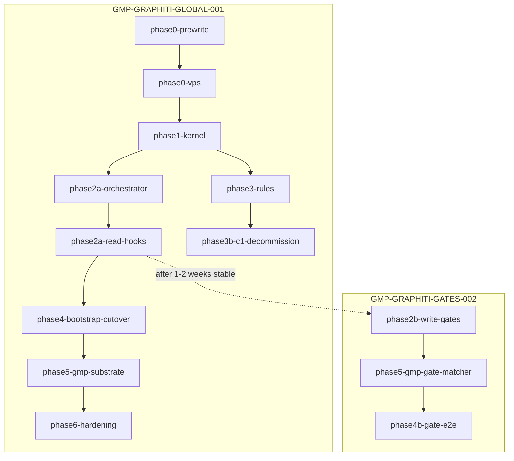

# Graphiti Plan Update + Screenshot Diagnosis

## Q1 — Does "Chat context summarized" mean upload to graph?

**No.** These are unrelated pipelines:

| Mechanism | What it is | When it runs | Writes to |
|-----------|------------|--------------|-----------|
| **Chat context summarized** | Cursor compresses long chat history so the model fits the context window | Mid-conversation, automatic | Nothing external — in-session only |
| **code-graph `batch_index`** | Indexes **source files** into `.code-graph-rag/vectors.db` | Terminal / hook health | Local code structure graph |
| **Graphiti `add_episode`** (planned) | Distills **decisions/facts** into Neo4j | `sessionEnd` T1 hook (not built yet) | VPS Graphiti |

Summarization does **not** trigger Graphiti, C1, or code-graph writes. Your current session even started with a handoff summary — that is Cursor's context management, not memory infrastructure.

---

## Q2 / Q2a — What your screenshots show

### Screenshot 1 — "1 background terminal: Module importers with correct param name"

Cursor spawned a **background shell** from an earlier agent turn. The label is the agent's task description, not a success/failure indicator. No green checkmark = **not completed** (still running or stuck).

### Screenshot 2 — Terminal command (blank output)

```bash
python3 "$GOV/code_graph_cli.py" list_module_importers \
  '{"moduleSource":"plasticos_intake"}' "$REPO" 2>/dev/null | python3 -c "..."
```

**What it is trying to do:** Query the **code-graph** (not Graphiti) for modules that import `plasticos_intake`.

**What actually happened: HUNG (not silent success)**

Evidence from workspace terminal capture [`terminals/91365.txt`](/Users/ib-mac/.cursor/projects/Users-ib-mac-IB-Odoo-19-LOCAL-IB-Odoo-19/terminals/91365.txt):

- Same command pattern
- `running_for_ms: 10965620` (~3 hours) with **no stdout**
- No exit code / completion footer when captured

Contributing factors:

1. **`2>/dev/null`** — hides `code_graph_cli.py` errors (would print `ERROR: ...` to stderr)
2. **One-shot MCP spawn per CLI call** — [`code_graph_cli.py`](.cursor-commands/skills/l9-code-graph-rag-mcp/scripts/code_graph_cli.py) runs `subprocess.run([code-graph-rag-mcp, repo, payload])` with no timeout
3. **Index is healthy** — MCP log at `22:32:21` shows `healthy: true`, `4708 entities / 605 relationships / 458 files` — so **batch indexing succeeded**; this is a **query-tool hang**, not a missing index

**Verdict for 2a:** The `list_module_importers` background job **did not succeed** — it **hung**. Indexing (`code_graph_batch_index.sh`) **did succeed** separately.

### Immediate fix (when executing, not now)

```bash
# Kill stuck process if still running
pkill -f "list_module_importers.*plasticos_intake" || true

# Run WITHOUT stderr suppression + with timeout
timeout 60 python3 "$GOV/code_graph_cli.py" list_module_importers \
  '{"moduleSource":"plasticos_intake"}' "$REPO"
```

Add to skill pack (follow-up, outside Graphiti plan): CLI timeout + never `2>/dev/null` on diagnostic calls.

---

## Q3 — Update [`graphiti_global_memory_1ce8a99e.plan.md`](/Users/ib-mac/.cursor/plans/graphiti_global_memory_1ce8a99e.plan.md)

**Current state:** 8 todos aligned to v2.0 phases 0–6, but **recursive audit changes NOT applied** — still monolithic Phase 2 (prefetch + gates), no GMP split, no C1 sweep, corrupted body blocks (empty `text`/`json` fences, S3 URL citations).

### Architecture decision (confirmed)

Split into two GMP runs on **one** architecture doc:



### Frontmatter changes (replace 8 todos with 14)

| ID | GMP | Content |
|----|-----|---------|
| `phase0-prewrite` | GLOBAL-001 | Read `graphiti 2/` sources; reuse matrix before Phase 1 lock |
| `phase0-vps` | GLOBAL-001 | Neo4j + Graphiti MCP VPS; Tailscale; `DEPLOY.md`; Mac `graphiti.env` + `mcp.json` |
| `phase1-kernel` | GLOBAL-001 | Port `ops/graphiti/` CLI, registry, ontology, domain packs, memory-bank template, prune |
| `phase2a-orchestrator` | GLOBAL-001 | Single `sessionStart` orchestrator: code-graph health + Graphiti inject; combined 15s budget |
| `phase2a-read-hooks` | GLOBAL-001 | `graphiti-prefetch.sh`, `graphiti-session-end.sh` T0 only, memory-bank scaffold; **no Write gates** |
| `phase2b-write-gates` | **GATES-002** | reset-generation, mark-ok, gate-edits/shell/subagent, state JSON, failClosed |
| `phase3-rules` | GLOBAL-001 | Rules 03/97/98/99; skill; `98` gates conditional on `GRAPHITI_WRITE_GATES=1` |
| `phase3b-c1-decommission` | GLOBAL-001 | Sweep `03-mcp-memory`, bridge/distiller scripts, `RULES-MANIFEST`, `93-c1-server-protection` |
| `phase4a-memory-bank-policy` | GLOBAL-001 | Git policy: PlasticOS tracks `memory-bank/`; no auto-commit unless explicit |
| `phase4-bootstrap-cutover` | GLOBAL-001 | Bootstrap dry-run + production slugs; C1 read-only; wiring check; **prefetch E2E only** |
| `phase4b-gate-e2e` | **GATES-002** | Write deny/allow via forced state file; shell/subagent gates; independent of `additional_context` |
| `phase5-gmp-substrate` | GLOBAL-001 | GMP Phase 0 MEMORY_PREFETCH + conflicts; Phase 6 Section 11 — **no gate matcher** |
| `phase5-gmp-gate-matcher` | **GATES-002** | `gmp:phase_lock` matcher in `graphiti-gate-edits.sh` |
| `phase6-hardening` | GLOBAL-001 | Tuning, prune cron, conflicts, Final Declaration for GLOBAL-001 |

**Overview line** — change to:

> Two-GMP rollout: GLOBAL-001 ships VPS + read-path memory (prefetch, memory-bank, rules, bootstrap); GATES-002 ships failClosed Write/Shell enforcement after prefetch is stable. GlobalCommands only; code-graph layer already wired in IB-Odoo [`87-plasticos-code-graph-rag`](.cursor/rules/87-plasticos-code-graph-rag.mdc).

**Feature flags** — add to Phase 1 / Phase 4 sections:

- `GRAPHITI_MEMORY_ENABLED=1` — master switch
- `GRAPHITI_WRITE_GATES=0|1` — gates off by default until GATES-002

### Body edits (recursive alignment/improvement)

Apply to plan body sections (not just todos):

1. **Disambiguation** — one line: Graphiti memory gate hooks ≠ PlasticOS ADR-002 Gate hub
2. **Layer boundary table** — add row for repo overlay `87-plasticos-code-graph-rag` vs Global `97-graph-layer-boundary`
3. **Phase 2 split** — replace monolithic "7 hooks" DoD with 2a (read) and 2b (write) acceptance criteria
4. **Phase 4 E2E** — move "Write denied until search" steps to `phase4b-gate-e2e` (GATES-002)
5. **Phase 5** — split substrate vs gate matcher sections
6. **Success criteria table** — gate row marked GATES-002; add "prefetch loads without agent MCP call" for GLOBAL-001
7. **Document hygiene** — remove S3 presigned URL citations; restore real mermaid/YAML/JSON in Deliverables 3–8 (currently empty fences)
8. **Testing** — add MUST: gate tests use forced `~/.cursor/graphiti-state/<conv>.json`, not agent quoting prefetch

### Out of scope for this plan file edit

- Fixing `code_graph_cli.py` timeout (separate skill-pack fix)
- Executing Graphiti VPS deploy

---

## Execution steps (Agent mode, after approval)

1. Edit frontmatter: overview + 14 todos with GMP tags in content strings
2. Patch plan body: GMP split section, feature flags, orchestrator, C1 sweep, memory-bank policy, ADR-002 note
3. Fix corrupted deliverable blocks (remove S3 links, restore diagrams)
4. Add **Convergence block** at end (from Recursive Improvement prompt)
5. Do **not** start VPS or hook implementation in same pass

---

## Answers summary

| Question | Answer |
|----------|--------|
| 1. Summarized = graph upload? | **No** — Cursor context compression only |
| 2. Screenshot meaning? | Background agent shell running code-graph `list_module_importers` |
| 2a. Work / fail / hang? | **Hung** (~3h, no output); index itself is healthy (4708 entities) |
| 3. Plan updated? | **Not yet** — this plan describes the edit; execute in Agent mode |
