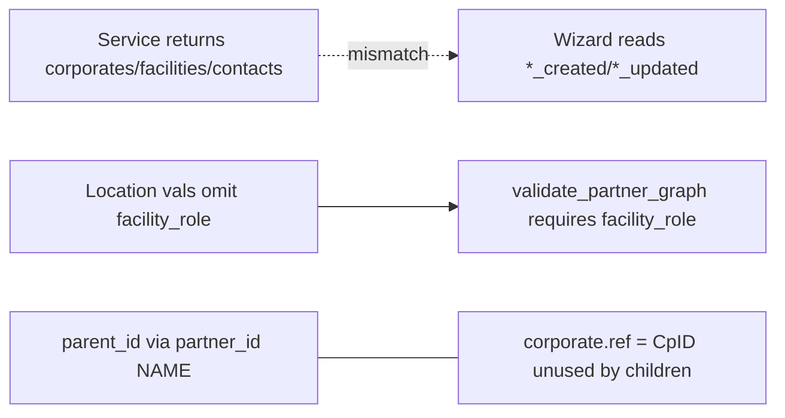

# PLAN: Partner Import Integrity Triangle

**Depth:** deep (`route_plan.py --risk high --evidence partial`)
**Authoritative artifact:** PLAN_DOCUMENT JSON validated `PASS` via `l9-plan/scripts/validate_plan_document.py`
**Next skill after confirm:** `l9-gmp-protocol`
**Module:** [`plasticos_partner_import`](plasticos_partner_import/) @ `19.0.2.7.1` → bump `19.0.2.7.2`

### Objective

Close three import-integrity gaps so operators see honest run stats, Location upserts satisfy `facility_role` graph validation without a separate Repair pass, and facility parents resolve by corporate `ref` (cieTrade CpID) with exact name as fallback.

**Success (falsifiable):**
1. Wizard `state=done` shows Integer stats matching service keys (`*_created` / `*_updated` / `skipped`) — not a bare “Import completed successfully!” with empty count lines.
2. Location upserts write `facility_role='other'` when empty so `validate_partner_graph()` does not emit missing-role for newly imported Locations.
3. Rows with `parent_ref` attach via `res.partner.ref` before name lookup; name-only rows keep working; `ilike` is not the primary resolve path.
4. Version bump + tests for the three contracts; `make pr-check` passes.
5. ADR-003 + READMEs document parent resolve order and count keys.

### Locked decisions (no open options)

| Decision | Choice |
|----------|--------|
| Count honesty | Track create vs update in `_upsert`; return CRM-style keys; wizard Integer fields (not remapping “created” onto aggregate upsert totals) |
| `facility_role` | Set `other` on Location create/write **only if** existing value is falsy (write-if-empty). No post-migrate backfill in this pack (Repair remains) |
| Parent resolve | Prefer CSV `parent_ref` (alias `ref` on child row) → corporate `ref`; else exact `name` + `parent_id=False` + `is_company`; drop primary `ilike`. Current facility CSV has no `parent_ref` yet — code accepts column; cieTrade offline transform emits `parent_ref=CpID` later |
| `company_id` column | Not a parent key (0∩ `corp.ref`; name-like labels) — leave unread for parent linking |

### Scope

**In:** service result contract + wizard UI; Location/`_load_facilities` `facility_role`; `_resolve_corporate_parent`; ADR-003 + READMEs + cieTrade research transform note; tests; manifest bump + scoped `make update`.

**Out:** full SM_EXPORT dump importer; regenerating bundled facility CSV with CpIDs; N+1/XPath hygiene; Neo4j `facility_role` consumers; CRM/VanillaSoft path; ORM-required `facility_role`; `pipeline_v2` / Gate / enrichment.

### Ground truth (verified)

- Service: [`partner_import_service.py`](plasticos_partner_import/models/partner_import_service.py) `run_csv_import` returns aggregates; wizard [`partner_import_wizard.py`](plasticos_partner_import/wizards/partner_import_wizard.py) probes missing keys → fake-success UI. CRM path already honest — copy that pattern.
- Location vals (~L385–398) omit `facility_role`; [`validation.py`](plasticos_partner_import/models/validation.py) hard-fails; Repair sets `"other"`.
- Parent: `_find_corporate_by_name` only; ~122 unique `partner_id` exact-name misses; cieTrade plan [`docs/cietrade_sm_export_research.md`](docs/cietrade_sm_export_research.md) §8: `CpID → ref`.

### Pre-Validation

| Check | Status |
|-------|--------|
| Service vs wizard key mismatch | passed |
| Location omits `facility_role` + validation requires it | passed |
| Name-only parent; `company_id` ≠ CpID; no `parent_ref` today | passed |
| Depth router → deep | passed |
| `make pr-check` baseline (no commit/push) | pending at execution start |

### TODO Plan

| ID | Task | Files | Effort | Risk | Deps | Leverage |
|----|------|-------|--------|------|------|----------|
| T4_parent_ref_resolve | `_resolve_corporate_parent`: `parent_ref`→`ref`, else exact name; remove primary ilike; wire `_import_facility_row` | `partner_import_service.py` | M | high | — | 1 |
| T1_count_contract | `_upsert` → (record, action); accumulate created/updated/skipped/errors | `partner_import_service.py`, `scripts/run_import.py` | M | medium | — | 1 |
| T3_facility_role_upsert | Location (+ legacy facility load) write-if-empty `facility_role='other'` | `partner_import_service.py` | S | low | — | 3 |
| T2_honest_wizard_ui | Integer fields + done-view like CRM wizard | wizard py + `partner_import_wizard_views.xml` | S | low | T1 | 2 |
| T6_tests | TransactionCase for three contracts; wire `tests/__init__.py` | `tests/test_import_integrity_triangle.py` | M | medium | T1–T4 | 4 |
| T7_version_bump_update | Manifest `19.0.2.7.2`; `make update m=plasticos_partner_import` | `__manifest__.py` | S | low | T1–T4 | 6 |
| T5_docs_adr | ADR-003, READMEs, cieTrade research transform note | docs + module README | S | low | T1,T3,T4 | 5 |
| T8_pr_check | ruff + `make pr-check`; phantom allowlist only if needed | possibly `tests/test_phantom_enum_values.py` | S | low | T5–T7 | 7 |

### Critical Path

`T4 → T3 → T1 → T2 → T6 → T7 → T5 → T8`

(T4/T3/T1 are independent in code; order above is leverage/risk-first for checkpoints.)

### Stress Test

- **Disconfirming:** Existing blank roles stay until Repair (accepted); dropping ilike may raise skips until `parent_ref` is emitted (honest skip counts surface them); shell/`post_init` must tolerate new keys; re-import must not clobber curated roles (write-if-empty).
- **Assumed false if:** `company_id` is CpID (false); matcher hard-depends on `facility_role` today (false); SM_EXPORT importer in scope (false).
- **Blast radius:** Wrong `parent_id` on ambiguous `ref`; role writes; wizard/stat consumers; auto-import hooks.
- **Rollback:** Revert module to `19.0.2.7.1` + `make update m=plasticos_partner_import`. No schema drops. Repair + name resolve remain recoverable.

### Leverage

- **Ranked:** T4, T1, T3, T2, T6, T5, T7, T8
- **Shared causes:** No operator result contract; validation/repair paper over upsert gaps; CpID/`ref` unused for child link
- **Deletions:** Dishonest key probes; primary ilike parent path; stale README “wizard has facility_role field”

### Doc / Root Surface Impact

| Surface | Action |
|---------|--------|
| [`docs/adr/ADR-003-contact-import-configuration.md`](docs/adr/ADR-003-contact-import-configuration.md) | update — parent_ref then name |
| [`docs/README_plasticos_partner_import.md`](docs/README_plasticos_partner_import.md) | update — counts + drop stale claims |
| [`plasticos_partner_import/README.md`](plasticos_partner_import/README.md) | update |
| [`docs/cietrade_sm_export_research.md`](docs/cietrade_sm_export_research.md) | update — emit `parent_ref=CpID` |
| AGENTS.md / Makefile | N/A |

### Milestones / Checkpoints

- **M1** Graph integrity (T4+T3) → CP1 parent_ref fixture; CP2 role validation clean for new Locations
- **M2** Operator honesty (T1+T2) → CP3 Integers populated
- **M3** Ship gate (T6–T8) → CP4 `make pr-check` PASS

### Risks

| Risk | Mitigation |
|------|------------|
| More name orphans without `parent_ref` data | Exact-name fallback + skipped counts; transform owns CpID emission |
| Role overwrite on re-import | Write-if-empty only |
| Ambiguous duplicate `ref` | Detect >1 match → warn/skip |

### Unknowns (bounded)

| ID | Resolution |
|----|------------|
| U1 backfill existing blank roles | **accept_bounded** — upsert-only; Repair for legacy |
| U2 who emits `parent_ref` in CSV | **accept_bounded** — this pack = code+docs; transform task later |

### Estimate

1–2 focused engineering days including Docker module tests and doc sync.

### Final Validation

| Check | Command |
|-------|---------|
| Ruff | `ruff check/format plasticos_partner_import` |
| Wiring | `python3 scripts/check_module_wiring.py` |
| Module tests | `make test-module m=plasticos_partner_import` |
| Gate | `make pr-check` |

### Convergence

`status: partial` — plan ready; U1/U2 bounded; baseline `pr-check` still pending at GMP Phase 0.
`next_skill: l9-gmp-protocol`

### GMP Handoff

**May modify:** `plasticos_partner_import` service/wizard/views/scripts/tests/manifest/README; ADR-003; partner_import READMEs; cieTrade research §import; phantom allowlist if required.

**Must not:** `pipeline_v2.py`, `plasticos_web_leads/**`, SM_EXPORT bulk CSVs, `Current Work - IGNORE/**`, `ci.yml`, Selection definition churn on `facility_role`.

**Preserved:** corporate `ref` load; Location vs invoice Type branching; `validate_partner_graph` still requires role; CRM wizard unchanged; no dump importer.
