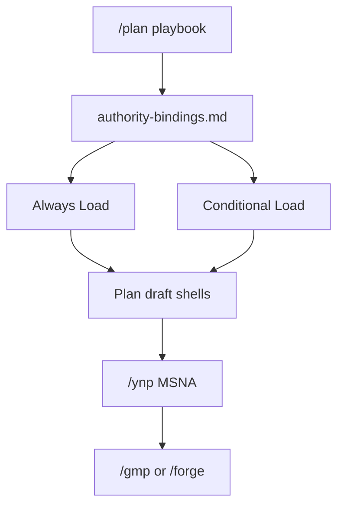

## PLAN: `/plan` as planning playbook — leverage permanent fixtures

### Planning Mode
**Mode:** Deep  
**Justification:** Cross-cutting playbook wiring across skills/kernels/profiles; shared contracts.

### plan_status
ConditionallyReady — Ready after user approves execution.

### Objective
Evolve [`commands/plan.md`](commands/plan.md) / [`skills/l9-plan`](skills/l9-plan) from a self-contained template into a **planning playbook**: orchestrate existing permanent fixtures by **Load / Read / apply**, same pattern as [`kernel-pass-pipeline.md`](skills/l9-plan/references/kernel-pass-pipeline.md).

**Success:**
1. `authority-bindings.md` enumerates **always-load** vs **conditional-load** fixtures by playbook stage.
2. Plan sections are **shells** filled from those fixtures (path scopes, MUST/MUST NOT, Modification Lock, Phase-0 TODOs, Plan DoD, Post-impl DoD).
3. No second SSOT: do not paste GMP/CCP/PLAN/DoD catalogs into patterns.
4. Handoff chain explicit: `/plan` → (optional `/gap-analysis` / `/analyze`) → `/ynp` → `/gmp` | `/forge`.
5. `make pr-check` PASS; wrapped trees untouched.

### Design decision
**Wrap/call permanent fixtures** — do not distill. Prefer `kernels/L9 Coding Control Plane/ai-control-plane/` over `WIP/10X Kernels`. Prefer `skills/l9-gmp-protocol/references/` over copying lock/phase text.

---

### Playbook leverage map (permanent fixtures)

#### A. Always load (every `/plan`)

| Fixture | Path | Playbook use |
|---------|------|--------------|
| Plan skill + workflow | `skills/l9-plan/**` | Orchestrator + section shells |
| Doctrine / ask-first | Skill Doctrine; `rules/92-learned-lessons.mdc`; `learning/failures/repeated-mistakes.md` | Pre-Validate / Gather |
| Quick-fixes | `learning/patterns/quick-fixes.md` | Lesson matches when present |
| CCP PLAN | `kernels/L9 Coding Control Plane/ai-control-plane/PLAN.md` | Path scopes, plan quality gates, assumptions, critical path, acceptance |
| CCP DoD | `…/DEFINITION_OF_DONE.md` | Post-impl DoD gate names |
| Five kernels | `kernels/{Improve,Leverage,Recursive Alignment,Recursive Leverage,Validate & Repair}.md` via `kernel-pass-pipeline.md` | Draft hardening |
| YNP | `skills/l9-ynp` + `/ynp` | MSNA / auto-chain |
| Graphiti (when healthy) | `skills/l9-graphiti-memory`; `ops/graphiti/graphiti_memory_client.py`; `rules/03-graphiti-memory.mdc` | Prefetch / conflicts on Gather |
| Agent docs / invariants | `AGENTS.md`; `.cursor/rules/*.mdc` | Authority order |

#### B. Always load when handoff = CHANGE / tracked implementation

| Fixture | Path | Playbook use |
|---------|------|--------------|
| GMP skill | `skills/l9-gmp-protocol/SKILL.md` | Phase-0 mindset; fail-loudly |
| Modification lock | `…/references/modification-lock.md` | may-modify / must-not-modify |
| Phase contracts | `…/references/phase-contracts.md` | TODO schema; baseline READY; Phase 5 verify |
| Evidence report | `…/references/evidence-report.md` | Name implementer artifact (do not write from `/plan`) |
| Pipeline composition | `…/references/pipeline-composition.md` | Wave / no parallel mutate |
| GMP rules | `rules/80-gmp-execution.mdc`, `81-gmp-audit.mdc`, `83-gmp-contracts.mdc` | Guardrails awareness |
| Protocols (optional Deep) | `protocols/GMP-Action-Prompt-Canonical-v1.0.md` | Align wording if plan is GMP-bound |

#### C. Conditional load (by plan trigger)

| Trigger | Fixture | Path | Use |
|---------|---------|------|-----|
| Unclear architecture / options | Structured reasoning | `skills/l9-structured-reasoning` + `/reasoning` | Depth / Decisions |
| Readiness / % vs target | Gap analysis | `skills/l9-gap-analysis` + `/gap-analysis` | Pre-Validate evidence |
| Unfamiliar codebase | Code analysis | `skills/l9-code-analysis` + `/analyze` | Inventory / hotspots |
| External import | Inspect | `skills/l9-inspect` + `/inspect` | Out-of-repo gate |
| Security-sensitive | Security audit | `skills/l9-auditing-security` | Escalate Planning Mode; Constraints |
| Performance-sensitive | Perf audit | `skills/l9-auditing-performance` | Validation matrix rows |
| Library/API unknowns | Context7 | `skills/l9-context7-docs`; `rules/22-context7-auto-invoke.mdc` | Gather facts |
| Cross-module PlasticOS | Code-graph | `skills/l9-code-graph-rag-mcp` | CODE_GRAPH_BASELINE or SKIPPED |
| Significant design choice | ADRs | `skills/l9-architecture-decision-records` | ADRs consulted / Decision register |
| Multi-artifact pack harden | Recursive optimization | `skills/l9-recursive-optimization` | Optional post-draft (after kernels) |
| Spec mode | Spec command | `/spec` + `spec-workflow.md` | Already in skill Core Contract |
| Fast batch later | Forge | `skills/l9-forge` + `/forge` | Handoff profile BUILD/forge |
| PR already open | PR analysis | `skills/l9-pr-analysis` + `/pr` | Baseline / blockers |
| Parallel agents | Bounded autonomy | `skills/l9-bounded-autonomy` + `/autonomy` | Waves / lease awareness only |
| Component ladder | Inspect/verify | `/probe`, `/audit-component`, `/verify-component` | Validation matrix for components |
| Repo map needed | Repo index | `skills/l9-repo-index` + `/index` | Inspection scope discovery |
| Skill/command authoring | Skill compiler / update-command | `l9-skill-compiler`, `/update-command` | When plan target is skills/commands |
| CI/setup work | CI skills | `l9-setting-up-ci`, `/ci` | Release-mode plans |

#### D. Profiles / reasoning packs (conditional Deep)

| Fixture | Path | Use |
|---------|------|-----|
| YNP mode | `profiles/ynp_mode.md` | MSNA quality |
| Reasoning L9 / docs / tech ops | `profiles/reasoning_*.md` | Depth when `/reasoning` chained |
| Workflow governance | `profiles/workflow-governance.md` | Process constraints |
| Session startup | `profiles/session-startup-protocol.md` | Context bind if session cold |
| Orchestrator | `profiles/orchestrator.md` | Multi-workstream plans |

#### E. Key components (concepts only — already conditional in v2.2.0)

Provenance [`key components/`](key%20components/) — lesson recall, pattern harvest, failure-path map, refactor default, secret rows, disposition, drift watch. **Call concepts via plan-workflow triggers**; do not resurrect CLIs.

#### F. Explicitly do **not** load into `/plan` (wrong stage)

| Fixture | Why |
|---------|-----|
| GMP Phases 2–6 / `/gmp` DAG executor | Execution, not planning |
| `/forge` body | Execution |
| `/end-session`, backup hooks | Session close |
| Release/deploy kernels as executors | Lifecycle after Done |
| `WIP/10X Kernels` | Non-SSOT; use CCP `ai-control-plane/*` |
| Full `protocols/GMP-System-Prompt` every Quick plan | Token bloat; Deep/Release optional |

---

### Scope (implementation of playbook wiring)

**Modify:**  
- New `skills/l9-plan/references/authority-bindings.md` (playbook Load map above)  
- `plan-workflow.md`, `SKILL.md` (2.3.0), `spec-workflow.md`, `ccp-plan-patterns.md` (slim), `commands/plan.md`, `commands-index.md`

**Out:** Editing wrapped fixtures; distillate copies; WIP/10X as binding targets.

### TODO Plan
| ID | File | Action |
|----|------|--------|
| T1 | `authority-bindings.md` | Create playbook Load map (A–F) |
| T2 | `plan-workflow.md` | Section shells + Load directives |
| T3 | `SKILL.md` | 2.3.0 playbook workflow + fail-closed |
| T4 | `spec-workflow.md` | Mirror bindings |
| T5 | `commands/plan.md` + index | Playbook framing |
| T6 | `ccp-plan-patterns.md` | Slim to adaptive-depth + pointers |
| T7 | gate | `make pr-check` |

### Depth
**Evolution:** template → **planning playbook**.  
**Precedent:** kernel-pass-pipeline wrap pattern.  
**Preserved:** v2.2.0 doctrine, five-kernel pipeline, key-component conditionals, auto-chain `/ynp`.

### Dependencies
T1 → T2 → (T3 ∥ T4 ∥ T5 ∥ T6) → T7

### Milestones
| M | Outcome |
|---|---------|
| M1 | Playbook Load map committed in authority-bindings |
| M2 | Workflow/SKILL call fixtures; patterns slim |
| M3 | `make pr` PASS |

### Checkpoints
| CP | Evidence | No-go |
|----|----------|-------|
| CP1 | Always vs conditional tables complete; F-list present | Don't expand workflow |
| CP2 | No pasted Phase-0/DoD catalogs in patterns | Strip |
| CP3 | Fixtures untouched; `make pr` PASS | Repair |

### Checklist
- [ ] Playbook leverage map in authority-bindings
- [ ] Section shells call CCP PLAN/DoD + GMP refs
- [ ] Conditional skills listed with triggers
- [ ] Profiles optional Deep only
- [ ] WIP/10X not bound
- [ ] `/plan` planning-only
- [ ] `make pr-check` PASS

### Constraints
**MUST:** wrap/call permanent fixtures; fail-closed on skipped required Loads.  
**MUST NOT:** re-host fixture contracts; execute GMP/forge from `/plan`; bind to WIP/10X.

### Final Validation
| Check | Pass |
|-------|------|
| Playbook completeness | A–F covered in bindings |
| Scanners | `make pr-check` PASS |
| Untouched | No diff under wrapped skill/kernel trees |
| Honesty | Status labels only |

### Minimum Safe Next Action
On approval: implement T1–T7 on `docs/l9-plan-kernel-pipeline`.

### Handoff profile
CHANGE → `l9-gmp-protocol`
