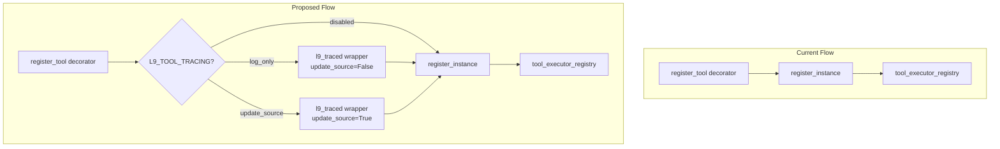

# L9 Traced Tool Adoption Plan

## Architecture Overview




## Files to Modify


| File                                                                       | Change Type | Lines Affected |
| -------------------------------------------------------------------------- | ----------- | -------------- |
| [runtime/tool_registry.py](runtime/tool_registry.py)                       | Modify      | ~37-120        |
| [tests/runtime/test_tool_registry.py](tests/runtime/test_tool_registry.py) | Add tests   | ~200+          |


---

## Phase 1: Modify Tool Registry

### 1.1 Add Imports (Line ~37)

Add import for `l9_traced` and `os` module:

```python
# runtime/tool_registry.py, after line 42
import os
from runtime.dora import l9_traced
```

### 1.2 Add Configuration Constants (Line ~45)

Add environment variable configuration after logger initialization:

```python
# After line 44 (logger = structlog.get_logger(__name__))

# =============================================================================
# Tool Tracing Configuration
# =============================================================================
# Options: "disabled", "log_only", "update_source"
# - disabled: No tracing (original behavior)
# - log_only: Trace execution to structlog but don't update source files
# - update_source: Full DORA block updates (development only)
L9_TOOL_TRACING = os.getenv("L9_TOOL_TRACING", "log_only")

def _should_trace_tools() -> bool:
    """Check if tool tracing is enabled."""
    return L9_TOOL_TRACING in ("log_only", "update_source")

def _should_update_source() -> bool:
    """Check if source file updates are enabled."""
    return L9_TOOL_TRACING == "update_source"
```

### 1.3 Modify Decorator Function (Lines 97-116)

Modify the inner `decorator` function to wrap with `l9_traced`:

**Current code (lines 97-116):**

```python
def decorator(func: Callable[P, R]) -> Callable[P, R]:
    # Register the function directly (not as a factory)
    tool_name = name or func.__name__
    tool_executor_registry.register_instance(
        component_id=tool_name,
        component=func,
        priority=priority,
        tags=[category] if category else [],
        **metadata,
    )
    return func
```

**Proposed code:**

```python
def decorator(func: Callable[P, R]) -> Callable[P, R]:
    tool_name = name or func.__name__
    tool_category = category or "general"
    
    # Optionally wrap with l9_traced for DORA block integration
    wrapped_func = func
    if _should_trace_tools():
        wrapped_func = l9_traced(
            task_name=f"tool:{tool_name}",
            patterns=[f"tool_{tool_category}"],
            update_source=_should_update_source(),
        )(func)
        logger.debug(
            "tool_registry.traced",
            tool=tool_name,
            category=tool_category,
            update_source=_should_update_source(),
        )
    
    # Register the (potentially wrapped) function
    tool_executor_registry.register_instance(
        component_id=tool_name,
        component=wrapped_func,
        priority=priority,
        tags=[tool_category] if tool_category else [],
        **metadata,
    )
    return wrapped_func
```

### 1.4 Update Module Docstring

Add documentation about tracing:

```python
"""
L9 Runtime - Tool Executor Auto-Registration System
====================================================

...existing docstring...

Environment Variables:
    L9_TOOL_TRACING: Controls tool execution tracing
        - "disabled": No tracing (default for production)
        - "log_only": Log execution traces (recommended)
        - "update_source": Update DORA blocks in source files (dev only)
"""
```

---

## Phase 2: Add Tests

### 2.1 Add Test Fixtures and Tests to [tests/runtime/test_tool_registry.py](tests/runtime/test_tool_registry.py)

Add new test section after existing tests (~line 200):

```python
# =============================================================================
# Tool Tracing Tests
# =============================================================================

@pytest.fixture
def enable_tracing(monkeypatch):
    """Enable tool tracing for test."""
    monkeypatch.setenv("L9_TOOL_TRACING", "log_only")
    # Reload configuration
    import runtime.tool_registry as tr
    tr.L9_TOOL_TRACING = "log_only"
    yield
    tr.L9_TOOL_TRACING = "disabled"


@pytest.fixture  
def disable_tracing(monkeypatch):
    """Disable tool tracing for test."""
    monkeypatch.setenv("L9_TOOL_TRACING", "disabled")
    import runtime.tool_registry as tr
    tr.L9_TOOL_TRACING = "disabled"
    yield


def test_tracing_disabled_by_default(clean_registry, disable_tracing):
    """Test that tracing is disabled by default."""
    @register_tool(category="test")
    async def test_tool(**kwargs):
        return {"status": "ok"}
    
    # Function should not be wrapped
    executors = get_tool_executors()
    assert executors["test_tool"] == test_tool


def test_tracing_enabled_wraps_function(clean_registry, enable_tracing):
    """Test that enabling tracing wraps the function."""
    @register_tool(category="test")
    async def traced_tool(**kwargs):
        return {"status": "traced"}
    
    executors = get_tool_executors()
    # Function should be wrapped (different object)
    assert executors["traced_tool"].__wrapped__ == traced_tool


@pytest.mark.asyncio
async def test_traced_tool_execution(clean_registry, enable_tracing):
    """Test that traced tool executes correctly."""
    @register_tool(category="memory")
    async def memory_tool(query: str, **kwargs):
        return {"query": query, "results": []}
    
    executors = get_tool_executors()
    result = await executors["memory_tool"](query="test")
    
    assert result["query"] == "test"
    assert "results" in result
```

---

## Phase 3: Validation

### 3.1 Run Existing Tests

```bash
pytest tests/runtime/test_tool_registry.py -v
pytest tests/runtime/test_dora_auto_update.py -v
```

### 3.2 Manual Verification

```bash
# Test with tracing disabled (default production behavior)
L9_TOOL_TRACING=disabled pytest tests/runtime/test_tool_registry.py -v

# Test with log_only mode
L9_TOOL_TRACING=log_only pytest tests/runtime/test_tool_registry.py -v

# Test with update_source mode (development)
L9_TOOL_TRACING=update_source pytest tests/runtime/test_tool_registry.py -v
```

---

## Risk Analysis


| Risk                                           | Mitigation                                                    | Severity |
| ---------------------------------------------- | ------------------------------------------------------------- | -------- |
| Performance overhead from tracing              | Default to `log_only` which has minimal overhead              | Low      |
| Source file write failures in production       | `update_source` mode only enabled explicitly                  | Low      |
| Circular import (dora.py imports from runtime) | Import is one-way (tool_registry imports dora)                | None     |
| Breaking existing tool behavior                | All tests run in both modes; behavior unchanged when disabled | Low      |


---

## Rollback Plan

If issues occur:

1. Set `L9_TOOL_TRACING=disabled` in environment
2. Revert changes to [runtime/tool_registry.py](runtime/tool_registry.py)
3. Remove new tests from [tests/runtime/test_tool_registry.py](tests/runtime/test_tool_registry.py)

---

## Success Criteria

- All 107+ tool functions automatically traced when `L9_TOOL_TRACING=log_only`
- Zero changes required to existing tool files (`runtime/l_tools.py`, etc.)
- All existing tests pass with tracing both enabled and disabled
- DORA blocks update when `L9_TOOL_TRACING=update_source`

