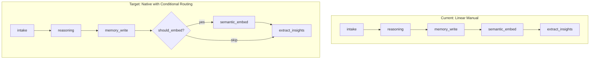

# Native LangGraph Execution for L9 SubstrateDAG

---

## CODE AUDIT FINDINGS (Perplexity Gap Analysis)

### FINDING 1: State Mutation Patterns - ALREADY CORRECT

**Status:** NO CHANGES NEEDED

**Evidence from code audit:**

All 8 nodes already use **immutable state update pattern**:

```python
# memory/substrate_dag.py:184-188 (intake_node)
return {
    **state,
    "envelope": envelope,
    "errors": errors,
}

# memory/substrate_dag.py:263-266 (reasoning_node)
return {
    **state,
    "reasoning_block": reasoning_block,
}

# memory/substrate_dag.py:671-674 (store_insights_node)
return {
    **state,
    "written_tables": written_tables,
    "errors": errors,
}
```

Lists are safely copied before modification:

```python
# Line 285
errors = list(state.get("errors", []))  # Creates NEW list
written_tables = list(state.get("written_tables", []))  # Creates NEW list
```

---

### FINDING 2: `_should_skip_embedding()` - FOUND AND DOCUMENTED

**Status:** FUNCTION EXISTS at lines 56-89

**Location:** `memory/substrate_dag.py:56-89`

**Implementation:**

```python
SKIP_EMBEDDING_PATTERNS: list[str] = [
    "Sorry, I encountered a temporary error. Please try again.",
    "Sorry, I encountered an error processing your command.",
    "No response generated.",
    "This message has already been processed.",
    "L9 agent executor not available. Please try again later.",
    "Mac agent is not available on this server.",
]

def _should_skip_embedding(text: str) -> bool:
    if not text:
        return True
    text_stripped = text.strip()
    if text_stripped in SKIP_EMBEDDING_PATTERNS:
        return True
    low_value_prefixes = [
        "Sorry, I encountered",
        "❌ Mac command error:",
        "❌ Please provide a command",
    ]
    for prefix in low_value_prefixes:
        if text_stripped.startswith(prefix):
            return True
    if len(text_stripped) < 10:
        return True
    return False
```

**Action:** Can be used directly in routing function.

---

### FINDING 3: `enrich()` Behavior - SEPARATE GRAPH JUSTIFIED

**Status:** SEPARATE ENRICHMENT GRAPH NEEDED

**Evidence from code audit (lines 881-942):**

`enrich()` explicitly SKIPS 4 nodes and RUNS 4 different ones:

- **SKIPS:** intake_node, memory_write_node, semantic_embed_node, checkpoint_node
- **RUNS:** reasoning_node → extract_insights_node → store_insights_node → world_model_trigger_node

Currently uses manual node calls (lines 935-942):

```python
state = await reasoning_node(state, repository=self._repository)
state = await extract_insights_node(state, repository=self._repository)
state = await store_insights_node(state, repository=self._repository)
state = await world_model_trigger_node(state, ...)
```

**Conclusion:** A **separate `build_enrichment_graph()`** is the correct approach because:

1. Different entry point (reasoning_node, not intake_node)
2. Different exit point (world_model_trigger_node, not checkpoint_node)
3. Skips 4 nodes entirely

---

### FINDING 4: `build_substrate_graph()` Return Type - CORRECT

**Status:** RETURNS COMPILED GRAPH

**Evidence:** Line 785: `return graph.compile()`

This is correct for `ainvoke()` - the graph is already compiled.

---

### FINDING 5: Existing Tests - NONE FOUND

**Status:** NO EXISTING TESTS for SubstrateDAG

**Evidence:** `tests/memory/test_substrate_dag*.py` glob returned 0 files.

**Action Required:** Must create comprehensive test suite as part of this GMP.

---

## PRE-EXECUTION BLOCKERS (Must Resolve First)

### BLOCKER 0: Verify LangGraph Config Pattern Works

**Status:** MUST VERIFY BEFORE PHASE 1

**Problem:** LangGraph may not automatically pass `config` to node functions. Need to confirm the pattern.

**Verification Script (run before execution):**

```python
# tests/memory/test_langgraph_config_pattern.py
"""Verify LangGraph passes config to async node functions."""
import asyncio
from typing import TypedDict
from langgraph.graph import StateGraph, END

class TestState(TypedDict):
    value: int
    config_received: bool

async def test_node(state: TestState, config=None) -> TestState:
    """Node that checks if config was received."""
    return {
        **state,
        "config_received": config is not None and "configurable" in config,
    }

def test_config_passed_to_node():
    graph = StateGraph(TestState)
    graph.add_node("test", test_node)
    graph.set_entry_point("test")
    graph.add_edge("test", END)
    compiled = graph.compile()

    result = asyncio.run(compiled.ainvoke(
        {"value": 1, "config_received": False},
        config={"configurable": {"my_dep": "test_value"}}
    ))

    assert result["config_received"], "LangGraph did NOT pass config to node!"
    print("SUCCESS: LangGraph passes config to nodes")

if __name__ == "__main__":
    test_config_passed_to_node()
```

**Run:** `python tests/memory/test_langgraph_config_pattern.py`

**If FAILS:** Must use different pattern (e.g., closures or RunnableLambda with bound dependencies)

---

### BLOCKER 1: Double Skip Logic Conflict - RESOLVED

**Status:** ✅ DECIDED - Option B (Keep internal skip as safety net)

**Decision:** Keep internal skip logic in `semantic_embed_node` (lines 364-391) as defense in depth.

**Rationale:**

- Routing handles skip at graph level (efficient - node never called)
- Internal skip remains as safety net if routing somehow fails
- Redundant checks are minor performance cost for added safety

**Action:** NO changes to lines 363-391. Only add routing function (Phase 2) and conditional edges (Phase 3).

---

### BLOCKER 2: Verify Dependencies Exist

**Status:** VERIFY BEFORE PHASE 1

**Check:** Does `langchain_core.runnables.RunnableConfig` exist?

```bash
python -c "from langchain_core.runnables import RunnableConfig; print('OK')"
```

**If FAILS:** Check langchain-core version, may need `from langgraph.types import RunnableConfig` instead.

---

## Current State (Problem)

The file [memory/substrate_dag.py](memory/substrate_dag.py) builds a LangGraph but then ignores it, manually calling nodes sequentially (lines 841-863):

```python
# Current: Manual execution (WRONG)
state = await intake_node(state, repository=self._repository)
state = await reasoning_node(state, repository=self._repository)
state = await memory_write_node(state, repository=self._repository)
# ... continues for all 8 nodes
```

## Target State (Solution)

```python
# Target: Native LangGraph execution
final_state = await self._graph.ainvoke(
    initial_state,
    config={"configurable": {"repository": repo, "semantic_service": svc, ...}}
)
```

With conditional routing to skip `semantic_embed_node` when content matches GMP-42 skip patterns.

## Architecture Overview



---

## Implementation Plan (LOCKED CODE)

### Phase 0.5: Add Config Helper Function (NEW - from Perplexity feedback)

**File:** [memory/substrate_dag.py](memory/substrate_dag.py)

**Add after line 89 (after `_should_skip_embedding` function):**

```python
# =============================================================================
# Config Helper (for RunnableConfig dependency injection)
# =============================================================================

def _get_config_dependency(config, key: str, default=None):
    """
    Safely extract a configurable dependency from RunnableConfig.

    Args:
        config: RunnableConfig or None
        key: Key to extract from configurable dict
        default: Default value if not found

    Returns:
        The dependency value or default
    """
    if not config:
        return default
    configurable = config.get("configurable", {})
    if not configurable:
        return default
    return configurable.get(key, default)
```

**Rationale:** Centralizes config extraction, handles None cases, reduces boilerplate in nodes.

---

### Phase 1: Config-Based Dependency Injection (8 nodes)

Update all node functions to accept `RunnableConfig` and extract dependencies using the helper.

**File:** [memory/substrate_dag.py](memory/substrate_dag.py)

**Also add import at top of file (line ~20):**

```python
from langchain_core.runnables import RunnableConfig
```

---

#### NODE 1: intake_node (line 144)

```python
# BEFORE
async def intake_node(
    state: SubstrateGraphState, repository=None
) -> SubstrateGraphState:
    """Entry node: validates and normalizes the PacketEnvelope."""
    logger.debug("intake_node: Processing packet")

# AFTER (LOCKED)
async def intake_node(
    state: SubstrateGraphState, config: RunnableConfig = None
) -> SubstrateGraphState:
    """Entry node: validates and normalizes the PacketEnvelope."""
    repository = _get_config_dependency(config, "repository")
    logger.debug("intake_node: Processing packet")
```

---

#### NODE 2: reasoning_node (line 191)

```python
# BEFORE
async def reasoning_node(
    state: SubstrateGraphState, repository=None
) -> SubstrateGraphState:

# AFTER (LOCKED)
async def reasoning_node(
    state: SubstrateGraphState, config: RunnableConfig = None
) -> SubstrateGraphState:
    repository = _get_config_dependency(config, "repository")
```

---

#### NODE 3: memory_write_node (line 269)

```python
# BEFORE
async def memory_write_node(
    state: SubstrateGraphState, repository=None
) -> SubstrateGraphState:

# AFTER (LOCKED)
async def memory_write_node(
    state: SubstrateGraphState, config: RunnableConfig = None
) -> SubstrateGraphState:
    repository = _get_config_dependency(config, "repository")
```

---

#### NODE 4: semantic_embed_node (line 340)

```python
# BEFORE
async def semantic_embed_node(
    state: SubstrateGraphState, repository=None, semantic_service=None
) -> SubstrateGraphState:

# AFTER (LOCKED)
async def semantic_embed_node(
    state: SubstrateGraphState, config: RunnableConfig = None
) -> SubstrateGraphState:
    repository = _get_config_dependency(config, "repository")
    semantic_service = _get_config_dependency(config, "semantic_service")
```

**NOTE:** Internal skip logic (lines 364-391) is KEPT as safety net per BLOCKER 1 decision (Option B).

---

#### NODE 5: checkpoint_node (line 423)

```python
# BEFORE
async def checkpoint_node(
    state: SubstrateGraphState, repository=None
) -> SubstrateGraphState:

# AFTER (LOCKED)
async def checkpoint_node(
    state: SubstrateGraphState, config: RunnableConfig = None
) -> SubstrateGraphState:
    repository = _get_config_dependency(config, "repository")
```

---

#### NODE 6: extract_insights_node (line 479)

```python
# BEFORE
async def extract_insights_node(
    state: SubstrateGraphState, repository=None
) -> SubstrateGraphState:

# AFTER (LOCKED)
async def extract_insights_node(
    state: SubstrateGraphState, config: RunnableConfig = None
) -> SubstrateGraphState:
    repository = _get_config_dependency(config, "repository")
```

---

#### NODE 7: store_insights_node (line 587)

```python
# BEFORE
async def store_insights_node(
    state: SubstrateGraphState, repository=None
) -> SubstrateGraphState:

# AFTER (LOCKED)
async def store_insights_node(
    state: SubstrateGraphState, config: RunnableConfig = None
) -> SubstrateGraphState:
    repository = _get_config_dependency(config, "repository")
```

---

#### NODE 8: world_model_trigger_node (approx line 680)

```python
# BEFORE
async def world_model_trigger_node(
    state: SubstrateGraphState, repository=None, world_model_service=None
) -> SubstrateGraphState:

# AFTER (LOCKED)
async def world_model_trigger_node(
    state: SubstrateGraphState, config: RunnableConfig = None
) -> SubstrateGraphState:
    repository = _get_config_dependency(config, "repository")
    world_model_service = _get_config_dependency(config, "world_model_service")
```

---

### Phase 2: Add Routing Functions

Add routing functions for conditional edges.

**File:** [memory/substrate_dag.py](memory/substrate_dag.py)

**Insert after node definitions (around line 745):**

```python
# =============================================================================
# Routing Functions (Conditional Edges)
# =============================================================================

def _extract_text_for_routing(envelope: dict) -> str:
    """Extract text content from envelope for routing decisions."""
    if not envelope:
        return ""
    payload = envelope.get("payload", {})
    if not isinstance(payload, dict):
        return ""
    return (
        payload.get("text")
        or payload.get("content")
        or payload.get("description")
        or ""
    )

def route_after_memory_write(state: SubstrateGraphState) -> str:
    """
    Route after memory_write_node: skip semantic_embed if low-value content.

    GMP-42: Implements skip pattern at graph level (more efficient than in-node check).

    Returns:
        "do_embed" to run semantic_embed_node
        "skip_embed" to skip directly to extract_insights_node
    """
    try:
        envelope = state.get("envelope", {})

        # Guard: empty or invalid envelope
        if not envelope:
            logger.warning("route_after_memory_write: Empty envelope, defaulting to 'do_embed'")
            return "do_embed"

        payload = envelope.get("payload", {})
        packet_type = envelope.get("packet_type", "")

        # Check if content type is embeddable
        should_embed = (
            "semantic" in packet_type.lower()
            or "memory" in packet_type.lower()
            or "text" in payload
            or "content" in payload
            or "description" in payload
        )

        if not should_embed:
            logger.debug(f"route_after_memory_write: packet_type={packet_type} not embeddable, skip")
            return "skip_embed"

        # Check GMP-42 skip patterns
        text = _extract_text_for_routing(envelope)
        if _should_skip_embedding(text):
            logger.debug(f"route_after_memory_write: GMP-42 skip pattern matched, skip")
            return "skip_embed"

        return "do_embed"

    except Exception as e:
        logger.error(f"route_after_memory_write: Error in routing: {e}, defaulting to 'do_embed'")
        return "do_embed"
```

---

### Phase 3: Update Graph Construction

Modify `build_substrate_graph()` to use conditional edges.

**File:** [memory/substrate_dag.py](memory/substrate_dag.py) lines 748-785

**Replace edge definitions:**

```python
def build_substrate_graph() -> StateGraph:
    """Build the LangGraph DAG with conditional routing."""

    graph = StateGraph(SubstrateGraphState)

    # Add nodes (unchanged)
    graph.add_node("intake_node", intake_node)
    graph.add_node("reasoning_node", reasoning_node)
    graph.add_node("memory_write_node", memory_write_node)
    graph.add_node("semantic_embed_node", semantic_embed_node)
    graph.add_node("extract_insights_node", extract_insights_node)
    graph.add_node("store_insights_node", store_insights_node)
    graph.add_node("world_model_trigger_node", world_model_trigger_node)
    graph.add_node("checkpoint_node", checkpoint_node)

    # Linear edges
    graph.set_entry_point("intake_node")
    graph.add_edge("intake_node", "reasoning_node")
    graph.add_edge("reasoning_node", "memory_write_node")

    # CONDITIONAL: Route after memory_write based on content
    graph.add_conditional_edges(
        "memory_write_node",
        route_after_memory_write,
        {
            "do_embed": "semantic_embed_node",
            "skip_embed": "extract_insights_node",
        }
    )

    # Continue from semantic_embed to insights
    graph.add_edge("semantic_embed_node", "extract_insights_node")

    # Rest of pipeline (linear)
    graph.add_edge("extract_insights_node", "store_insights_node")
    graph.add_edge("store_insights_node", "world_model_trigger_node")
    graph.add_edge("world_model_trigger_node", "checkpoint_node")
    graph.add_edge("checkpoint_node", END)

    return graph.compile()
```

---

### Phase 4: Refactor SubstrateDAG.run() for Native Execution

Replace manual node calls with `graph.ainvoke()`.

**File:** [memory/substrate_dag.py](memory/substrate_dag.py) lines 814-879

```python
import asyncio  # Add at top of file if not present

async def run(self, envelope: PacketEnvelope) -> PacketWriteResult:
    """Run the substrate DAG using native LangGraph execution."""

    # Validate envelope shape before invoke
    if not isinstance(envelope, PacketEnvelope):
        raise ValueError(f"envelope must be PacketEnvelope, got {type(envelope)}")

    initial_state: SubstrateGraphState = {
        "envelope": envelope.model_dump(mode="json"),
        "reasoning_block": None,
        "written_tables": [],
        "embedding_id": None,
        "saved_checkpoint_id": None,
        "insights": [],
        "facts": [],
        "world_model_triggered": False,
        "errors": [],
    }

    # Validate state shape
    if not isinstance(initial_state["envelope"], dict):
        raise ValueError("envelope must serialize to dict")

    # Config with dependencies for all nodes
    config: RunnableConfig = {
        "configurable": {
            "repository": self._repository,
            "semantic_service": self._semantic_service,
            "world_model_service": self._world_model_service,
        }
    }

    # Native LangGraph execution with structured error handling
    try:
        final_state = await asyncio.wait_for(
            self._graph.ainvoke(initial_state, config=config),
            timeout=60.0  # 60 second timeout for DAG execution
        )
    except asyncio.TimeoutError:
        logger.error(f"DAG execution timed out for packet {envelope.packet_id}")
        return PacketWriteResult(
            packet_id=envelope.packet_id,
            written_tables=[],
            status="error",
            error_message="DAG execution timeout (60s)",
        )
    except ValueError as e:
        if "configurable" in str(e).lower():
            logger.error(f"Missing dependency in config: {e}")
        raise
    except Exception as e:
        logger.error(f"DAG execution failed: {e}", exc_info=True)
        return PacketWriteResult(
            packet_id=envelope.packet_id,
            written_tables=[],
            status="error",
            error_message=str(e),
        )

    # Build result from final state
    errors = final_state.get("errors", [])
    if errors:
        return PacketWriteResult(
            packet_id=envelope.packet_id,
            written_tables=final_state.get("written_tables", []),
            status="error",
            error_message="; ".join(errors),
        )

    return PacketWriteResult(
        packet_id=envelope.packet_id,
        written_tables=final_state.get("written_tables", []),
        status="ok",
    )
```

---

### Phase 5: Refactor SubstrateDAG.enrich() for Native Execution

Build a separate enrichment graph or use subgraph for `enrich()`.

**File:** [memory/substrate_dag.py](memory/substrate_dag.py) lines 881-940

**Option A (simpler):** Build enrichment-only graph

```python
def build_enrichment_graph() -> StateGraph:
    """Build enrichment-only DAG (skips intake, memory_write, semantic_embed)."""
    graph = StateGraph(SubstrateGraphState)

    graph.add_node("reasoning_node", reasoning_node)
    graph.add_node("extract_insights_node", extract_insights_node)
    graph.add_node("store_insights_node", store_insights_node)
    graph.add_node("world_model_trigger_node", world_model_trigger_node)

    graph.set_entry_point("reasoning_node")
    graph.add_edge("reasoning_node", "extract_insights_node")
    graph.add_edge("extract_insights_node", "store_insights_node")
    graph.add_edge("store_insights_node", "world_model_trigger_node")
    graph.add_edge("world_model_trigger_node", END)

    return graph.compile()
```

Then update `SubstrateDAG.__init__()` and `enrich()` to use `_enrichment_graph.ainvoke()`.

---

### Phase 6: Add Import and Type Hints

**File:** [memory/substrate_dag.py](memory/substrate_dag.py) top of file

Add import:

```python
from langchain_core.runnables import RunnableConfig
```

---

## Testing Plan (Comprehensive - from Perplexity feedback)

### Test File: `tests/memory/test_substrate_dag_native.py`

**Note:** NO existing tests found for SubstrateDAG. This is a full test suite creation.

---

#### Test 1: Config Helper Function

```python
def test_get_config_dependency_with_valid_config():
    config = {"configurable": {"repository": "mock_repo"}}
    assert _get_config_dependency(config, "repository") == "mock_repo"

def test_get_config_dependency_with_none():
    assert _get_config_dependency(None, "repository") is None

def test_get_config_dependency_with_empty():
    assert _get_config_dependency({}, "repository") is None

def test_get_config_dependency_with_missing_key():
    config = {"configurable": {"other": "value"}}
    assert _get_config_dependency(config, "repository") is None
```

---

#### Test 2: Node Config Injection

```python
@pytest.mark.asyncio
async def test_intake_node_receives_config():
    """Verify intake_node extracts repository from config."""
    state = {"envelope": make_test_envelope(), "errors": []}
    mock_repo = MagicMock()
    config = {"configurable": {"repository": mock_repo}}

    result = await intake_node(state, config=config)

    assert result is not None
    assert "envelope" in result
```

(Similar tests for all 8 nodes)

---

#### Test 3: Routing Function

```python
def test_route_after_memory_write_skip_for_error_message():
    """GMP-42: Skip embedding for known error messages."""
    state = {
        "envelope": {
            "packet_type": "memory",
            "payload": {"text": "Sorry, I encountered a temporary error. Please try again."}
        }
    }
    assert route_after_memory_write(state) == "skip_embed"

def test_route_after_memory_write_embed_for_valid_content():
    """Normal content should be embedded."""
    state = {
        "envelope": {
            "packet_type": "memory",
            "payload": {"text": "This is a valid piece of content worth embedding."}
        }
    }
    assert route_after_memory_write(state) == "do_embed"

def test_route_after_memory_write_skip_for_non_embeddable_type():
    """Non-embeddable packet types should skip."""
    state = {
        "envelope": {
            "packet_type": "heartbeat",
            "payload": {}
        }
    }
    assert route_after_memory_write(state) == "skip_embed"

def test_route_after_memory_write_handles_empty_envelope():
    """Empty envelope should default to do_embed (safe fallback)."""
    state = {"envelope": {}}
    assert route_after_memory_write(state) == "do_embed"

def test_route_after_memory_write_handles_exception():
    """Exception in routing should default to do_embed."""
    state = {"envelope": None}  # Will cause exception
    # Should not raise, should return safe default
    result = route_after_memory_write(state)
    assert result == "do_embed"
```

---

#### Test 4: Full DAG Native Execution

```python
@pytest.mark.asyncio
async def test_substrate_dag_run_native_execution():
    """Full integration: DAG runs via ainvoke, not manual calls."""
    dag = SubstrateDAG(
        repository=mock_repo,
        semantic_service=mock_semantic,
        world_model_service=mock_world_model,
    )
    envelope = make_test_envelope("Valid content for embedding")

    result = await dag.run(envelope)

    assert result.status == "ok"
    assert "packet_store" in result.written_tables

@pytest.mark.asyncio
async def test_substrate_dag_run_skips_embed_for_error():
    """DAG should skip semantic_embed for GMP-42 patterns."""
    dag = SubstrateDAG(...)
    envelope = make_test_envelope("Sorry, I encountered a temporary error. Please try again.")

    result = await dag.run(envelope)

    # Should succeed but not call semantic_embed
    assert result.status == "ok"
    # Verify semantic_embed was NOT called (via mock)
```

---

#### Test 5: Enrichment Graph

```python
@pytest.mark.asyncio
async def test_substrate_dag_enrich_native_execution():
    """enrich() should use enrichment graph, not manual calls."""
    dag = SubstrateDAG(...)
    envelope = make_persisted_envelope()  # Already has packet_id

    result = await dag.enrich(envelope)

    assert isinstance(result, EnrichmentResult)
    assert result.packet_id == envelope.packet_id
```

---

#### Test 6: Equivalence Test (CRITICAL - from Perplexity)

**Purpose:** Verify new native execution produces IDENTICAL results to old manual execution.

```python
@pytest.mark.asyncio
async def test_equivalence_native_vs_manual():
    """
    CRITICAL: Run same packets through both implementations, compare results.

    This test should FAIL if native execution diverges from manual execution behavior.
    """
    test_packets = [
        make_test_envelope("Normal content", packet_type="memory"),
        make_test_envelope("Error message", packet_type="error"),
        make_test_envelope("Semantic data", packet_type="semantic"),
        make_test_envelope("Short", packet_type="memory"),  # < 10 chars
        make_test_envelope("Sorry, I encountered a temporary error.", packet_type="memory"),
    ]

    for envelope in test_packets:
        # Run through OLD manual implementation (snapshot before refactor)
        old_result = await dag_manual_implementation(envelope)

        # Run through NEW native implementation
        new_result = await dag_native_implementation(envelope)

        # Compare results
        assert old_result.status == new_result.status, f"Status mismatch for {envelope}"
        assert old_result.written_tables == new_result.written_tables, f"Tables mismatch"
        # ... additional assertions
```

**Implementation note:** Before refactoring, snapshot the current manual `run()` method as `run_manual_legacy()` to enable this equivalence test.

---

#### Test 7: Timeout Handling

```python
@pytest.mark.asyncio
async def test_substrate_dag_run_timeout():
    """DAG should handle timeout gracefully."""
    # Mock a slow node
    async def slow_node(state, config=None):
        await asyncio.sleep(120)  # 2 minutes
        return state

    # Replace a node with slow version
    # ...

    result = await dag.run(envelope)

    assert result.status == "error"
    assert "timeout" in result.error_message.lower()
```

---

## Files Modified

- [memory/substrate_dag.py](memory/substrate_dag.py) - Main changes (all phases)

## Files to Add

- [tests/memory/test_substrate_dag_native.py](tests/memory/test_substrate_dag_native.py) - Comprehensive test suite

---

## Risk Assessment

- **Low risk:** Changes are internal to SubstrateDAG, entry points unchanged
- **Mitigation:** Equivalence test ensures behavior preserved
- **Rollback:** Git revert if issues discovered
- **Validation:**

  1. Run blocker verification scripts FIRST
  2. Run new test suite
  3. Run existing memory tests before/after

---

## Readiness Checklist (from Perplexity)

All blockers resolved. Ready to execute.

- [x] BLOCKER 0: LangGraph config pattern verified ✅ PASSED
- [x] BLOCKER 1: Decision made - Option B (keep internal skip) ✅ DECIDED
- [x] BLOCKER 2: `RunnableConfig` import verified ✅ PASSED
- [x] State mutation patterns confirmed correct (FINDING 1: OK)
- [x] `_should_skip_embedding()` location confirmed (FINDING 2: lines 56-89)
- [x] `enrich()` behavior confirmed (FINDING 3: separate graph needed)
- [x] `build_substrate_graph()` return type confirmed (FINDING 4: compiled)
- [x] No existing tests to break (FINDING 5: creating from scratch)
