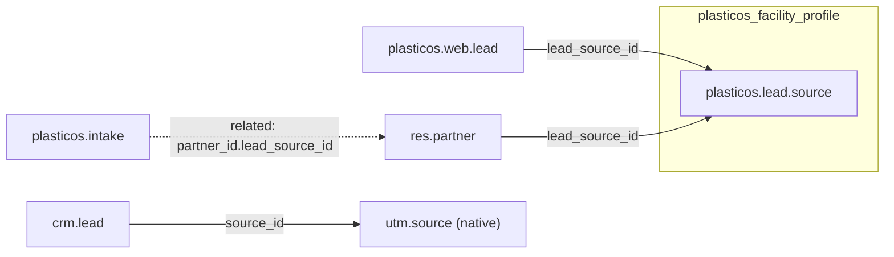

# Lead Source Architecture Cleanup (Revised)

## Why No Model Movement

Moving `plasticos.lead.source` to `plasticos_crm_bridge` creates a **circular dependency**:

```
plasticos_crm_bridge → plasticos_web_leads → plasticos_facility_profile → plasticos_crm_bridge
```

The model stays in `plasticos_facility_profile` — it's master data for partner acquisition tracking, not CRM-specific.

## Current State

| Model | Field | Type | Status |
|-------|-------|------|--------|
| `plasticos.web.lead` | `lead_source_id` | Many2one → `plasticos.lead.source` | Correct |
| `crm.lead` | `source_id` | Many2one → `utm.source` (native) | Correct |
| `res.partner` | `lead_source_id` | Many2one → `plasticos.lead.source` | Correct |
| `plasticos.intake` | `lead_source` | Selection (old pattern) | **Remove** |

## Target State



## Execution Steps

### Step 1: Update `plasticos_intake/models/intake.py`

**Remove:**

1. Selection field definition (~lines 66-72):
```python
lead_source = fields.Selection(
    selection="_get_lead_source_selection",
    string="Lead Source",
    ...
)
```

2. `_get_lead_source_selection()` method (~lines 74-82)

3. `_onchange_lead_source()` method (~lines 497-510)

4. `lead_source` assignment in `_create_partner_from_intake()` (~lines 769-772):
```python
if self.lead_source:
    partner_vals["lead_source"] = self.lead_source
else:
    partner_vals["lead_source"] = "web_lead"
```

**Add** related field (after `partner_id` field):
```python
lead_source_id = fields.Many2one(
    related="partner_id.lead_source_id",
    string="Lead Source",
    readonly=True,
    store=False,
)
```

### Step 2: Update `plasticos_intake/views/intake_views.xml`

Update 5 field references from `lead_source` to `lead_source_id`:

| Line | Current | New |
|------|---------|-----|
| 17 | `<field name="lead_source"/>` | `<field name="lead_source_id"/>` |
| 50-52 | `context="{'group_by': 'lead_source'}"` | `context="{'group_by': 'lead_source_id'}"` |
| 75 | `<field name="lead_source" optional="hide"/>` | `<field name="lead_source_id" optional="hide"/>` |
| 259 | `<field name="lead_source"/>` | `<field name="lead_source_id"/>` |

### Step 3: Update `plasticos_intake/views/intake_ux.xml`

Update xpath expression (~lines 108-110):
```xml
<!-- OLD -->
<xpath expr="//field[@name='lead_source']" position="attributes">

<!-- NEW -->
<xpath expr="//field[@name='lead_source_id']" position="attributes">
```

### Step 4: Verify

- `ruff check plasticos_intake/`
- XML syntax validation
- Verify related field resolves correctly (requires partner_id to be set)

## Notes

- The related field is `readonly=True, store=False` — intake cannot set lead source directly
- Lead source is set on the partner when the partner is created (from web lead or manually)
- Existing intake records with `lead_source` Selection values will lose that data (acceptable since partner is canonical owner)