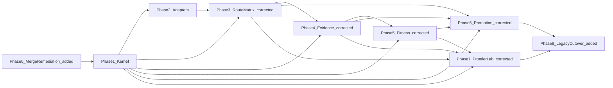

# LLM Control Plane 7-Phase Build

## REVISED -- what changed in this review and why

This plan was originally written against `main` as if it were the final, remediated codebase. It is not. Direct verification against the live repo (not just the audit docs in `src/docs/WIP/LLM-Router audits/`) found:

- **The 18-finding remediation described in [`unified-remediation-ledger.md`](src/docs/WIP/LLM-Router%20audits/unified-remediation-ledger.md) and [`prior-baseline.md`](src/docs/WIP/LLM-Router%20audits/prior-baseline.md) is real and fully committed** -- but only on an unmerged branch, `fix/unified-remediation-phases-1-7` (commit `e7433f2`, pushed to `origin/fix/unified-remediation-phases-1-7`). It is **not** on `main` (currently checked out at `8e777e3`). Direct reads of `src/index.ts` and `src/types.ts` on `main` confirm the pre-remediation bugs (`as any` casts, family-unsafe `getDowngradedModel()`, `RoutingResult`/`CircuitBreakerState` still dormant) are still present on disk today. The ledger's own text ("all Phase 1-6 remediation work exists as uncommitted local changes") was accurate for a working tree that no longer matches what's checked out now.
- **The remediation branch was cut before `main` imported a large batch of org governance/CI files** (commit `8e777e3`: `.github/CODEOWNERS`, `ISSUE_TEMPLATE/*`, `dependabot.yml`, most `l9-*.yml` workflows, `CODE_OF_CONDUCT.md`, `CONTRIBUTING.md`, `SECURITY.md`, `SUPPORT.md`). A naive `git merge` looked like it would delete those, since the branch's diff against `main` shows them removed -- but a **real 3-way merge preview (`git merge --no-commit --no-ff`, then aborted -- no commit made)** confirmed the common ancestor (`87075d82`) predates those files, so git correctly keeps every one of them automatically. They are not actually at risk.
- The real merge surface is **6 conflicts**, all small and mechanical (verified by running the merge preview): `eslint.config.js` (add/add), `package.json` (devDependency key ordering only), `src/index.ts` (one-line `CircuitBreaker` import), `src/types.ts` (cosmetic comment/lint-directive wording), `tests/budget.test.ts` and `tests/router.test.ts` (add/add -- branch's versions are supersets of main's older versions and should win). `main`'s three other pre-existing test files (`general-matrix.test.ts`, `perplexity-matrix.test.ts`, `vision.test.ts`) merge in automatically with zero conflict and are **not** lost.
- Per user decision, this plan now treats **the merged result of `main` + `fix/unified-remediation-phases-1-7` as the Phase 1 starting point** -- see new Phase 0 below. This changes the file inventory Phase 1/2/8 must account for: `src/pricing.ts`, `src/circuit-breaker.ts`, `src/schemas.ts`, root `ARCHITECTURE.md`, and a `no-restricted-imports` "router-only-egress" ESLint rule did not exist in the version of `main` this plan was originally scoped against, and each has a real interaction with the Control Plane architecture (see cross-cutting corrections #6-#9).
- The actual `git merge`/commit is **not executed by this review** -- it is scoped as Phase 0, gated the same way every other phase in this plan already is (build/validate, then halt for explicit human commit approval per this workspace's no-auto-commit rule). Nothing above required a commit to verify; the preview merge was aborted and the working tree is back to the clean `main` state it started in.

## Locked decisions (from user)
- **Legacy code: Replace.** The new Control Plane becomes the package's public API. Legacy `L9LLMRouter`, `TaskDescriptor`, `RoutingDecision`, `BudgetTracker`, `src/matrices/*`, and the current `src/providers/perplexity.ts`/`src/providers/openrouter.ts` client wrappers are deprecated and removed from the public surface once the replacement is validated. This is a breaking change for `l9-seo-bot` and `l9-website-factory`, which live in **other repos** outside this workspace -- this plan cannot edit them; a follow-up action item is called out below.
- **Scope: Contracts-only.** This plan implements exactly Phase 1-7 as specified in [`llm-router-contracts/phase1`](src/docs/WIP/LLM-Router%20audits/_LLM%20Router/llm-router-contracts/phase1), [`phase2`](src/docs/WIP/LLM-Router%20audits/_LLM%20Router/llm-router-contracts/phase2), and the corrected [`llm-router-phases3-7-corrected`](src/docs/WIP/LLM-Router%20audits/_LLM%20Router/llm-router-contracts/llm-router-phases3-7-corrected) set. The separate Token-Conscious Implementation Brief (`TokenUsageRecord`, `L9TaskPacket`/`TokenBudget`/`CachePolicy`, standalone `PolicyDecision`, `BudgetAlarm`, prompt caching, `CircuitBreaker`, `AgentLoopGovernor`) is explicitly **out of scope** here and tracked as a future Phase 8+ track, not built now.
- **REVISED (new decision, this review): Remediation branch merges in as Phase 0, ahead of Phase 1.** The merge keeps `main`'s newer governance/CI files and the remediation branch's code fixes; conflicts resolve toward the remediation branch's versions for `src/index.ts`/`src/types.ts`/tests (they are supersets), and toward a union for `eslint.config.js`/`package.json` (no functional loss either direction).

## Dependency order (validated, no reordering needed)

Each corrected phase's dependency-DAG audit note was checked against the prior (drifted) version and confirmed eliminated (e.g. Phase 3 no longer claims `execution-record(P1)`; Phase 5 corrected `execution-record(P1)` to `execution-record(P4)`; Phase 6 added missing `route-planner(P3)`/`execution-record(P4)` edges; Phase 7 added missing `regression-tester`/`route-planner(P3)` edges). Building 0 -> 1 -> 2 -> 3c -> 4c -> 5c -> 6c -> 7c in this order is dependency-sound. Phase 0 is a new prerequisite added by this review; it has no contract of its own (it is a git-merge operation, not a build phase) but must complete and be validated before Phase 1's "current repo state" preflight means anything.

## REVISED -- Phase 0 (new): Merge remediation branch into main

Not in any contract; required because the remediation this plan was supposed to build on top of only exists on an unmerged branch.

1. **Preflight (already done by this review, non-destructively):** `git merge --no-commit --no-ff fix/unified-remediation-phases-1-7` against `main`, inspected all conflicts, then `git merge --abort`. Confirmed exactly 6 conflicts and confirmed all newer main-only governance/CI files survive automatically. No commit was made; repeat this preview if re-verifying before executing Phase 0 for real.
2. **Resolve conflicts** (direction confirmed by this review):
   - `eslint.config.js` -- union both sides: keep `main`'s `ignores: ['dist/**', 'node_modules/**', 'src/docs/**']` (needed -- `src/docs/**` now holds all the WIP audit material and must stay unlinted) plus the branch's `@eslint/js` base config and its `no-restricted-imports` "router-only-egress" block (see cross-cutting correction #6 below for how that rule must be scoped once Phase 1-3 land) plus `coverage/**` in ignores.
   - `package.json` -- union `devDependencies` (add `@eslint/js`, keep `typescript`/`vitest`/`typescript-eslint`/`@types/node`/`eslint`); this is a key-ordering artifact, not a real conflict -- no dependency is actually contested.
   - `src/index.ts` -- take the branch's one-line addition (`import { CircuitBreaker, CircuitOpenError } from './circuit-breaker.js';`) plus everything else the branch changed in this file (family-safe `getDowngradedModel`, no more `as any`, `checkSurge`/`resetGlobalMonthly` wrappers, Zod validation, `toJSON()` redaction) -- confirmed via `git diff main fix/unified-remediation-phases-1-7 -- src/index.ts` that branch's version is a strict superset of main's.
   - `src/types.ts` -- take the branch's version (cosmetic-only conflict: per-member `eslint-disable-next-line` comments vs main's block-disable; branch's is more precise and is also what the rest of the file's remediated content depends on).
   - `tests/budget.test.ts`, `tests/router.test.ts` -- take the branch's versions in full (they are rewritten supersets covering the new behavior: family-safe downgrade, circuit breaker, Zod validation paths). Main's other three pre-existing test files (`general-matrix.test.ts`, `perplexity-matrix.test.ts`, `vision.test.ts`) are untouched by either side and require no action.
3. **Validate the merged tree** before committing: `npm ci && npm run build && npm run verify:types && npm run lint && npm test && npm audit --audit-level=high --omit=dev`. All must exit 0. This is the same bar the remediation's own commit message claims ("82 tests across 10 files, 0 lint errors, 0 npm audit vulnerabilities, clean tsc build/typecheck") -- re-verify it holds after conflict resolution, don't just trust the claim.
4. **Halt for explicit commit approval** (per this workspace's no-auto-commit and git-push-approval rules) before merging for real. Once approved: commit the merge, and per [`prior-baseline.md`](src/docs/WIP/LLM-Router%20audits/prior-baseline.md)'s own instruction, record the resulting commit SHA as the new `base_ref` in that file (it currently says "not yet assigned").
5. Only after Phase 0's merge is committed does Phase 1's "Preflight (inspect current repo state)" step (see Execution governance, below) mean what the rest of this plan assumes.

## Cross-cutting corrections required before/while executing (not in the contracts as-is)
1. **Tooling mismatch:** contracts' validation commands assume Jest (`npm test -- --testPathPattern=providers`); this repo uses **Vitest**. Translate every phase's test command to Vitest syntax (e.g. `npx vitest run src/providers`). Also add a `typecheck` script to [package.json](package.json) (still only has `verify:types` on both `main` and the remediation branch -- confirmed the merge does not add one) so contract commands like `npm run typecheck` resolve.
2. **Missing dependency:** no YAML parser is installed (`openai`, `zod`, `pino` only, unchanged by the remediation merge). Phase 1/3 config-loader work requires adding a YAML dependency (e.g. `yaml`).
3. **Missing script target:** Phase 3's validation commands reference `node scripts/validate-config.js`, which is not listed in Phase 3's File Generation Targets -- add it as an implied Phase 3 deliverable.
4. **Config versioning:** Phase 1 creates `config/llm-route-matrix.v2.yaml` (skeleton); Phase 3 creates `config/llm-route-matrix.v2.1.yaml` (full 4-layer). Phase 3 must supersede, not duplicate, the Phase 1 skeleton.
5. **Vision QA is out of contract scope:** `src/vision/index.ts` (`planVisualQA`, `generateFullSiteQAPlan`, `VIEWPORTS`) has no equivalent in any of the 7 contracts. `task_family: vision_analysis` exists in the new `TaskProfile` enum, so vision tasks can route through the Control Plane, but the QA-plan-generation helper itself is orchestration convenience, not routing. Decision for this plan: keep `vision/index.ts` unchanged and re-export it from the new `src/index.ts` alongside the Control Plane API (not part of any phase's contract, called out here for transparency).
6. **REVISED (new, from Phase 0 merge): router-only-egress ESLint rule must be scoped, not left blanket.** The merged `eslint.config.js` carries a `no-restricted-imports` rule forbidding any `src/**/*.ts` file except `src/index.ts` from importing an import-specifier matching `**/providers/*`. That rule encoded a real invariant of the *legacy* architecture (only `L9LLMRouter.execute()` may call a provider client, so budget/circuit-breaker/downgrade logic can't be bypassed) -- but the Control Plane inverts that: Phase 3's `route-resolver.ts`/`route-planner.ts` (living in `src/`, not `src/providers/`) must legitimately import Phase 2's provider adapters/registry via a specifier like `./providers/provider-registry.js`, which *would* trip this rule verbatim. During Phase 1, update `ARCHITECTURE.md`'s "Router-only egress" section and the ESLint rule together: either (a) narrow the restricted-import pattern to the two legacy transport files specifically (`**/providers/perplexity.js`, `**/providers/openrouter.js`) so only Phase 2's adapter layer -- not arbitrary `src/` modules -- may still reach them directly, or (b) drop the blanket rule once `provider-adapter.ts`'s interface (Phase 1) becomes the enforced boundary and rely on that interface instead of an import-path lint rule. Do not silently leave the old blanket rule in place and then be surprised when Phase 3 fails lint.
7. **REVISED (new, from Phase 0 merge): `src/circuit-breaker.ts` overlaps with Phase 3/Phase 5's health checking.** The remediation added a real `CircuitBreaker` class (closed/open/half-open state machine per `Provider`), wired into `L9LLMRouter.execute()`. Phase 3 independently specifies `provider-health-checker.ts` and Phase 5 specifies `provider-health-engine.ts`. Decide explicitly during Phase 3 build, don't improvise: either (a) `provider-health-checker.ts` wraps/reuses `CircuitBreaker`'s state machine so the resilience logic isn't reimplemented a third time, or (b) `provider-health-checker.ts` supersedes it entirely and `src/circuit-breaker.ts` is flagged for removal alongside the rest of the legacy surface at Phase 8. Either is contract-compliant; silently doing both (two independent breaker implementations) is not.
8. **REVISED (new, from Phase 0 merge): `src/pricing.ts`'s fate.** The remediation extracted a canonical `Record<GeneralModel, {input, output}>` USD-rate table consumed by `openrouter.ts` and `general-matrix.ts`. The Control Plane's equivalent is config-driven: Phase 2's `config/provider-catalog.yaml` (model capabilities/cost) and Phase 3's `config/budget-policy.yaml`. Treat `src/pricing.ts` as scoped to the *legacy* `general-matrix.ts`/`openrouter.ts` pair -- it should not be migrated forward into the Control Plane's config files as a separate step; it is retired at Phase 8 alongside `src/matrices/*`, not before.
9. **REVISED (new, from Phase 0 merge): `src/schemas.ts`'s fate.** The remediation added Zod schemas (`parseTaskDescriptor`, `parseRouterConfig`) validating the legacy `TaskDescriptor`/`RouterConfig` types at `execute()`/constructor entry (SEC-002). Phase 1 replaces `TaskDescriptor` with the new `TaskProfile` contract and `RouterConfig` with the kernel's own config surface -- confirm during Phase 1 build whether `contracts.ts` defines its own runtime validation (the Phase 1 contract's "10 required tests" don't obviously call this out; check before assuming it's covered). `src/schemas.ts` itself is legacy-type-scoped and is retired at Phase 8 with `TaskDescriptor`/`RouterConfig`, not carried forward.

## Phase 1 -- Control Plane Kernel
Source: [phase1/Phase1-Control-Plane-Kernel-Nuclear-Contract.md](src/docs/WIP/LLM-Router%20audits/_LLM%20Router/llm-router-contracts/phase1/Phase1-Control-Plane-Kernel-Nuclear-Contract.md)
- Create `src/contracts.ts`, `src/hashing.ts`, `src/task-profiler.ts`, `src/policy-engine.ts` (interface), `src/provider-adapter.ts` (interface), `src/route-plan.ts`, `src/execution-record.ts`, `src/feedback-signal.ts`.
- Update `src/index.ts` to begin exporting new kernel types alongside (not yet replacing) legacy exports.
- `config/llm-route-matrix.v2.yaml` static-defaults skeleton, `docs/architecture.md` boundary doc.
- **REVISED:** the merged tree (post-Phase-0) already has a root `ARCHITECTURE.md` describing the legacy router-only-egress law. Do not let `docs/architecture.md` become a second, silently-diverging boundary doc. Either extend the existing root `ARCHITECTURE.md` in place with the new Control Plane boundary (provider-adapter.ts as the new egress interface) and skip creating `docs/architecture.md` separately, or explicitly scope `docs/architecture.md` as "target-state" documentation and add a one-line pointer in root `ARCHITECTURE.md` to it -- pick one, don't produce two uncoordinated architecture docs for the same package.
- 10 required tests per contract (deterministic `task_profile_hash`, `content_hash` on all records, no Graphiti/Neo4j imports, routing determinism).
- Also apply cross-cutting correction #6 (scope the router-only-egress ESLint rule) and confirm/resolve #9 (schemas.ts fate) during this phase, since both are Phase-1-adjacent decisions.
- Validate: build, typecheck, vitest, lint -- HALT at commit gate for explicit approval (per contract's Protected Action Policy and this workspace's no-auto-commit rule).

## Phase 2 -- Provider Adapter Expansion
Source: [phase2/Phase2-Provider-Adapter-Expansion-Nuclear-Contract.md](src/docs/WIP/LLM-Router%20audits/_LLM%20Router/llm-router-contracts/phase2/Phase2-Provider-Adapter-Expansion-Nuclear-Contract.md)
- Create `src/providers/{fake-provider,openrouter-adapter,perplexity-adapter,openai-adapter,anthropic-adapter,mistral-adapter,gemini-adapter,deepseek-adapter,provider-registry,provider-catalog-loader,index}.ts`.
- New adapters wrap/reuse the existing low-level HTTP logic in `src/providers/perplexity.ts` / `openrouter.ts` where practical rather than reimplementing transport from scratch; those two legacy files are retained internally until Phase 8 cutover, not exported.
- **REVISED:** post-Phase-0, those two legacy files are the *remediated* versions -- SSRF/host-allowlist guard on vision image URLs, functional `disableSearch` (no more wasted search-grounding cost), accumulated per-attempt fallback errors, and `toJSON()` credential-safe error redaction. Wrapping them means Phase 2's adapters inherit all of that for free; do not re-introduce the pre-remediation behavior by wrapping an older copy or reimplementing transport "from scratch" as the contract's fallback phrasing allows.
- `config/provider-catalog.yaml` for all 7 providers + model capabilities.
- 10 required tests (FakeProvider no-network, restricted-data blocks OpenRouter, secrets never logged, etc).

## Phase 3 -- Route Matrix v2.1 (corrected)
Source: [llm-router-phases3-7-corrected/phase3/Phase3-Route-Matrix-v2.1-Nuclear-Contract.md](src/docs/WIP/LLM-Router%20audits/_LLM%20Router/llm-router-contracts/llm-router-phases3-7-corrected/phase3/Phase3-Route-Matrix-v2.1-Nuclear-Contract.md)
- Create `src/{config-loader,budget-engine,provider-health-checker,policy-engine-impl,route-resolver,route-planner}.ts`, plus `scripts/validate-config.js` (cross-cutting fix #3).
- `config/{llm-route-matrix.v2.1.yaml, policy-overrides.yaml, budget-policy.yaml, perplexity-depth-profiles.yaml, promotion-rules.yaml, learned-candidates.yaml}`.
- Implements the 10-step route resolution algorithm and 4-layer matrix (static -> policy -> health/fitness read-only -> promoted overrides, promoted-only-affects-routing law).
- **REVISED:** resolve cross-cutting correction #7 here (does `provider-health-checker.ts` wrap or supersede `src/circuit-breaker.ts`?) and confirm the ESLint rule from correction #6 was scoped correctly in Phase 1 -- `route-resolver.ts`/`route-planner.ts` importing `./providers/provider-registry.js` is exactly the case that rule must not block.
- 10 required tests (policy override blocks OpenRouter for restricted data, budget hard-throttle downgrade, unpromoted candidates never affect `LLMRoutePlan.selected`, determinism).

## Phase 4 -- Evidence and Signals (corrected)
Source: [llm-router-phases3-7-corrected/phase4/Phase4-Evidence-and-Signals-Nuclear-Contract.md](src/docs/WIP/LLM-Router%20audits/_LLM%20Router/llm-router-contracts/llm-router-phases3-7-corrected/phase4/Phase4-Evidence-and-Signals-Nuclear-Contract.md)
- Create `src/{prompt-contract-loader,schema-validator,evidence-recorder,feedback-signal-emitter,corpus-writer}.ts`, `config/prompt-contracts/l9.assurance.evaluate.v1.yaml`.
- This is where `LLMExecutionRecord`/`LLMRouterSignal` are actually produced (corrected from the original drift that anchored them to P1).
- Corpus writes to `.l9/llm-router/executions/` and `.l9/llm-router/signals/` are opt-in only; router emits, never writes to Graphiti/Neo4j (Design-0 emission law).
- 10 required tests (deterministic `content_hash`, `route_failure` populates `failure_reason`, corpus opt-in enforced both ways).

## Phase 5 -- Fitness Engine (corrected)
Source: [llm-router-phases3-7-corrected/phase5/Phase5-Fitness-Engine-Nuclear-Contract.md](src/docs/WIP/LLM-Router%20audits/_LLM%20Router/llm-router-contracts/llm-router-phases3-7-corrected/phase5/Phase5-Fitness-Engine-Nuclear-Contract.md)
- Create `src/fitness/{provider-health-engine,openrouter-analytics-normalizer,aggregator,route-scorer,candidate-generator,fitness-engine,index}.ts`.
- 9-dimension route scoring; `MatrixUpdateCandidate` generation with `status` capped at `candidate|testing|rejected` -- never `promoted` here.
- **REVISED:** `provider-health-engine.ts` here and `provider-health-checker.ts` in Phase 3 both reason about provider health/failure -- confirm during this phase that the Phase 3 decision on correction #7 (circuit-breaker reuse/supersession) is consistent with what this phase consumes; don't let Phase 3 and Phase 5 independently reinvent two different health models.
- 10 required tests (candidate never self-promotes, `approval_required: true` always set, 30-day expiration respected).

## Phase 6 -- Promotion Workflow (corrected)
Source: [llm-router-phases3-7-corrected/phase6/Phase6-Promotion-Workflow-Nuclear-Contract.md](src/docs/WIP/LLM-Router%20audits/_LLM%20Router/llm-router-contracts/llm-router-phases3-7-corrected/phase6/Phase6-Promotion-Workflow-Nuclear-Contract.md)
- Create `src/promotion/{assurance-integration,operator-approval-gate,promotion-engine,matrix-writer,route-replayer,index}.ts`.
- Consumes (not implements) an external `@l9/assurance-gate` result; enforces `agent_self_approval_forbidden`; `matrix-writer` writes Layer 4 (`promoted_route_overrides`) only, never Layers 1-2.
- 10 required tests (no self-approval path exists, Layer 2 stays authoritative over Layer 4, rejected candidates populate `promotion_blockers`).

## Phase 7 -- Frontier Lab (corrected)
Source: [llm-router-phases3-7-corrected/phase7/Phase7-Frontier-Lab-Nuclear-Contract.md](src/docs/WIP/LLM-Router%20audits/_LLM%20Router/llm-router-contracts/llm-router-phases3-7-corrected/phase7/Phase7-Frontier-Lab-Nuclear-Contract.md)
- Create `src/lab/{experiment-config,shadow-router,ab-router,golden-suite-runner,regression-tester,frontier-chart-emitter,drift-detector,task-profile-clusterer,auto-candidate-proposer,index}.ts`, `config/golden-suites/sample-evidence-synthesis.yaml`, `docs/frontier-lab.md`.
- Shadow/A-B routes never affect production `LLMRoutePlan.selected`; `auto-candidate-proposer` feeds the Phase 6 pipeline but never self-promotes.
- 10 required tests + full `npm test` + `npm run build` at the end (per contract's own validation command list).

## Phase 8 -- Legacy Cutover (added, not in source contracts -- required by the "Replace" decision)
- **REVISED -- expanded removal list.** Remove `L9LLMRouter` class, `TaskDescriptor`, `RoutingDecision`, `BudgetTracker` exports, `src/matrices/*`, and the standalone `src/budget/index.ts` from the public API once Phase 1-7 are validated -- **plus**, now that Phase 0 merges the remediation in, also retire (unless explicitly carried forward per corrections #7-#9 above): `src/pricing.ts` (superseded by `config/provider-catalog.yaml`/`budget-policy.yaml`, correction #8), `src/schemas.ts` (validated legacy types that no longer exist, correction #9), `src/circuit-breaker.ts` (only if Phase 3 chose supersession over reuse in correction #7), and the legacy-scoped error classes `PerplexityError`/`OpenRouterError`/`UnsafeImageUrlError`/`CircuitOpenError`/`TaskValidationError`/`RouterConfigValidationError` that the remediation added -- decide per class whether Phase 2/4's new adapter/evidence error semantics already cover the same failure mode, and don't let any of these six become new orphaned exports the way `RoutingResult`/`CircuitBreakerState` were before the remediation fixed that once already.
- Rewrite `src/index.ts` so the Control Plane (`route-planner`, `execution-record`, `feedback-signal`, promotion/lab entry points) is the sole public surface; update `package.json` `exports` map accordingly (drop `./perplexity`, `./openrouter` legacy subpaths or repoint them at the new adapters).
- Retain `src/vision/index.ts` unchanged, re-exported from the new `index.ts` (cross-cutting fix #5).
- **REVISED:** retire or rewrite the root `ARCHITECTURE.md`'s "Router-only egress" section at this point too -- once `index.ts` is no longer the sole composition root (`route-planner.ts` is), the doc's central claim is obsolete; fold its still-true parts (module leaf ordering, no-secrets-in-error-classes) into whatever boundary doc Phase 1 chose (see Phase 1's revision note above) rather than leaving a stale doc describing a law that no longer holds.
- Bump `package.json` version as a breaking change (semver major).
- **Out-of-repo follow-up (cannot be done from this workspace):** `l9-seo-bot` and `l9-website-factory` call `L9LLMRouter.execute()` directly and will break on upgrade -- flag as a required coordinated update in those repos once this package is republished.

## Execution governance (applies to every phase above, including Phase 0)
- Each phase runs as its own gated unit: Preflight (inspect current repo state) -> build files -> run that phase's validation commands (build/typecheck/vitest/lint, translated per correction #1) -> capture real output -> **HALT and present results**; no `git add`/`commit`/`push` without the user's explicit go-ahead (per this workspace's no-auto-commit and git-push-approval rules, which is also literally what each contract's own Protected Action Policy requires). This applies to Phase 0's merge exactly as much as it applies to Phase 1-7's file generation -- a merge commit is still a commit.
- No Graphiti/Neo4j/Gate client code in any phase; no live provider network calls in tests (FakeProvider only); no raw secrets logged; provider API keys come from `.env` (add new keys to `.env.example`, never hardcode) per this workspace's env-no-hardcode rule.
- No stubs/placeholders/omitted imports; if a stop condition in a contract is hit (e.g. an unpromoted candidate would affect live routing), halt and report rather than improvising around it.
