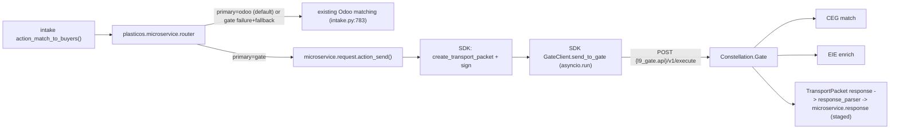

# Integrate plasticos_microservice_bridge (Gate-first, SDK-backed) into the repo

## Decisions (locked with user)
1. Client/transport = adopt `constellation-node-sdk` (`constellation_node_sdk`) as a pip dependency. Delete the pack's hand-rolled `gate_client.py` + `transport_packet_builder.py`. Per ADR-002 L31/L82.
2. Naming: `l9_gate.api` is the ONLY L9-named key (the egress Gate URL). Everything Odoo-side is `plasticos.*` (`plasticos.gate.*`, `plasticos.matching.*`, `plasticos.inference.*`). The SDK's `L9_*`/`GATE_URL` env names stay encapsulated behind the seam.
3. Seam/persistence = Phase 1 staging. Seam only at `action_match_to_buyers()` (`plasticos_intake`); Gate responses staged to `plasticos.microservice.response`; writeback disabled. ADR-full persistence into `plasticos.match.result` / `plasticos.intake.match` and the `find_matches_for_supplier()` matcher seam are a FOLLOW-UP PR (avoids editing the cursorignored `plasticos_buyer_match_engine`).
4. Update ADR-002 to record the above.

## Canonical source
`Current Work - IGNORE/plasticos_microservice_bridge - improved/plasticos_microservice_bridge_gate_primary_v1/plasticos_microservice_bridge/`. Copy ONLY that inner module dir. Drop `FILETREE.md`, `MANIFEST.json`, `README.md`, `repo_patch_guides/`, `__MACOSX/`, `__pycache__/`, `.DS_Store`.

## Gate contract (from the Gate + SDK repos)
- Endpoints: `POST /v1/execute`, `GET /v1/health`, `GET /v1/registry`, `POST /v1/admin/register`. Only `TransportPacket` is accepted/emitted.
- SDK exposes `GateClient` (async `send_to_gate`/`health`), `GateClientConfig`, `create_transport_packet`, `compute_payload_hash`, `compute_transport_hash`, `sign_transport_packet`, `validate_transport_packet`, and routing-policy guards.
- `transport_hash` covers header, address, tenant, payload, governance, provenance, delegation_chain, lineage, attachments, payload_hash (only `hop_trace` excluded). The pack's hand-rolled hash was wrong - another reason to use the SDK.
- Outbound policy: node-origin packet must have `provenance.origin_kind == "node"`, `address.source_node == local_node`, `address.destination_node == "gate"`.
- SDK deps: `pydantic>=2.8`, `httpx`, `cryptography`, `fastapi`, `pyyaml`. SDK is a PRIVATE repo (not PyPI) - install via git.



---

## Phase 0 - Placement and branch
- Copy the inner module dir to repo root as `plasticos_microservice_bridge/` (scaffolding stripped).
- Branch from `Staging`: `feat/microservice-bridge`.

## Phase 1 - Adopt the SDK; delete hand-rolled transport
- Add to `__manifest__.py`: `"external_dependencies": {"python": ["constellation_node_sdk"]}`. Bump version (e.g. `19.0.1.2.0`).
- DELETE `services/gate_client.py` and `services/transport_packet_builder.py` (+ their `services/__init__.py` imports).
- KEEP `services/payload_builder.py` (already maps real intake fields).
- ADAPT `services/response_parser.py` to read the SDK response: `TransportPacket.model_validate(body)` -> operate on `packet.payload` (or `.model_dump()`); keep producing `microservice.response` row dicts.
- Cross-addon import rule: import the SDK lazily inside methods at the seam (not at module top) to respect wiring checks and avoid load-order coupling.

## Phase 2 - Rewrite microservice_request.action_send() around the SDK
At the seam, build the config from Odoo ICP (mapping plasticos.* -> SDK fields), construct + sign + send:
```python
import asyncio
from constellation_node_sdk import (
    GateClientConfig, GateClient, create_transport_packet, sign_transport_packet,
)
icp = self.env["ir.config_parameter"].sudo()
config = GateClientConfig(
    gate_url=icp.get_param("l9_gate.api"),                       # ONLY L9 key
    local_node=icp.get_param("plasticos.gate.source_node", "odoo-plasticos"),
    timeout_seconds=float(icp.get_param("plasticos.gate.timeout_seconds", "30")),
    require_signature=icp.get_param("plasticos.gate.require_signature", "False") == "True",
    signing_key=icp.get_param("plasticos.gate.signing_key") or None,
    signing_key_id=icp.get_param("plasticos.gate.signing_key_id") or None,
    signing_algorithm=icp.get_param("plasticos.gate.signing_algorithm") or None,
    allowed_gate_destination="gate",
)
packet = create_transport_packet(
    action=action,                       # "enrich" | "match"
    payload=payload,                     # from payload_builder
    source_node=config.local_node,
    destination_node="gate",
    origin_kind="node",                  # SDK routing policy requires "node"
    tenant=...,                          # org_id/actor -> TenantContext (ensure_tenant_context)
    idempotency_key=self.idempotency_key,
)
response_packet = asyncio.run(GateClient(config).send_to_gate(packet))   # async wrapped
```
- `asyncio.run()` is safe in Odoo's sync worker thread. Lower-risk alternative if a loop is ever present: use the SDK only to build/sign/validate, then POST synchronously to `{l9_gate.api}/v1/execute` with `httpx` sync. Keep asyncio.run() as primary per decision.
- Confirm the exact `create_transport_packet` / `TenantContext` / `ensure_tenant_context` signatures against the SDK transport module before wiring (read `src/constellation_node_sdk/transport/packet.py`).
- Store `transport_packet_json` and the response packet for audit; map non-2xx / `httpx.HTTPStatusError` and SDK `Transport*Error` to `state="failed"` + `error_message`.

## Phase 3 - Param rename (l9_gate.api + plasticos.* internal)
- `data/ir_config_parameter.xml` and `res_config_settings.py`:
  - egress endpoint -> `l9_gate.api` (replaces `plasticos.gate.api_base_url`).
  - keep `plasticos.gate.enabled`, `plasticos.gate.timeout_seconds`, `plasticos.gate.api_key`, `plasticos.gate.source_node`, `plasticos.gate.reply_to_node`, `plasticos.gate.org_id`, `plasticos.gate.actor`; add `plasticos.gate.signing_key/_id/_algorithm`, `plasticos.gate.require_signature`.
  - routing: `plasticos.gate.matching_enabled`, `plasticos.gate.inference_enabled` (enable-via-Gate toggles), `plasticos.matching.primary_engine` (odoo|gate), `plasticos.matching.fallback_enabled`, `plasticos.inference.primary_engine`, `plasticos.inference.fallback_enabled`, `plasticos.matching_engine.action`, `plasticos.inference_engine.action`.
- The bridge must NEVER read `plasticos.matching_engine.url` / `plasticos.inference_engine.url`.

## Phase 4 - BLOCKER: settings view inherit_id + relabel
- `res_config_settings_views.xml` inherits `plasticos_base.res_config_settings_view_form` which does NOT exist -> change to `base_setup.res_config_settings_view_form`. Real plasticos_base id is `res_config_settings_view_form_plasticos_microservices`.
- Relabel the Gate API field to `l9_gate.api`; routing toggles to the `plasticos.*` fields above. Keep the single-API-slot UX (one endpoint, one key).

## Phase 5 - Reduce API surface in plasticos_base (Ask-Before module)
- Edit `plasticos_base/views/res_config_settings_views.xml`: hide the two URL `<div class="content-group">` blocks (`invisible="1"`) or move under a "Legacy Direct-Service URLs (deprecated - not used by Gate bridge)" block. Keep params + `res_config_settings.py` fields for back-compat. View-only/additive = non-regressive.

## Phase 6 - Matching seam (Phase 1; plasticos_intake regression hotspot)
- In `plasticos_intake/models/intake.py` `action_match_to_buyers()` (line 765), right after `self.ensure_one()`:
```python
routed = self.env["plasticos.microservice.router"].try_gate_matching(self)
if routed.get("handled"):
    return routed.get("action")
# existing Odoo matching logic continues unchanged below
```
- Update the router to read the renamed params (`plasticos.matching.primary_engine`, `plasticos.matching.fallback_enabled`, `plasticos.gate.matching_enabled`). Default `primary_engine=odoo` => no-op (zero regression).
- Run `make test-module m=plasticos_intake` before and after.
- DEFER the `find_matches_for_supplier()` seam and `plasticos.match.result`/`plasticos.intake.match` persistence to the follow-up PR.

## Phase 7 - Update ADR-002
- `docs/adr/ADR-002-gate-hub-phased-autonomy.md`: change `plasticos.gate.url` -> `l9_gate.api`; note `constellation-node-sdk` is the mandated client; document Phase 1 staging (microservice.response) vs Phase 2 persistence (match.result/intake.match + matcher seam). Keep ADR-001/002 numbering unchanged (ADR relocation remains out of scope).

## Phase 8 - Deps + deployment
- SDK is private (not PyPI): provision install in the Odoo image/requirements via git (e.g. `pip install "git+https://github.com/cryptoxdog/Gate_SDK@main"`), with credentials available at build time. Pulls `pydantic>=2.8`, `httpx`, `cryptography`. Verify these are compatible with the Odoo 19 runtime.
- `external_dependencies` only declares the import name for Odoo's check; the actual install is a deployment task - document in the PR.

## Phase 9 - Tests
- Keep the `TransactionCase` (`@tagged post_install`) tests; confirm the pure-python pytest tier does NOT collect `plasticos_*/tests/` (else exclude). Add a router fallback test: `primary=odoo` -> `handled=False`; `primary=gate` with Gate down + `fallback_enabled` -> `handled=False` + message_post.
- Mock the SDK `GateClient.send_to_gate` in flow tests (no live Gate in CI).

## Phase 10 - Validation and push
```bash
ruff check --fix . && ruff format .
python3 scripts/check_module_wiring.py
python3 ci/check_circular_deps.py
python3 ci/check_odoo19_xml.py
pre-commit run --all-files
make pr-check
make update m=plasticos_base,plasticos_microservice_bridge   # local smoke if Docker
make test-module m=plasticos_microservice_bridge
make test-module m=plasticos_intake                          # regression on seam
make push b=feat/microservice-bridge
```
Open PR to `Staging` (never Production). API push only if `git push` crashes (Dropbox mmap) after pr-check passed.

## Default behavior after install (safe switch)
- `plasticos.matching.primary_engine = odoo`, `plasticos.inference.primary_engine = odoo`, both `fallback_enabled = True`, `plasticos.gate.enabled = False`. Flip `primary_engine = gate` + `plasticos.gate.enabled = True` + set `l9_gate.api` in Staging to route through Gate.

## Out of scope (this PR)
- ADR relocation (`reports/adr` -> `docs/adr`).
- `find_matches_for_supplier()` seam + writeback into `plasticos.match.result`/`plasticos.intake.match` (follow-up).
- Inference auto-seam (manual bridge button only for now), web-lead Gate triage, `pipeline_v2.py`, auto-writeback.

## Confidence and risks
- HIGH: SDK is the correct, ADR-mandated transport; deleting the non-conformant hand-rolled builder removes a real Gate-rejection risk.
- MEDIUM: exact SDK `create_transport_packet`/tenant API (verify against `transport/packet.py`); `asyncio.run()` inside Odoo worker (safe in sync threads; sync-POST fallback noted); installing a private SDK + pydantic/httpx into the Odoo image; pure-python pytest collection of module tests.
- Regression-sensitive files: `plasticos_base` settings view (view-only) and `plasticos_intake.action_match_to_buyers` (guarded, default no-op) - both covered by Phase 9/10 tests.
