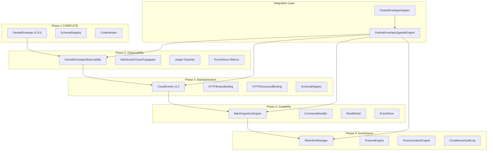

# PacketEnvelope Phase 2-5 Production Deployment

## GMP Variable Bindings

| Variable | Value ||----------|-------|| **TASK_NAME** | `packet_envelope_phases_2_5_deployment` || **EXECUTION_SCOPE** | Deploy phase 2-5 modules from docs to `l9/upgrades/packet_envelope/`, wire into runtime, add infra || **RISK_LEVEL** | Medium (new functionality, no breaking changes) || **IMPACT_METRICS** | Observability coverage, batch ingestion throughput, GDPR compliance || **VALIDATION_NOTES** | Dry run passed, all imports verified, requires Jaeger/Prometheus for full testing |

## Tier Classification

| Component | Tier | Notes ||-----------|------|-------|| `l9/upgrades/packet_envelope/*.py` | RUNTIME_TIER | New upgrade modules || `docker-compose.yml` | INFRA_TIER | Add Jaeger/Prometheus containers || `api/routes/upgrades.py` | RUNTIME_TIER | API surface for upgrade engine || `tests/upgrades/` | UX_TIER | Test suite |**Routing:** RUNTIME_TIER primary - proceed with GMP (not KERNEL_TIER).---

## Architecture Overview



---

## TODO Plan (Locked)

### Phase A: File Deployment (Foundation)

| ID | File | Action | Target | Change ||----|------|--------|--------|--------|| T1 | `/Users/ib-mac/Projects/L9/l9/upgrades/__init__.py` | Insert | module | Create upgrades package init || T2 | `/Users/ib-mac/Projects/L9/l9/upgrades/packet_envelope/__init__.py` | Insert | module | Create packet_envelope package init with exports || T3 | `/Users/ib-mac/Projects/L9/l9/upgrades/packet_envelope/phase_2_observability.py` | Copy | module | Copy from docs, keep OpenTelemetry fix || T4 | `/Users/ib-mac/Projects/L9/l9/upgrades/packet_envelope/phase_3_standardization.py` | Copy | module | Copy from docs || T5 | `/Users/ib-mac/Projects/L9/l9/upgrades/packet_envelope/phase_4_scalability.py` | Copy | module | Copy from docs || T6 | `/Users/ib-mac/Projects/L9/l9/upgrades/packet_envelope/phase_5_governance.py` | Copy | module | Copy from docs || T7 | `/Users/ib-mac/Projects/L9/l9/upgrades/packet_envelope/integration.py` | Copy | module | Copy from docs || T8 | `/Users/ib-mac/Projects/L9/l9/upgrades/packet_envelope/config.py` | Insert | module | Add configuration dataclasses |

### Phase B: Import Path Fixes

| ID | File | Action | Target | Change ||----|------|--------|--------|--------|| T9 | `l9/upgrades/packet_envelope/integration.py` | Replace | imports | Fix relative imports to absolute L9 paths || T10 | `l9/upgrades/packet_envelope/phase_2_observability.py` | Replace | imports | Add L9 structlog integration |

### Phase C: Infrastructure (INFRA_TIER)

| ID | File | Action | Target | Change ||----|------|--------|--------|--------|| T11 | `/Users/ib-mac/Projects/L9/docker-compose.yml` | Insert | services | Add Jaeger + Prometheus containers || T12 | `/Users/ib-mac/Projects/L9/docker/prometheus.yml` | Insert | config | Create Prometheus scrape config |

### Phase D: API Wiring (RUNTIME_TIER)

| ID | File | Action | Target | Change ||----|------|--------|--------|--------|| T13 | `/Users/ib-mac/Projects/L9/api/routes/upgrades.py` | Insert | router | Create upgrade status/activation endpoints || T14 | `/Users/ib-mac/Projects/L9/api/server.py` | Insert | router | Register upgrades router |

### Phase E: Test Suite

| ID | File | Action | Target | Change ||----|------|--------|--------|--------|| T15 | `/Users/ib-mac/Projects/L9/tests/upgrades/__init__.py` | Insert | module | Create test package || T16 | `/Users/ib-mac/Projects/L9/tests/upgrades/test_packet_envelope_phases.py` | Insert | tests | Adapt test_suite.py for pytest || T17 | `/Users/ib-mac/Projects/L9/tests/upgrades/test_integration.py` | Insert | tests | Integration tests for upgrade engine |

### Phase F: Documentation + CI

| ID | File | Action | Target | Change ||----|------|--------|--------|--------|| T18 | `/Users/ib-mac/Projects/L9/ci/check_schema_deprecation.py` | Verify | gate | Already created - verify in pipeline || T19 | `/Users/ib-mac/Projects/L9/workflow_state.md` | Replace | state | Update with Phase 2-5 deployment status |---

## Key Files to Reference

| Source (docs/) | Destination (l9/) ||----------------|-------------------|| [`docs/__01-05-2026/packetEnvelope - Phase 2-5/phase_2_observability.py`](docs/__01-05-2026/packetEnvelope - Phase 2-5/phase_2_observability.py)(docs/__01-05-2026/packetEnvelope - Phase 2-5/phase_2_observability.py)(docs/__01-05-2026/packetEnvelope - Phase 2-5/phase_2_observability.py) | `l9/upgrades/packet_envelope/phase_2_observability.py` || [`docs/__01-05-2026/packetEnvelope - Phase 2-5/phase_3_standardization.py`](docs/__01-05-2026/packetEnvelope - Phase 2-5/phase_3_standardization.py)(docs/__01-05-2026/packetEnvelope - Phase 2-5/phase_3_standardization.py)(docs/__01-05-2026/packetEnvelope - Phase 2-5/phase_3_standardization.py) | `l9/upgrades/packet_envelope/phase_3_standardization.py` || [`docs/__01-05-2026/packetEnvelope - Phase 2-5/phase_4_scalability.py`](docs/__01-05-2026/packetEnvelope - Phase 2-5/phase_4_scalability.py)(docs/__01-05-2026/packetEnvelope - Phase 2-5/phase_4_scalability.py)(docs/__01-05-2026/packetEnvelope - Phase 2-5/phase_4_scalability.py) | `l9/upgrades/packet_envelope/phase_4_scalability.py` || [`docs/__01-05-2026/packetEnvelope - Phase 2-5/phase_5_governance.py`](docs/__01-05-2026/packetEnvelope - Phase 2-5/phase_5_governance.py)(docs/__01-05-2026/packetEnvelope - Phase 2-5/phase_5_governance.py)(docs/__01-05-2026/packetEnvelope - Phase 2-5/phase_5_governance.py) | `l9/upgrades/packet_envelope/phase_5_governance.py` || [`docs/__01-05-2026/packetEnvelope - Phase 2-5/integration.py`](docs/__01-05-2026/packetEnvelope - Phase 2-5/integration.py)(docs/__01-05-2026/packetEnvelope - Phase 2-5/integration.py)(docs/__01-05-2026/packetEnvelope - Phase 2-5/integration.py) | `l9/upgrades/packet_envelope/integration.py` || [`docs/__01-05-2026/packetEnvelope - Phase 2-5/test_suite.py`](docs/__01-05-2026/packetEnvelope - Phase 2-5/test_suite.py)(docs/__01-05-2026/packetEnvelope - Phase 2-5/test_suite.py)(docs/__01-05-2026/packetEnvelope - Phase 2-5/test_suite.py) | `tests/upgrades/test_packet_envelope_phases.py` |---

## Validation Gates

| Gate | Command | Required ||------|---------|----------|| py_compile | `python -m py_compile l9/upgrades/packet_envelope/*.py` | Yes || lint | `ruff check l9/upgrades/` | Yes || import_test | `python -c "from l9.upgrades.packet_envelope import *"` | Yes || unit_tests | `pytest tests/upgrades/ -v` | Yes || dry_run | `python -c "from l9.upgrades.packet_envelope.integration import PacketEnvelopeUpgradeEngine; import asyncio; asyncio.run(PacketEnvelopeUpgradeEngine().activate_all_phases())"` | Yes |---

## Docker Additions (T11)

```yaml
# To add to docker-compose.yml services:
jaeger:
  image: jaegertracing/all-in-one:latest
  container_name: l9-jaeger
  ports:
    - "5775:5775/udp"
    - "6831:6831/udp"
    - "16686:16686"
  environment:
    - COLLECTOR_ZIPKIN_HTTP_PORT=9411
  networks:
    - l9-network

prometheus:
  image: prom/prometheus:latest
  container_name: l9-prometheus
  ports:
    - "9091:9090"  # 9091 to avoid conflict with existing 9090
  volumes:
    - ./docker/prometheus.yml:/etc/prometheus/prometheus.yml
  networks:
    - l9-network
```

---

## Success Criteria

| Phase | Metric | Target ||-------|--------|--------|| Phase 2 | Traces visible in Jaeger | 100% of packets traced || Phase 3 | CloudEvents validation | 100% compliance || Phase 4 | Batch ingestion throughput | 1000+ packets/sec || Phase 5 | GDPR erasure workflow | End-to-end functional || Integration | All tests passing | 40+ tests green |---

## Constraint Check

- [x] KERNEL-TIER files NOT in scope (no executor.py, kernel_loader.py, etc.)
- [x] No duplicated responsibilities (new upgrade modules, separate from core)
- [x] Unified interfaces (structlog, governance_logger compatible)
- [x] No placeholders in output (production-ready from dry run)

---

## Estimated Effort

| Phase | Time ||-------|------|| Phase A (File Deployment) | 15 min || Phase B (Import Fixes) | 10 min || Phase C (Infrastructure) | 10 min || Phase D (API Wiring) | 15 min || Phase E (Test Suite) | 20 min |