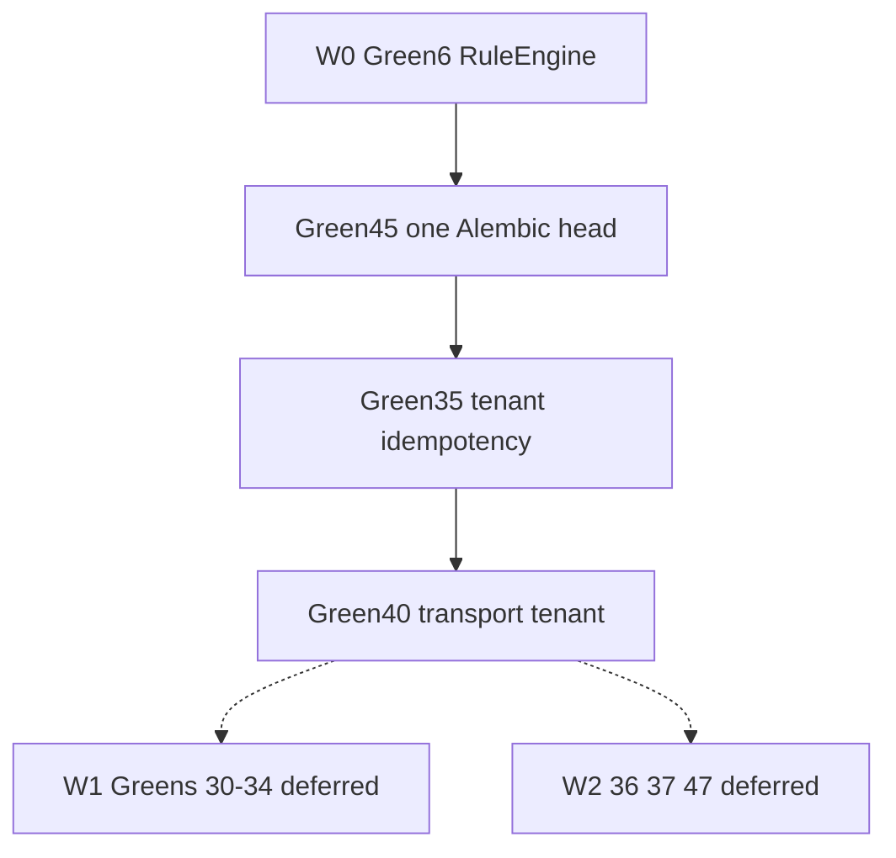

# PE EIE scoped campaign (compiled donor)

Do not execute this file. Do not run `make campaign` from this path. The live compiled contract is [`pe_loop_compiled_8-28-26.plan.md`](pe_loop_compiled_8-28-26.plan.md).

# PE EIE scoped campaign (≤30%) for `make campaign`

## Objective

After a later confirm on the **compiled successor**, emit three PE-admissible artifacts and stop. Do not mutate `app/`, `migrations/`, or other product files from this donor file. Do not run the following from this path. The live front door lives on [`pe_loop_compiled_8-28-26.plan.md`](pe_loop_compiled_8-28-26.plan.md):

```bash
# Do not run from this donor file.
make -C "$HOME/.cursor-governance" campaign \
  INTENT="/Users/ib-mac/Enrichment.Inference.Engine/.cursor-commands/WIP/PE EIE/eie-inference-isolation-v1.md"
```

That command is the only live PE front door ([`l9-pe-campaign-activate`](file:///Users/ib-mac/.cursor-governance/skills/l9-pe-campaign-activate/SKILL.md)). Do not call `pec`, `compile_campaign_source.py`, or `program-execution intent` as a substitute.

**It is:** a Wave-0/Wave-2 isolation campaign on `Quantum-L9/Enrichment.Inference.Engine` that restores deterministic RuleEngine inference and tenant-authoritative idempotency/persistence, then stops before outbox, catalog, surface quarantine, and release closure.

## Corpus bound (verified)

| Path | Bytes | Role |
|---|---|---|
| [PE EIE 1.md](.cursor-commands/WIP/PE%20EIE/PE%20EIE%201.md) | 28,546 | In-flight Green 6 implementation spec |
| [PE EIE 2.md](.cursor-commands/WIP/PE%20EIE/PE%20EIE%202.md) | 7,801 | Tenant waves 1–5 + current build order (source of Repair Order.md) |
| [PE EIE 3.md](.cursor-commands/WIP/PE%20EIE/PE%20EIE%203.md) | 22,841 | Early Greens 1–8 (Green 6 lock; Green 3 Alembic) |
| [PE EIE 4.md](.cursor-commands/WIP/PE%20EIE/PE%20EIE%204.md)–[8.md](.cursor-commands/WIP/PE%20EIE/PE%20EIE%208.md) | 87,711 | Surface / peer-boundary greens (mostly later waves) |
| [PE EIE 9.md](.cursor-commands/WIP/PE%20EIE/PE%20EIE%209.md) | 43,266 | Terminal Greens 35–50 + landing order |
| [AUDIT_SUPERSESSION.md](.cursor-commands/WIP/PE%20EIE/AUDIT_SUPERSESSION.md) | 3,361 | Later Green wins; 35–50 are terminal architecture |
| [PE EIE Repair Order.md](.cursor-commands/WIP/PE%20EIE/PE%20EIE%20Repair%20Order.md) | 817 | Stale 8-phase queue copied from File 2 |

Total corpus: **204,505 bytes**. Scoped brief hard cap: **≤61,351 bytes (30%)**. Distill; do not concatenate Files 1–9. Target 15–25 KB.

Baseline SHA: `7c4ce2596ca511de32dafe642ef4cc6ee1b21b6d` on `main`. Target repo: `Quantum-L9/Enrichment.Inference.Engine`.

## Repaired order (full program vs this slice)

Three orders conflict. [AUDIT_SUPERSESSION.md](.cursor-commands/WIP/PE%20EIE/AUDIT_SUPERSESSION.md) is the precedence rule: later Green wins; Greens 35–50 are the terminal architecture.

```text
W0  Green 6 inference          File 1 / File 3 G6   IN FLIGHT, not superseded
W1  Greens 30-34 boundary      File 8               File 9 landing start
W2  45 → 35 → 36 → 37 → 47     File 9               durability / isolation / egress
W3  38 → 40 → 41 → 39 → 42     File 9               catalog / commands
W4  43 → 44                    File 9               convergence
W5  46 → 48 → 49 → 50          File 9               ops / release
```

**This campaign is W0 + W2 isolation only: Green 6, then 45, then 35, then 40.** That is ≤30% of remaining live work and matches Repair Order “IN FLIGHT → NEXT — Security / isolation,” with File 9’s `45 before 35` correction applied.

**Documented exception vs File 9:** File 9 lists 30–34 before 45. Those greens are a peer-boundary campaign (Neo4j/SCORE/sibling URL removal), not a technical prerequisite for Alembic lineage or tenant idempotency. Honor 30–34 as **invariants** (no new Neo4j/Redis-bus/direct-peer work) and defer their mutations to the next campaign. Do not implement superseded early greens (File 3 G1/G2 text, File 4 G11/G13/G24) as if they were current — use File 9 G35/G40/G45 and File 2 waves as the implementation spec.



## PE-owned Releases (encoded in the brief; not executed by the planning agent)

Numbered `Release A —` blocks are load-bearing: [`compile_brief.py`](file:///Users/ib-mac/.cursor-governance/skills/l9-pe-campaign-activate/scripts/compile_brief.py) extracts only those (or a `Program ordering` list). Filename slug becomes `campaign_id` (`eie-inference-isolation-v1`). Body must contain `Quantum-L9/Enrichment.Inference.Engine` or the compiler defaults to Cursor-Governance.

| Release | Title | Grounded files | Contracts |
|---|---|---|---|
| A | Deterministic RuleEngine inference | [`app/main.py`](app/main.py) (T4), [`app/engines/handlers.py`](app/engines/handlers.py) (T4), [`app/engines/inference/rule_loader.py`](app/engines/inference/rule_loader.py), [`app/engines/inference/rule_engine.py`](app/engines/inference/rule_engine.py), [`app/engines/inference_bridge_adapter.py`](app/engines/inference_bridge_adapter.py), `tests/test_rule_engine.py`, `tests/test_rule_loader.py`, new `tests/test_inference_wiring.py`; fixture [`domains/plasticos/spec.yaml`](domains/plasticos/spec.yaml) read-only | C-13/C-21 lockstep; no PlasticOS→v2 rewrite; no `inference_bridge_v2` delete |
| B | One Alembic lineage | `alembic.ini` `script_location=migrations`; `migrations/versions/001_*`; do **not** import orphan `alembic/versions/0002_perplexity_api_key_default.py` | Green 45 supersedes File 3 Green 3 |
| C | Tenant Redis + Postgres idempotency | [`app/engines/enrichment_orchestrator.py`](app/engines/enrichment_orchestrator.py), [`app/services/idempotency.py`](app/services/idempotency.py), [`app/services/pg_store.py`](app/services/pg_store.py), [`app/services/pg_models.py`](app/services/pg_models.py); migration after `001` | Green 35; `UNIQUE(tenant_id, idempotency_key)`; no raw tenant in Redis keys |
| D | ResultStore + approval tenant predicates | [`app/services/result_store.py`](app/services/result_store.py), [`app/services/pg_store.py`](app/services/pg_store.py) `approve_schema_proposal` | File 2 waves 3–4; UUID is not authorization |
| E | Transport tenant is authoritative | [`app/engines/handlers.py`](app/engines/handlers.py), [`app/services/chassis_handlers.py`](app/services/chassis_handlers.py) (T4) | Green 40; reverse `payload.get("tenant_id") or tenant`; invert `test_tenant_override()` |

HTTP `/api/v1/*` tenant mapping stays **disposition-only** (File 2 Wave 6). No SideEffectCoordinator/outbox (G36), no action-catalog rewrite (G38), no GRAPH inbox (G39), no enrich-path collapse (G42).

## Skill → PE front door (wiring)

`l9-plan` already names `make campaign INTENT=` in the executable template. The gap is that `.plan.md` is **not** a `compile_brief` memo (no `Release A —`, no `It is:` under Final architectural judgment). Wiring for this campaign is artifact-level, not a governance skill-pack edit:

1. Write the scoped memo at `.cursor-commands/WIP/PE EIE/eie-inference-isolation-v1.md` with the exact markers [`source-contract.md`](file:///Users/ib-mac/.cursor-governance/skills/l9-pe-campaign-activate/references/source-contract.md) requires.
2. Point the `.plan.md` Execute section at that absolute INTENT path.
3. Prove classification: `campaign_input.py` → kind `brief`, route `brief -> activate -> campaign_source -> blueprint -> PEC`.
4. Do **not** add this id to governance [`COMPILE_ALLOWLIST.yaml`](file:///Users/ib-mac/.cursor-governance/environment/program-execution/campaigns/COMPILE_ALLOWLIST.yaml) (allowlist is for in-repo `CAMPAIGN_SOURCE.yaml` compile, not live `make campaign` briefs).
5. Out of scope: mutating `l9-plan` / `l9-pe-campaign-activate` skill packs, or adding `render_plan_brief.py` to Cursor-Governance.

Required brief markers:

```text
owner: Igor Beylin
Quantum-L9/Enrichment.Inference.Engine
Final architectural judgment
It is:
<one paragraph objective>
1. Release A — …
2. Release B — …
…
```

## Planning-agent emit sequence (after confirm; no `app/` writes)

1. Write the scoped brief (≤61,351 bytes; `wc -c` is a success property).
2. Write `PLAN_DOCUMENT` JSON conforming to [`schemas/plan-document.schema.json`](file:///Users/ib-mac/.claude/skills/l9-plan/schemas/plan-document.schema.json) with todos T-A…T-E mapped to the Releases, `code_in_scope: true`, `scope.out` non-empty.
3. `python3 ~/.claude/skills/l9-plan/scripts/validate_plan_document.py <plan.json>` must PASS.
4. Project `.cursor/plans/eie_inference_isolation_<8hex>.plan.md` via `render_plan_pe_autonomy.py`. Must retain **Execute via @environment/program-execution + autonomy**.
5. Classify the brief with `campaign_input.py`; fail closed if not `brief`.
6. Stop. Recommend `/ynp` → `make campaign INTENT=<brief>` (not `/gmp`, not pec).

EIE has no `make pr-check` target. Name it in `final_validation` per l9-plan G_PR_CHECK, and bind the real gate to **`make agent-check`** (7 gates in [AGENTS.md](AGENTS.md)). Never invent a `pr-check` Makefile target in this campaign.

## Execution envelope (for the later PE run)

- New branch from `origin/main`: `campaign/eie-inference-isolation-v1` (KERNEL/PE overlay default; runner isolates a worktree).
- T4 files in slice: `app/main.py`, `app/engines/handlers.py`, `app/services/chassis_handlers.py` — C-13 lockstep; PR + 2 reviewers; do not retouch deprecated `chassis/router.py`.
- `autonomous_merge: false`.
- Commands allowed later: `make agent-check`, `make agent-fix`, targeted pytest. Forbidden: `make prod`, `make deploy`, `alembic upgrade` against production, force-push.
- Quarantine shrink only after the 15 RuleEngine/RuleLoader tests actually pass (File 1 rule).

## Success properties

- `wc -c` of the scoped brief ≤ 61,351.
- Brief contains ≥5 `Release [A-E] —` headings and an `It is:` objective.
- `campaign_input` classifies the brief as `brief`.
- `validate_plan_document.py` PASS; `.plan.md` has the PE execute section.
- PE Task Cards do not include G30–34, G36–39, G41–50, HTTP tenant invention, or v2/DAG deletion.

## Stress / rollback / unknowns

- Disconfirm: File 9 is correct that 45 must wait for 30–34 (if yes, split this campaign and do W1 first). File 1 already landed on `main` (if yes, Release A becomes verify-only). `test_tenant_override` is load-bearing for an external consumer (if yes, stop on Green 40).
- Rollback: delete the three emit artifacts; no product SHA change from planning. PE run rolls back by not merging `campaign/eie-inference-isolation-v1`.
- Unknowns: whether `make pr-check` exists via a hidden overlay (treat as absent); whether a live HTTP consumer blocks Wave-6 disposition (out of scope); Graphiti write was unauthorized this session (`principal local-operator`) — do not treat memory as SSOT.

## Out of scope

- Implementing any `app/` or migration change from the planning agent
- Greens 30–34, 36–39, 41–50
- Rewriting PlasticOS to v2 / deleting `inference_bridge_v2`
- Direct HTTP tenant “security” patches
- Governance skill-pack or `COMPILE_ALLOWLIST` edits
- `make campaign` / pec / push / PR / merge from `/l9-plan`
