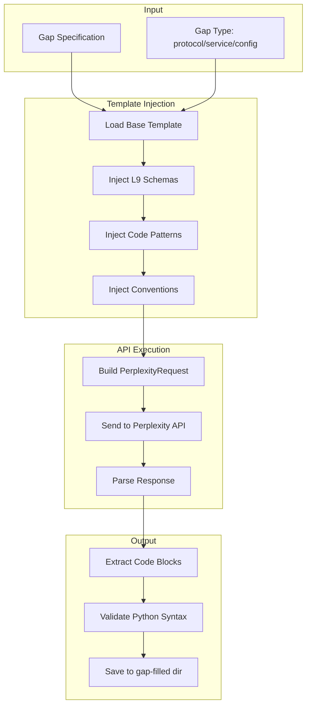

# Perplexity Gap-Filling SuperPrompt System

## Problem Statement

When using Perplexity API (via MCP tools), requests for L9-specific code generation fail with "I need more context" because:

1. MCP tools send bare queries without L9 schema context
2. No template injection occurs - Perplexity has no knowledge of PacketEnvelope, MemorySubstrateService, etc.
3. Responses cannot be guaranteed to match L9 conventions

## Existing Assets to Leverage

| Asset | Location | Purpose |

|-------|----------|---------|

| `perplexity_client.py` | [services/research/tools/perplexity_client.py](services/research/tools/perplexity_client.py) | Production API client with retry, rate limits |

| `extract_perplexity_pack.py` | [scripts/research/extract_perplexity_pack.py](scripts/research/extract_perplexity_pack.py) | Parse multi-file code from responses |

| `send_perplexity_spec_request.py` | [scripts/research/send_perplexity_spec_request.py](scripts/research/send_perplexity_spec_request.py) | Example of context injection pattern |

| SuperPrompt_Emitter spec | [agents/codegenagent/codegen+codegenAgent_specs/runtime_perplexity_SuperPrompt_Emitter.yaml](agents/codegenagent/codegen+codegenAgent_specs/runtime_perplexity_SuperPrompt_Emitter.yaml) | Gap detection + prompt building |

## Architecture



## Component Design

### 1. Gap-Fill SuperPrompt Template

Location: `prompts/perplexity/gap_fill_superprompt.md`

The template will include:

- L9 coding conventions (Python 3.12, structlog, async-first)
- Core schema definitions (PacketEnvelope, MemorySubstrateService protocol)
- Output format requirements (no TODOs, full docstrings, DORA footer)
- File naming and structure conventions

Template structure:

```
# L9 GAP-FILL SUPERPROMPT v1.0

## L9 CONVENTIONS (MANDATORY)
{conventions_block}

## CORE SCHEMAS (INJECT THESE)
{schemas_block}

## CODE PATTERNS TO FOLLOW
{patterns_block}

## GAP SPECIFICATION
{gap_details}

## OUTPUT REQUIREMENTS
- Complete Python 3.12 code
- No placeholders or TODOs
- Full type hints
- structlog logging
- DORA footer metadata
```

### 2. Schema Injection Registry

Location: `config/perplexity/schema_registry.yaml`

Maps gap types to required schema injections:

```yaml
protocols:
  inject:
    - core/schemas/packet_envelope.py  # PacketEnvelope definition
    - core/protocols/substrate_protocols.py  # Protocol interfaces
  conventions:
    - async-first
    - structlog
    - python-3.12-typing

memory_services:
  inject:
    - memory/substrate_service.py  # MemorySubstrateService interface
    - core/schemas/packet_envelope.py
  conventions:
    - facade-pattern
    - async-first

feature_flags:
  inject:
    - config/feature_flags.py  # Existing pattern
  conventions:
    - env-var-based
    - singleton-pattern
```

### 3. Gap-Fill Executor Script

Location: `scripts/research/gap_fill_executor.py`

```python
# Pseudocode structure
class GapFillExecutor:
    def __init__(self, gap_type: str, gap_spec: dict):
        self.gap_type = gap_type
        self.gap_spec = gap_spec
        self.client = PerplexityClient(api_key)
    
    def build_superprompt(self) -> str:
        # 1. Load base template
        template = load_template("gap_fill_superprompt.md")
        
        # 2. Inject schemas based on gap_type
        schemas = self.load_schemas_for_type(self.gap_type)
        template = template.replace("{schemas_block}", schemas)
        
        # 3. Inject conventions
        conventions = self.load_conventions(self.gap_type)
        template = template.replace("{conventions_block}", conventions)
        
        # 4. Inject gap details
        template = template.replace("{gap_details}", self.gap_spec)
        
        return template
    
    async def execute(self) -> list[ExtractedFile]:
        prompt = self.build_superprompt()
        
        request = PerplexityRequest(
            query=prompt,
            model=PerplexityModel.SONAR_REASONING_PRO,
            system_context="You are a code generator. Output ONLY Python code blocks.",
            max_tokens=8000,
        )
        
        response = await self.client.search(request)
        
        # Use existing extractor
        files = extract_files(response.content)
        
        return files
```

### 4. CLI Interface

Location: `scripts/research/gap_fill.py`

```bash
# Usage examples
python scripts/research/gap_fill.py \
  --type protocol \
  --name "ErrorHandlingProtocol" \
  --output current_work/01-25-2026/gap-filled/

python scripts/research/gap_fill.py \
  --type memory_service \
  --name "PacketService" \
  --output current_work/01-25-2026/gap-filled/
```

## Files to Create

| File | Purpose |

|------|---------|

| `prompts/perplexity/gap_fill_superprompt.md` | Base template with injection slots |

| `config/perplexity/schema_registry.yaml` | Maps gap types to schema injections |

| `scripts/research/gap_fill_executor.py` | Core executor with template injection |

| `scripts/research/gap_fill.py` | CLI entry point |

## Files to Modify

| File | Change |

|------|--------|

| `services/research/tools/perplexity_client.py` | Add `gap_fill()` convenience method |

## Key Design Decisions

1. **Template-first**: Always inject full context, never rely on Perplexity knowing L9
2. **Schema extraction**: Read actual L9 files to inject, not hardcoded examples
3. **Model selection**: Use `sonar-reasoning-pro` for code generation (best for structured output)
4. **Validation**: Syntax-check extracted Python before saving
5. **Reuse existing**: Leverage `extract_perplexity_pack.py` for parsing

## Success Criteria

1. Running `gap_fill.py --type protocol --name X` produces complete, runnable Python
2. No "I need more context" responses from Perplexity
3. Output code follows L9 conventions (structlog, async, Python 3.12 typing)
4. Extracted code passes `python -m py_compile` validation