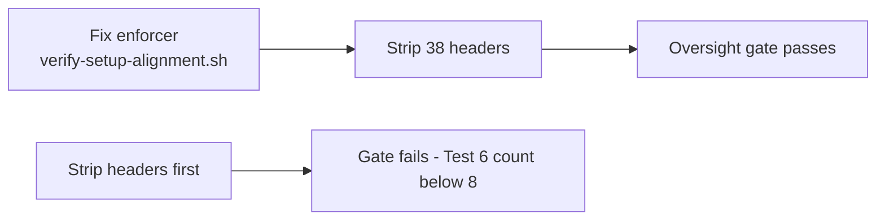

# Suite-6 full cut-over

`CANONICAL_LAW.md` is already headed "Post-Suite-6 / Graphiti-native rewrite" and [SETUP_QUICK_START.md:62](/Users/ib-mac/.cursor-governance/intelligence/workspace/SETUP_QUICK_START.md) already declares `.suite6-config.json` stale. The declaration never reached the artifacts. This plan closes that gap.

## The load-bearing finding

**A live gate rewards Suite-6 residue.** [ops/scripts/verify-setup-alignment.sh](/Users/ib-mac/.cursor-governance/ops/scripts/verify-setup-alignment.sh) Test 6 (lines 146-156) counts scripts carrying `=== SUITE 6 CANONICAL HEADER ===` and **fails when the count drops below 8**. [operational-oversight.py:354-355](/Users/ib-mac/.cursor-governance/ops/scripts/operational-oversight.py) invokes it as "the current active replacement."

This dictates ordering: **the enforcer is fixed before any header is touched.** Reverse that order and the oversight check starts failing mid-migration.

## Footprint

- **38 files** carry `=== SUITE 6 CANONICAL HEADER ===` live: 12 in `profiles/` (retiring), **26 in live components** across `intelligence/` (13), `learning/` (6), `ops/` (4), `security/` (2), `operations/` (1).
- The replacement already dominates: **87 files use `L9_META`**, 25 use `SKILL_META`. This is minority-legacy to established-modern, not an invention.
- **`.suite6-config.json` is manifested**, not stray - [l9-meta.yaml:489](/Users/ib-mac/Dropbox/Repo_Dropbox_IB/Cognitive.Engine.Graphs/l9-meta.yaml) and [tools/l9_template_manifest.yaml:127](/Users/ib-mac/Dropbox/Repo_Dropbox_IB/Cognitive.Engine.Graphs/tools/l9_template_manifest.yaml), so it scaffolds into every new L9 repo.
- **`WIP/Graphiti - Cirsor Governance/`** is 96 git-tracked files, 1.1M, including a `WHOLE REPO-*.txt` dump with 10 hits.

**Preserved deliberately:** `CHANGELOG.md`, `TODO.md`, `CANONICAL_LAW.md`, `README.md`, and the `SETUP_QUICK_START.md` deprecation table keep their Suite-6 mentions. Those *document* the cut-over; erasing them destroys the record of why any of this happened.

## Phase 1 - Break the coupling (must be first)

- [ops/scripts/verify-setup-alignment.sh](/Users/ib-mac/.cursor-governance/ops/scripts/verify-setup-alignment.sh): delete Test 6 (lines 146-156), fix the banner at line 50, and the summary claims at lines 190-191 that count "scripts with Suite 6 headers". Renumber remaining tests. Migrate its own header (lines 2-3) last, once Test 6 is gone.
- [ops/scripts/tool_pattern_extractor.py:375](/Users/ib-mac/.cursor-governance/ops/scripts/tool_pattern_extractor.py): the governance keyword list contains `"suite 6"` and `"canonical header"` - a live classifier keyed to dead vocabulary. Replace with `"l9_meta"`, `"canonical law"`.
- Run `operational-oversight.py` verification path afterward to confirm the gate still passes at full strength.

## Phase 2 - Port profiles into live components

Porting rules, applied to every file:

- **Diff before writing.** The live artifact is the source of truth; port only the delta. Never append a whole profile.
- **Register or do not port.** [skills/l9-structured-reasoning/SKILL.md](/Users/ib-mac/.cursor-governance/skills/l9-structured-reasoning/SKILL.md) carries a Resource Map (lines 70-80) indexing all 11 of its references. A file dropped into `references/` without a map entry is never loaded - it reproduces the exact decorative problem being fixed.
- **Carry provenance** via an `L9_META` header with `sources:` naming the originating profile. Format per [ynp-workflow.md](/Users/ib-mac/.cursor-governance/skills/l9-ynp/references/ynp-workflow.md) lines 1-7.
- **Strip the Suite-6 canonical header** (lines 1-52 of each profile). None of it ports.

**Reasoning group** into [skills/l9-structured-reasoning/references/](/Users/ib-mac/.cursor-governance/skills/l9-structured-reasoning/references/):

- `reasoning_docs.md` (479 lines) is misnamed - it is "Strategic Intelligence Layer", not documentation reasoning. Its 5 modes overlap `reasoning-modes.md`; its metrics overlap `success-metrics-template.md`. Port only unique modes plus its 4 reasoning operations (dependency mapping, gap analysis, coherence check, insight generation).
- `reasoning_technical_operations.md` (338 lines) into a new `technical-operations-reasoning.md`. Add Resource Map entry.
- `reasoning_l9.md` (96 lines) - diff against `reasoning-protocol.md`, fold residue inline. Likely no new file.

**Mode group:**

- `ynp_mode.md` (206 lines) into the existing [references/ynp-workflow.md](/Users/ib-mac/.cursor-governance/skills/l9-ynp/references/ynp-workflow.md), already Resource-Mapped. [skills/l9-ynp/SKILL.md](/Users/ib-mac/.cursor-governance/skills/l9-ynp/SKILL.md) is only 56 lines and already covers purpose, reasoning-before-output, confidence scoring, failure handling. Unique delta is narrow: the literal "Your Next Prompt" closing block, numbered-choice interpretation, do-not-repeat-confirmed-inputs, packet awareness.
- `dev_mode.md` (209 lines) split to `skills/l9-ci-ops/` and `skills/l9-python-tdd-with-uv/`; drop refs to the missing `environment/env_validator.py` and `pipeline/pipeline_validate.md`.
- `advanced-features.md` (485 lines): persona lenses to `l9-structured-reasoning/references/persona-lenses.md`, automation content to `skills/l9-forge/references/`.

**New rule** from `session-startup-protocol.md`:

That file is two unrelated documents. Lines 61-225 are the dead startup bootstrap. Lines 251-640 are verification gates - **but sections B-E cite a foreign stack.** `HARD_RULES.md`, `SUPABASE_AUTH_CORRECT_METHOD.md`, `Data_Management/supabase-schema.sql`, and `Configuration/.env` are all MISSING from this repo, with 12 Supabase/n8n markers in the file. Only sections F/G/H (lines 396-520: success verification, failure stop, anti-patterns) generalize.

- Create `rules/45-pre-action-verification.mdc` from F/G/H only. Drop B-E.
- **Trade-off, stated once:** `rules/` is always-applied and already totals 6,993 lines across 58 files. Verbatim F/G/H would add ~390 lines of per-request context. Target a condensed 60-80 lines, after an overlap check against [rules/60-anti-patterns.mdc](/Users/ib-mac/.cursor-governance/rules/60-anti-patterns.mdc) (351 lines) and [rules/40-domain-autonomy.mdc](/Users/ib-mac/.cursor-governance/rules/40-domain-autonomy.mdc).

**Governance stubs** (66-67 lines each):

- `operational-health.md` to `skills/l9-governance-wiring/references/`
- `security-access.md` to `skills/l9-auditing-security/references/`. Its `security/credentials-policy.md` citation is a **stale path, not a missing file** - [learning/credentials-policy.md](/Users/ib-mac/.cursor-governance/learning/credentials-policy.md) exists. Repoint, do not drop.
- `versioning.md` to `skills/l9-architecture-decision-records/references/`
- `workflow-governance.md` to `skills/l9-ci-ops/references/`; drop its missing `commands/validate-workflow.md` citation

**Structural:**

- `orchestrator.md` (77 lines) routing intent into [skills/AUTONOMY_MANIFEST.yaml](/Users/ib-mac/.cursor-governance/skills/AUTONOMY_MANIFEST.yaml), which already owns routing.
- `session-startup-protocol.md` lines 61-225 are dead; live startup already belongs to [commands/start-session.md](/Users/ib-mac/.cursor-governance/commands/start-session.md) and `ops/hooks/session_start_bootstrap.sh`. Verify, port nothing.

## Phase 3 - Header migration

Migrate the 26 live non-profile files from `=== SUITE 6 CANONICAL HEADER ===` to `L9_META`. The Suite-6 block carries ~40 fields (business_value, success_metrics, suite_2_origin, api_endpoints, performance_tier); `L9_META` carries 6-7. **Map, do not transcribe** - most Suite-6 fields have no consumer and are why these files rot.

Mapping: `component_name` to `component`, `layer`/`domain`/`type` collapse into `artifact_type`, `tags` carry over, `status` carries over, add `retrieval: on_demand`. Drop the rest.

Two files need special handling:

- **[learning/graphiti-episodes/quick-fixes.episodes.json](/Users/ib-mac/.cursor-governance/learning/graphiti-episodes/quick-fixes.episodes.json)** - the header is embedded inside a JSON `"body"` string, i.e. it is *memory episode content*, not a file header. Editing it rewrites stored memory. Flag at the retirement gate rather than silently rewriting.
- **`ops/scripts/verify-setup-alignment.sh`** - migrate only after Phase 1 removes its Test 6.

## Phase 4 - Remove `.suite6-config.json`

In the CEG repo:

- Delete `.suite6-config.json` (currently tracked and modified).
- Drop its entry from [l9-meta.yaml:489](/Users/ib-mac/Dropbox/Repo_Dropbox_IB/Cognitive.Engine.Graphs/l9-meta.yaml).
- Drop its entry from [tools/l9_template_manifest.yaml:127](/Users/ib-mac/Dropbox/Repo_Dropbox_IB/Cognitive.Engine.Graphs/tools/l9_template_manifest.yaml) so it stops scaffolding into new L9 repos.
- Check `.gitignore` and any template validator that asserts the file exists.

This is the only phase touching the CEG repo. It is a separate commit from the governance work.

## Phase 5 - WIP cleanup

96 tracked files, 1.1M, under `WIP/Graphiti - Cirsor Governance/`. Apply the same header migration and vocabulary cleanup. The `WHOLE REPO-l9-graphiti-memory.txt` dump (10 hits) is a generated snapshot - propose regeneration or deletion at the gate rather than hand-editing.

## Phase 6 - Reference cleanup

Fix:

- [ops/scripts/session_init.sh](/Users/ib-mac/.cursor-governance/ops/scripts/session_init.sh) lines 83-84 log `profiles/reasoning.md` and `profiles/technical-operations-reasoning.md` - **both filenames have never existed.** A live script writing phantom log lines.
- [intelligence/adaptive-reasoning.md:66](/Users/ib-mac/.cursor-governance/intelligence/adaptive-reasoning.md) claims it pushes updates into `.cursor/profiles/reasoning.md` - phantom target.
- [security/api-key-verification.md:61](/Users/ib-mac/.cursor-governance/security/api-key-verification.md) and [learning/credentials-policy.md:61](/Users/ib-mac/.cursor-governance/learning/credentials-policy.md) point at `.cursor/profiles/security-access.md` - repoint.
- [key components/07_session-rebuilder.md:19](/Users/ib-mac/.cursor-governance/key%20components/07_session-rebuilder.md) uses a stale `@.GlobalCommands/profiles/*.md` prefix.
- [README.md:63](/Users/ib-mac/.cursor-governance/README.md) and [TODO.md:38](/Users/ib-mac/.cursor-governance/TODO.md).

Leave alone:

- All `_archived/` hits, including `ops/scripts/_archived/update-suite6-references.py` - archived by design.
- **False positives:** `kernels/L9 Coding Control Plane/{README,ROADMAP}.md` reference a `profiles/` directory in that kernel's *own* tree diagram. Verified by reading surrounding context. Do not "fix."
- [environment/ide/README.md:7](/Users/ib-mac/.cursor-governance/environment/ide/README.md) and [rules/97-ide-profile-exceptions.mdc:34-36](/Users/ib-mac/.cursor-governance/rules/97-ide-profile-exceptions.mdc) are disambiguation notes that exist only because `profiles/` is confusable with IDE profiles - simplifiable only after retirement, so defer to the gate.

## Verification

- **Oversight gate still passes:** run `operational-oversight.py`'s verification path; `verify-setup-alignment.sh` passes at full strength with no Suite-6 test.
- **Vocabulary check:** `rg -i 'suite.?6' --glob '!**/_archived/**'` returns hits only in `CHANGELOG.md`, `TODO.md`, `CANONICAL_LAW.md`, `README.md`, and `SETUP_QUICK_START.md` - the deliberate history set.
- **Header check:** `rg -l '=== SUITE 6 CANONICAL HEADER ===' --glob '!**/_archived/**'` returns only `profiles/` (pending gate approval) and the flagged episodes JSON.
- **Registration check:** every new `references/*.md` filename greps positive against its owning `SKILL.md` Resource Map, and carries `L9_META` with `sources:`.
- **Reference check:** `rg -n 'profiles/' --glob '!**/_archived/**' --glob '!profiles/**' --glob '!kernels/**'` returns only the disambiguation notes. (Note: a blanket "zero hits" criterion is wrong - archived files retain refs permanently.)
- `bash ops/scripts/validate_governance_no_hardcoded_paths.sh` and `bash ops/scripts/validate_governance_symlinks.sh`.
- CEG repo: confirm template scaffolding still validates without `.suite6-config.json`.

## Retirement gate

After all phases, present a table covering every `profiles/` file (ported where, dropped what, why), the episodes-JSON decision, the `WHOLE REPO-*.txt` decision, and the now-removable disambiguation notes. Then **stop and wait for explicit approval.** No deletion happens without it.

## Out of scope

`kernels/L9 Coding Control Plane/` is a separate architecture (PLAN.md, AUDIT.md, BUILD.md) and is not touched.
