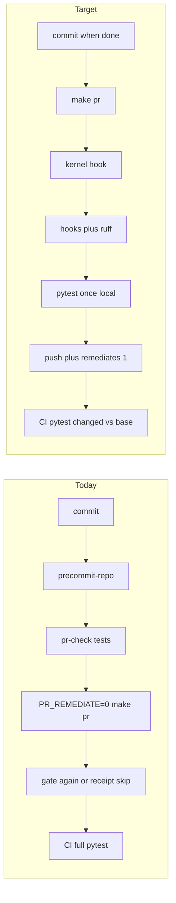

# Tests once, then `make pr` remediates

## Objective

One local pytest pass per unchanged tree. One agent command after finished work is committed: `make pr`. GitHub `pull_request` Test Suite uses the same changed-vs-base file set as local. After the PR opens, remediates defaults to on.

User invoked `l9-plan` for planning depth. Execution stays Cursor Build on a new `origin/main` branch (rule 46). Do not run `make campaign`. Do not admit a Program Lock.

## Current waste (verified)

Happy path today is three overlapping ceremonies:

1. After every commit: `make precommit-repo` ([AGENTS.md](AGENTS.md) `PRECOMMIT_REPO_OWNS_RUFF_V1`)
2. Then `make pr-check` (hooks + ruff + pytest + security)
3. Then `PR_REMEDIATE=0 make pr` (same gate again; receipt skip if the tree is unchanged)

Makefile already has `PR_REMEDIATE ?= 1`. Agents are taught `0`. [ops/scripts/open_pr_after_gate.sh](ops/scripts/open_pr_after_gate.sh) uses `PR_REMEDIATE="${PR_REMEDIATE:-0}"`. [rules/48-make-pr-remediation.mdc](rules/48-make-pr-remediation.mdc) and [CANONICAL_LAW.md](CANONICAL_LAW.md) §6.2.2 require `0`. [ops/autonomy/surface_profile.yaml](ops/autonomy/surface_profile.yaml) `post_push.required_command` is `PR_REMEDIATE=0 make pr`.

Local pytest is already `--changed-file` via [ops/scripts/run_pr_gate.sh](ops/scripts/run_pr_gate.sh). GitHub Test Suite in [.github/workflows/l9-lint-test.yml](.github/workflows/l9-lint-test.yml) runs `run_python_test_suites.py --profile ci` (full catalog). The runner accepts `--changed-file` only with `--profile local`.

Commit-when-finished exists (`CURSOR_COMMIT_BEFORE_STOP_V1`). It is not paired with then-`make pr`.

## Locked contracts

- **PR file set:** added + modified + renamed vs the PR base. Not git-A-only.
- **Local tests once:** same worktree digest + `PR_BASE` → one pytest pass. `make pr` runs the gate (`pr-check` is an internal leaf). Running `make pr-check` as a separate step before `make pr` on an unchanged tree is a teaching failure. Mechanical once-only remains the existing gate receipt. Do not add a second latch.
- **PR CI Test Suite:** `--profile local --changed-file <scope.files>`. Do not add a third runner profile. Update the `--changed-file` help string from "Local pr-check only" to "changed-file selector for local make pr and pull_request CI".
- **Scope → Test wiring:** add `scope.outputs.files` (newline-separated paths, `WIP/**` dropped, empty when `run=false`). The Test Suite job writes that output to a temp file and does not call `gh api` again.
- **Missing paths:** a path in the PR list that is absent in the depth-1 HEAD checkout (deleted file) is skipped. If the mapped set is empty, the job PASSes (same as local "skip pytest").
- **push to main / workflow_dispatch:** keep `--profile ci`.
- **Kernel include:** on the execute worktree, if `ops/autonomy/kernel_gate.py` is missing, `git cherry-pick 43eae0e5`. If the file exists, do not cherry-pick.
- **Remediates:** every `make pr` defaults to `PR_REMEDIATE=1`, including campaign PRs. `PR_REMEDIATE=0` is an explicit opt-out. Remediates means spawn the poll worker to green + merge-ready. Merge still requires `/l9-pr-remediation` Converge / `authorize_merge.py`.
- **Makefile:** `PR_REMEDIATE ?= 1` stays. Do not rewrite existing help lines (additive_only). Append one new help echo for the new ceremony.
- **No new pre-commit hooks.** Kernel hook stays first inside [ops/scripts/run_pr_precommit.sh](ops/scripts/run_pr_precommit.sh). Do not add `precommit-repo` as a Make prereq of `pr` or `pr-check`.

## First-class laws (append, do not fold)

`AGENTS.md` and `CANONICAL_LAW.md` are `additive_only`. Append marker `TESTS_ONCE_AND_PUBLISH_V1` that supersedes older ceremony sentences. Do not rewrite those lines.

Three paired laws:

- **Tests run once locally.** Same worktree digest + `PR_BASE` → one pytest pass. Full corpus stays `make pr-full` / nightly / push-to-`main`.
- **Commit finished work when it is completed.** Restate `CURSOR_COMMIT_BEFORE_STOP_V1` as law. Intermediate commits during a task do not start the publish gate.
- **If the work is done and committed, `make pr`.** That command is the whole ceremony. Default remediates is 1.

[INVARIANTS.md](INVARIANTS.md) (managed): add two index rows. [CLAUDE.md](CLAUDE.md) stays a short pointer.

## Ceremony after the change

Happy path: finish → scoped-commit → `make pr`.

`make pr` stays `pr-preflight` → `pr-check` (gate) → `open_pr_after_gate.sh`. Change what agents are told to type, and the remediates default after open.

- `make pr` — only required publish command. Kernel hook → hooks → tests once → push → remediates=1
- `make pr-check` / `OPEN_PR=0 make pr` — diagnose only
- `make precommit-repo` — internal leaf of the gate; not a post-commit ritual
- `make improve` / L4 authorize — no mid-push only; kernels are the first gate hook
- `make pr-full` — corpus / nightly-adjacent

## Files

- [ops/autonomy/kernel_gate.py](ops/autonomy/kernel_gate.py) and [ops/scripts/run_pr_precommit.sh](ops/scripts/run_pr_precommit.sh) — include via cherry-pick when absent
- [ops/scripts/open_pr_after_gate.sh](ops/scripts/open_pr_after_gate.sh) — `:-0` → `:-1`
- [rules/48-make-pr-remediation.mdc](rules/48-make-pr-remediation.mdc) — standing instruction is `make pr` without forcing `PR_REMEDIATE=0`
- [ops/autonomy/surface_profile.yaml](ops/autonomy/surface_profile.yaml) — `post_push.required_command`, `campaign_execution.pr_remediate: 1`, session_start / llm override
- [CANONICAL_LAW.md](CANONICAL_LAW.md) / [AGENTS.md](AGENTS.md) — append only
- [INVARIANTS.md](INVARIANTS.md) — two rows
- [Makefile](Makefile) — append help echo only
- [.github/workflows/l9-lint-test.yml](.github/workflows/l9-lint-test.yml) — `scope.outputs.files`; Test Suite on `pull_request` uses `--profile local --changed-file`
- [ops/scripts/run_python_test_suites.py](ops/scripts/run_python_test_suites.py) — help text only
- Generated: `environment/generated/llm-rules/zz-autonomy-surface-override.md` via `sync_generated_artifacts.py --force`
- Tests: [tests/ops/scripts/test_pr_lifecycle.py](tests/ops/scripts/test_pr_lifecycle.py) plus a new workflow/selector case

## Scope out

- Lint job `ruff check .` / `ruff format --check .` / mypy (required contexts stay full-tree)
- [.github/workflows/peer-execution.yml](.github/workflows/peer-execution.yml) (path-owned required context; remaining waste, not this slice)
- Auto-merge from remediates=1
- A new "forbid pr-check before make pr" shell latch
- Folding or rewriting existing AGENTS / CANONICAL_LAW / Makefile lines
- Editing `kernels/`
- Consumer product repos
- Mixing this landing onto the dirty primary `main` checkout

## Stress

Disconfirm:

- Agents keep typing `make pr-check` then `make pr` → receipt skip must still prevent a second pytest; law text must name that sequence as wrong.
- `scope.outputs.files` exceeds GitHub output size on a huge PR → job must fail open to `--profile ci` for that event, not skip tests. Document that fail-open in the workflow comment.
- Cherry-pick `43eae0e5` conflicts after origin/main moves → stop and replay the kernel-hook files by path; do not force the pick.
- Remediates=1 on a campaign PR spawns a worker that tries to merge → worker contract stays green + merge-ready; merge_gate still denies without Converge.

Assumed false if: gate receipt still keys on worktree digest; `gh api pulls/N/files` remains available to the Scope job; additive_only root gate still accepts append-only AGENTS / CANONICAL_LAW.

Blast radius: every governed agent publish; GitHub Test Suite duration and skip behavior; campaign remediates spawn.

Rollback: revert the one PR. Law appends remain as historical supersession text until a later append. Workflow change reverts independently of law appends.

## Leverage

Highest first: remediates default (one script default plus doctrine pointers) → CI selector reuse of Scope's paid file list → law append that stops the double ceremony → kernel include only when missing → generated llm-rules sync → tests.

Shared cause: agents are taught a three-step publish that the Makefile does not need.

Deletions: standing instruction `PR_REMEDIATE=0 make pr`; post-commit `make precommit-repo` ritual. Those strings stay in old append-only lines and are superseded, not deleted.

## Doc / root surface

- AGENTS.md — append `TESTS_ONCE_AND_PUBLISH_V1`
- CANONICAL_LAW.md — append after §6.2.2; do not edit the old `PR_REMEDIATE=0` line
- INVARIANTS.md — two pointer rows
- CLAUDE.md — N/A; pointer stack unchanged
- Makefile — append help echo; no recipe rewrite

## Success (falsifiable)

- A clean tree: one `make pr` run prints one pytest invocation; a second `make pr` on the same digest prints receipt skip and does not start suites.
- `open_pr_after_gate.sh` with `PR_REMEDIATE` unset exports remediates=1.
- On a fixture PR file list of one `ops/scripts/foo.py` with a mapped test, CI argv is that test file, not `.`, and autonomy / Wave 3 / PE controller suites SKIP.
- On a markdown-only PR file list, Test Suite PASSes with skip pytest.
- `git grep -n 'PR_REMEDIATE=0 make pr' rules/48-make-pr-remediation.mdc ops/autonomy/surface_profile.yaml` is empty after the edit (old CANONICAL_LAW / AGENTS lines may still contain the string).

## Validation

- `pytest` `tests/ops/autonomy/test_kernel_gate.py` `tests/ops/scripts/test_pr_lifecycle.py` plus remediates-default and CI selector cases
- `.venv/bin/python skills/l9-plan/scripts/validate_plan_document.py docs/plans/publish_ceremony_once_d08758b6.plan.json`
- `.venv/bin/python skills/l9-plan/scripts/validate_plan_kernel_receipt.py docs/plans/publish_ceremony_once_d08758b6.plan.md`
- Protected-root template because AGENTS.md and CANONICAL_LAW.md are in the PR
- Report only commands that ran

## Execute via Cursor Build

Press **Build**. Work on a **new branch from `origin/main`** (rule 46).

- Do not run `make campaign`.
- Do not admit a Program Lock or Controller lease.
- Do not write `Lock: origin/main = <sha>` as a Program Lock.
- Do not execute on the dirty primary checkout.
- After local finish: `make pr` once (this plan's own law). Do not merge from this path.
