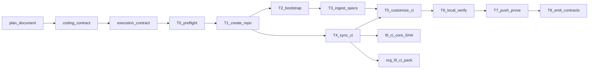

# Bootstrap Quantum-Animation-Studio from l9-repo-template

## Improve kernel status (plan artifact)

- Target: this plan file only (`qas_repo_bootstrap_6f681fed.plan.md`) — plan iteration, not bootstrap execution
- Mode: `full_improvement` on the plan; `inspect_only` for upstream GitHub (template / `.github` / Core)
- Passes applied: bind → discover defects → contract harden → remediate plan → entropy cut → converge
- Status: plan Converged for handoff to Build/execute; bootstrap runtime validation remains NotApplicable until execute

## Metadata (plan_document)

- `plan_id`: `plan.qas.bootstrap.v1`
- `name`: Bootstrap Quantum-Animation-Studio
- `schema_version`: `1.0.0` (canonical.schema.plan_document.v1)
- `status`: `executable` (after T0 preflight at execute start; else `preflight_blocked`)
- `is_project`: false
- `created_at`: `2026-08-12`
- `updated_at`: `2026-08-12` (Improve pass)

## Architect framing

- `planning_ssot`: [`canonical.schema.plan_document.v1`](WIP/Execution%20Schemas/environment/contracts/execution/schemas/canonical.schema.plan_document.v1.yaml)
- `plan_class`: `bounded_execution_contract`
- `redesign_allowed`: false
- `follow_on_schema_evolution_separate`: true
- Notes: Product architecture lives in the YAML pack; this plan only stands up the repo + CI chassis. Downstream execution uses [`canonical.schema.execution_contract.v1`](WIP/Execution%20Schemas/environment/contracts/execution/schemas/canonical.schema.execution_contract.v1.yaml) via a required `coding_contract` intermediate.

## Authority and artifact chain

On Build/execute, emit then run:

1. validated `plan_document` instance (machine form of this plan)
2. `coding_contract` `coding.qas.bootstrap.v1` (required — not skippable)
3. `execution_contract` `exec.qas.bootstrap.v1`
4. mutation-authorized `execution_packet[]` with authority ⊆ contract



## Defaults locked (no reopen at execute)

- Repo: **private** `Quantum-L9/Quantum-Animation-Studio` (absent today)
- Clone path: `/Users/ib-mac/Quantum-Animation-Studio` (sibling of Cursor-Governance; separate git root)
- Package: `quantum_animation_studio` via `make rename PKG=quantum_animation_studio`
- Spec path: `specs/quantum_animation_spec_pack_v3/` (33 YAML files)
- WIP source retained in Cursor-Governance (copy, never delete)
- Thin Python chassis retained (template `make verify` / inventory require it)
- No product implementation from specs (`SPECIFICATION_ONLY` / `FORBIDDEN_UNTIL_ACCEPTANCE`)
- Governance modes: **keep pack defaults** after sync (no day-0 soften); if first Analysis run fails on noise, stop_and_replan rather than silently weaken
- Customize CI **only after** the last `make sync-ci`; do not re-run sync-ci after T5 without re-applying consumer deltas
- Contract emission path: `.l9/execution/` in the new repo

## Immutable baseline (reverify at execution start)

- Source workspace: `/Users/ib-mac/Cursor-Governance` @ `fcbd5ed73f102b9f4f34e28858630b3a434f6085`
- Dirty: yes — untracked `WIP/` allowed; `overlap_policy`: `explicitly_allow_listed_paths` for `WIP/quantum_animation_spec_pack_v3/**` only
- Pack fingerprint (aggregate SHA256 of the 33 file content digests, sorted by filename): `125d897d0ff81e577787637350764ee44501ad6788bfa5b3749f3bba48cf860d`
- Recompute command:

```bash
find WIP/quantum_animation_spec_pack_v3 -name '*.yaml' -print0 \
  | sort -z | xargs -0 sha256sum | sha256sum
```

- Template pins at plan time: `ORG_GITHUB_SHA=0f7801b659e90b1fd86f900cdd2acceb09cdcfd9`, `L9_CI_CORE_PIN=f88116503430aa18992b70d8d31063e34ff97ef1`
- On drift: `stop_and_replan`
- Verification rule: `reverify_at_execution_start`

## Objective and property evidence matrix

**Mission:** Stand up a governed product repo that owns the Quantum Animation Studio v3 spec pack, inherits CI from `Quantum-L9/.github` → `l9-ci-core` at full SHA, and runs consumer-tuned checkers that validate the YAML pack plus thin Python chassis.

- `P_REPO_EXISTS` (repository_state, blocking) — private repo from template; proof: `gh repo view Quantum-L9/Quantum-Animation-Studio --json name,visibility,templateRepository`
- `P_PACK_PRESENT` (filesystem, blocking) — 33 YAMLs at spec path + fingerprint match; proof: count + recompute command equals baseline
- `P_CI_PACK` (structural, blocking) — 6 governance YAMLs + `l9-analysis.yml` + `l9-lint-test.yml`
- `P_CORE_PIN` (structural, blocking) — every `uses: Quantum-L9/l9-ci-core/...@` is 40-char SHA `f881165…`; zero `@main`/`@v1`
- `P_SYNC_CI` (runtime_behavior, blocking) — `make sync-ci` exit 0 and reports org SHA
- `P_LOCAL_VERIFY` (quality_gate, blocking) — `make verify` exit 0
- `P_SPEC_TEST` (quality_gate, blocking) — `pytest tests/test_spec_pack_yaml.py` requires `metadata.spec_id` on every YAML
- `P_GH_ACTIONS` (network_observation, blocking) — Analysis + Lint-Test runs observed; no Core pin/resolution failure
- `P_CUSTOMIZE` (structural, blocking) — lint-test `SOURCE_DIR=src`; analysis semgrep `--config p/python` only
- `P_CONTRACTS` (filesystem, blocking) — `.l9/execution/` plan + coding + execution contract instances present

## Capability preflight (T0 — fail → `preflight_blocked`)

- `gh auth status` shows usable auth with `Quantum-L9` create rights
- `gh repo view Quantum-L9/Quantum-Animation-Studio` returns **404** (dedupe). If exists → stop, do not recreate
- `gh repo view Quantum-L9/l9-repo-template --json isTemplate` → `true`
- `uv` + Python 3.12 available
- Network to `github.com`
- Org pack path is `l9-ci-pack/` + consumer `make sync-ci` — **not** `scripts/verify-pack.sh` (that validates the org `.github` repo itself)
- Baseline SHA + pack fingerprint reverified

## Execution envelope

- **Filesystem write allow:** `/Users/ib-mac/Quantum-Animation-Studio/**`; read Cursor-Governance `WIP/quantum_animation_spec_pack_v3/**`
- **Filesystem write deny:** Cursor-Governance protected roots; WIP delete; edits to `l9-ci-core` or org `.github` SSOT
- **Commands allow:** `gh repo create --template`, `git`, `make rename|sync-ci|verify|render-rules`, pytest/ruff/mypy via make, `gh workflow*` / `gh pr*` / `gh run*`, org scripts `bootstrap.sh`, `enable-secret-scanning.sh`, `sync-labels.sh`, `apply-rulesets.sh` targeted at the new repo
- **Commands deny:** force-push, hard-reset, admin-merge, Core `@main`/`@v1`, org `workflow-templates/*` v1 starters, deny-listed root dirs (`tools/`, `engine/`, …)
- **Network:** `bounded_external_write` → GitHub only
- **Secrets:** `read_only_named` via existing gh/AWS GitHub auth; redaction required
- **autonomous_merge:** false

## Gated write pipeline (T1 irreversible)

Ordered gates before repo create:

1. T0 preflight PASS
2. Explicit dedupe: target repo absent
3. Template `isTemplate=true`
4. Create once; record HTML URL + default branch in receipt `.l9/execution/receipts/T1_create_repo.json`
5. No blind retry of `gh repo create` if repo appears mid-flight

## Consumer CI customization (after final sync-ci only)

Evidence-backed facts used here:

- `scripts/sync_ci_from_pack.py` overwrites workflows/governance/CODEOWNERS/dependabot and writes `requirements-consumer-ci.txt`; it also patches lint-test to install that file
- `scripts/inventory_check.py` deny-list does **not** include `specs/` — adding `specs/` is safe; no inventory allowlist change required
- `make rename` text-replaces `l9_example_pkg` in `inventory_check.py` REQUIRED paths and renames `src/`

Modify these consumer knobs only in T5:

1. `.github/workflows/l9-lint-test.yml` `env:`
   - `SOURCE_DIR: "src"`
   - `TEST_DIR: "tests/"`
   - `COVERAGE_THRESHOLD: "0"`
   - `PYTHON_VERSION: "3.12"`
2. `.github/workflows/l9-analysis.yml` semgrep step: `--config p/python` only (drop JS/TS — no Node surface)
3. Identity via `make rename` + README / AGENTS / ARCHITECTURE pointing at `specs/quantum_animation_spec_pack_v3/` and `90_*` roadmap
4. `plugin-config.yaml` + `make render-rules` for studio/specs cartridge
5. Add `tests/test_spec_pack_yaml.py`: parse all 33 YAMLs; require `metadata.spec_id` (present across pack); write fingerprint receipt under `.l9/execution/receipts/pack_fingerprint.txt`
6. `.github/CODEOWNERS` — only after auto-seed PR handled (see T4)

**Do not:** restore v1 workflow-templates; pin Core floating refs; put `tools/` at root; copy org-inherited community health files; re-sync CI after T5 without re-applying deltas.

## Execution DAG (packets)

- `T0_preflight_dedupe` — depends: none — reverify baseline; gh/template probes; abort if repo exists
- `T1_create_repo` — depends: T0 — `gh repo create Quantum-L9/Quantum-Animation-Studio --template Quantum-L9/l9-repo-template --private --clone` into locked clone path
- `T2_bootstrap_identity` — depends: T1 — `make rename PKG=quantum_animation_studio`; docs; `make render-rules`
- `T3_ingest_specs` — depends: T2 — copy 33 YAMLs; add pytest YAML gate + fingerprint receipt
- `T4_sync_verify_ci` — depends: T1 — may run in parallel with T2/T3 — `make sync-ci`; assert pins; `gh pr list` for org auto-seed — if open, merge seed before T5 CODEOWNERS edit; run org `bootstrap.sh` messaging; enable secret scanning / sync labels when scripts apply to the new repo
- `T5_customize_ci` — depends: T3, T4 — apply consumer knobs; **no further sync-ci**
- `T6_local_verify` — depends: T5 — `make verify` PASS + pin/fingerprint proofs
- `T7_push_prove` — depends: T6 — commit, push bootstrap branch (or main if empty history policy allows), trigger/observe `L9 Analysis` + `L9 Lint and Test`
- `T8_emit_contracts` — depends: T7 — write `.l9/execution/` machine instances + packet receipts; may commit on same branch

Critical path: `T0 → T1 → (T2 → T3 parallel T4) → T5 → T6 → T7 → T8`

## Side effects and idempotency

- `T0` — side_effects: network_read — idempotency: safe_to_repeat — retry: bounded_retry — compensation: null — irreversible: false
- `T1` — side_effects: external_state_mutation, network_write — idempotency: unsafe_blind_repeat — retry: manual_only — compensation: human-approved archive/delete only — irreversible: true
- `T2` — side_effects: filesystem_mutation — idempotency: unsafe_blind_repeat after first rename (dir moves) — retry: manual_only — compensation: re-clone from template — irreversible: false
- `T3` — side_effects: filesystem_mutation — idempotency: safe_to_repeat — retry: bounded_retry — compensation: delete `specs/` tree — irreversible: false
- `T4` — side_effects: filesystem_mutation, network_read, network_write (seed PR merge) — idempotency: safe_with_dedupe — retry: bounded_retry — compensation: re-sync from pin; revert seed merge via new PR — irreversible: false
- `T5` — side_effects: filesystem_mutation — idempotency: safe_to_repeat — retry: bounded_retry — compensation: re-apply from this plan’s knob list — irreversible: false
- `T6` — side_effects: filesystem_read — idempotency: safe_to_repeat — retry: bounded_retry — compensation: null — irreversible: false
- `T7` — side_effects: network_write, external_state_mutation — idempotency: safe_with_dedupe — retry: bounded_retry — compensation: close PR / delete remote branch — irreversible: false
- `T8` — side_effects: filesystem_mutation, network_write if committed — idempotency: safe_to_repeat — retry: bounded_retry — compensation: delete `.l9/execution/` — irreversible: false

## Architecture impact

- All packets: bounded_context `quantum-animation-studio-bootstrap`; layer `ops` except T8 (`docs`/`control_plane` contracts) and T3 (`docs` specs)
- Owning contract: `exec.qas.bootstrap.v1`
- Prohibited on every packet: product implementation from specs; Core/org SSOT mutation; force-push; expanding authority

## Complexity and uncertainty

- complexity: medium
- uncertainty: medium (org auto-seed timing; Actions permissions)
- blast_radius: medium (new private org repo + CI runs)
- architectural_boundaries_crossed: 2 (Cursor-Governance WIP → new repo; org `.github` pack → consumer)
- external_systems_touched: 1 (GitHub)
- migration_required: false
- unknown_dependency_count: 1 (whether org `auto-seed-new-repo` fires for this create — handled by explicit T4 check)

## Rollback

- Code: revert commits / delete bootstrap branch; re-clone from template if rename mid-state is corrupt
- Local state: delete `/Users/ib-mac/Quantum-Animation-Studio` working tree
- External: repo create is not silently reversible — requires human-approved GitHub delete/archive
- Data: N/A (no DB)
- Constraint: never force-push compensation

## Stress and disconfirm

Disconfirming cases:

- Actions `allowed_actions` blocks `Quantum-L9/l9-ci-core` → P_GH_ACTIONS fails; fix permissions then re-run workflows
- `make sync-ci` after T5 wipes consumer semgrep/env → violate envelope; if happens, re-apply T5 deltas
- Rename run twice → fails because `src/l9_example_pkg` missing; treat as non-idempotent
- Auto-seed PR races CODEOWNERS edit → merge/close seed in T4 before T5
- Pack fingerprint changes between plan and execute → stop_and_replan

Assumed false ifs:

- Template remains `isTemplate=true`
- Core pin in `.l9/ci-pin` still matches workflows after sync
- Pack stays 33 YAML files with `metadata.spec_id`

Removed false risk (Improve): inventory rejecting `specs/` — deny-list has no `specs`; no allowlist edit needed.

## Out of scope

- Implementing Quantum Animation Studio product code from specs 00–30
- Promoting WIP Execution Schemas into live `skills/l9-plan`
- Changing `l9-ci-core` or org `.github` pack contents
- Deleting WIP pack from Cursor-Governance
- Merge authorization beyond green bootstrap PR checks (no autonomous merge)
- Node lint-test workflow
- Weakening governance rule-modes for day-0 convenience

## Follow-on milestone (separate plan)

- P0: coding/execution contracts for MVP acceptance (`16_*`) after spec acceptance
- P1: raise coverage threshold when product code is authorized
- P2: Graphiti group registration for `quantum-animation-studio`

## Execution-contract seed

```yaml
identity:
  execution_contract_id: exec.qas.bootstrap.v1
  coding_contract_ref: coding.qas.bootstrap.v1
  source_plan_ref: plan.qas.bootstrap.v1
  status: draft
authority:
  authority_source: plan.qas.bootstrap.v1
  authorized_scope:
    - create private Quantum-L9/Quantum-Animation-Studio from l9-repo-template
    - clone to /Users/ib-mac/Quantum-Animation-Studio
    - rename package quantum_animation_studio
    - ingest specs/quantum_animation_spec_pack_v3
    - sync and customize consumer CI knobs listed in this plan
    - push bootstrap branch and prove Actions inheritance
    - emit .l9/execution contract instances
  prohibited_scope:
    - product implementation from specs
    - mutate l9-ci-core or org .github SSOT
    - force-push / admin-merge / autonomous merge
    - re-run sync-ci after T5 without re-applying consumer deltas
  authority_may_be_expanded_by_packet: false
preconditions:
  capability_preflight: T0_preflight_dedupe
  dependency_topology: critical_path_T0_through_T8
mutation_authorization:
  authorization_refs:
    - mut.qas.bootstrap.repo_create.v1
    - mut.qas.bootstrap.filesystem.v1
    - mut.qas.bootstrap.github_push.v1
packet_partitioning:
  packet_schema: canonical.schema.execution_packet.v1
  packet_ids:
    - T0_preflight_dedupe
    - T1_create_repo
    - T2_bootstrap_identity
    - T3_ingest_specs
    - T4_sync_verify_ci
    - T5_customize_ci
    - T6_local_verify
    - T7_push_prove
    - T8_emit_contracts
  partition_rule: T0_T1_serial_then_T2T3_parallel_T4_then_join_at_T5
  shared_state_policy: single_working_tree_at_locked_clone_path
  parallelism_policy: no_parallel_git_writes_on_same_index
  packet_authority_must_be_subset: true
```

## Verification commands (execute phase)

```bash
# T0
gh auth status
gh repo view Quantum-L9/l9-repo-template --json isTemplate
gh repo view Quantum-L9/Quantum-Animation-Studio 2>&1 | rg '404|Not Found'  # must be absent

# T1–T6 (in /Users/ib-mac/Quantum-Animation-Studio)
gh repo create Quantum-L9/Quantum-Animation-Studio \
  --template Quantum-L9/l9-repo-template --private --clone
make rename PKG=quantum_animation_studio
# copy 33 YAMLs → specs/quantum_animation_spec_pack_v3/
make sync-ci
# T5 customize lint-test env + analysis semgrep; add tests/test_spec_pack_yaml.py
make verify
rg -n 'uses: Quantum-L9/l9-ci-core' .github/workflows/   # full SHA only
test "$(ls specs/quantum_animation_spec_pack_v3/*.yaml | wc -l)" -eq 33

# T7
gh workflow list
gh workflow run "L9 Analysis" --ref <bootstrap-ref>
gh run list --limit 10
```

Org scripts (from a clone of `Quantum-L9/.github`, applied to the new repo where applicable): `bootstrap.sh`, `enable-secret-scanning.sh`, `sync-labels.sh`, `apply-rulesets.sh`. Never use `verify-pack.sh` as a consumer gate.

## Handoff

On Build: run T0→T8 under mutation authorization in the new repo workspace. Emit machine contracts to `.l9/execution/`. Cursor-Governance is read-only source for the WIP pack. Do not claim bootstrap convergence until P_* blocking properties pass with observed evidence.

## Improve pass ledger (this iteration)

Pass 1 — bind: target = this plan; schemas = plan_document + execution_contract; upstream template/CI inspected readonly.

Pass 2 — issues found (verified):
- Schema gaps vs plan_document (metadata, framing, complexity, gated writes, per-todo side effects, contract refs)
- Mermaid omitted T6/T0/T8; packet count drifted from todos
- Soft optionality on governance soften (forbidden for executable plan)
- Clone path unlocked
- False stress case: inventory rejecting `specs/` (deny-list evidence contradicts)
- Missing pre-create dedupe gate and auto-seed race handling
- sync-ci overwrite order under-specified (customize-after-final-sync now locked)
- requirements-consumer-ci handled by sync-ci patch (document, do not “fix” wrongly)

Pass 3–5 — remediations applied in this file; entropy cut (removed false inventory risk; collapsed duplicate verify prose into property matrix).

Pass 6–7 — structural re-read of improved plan; no further high-severity plan defects; runtime bootstrap checks Unknown/NotApplicable until execute.

Convergence: **Converged** for plan handoff. Residual risks: org auto-seed timing; Actions permissions; baseline drift at execute start.
