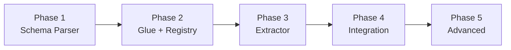

# QPF Implementation Strategy for L9

## Executive Summary

The QPF (Quantum Pipeline Factory) documentation describes a **schema-driven code generation system** that transforms YAML agent schemas into production code. L9 already has significant infrastructure in place. This plan bridges the gap between QPF's vision and L9's current state.

## Current State Analysis

### Already Implemented in L9

| Component | Location | Status |

|-----------|----------|--------|

| AIOSRuntime | `core/aios/runtime.py` | Working - OpenAI integration |

| AgentExecutorService | `core/agents/executor.py` | Working - full execution loop |

| Tool Registry | `core/tools/registry_adapter.py` | Basic - needs enhancement |

| Memory Substrate | `memory/substrate_service.py` | Working - packet persistence |

| Agent API Routes | `api/agent_routes.py` | Working - `/agent/execute` exists |

| Research Factory | `services/research/` | Working - LangGraph pipeline |

| API Server | `api/server.py` | Wired - v0.4.0 |

### QPF Components NOT Yet Implemented

| Component | Priority | Effort |

|-----------|----------|--------|

| Schema Parser + Validator | P0 | 4-6 hrs |

| Universal Extractor | P0 | 8-12 hrs |

| Glue Layer Resolver | P1 | 4-6 hrs |

| Agent Registry (real) | P1 | 4-6 hrs |

| Schema Versioning/Migration | P2 | 6-8 hrs |

| Dynamic Sub-Agent Factory | P3 | 8-10 hrs |

| TensorAIOS Core | P3 | 16-24 hrs |

---

## Phase 1: Core Schema Infrastructure (Week 1)

### Goal: Make YAML schemas parseable and extractable

### 1.1 Create Schema Parser

**New file:** [`services/qpf/schema_parser.py`](services/qpf/schema_parser.py)

Parses YAML schemas into validated Python objects:

- Validate all 12 required sections (system, integration, governance, memorytopology, etc.)
- Type-check against Pydantic models
- Return normalized AST for extraction

**Key classes:**

```python
class QPFSchema(BaseModel):
    system: SystemBlock
    integration: IntegrationBlock
    governance: GovernanceBlock
    memorytopology: MemoryTopologyBlock
    communicationstack: CommunicationStackBlock
    reasoningengine: ReasoningEngineBlock
    collaborationnetwork: CollaborationNetworkBlock
    learningsystem: LearningSystemBlock
    worldmodelintegration: WorldModelIntegrationBlock
    cursorinstructions: CursorInstructionsBlock
    deployment: DeploymentBlock
    metadata: MetadataBlock
```

### 1.2 Create Schema Validator

**New file:** [`services/qpf/schema_validator.py`](services/qpf/schema_validator.py)

Validates parsed schemas against QPF rules:

- All required keys present
- Version constraint >= 6.0.0
- File size <= 50KB
- No circular dependencies
- Valid import paths

### 1.3 Create Extraction Templates

**New directory:** [`services/qpf/templates/`](services/qpf/templates/)

Jinja2 templates for code generation:

- `controller.py.j2` - Agent controller template
- `__init__.py.j2` - Module init template
- `test_agent.py.j2` - Test suite template
- `README.md.j2` - Documentation template

---

## Phase 2: Glue Layer + Agent Registry (Week 2)

### Goal: Enable agent wiring and discovery

### 2.1 Implement Glue Layer Resolver

**New file:** [`services/qpf/glue_resolver.py`](services/qpf/glue_resolver.py)

Resolves inter-agent dependencies from glue YAML:

```python
class GlueResolver:
    def resolve_imports(self, agent_name: str) -> list[ImportSpec]:
        """Resolve what this agent imports from others"""

    def resolve_wirings(self, agent_name: str) -> list[WiringSpec]:
        """Resolve packet/API connections"""

    def get_dependency_order(self, agents: list[str]) -> list[str]:
        """Topological sort for extraction order"""
```

### 2.2 Implement Real Agent Registry

**Replace stub in:** [`api/server.py`](api/server.py)

**New file:** [`core/agents/registry.py`](core/agents/registry.py)

```python
class AgentRegistry:
    def __init__(self, config_dir: str = "config/agents"):
        """Load agent configs from YAML files"""

    def register_agent(self, config: AgentConfig) -> None:
        """Register an agent configuration"""

    def get_agent_config(self, agent_id: str) -> Optional[AgentConfig]:
        """Get config by ID"""

    def list_agents(self) -> list[str]:
        """List all registered agent IDs"""
```

### 2.3 Add Agent Config Directory

**New directory:** [`config/agents/`](config/agents/)

Store agent configurations as YAML:

- `l9-standard-v1.yaml` - Default L9 agent
- `research-agent-v1.yaml` - Research factory agent
- (extracted agents will be added here)

---

## Phase 3: Universal Extractor (Week 3)

### Goal: Generate code from schemas

### 3.1 Implement Universal Extractor

**New file:** [`services/qpf/extractor.py`](services/qpf/extractor.py)

Core extraction logic:

```python
class UniversalExtractor:
    async def extract(
        self,
        schema: QPFSchema,
        glue: GlueConfig,
        output_dir: str,
    ) -> ExtractionResult:
        """
        Extract code from schema:
        1. Parse schema into normalized AST
        2. Resolve dependencies via glue layer
        3. Apply extraction templates
        4. Generate code, tests, docs, manifest
        5. Validate outputs against quality gates
        """
```

### 3.2 Add Extraction API Endpoint

**New file:** [`api/routes/qpf.py`](api/routes/qpf.py)

```python
router = APIRouter(prefix="/qpf", tags=["qpf"])

@router.post("/extract")
async def extract_agent(request: ExtractRequest) -> ExtractResponse:
    """Extract agent from uploaded schema YAML"""

@router.post("/validate")
async def validate_schema(schema: UploadFile) -> ValidationResult:
    """Validate schema without extracting"""

@router.get("/templates")
async def list_templates() -> list[str]:
    """List available extraction templates"""
```

### 3.3 Add Extraction CLI

**New file:** [`scripts/qpf_extract.py`](scripts/qpf_extract.py)

CLI for local extraction:

```bash
python scripts/qpf_extract.py \
    --schema path/to/agent_schema.yaml \
    --glue path/to/glue.yaml \
    --output L9/agents/new_agent/
```

---

## Phase 4: Integration + Testing (Week 4)

### Goal: Wire everything together

### 4.1 Wire QPF Router to Server

**Update:** [`api/server.py`](api/server.py)

Add QPF router import and inclusion (similar to research_router pattern).

### 4.2 Create Integration Tests

**New file:** [`tests/services/qpf/test_extraction.py`](tests/services/qpf/test_extraction.py)

Test full extraction pipeline:

- Parse sample schema
- Validate against rules
- Extract to temp directory
- Verify generated files
- Run generated tests

### 4.3 Create Sample Schemas

**New directory:** [`docs/qpf/sample_schemas/`](docs/qpf/sample_schemas/)

Working example schemas for testing:

- `simple_agent.yaml` - Minimal agent
- `domain_adapter.yaml` - PlastOS-style adapter
- `orchestrator.yaml` - Main Agent style

---

## Phase 5: Advanced Features (Weeks 5-8)

### 5.1 Schema Versioning + Migration

**New file:** [`services/qpf/migrations.py`](services/qpf/migrations.py)

- Base migration class
- Migration registry
- Field renaming/addition/deprecation support
- Backward compatibility validation

### 5.2 Parallel Extraction

**Update:** [`services/qpf/extractor.py`](services/qpf/extractor.py)

Add DAG-based parallel extraction:

- Build dependency graph from glue layer
- Extract independent agents in parallel
- Cache unchanged schemas
- Track extraction metrics

### 5.3 Dynamic Sub-Agent Factory

**New file:** [`services/qpf/subagent_factory.py`](services/qpf/subagent_factory.py)

Runtime agent spawning:

- Spawn workers based on load
- Manage resource pools
- Graceful shutdown/restart
- Health monitoring

---

## Directory Structure After Implementation

```
L9/
├── services/
│   └── qpf/                          # NEW: QPF module
│       ├── __init__.py
│       ├── schema_parser.py          # Phase 1
│       ├── schema_validator.py       # Phase 1
│       ├── glue_resolver.py          # Phase 2
│       ├── extractor.py              # Phase 3
│       ├── migrations.py             # Phase 5
│       ├── subagent_factory.py       # Phase 5
│       └── templates/                # Phase 1
│           ├── controller.py.j2
│           ├── __init__.py.j2
│           ├── test_agent.py.j2
│           └── README.md.j2
├── api/
│   └── routes/
│       └── qpf.py                    # Phase 3: NEW route
├── core/
│   └── agents/
│       └── registry.py               # Phase 2: NEW (replaces stub)
├── config/
│   └── agents/                       # Phase 2: NEW directory
│       ├── l9-standard-v1.yaml
│       └── research-agent-v1.yaml
├── docs/
│   └── qpf/
│       └── sample_schemas/           # Phase 4
└── tests/
    └── services/
        └── qpf/                      # Phase 4
            └── test_extraction.py
```

---

## Implementation Order



---

## Estimated Total Effort

| Phase | Duration | Hours |

|-------|----------|-------|

| Phase 1 (Schema Infrastructure) | 3-4 days | 12-16 |

| Phase 2 (Glue + Registry) | 2-3 days | 8-12 |

| Phase 3 (Extractor) | 4-5 days | 16-20 |

| Phase 4 (Integration) | 2-3 days | 8-12 |

| Phase 5 (Advanced) | 1-2 weeks | 24-40 |

**Minimal Viable QPF (Phases 1-4):** ~2 weeks, 44-60 hours

**Full QPF with Advanced Features:** ~4-6 weeks, 68-100 hours

---

## Critical Dependencies

1. **OpenAI API Key** - Required for AIOSRuntime (already handled)
2. **PostgreSQL** - Required for Memory Substrate (already configured)
3. **Jinja2** - Required for template rendering (add to requirements.txt)
4. **PyYAML** - Required for schema parsing (already present)

---

## Questions for Clarification

Before proceeding, please confirm:

1. **Phase priority** - Should I start with Phase 1 immediately, or do you want to adjust the order?
2. **Template style** - Should extracted agents follow the existing `core/agents/executor.py` patterns, or adopt the more elaborate QPF schema structure?
3. **TensorAIOS** - Is implementing the full TensorAIOS neural layer (16-24 hrs) a priority, or should that be deferred to a later sprint?
