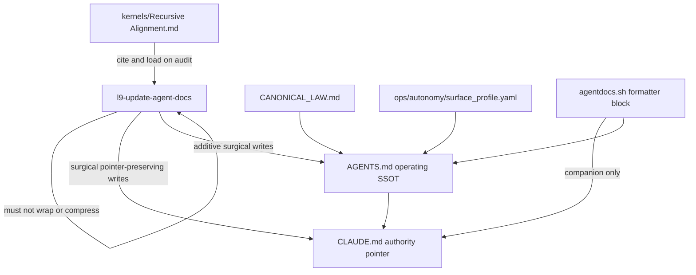

# Port Recursive Alignment to root docs (pointer, no kernel wrap)

> **plan_id:** `plan.root-docs.recursive-alignment-pointer.v1`
> **schema:** `canonical.schema.plan_document.v1` · **depth:** deep (additive-only root files + skill write-contract)
> **status:** draft until execute emits validated `PLAN_DOCUMENT` JSON
> **Execute:** `@environment/program-execution` → Program Lock → Controller; `@autonomy` subordinate. Do not free-form mutate from this markdown.

Port the **concept** in [`kernels/Recursive Alignment.md`](kernels/Recursive%20Alignment.md) onto the root-docs surface **without** wrapping that kernel into [`skills/l9-update-agent-docs/SKILL.md`](skills/l9-update-agent-docs/SKILL.md) (no compressed Kernel bind, no `references/` kernel dump). CLAUDE.md already shows the pattern: a load pointer, not a doctrine copy.

## Architect framing

Recursive Alignment’s reusable law for this target is ownership + source-of-truth, not the 10-pass YAML auditor:

- one owning layer per responsibility
- no competing SSOT
- do not invent architecture rules or missing files
- generated artifacts are companions
- load the kernel by path when auditing; do not embed it

The anti-pattern to refuse is [`skills/l9-pr-remediation/SKILL.md`](skills/l9-pr-remediation/SKILL.md) “Kernel bind (compressed)” (distill the kernel so the skill never opens it). The skill-compiler allows `compressed kernels` under `references/`; this plan **forbids** that for root docs. Precedent: [`docs/plans/pe_kernel_bind_564db18b.plan.md`](docs/plans/pe_kernel_bind_564db18b.plan.md) — harvest named steps, cite the kernel, no YAML dump.



## Immutable baseline

- Repository: Quantum-L9/Cursor-Governance
- Lock: `origin/main` = `577c482cac657403fb6fb66f7f7d89e2ad6994e1`
- KERNEL / skill / root-doc landing: **new wired worktree** from that SHA (`feat/root-docs-ra-pointer`). Do not mutate the dirty primary (uncommitted CLAUDE.md formatter block, `test_pe_trace.py`, `docs/plans/claude_session_parity_814a3230.plan.md`).
- On SHA drift: stop and replan

## Objective

Root agent docs stay a **pointer stack**, and the root-docs skill **maintains that stack** using Recursive Alignment concepts as named write rules, while the kernel file remains the only full auditor.

Falsifiable success:

- `CLAUDE.md` still opens as an authority pointer and does not grow Always/Never or CI tables
- `AGENTS.md` gains an **additive** root-doc authority map (no fold, no `ALLOW-ROOT-DELETION` unless a later finding proves a fold is necessary)
- `l9-update-agent-docs` cites `kernels/Recursive Alignment.md` by path, has no compressed Kernel bind and no copied kernel YAML, and no longer targets non-existent `ARCHITECTURE.md` / `INVARIANTS.md`
- `make pr-check` PASS in the isolated worktree

## What to port (named steps, not kernel text)

Harvest these RA domains only:

1. **Target bind** — inventory live root files from [`ops/config/root-file-protection.json`](ops/config/root-file-protection.json). Do not invent `ARCHITECTURE.md` / `INVARIANTS.md` (they are absent at repo root).
2. **Authority map** — `CANONICAL_LAW.md` > `ops/autonomy/surface_profile.yaml` > `AGENTS.md` > `skills/l9-*`. Skills do not author doctrine.
3. **One owner** — `CLAUDE.md` = load pointer; `AGENTS.md` = operating-instruction SSOT; `README.md` = index that points at both; generated formatter block = companion from [`ops/scripts/adapters/agentdocs.sh`](ops/scripts/adapters/agentdocs.sh).
4. **No competing SSOT** — the skill must not dump CI / pre-commit / skill-registry tables that already live in AGENTS.md §§4–6 and generated registries.
5. **Evidence + Unknown** — every metric from repo files; label unverified counts `Unknown`.
6. **Audit-only default** — inspect before write; modify only the files this plan authorizes.

## Capability preflight

- `git rev-parse origin/main` equals `577c482cac657403fb6fb66f7f7d89e2ad6994e1` at execute start
- `test -f kernels/Recursive\ Alignment.md`
- `test -f skills/l9-update-agent-docs/SKILL.md`
- Worktree via `ops/scripts/agent_worktree_start.sh` / `worktree_add_wired.sh` (not the dirty primary)

## Execution envelope

- **fs write:** `skills/l9-update-agent-docs/SKILL.md` (and a thin `references/root-docs-write-contract.md` **only** if SKILL.md would otherwise become a dump — that file is a write contract, not a kernel wrap); `AGENTS.md` append-only; optional one-line `README.md` pointer if the index still claims invented root files; generated skill-registry / llm-rules companions if the skill description changes
- **fs forbid:** `CANONICAL_LAW.md`, `kernels/Recursive Alignment.md`, `skills/l9-pr-remediation/**`, `skills/l9-recursive-optimization/**`, `pyproject.toml`, `.github/workflows/**`, folding `AGENTS.md`
- **commands:** read-only git; `make pr-check`; no push/merge from plan execute without L4
- **network:** none required
- **secrets:** none
- **autonomous_merge:** false

## Side effects

- `t1-audit`: read-only inventory; no writes
- `t2-skill`: changes when agents next refresh root docs (stops CLAUDE.md doctrine dump)
- `t3-agents-append`: AGENTS.md grows; additive-only gate must stay green without `ALLOW-ROOT-DELETION`
- `t4-registry`: generated companions only if skill frontmatter/description changes (`l9-wire-skill-into-repo`)
- `t5-pr-check`: quality receipt only

Idempotent: re-running the append is a no-op if the authority-map marker already exists; skill rewrite is content-identical on a second pass.

## Architecture impact

- Ownership: root-docs skill becomes a **pointer maintainer**, not a second doctrine author
- Cursor-primary: skill + AGENTS.md live in this repo; no adapter-owned copy
- Generated formatter blocks remain owned by `environment/ide/policy.json` via `agentdocs.sh`

## Rollback

Revert the feature-branch commits in the worktree. AGENTS.md append reverses with a new additive correction or an authorized `ALLOW-ROOT-DELETION` only if the append itself is proven wrong. Do not rewrite `CANONICAL_LAW.md` to undo.

## Execution DAG

1. **t0-isolate** — wired worktree from `origin/main` @ `577c482`; lock SHA
2. **t1-audit** — read the kernel (do not copy); bind live root files + current skill write targets; record violations (invented ARCHITECTURE/INVARIANTS; CLAUDE.md Always/Never rewrite; CI-table dump vs AGENTS.md §§4–6)
3. **t2-skill** — replace `l9-update-agent-docs` write contract with the named RA steps; cite kernel path; forbid Kernel bind / YAML dump; drop invented files; CLAUDE.md stays pointer-shaped
4. **t3-agents-append** — append root-doc authority map to `AGENTS.md` (additive). Do not fold the 20 operating sections
5. **t4-companions** — if skill description/triggers change, run `l9-wire-skill-into-repo` for registry / llm-rules only
6. **t5-prove** — fixture or grep: skill contains no kernel body and no `Kernel bind (compressed)`; CLAUDE.md still starts as authority pointer; `make pr-check` PASS
7. **t6-plan-json** — emit `docs/plans/root_docs_ra_pointer.plan.json`, `validate_plan_document.py` PASS, PE projection retained

Critical path: `t0 → t1 → t2 → t3 → t4 → t5 → t6`

## Property evidence

- SP-01 pointer: `CLAUDE.md` first heading remains “authority pointer”; skill Step 7 no longer lists Always/Never or CI tables for CLAUDE.md
- SP-02 no-wrap: `rg -n "Kernel bind|artifact_type: .ai_coding_alignment_kernel" skills/l9-update-agent-docs` is empty
- SP-03 live-targets: skill inventory matches `root-file-protection.json` root docs that exist (`AGENTS.md`, `CLAUDE.md`, `README.md`); no `ARCHITECTURE.md` / `INVARIANTS.md` write targets
- SP-04 additive: `validate_root_file_protection.py` / `make pr-check` PASS without `ALLOW-ROOT-DELETION: AGENTS.md`
- SP-05 quality: `make pr-check` PASS in the worktree

## Stress and disconfirm

- If agents stop following AGENTS.md because the append is treated as a fold instruction — false; the append must say “do not fold”
- If a future `/update-agent-docs` run re-dumps CI tables into CLAUDE.md — t2 failed; the write contract must name the forbidden sections
- If execute copies kernel YAML into `references/` because the compiler allows compressed kernels — violates user constraint; refuse
- If AGENTS.md append duplicates CANONICAL_LAW — RA violation; keep the append to a short authority map + pointer to the kernel path
- Assumed false if: `577c482` is no longer `origin/main`; user later authorizes an AGENTS.md fold; `l9-update-agent-docs` is retired rather than revised

Blast radius: every Claude/Cursor session that loads CLAUDE.md or AGENTS.md; every later root-doc refresh.

## Out of scope

- Wrapping or compressing the kernel into any skill (`l9-update-agent-docs`, `l9-recursive-optimization`, `l9-pr-remediation`)
- Editing `kernels/Recursive Alignment.md` or `CANONICAL_LAW.md`
- Folding AGENTS.md into a thin pointer (would strip operating instructions and need `ALLOW-ROOT-DELETION`)
- Creating root `ARCHITECTURE.md` / `INVARIANTS.md`
- Claude SessionStart parity plan, PE trace test, or the dirty formatter-block edit on the primary checkout
- Merge, raw push, workflow edits

## Doc / Root Surface Impact

- `AGENTS.md` — **in scope**, additive-only authority map
- `CLAUDE.md` — **preserve** pointer shape; skill must not enlarge it
- `README.md` — touch only if it still names invented root files
- `CANONICAL_LAW.md` — **out**; it is the constitution the map points at
- `skills/l9-update-agent-docs/SKILL.md` — **in scope** (the root-docs skill)

## Complexity and uncertainty

- UNK-001: whether a one-page `references/root-docs-write-contract.md` is needed vs keeping all rules in SKILL.md — resolve at t2; prefer SKILL.md-only if it stays short
- UNK-002: generated `ops/generated/skill-registry.json` + llm-rules sync path after description change — resolve at t4 from `l9-wire-skill-into-repo`
- Not unknown: invented ARCHITECTURE/INVARIANTS targets (confirmed absent); CLAUDE.md pointer already on HEAD; AGENTS.md is `additive_only`

## Convergence

`status: partial` until t0 re-locks SHA and t6 validator PASS. `execute_via`: PE + autonomy. Next skill after plan lock: `l9-ynp` (recommend `/autonomy` + PE, not `/gmp` unless a KERNEL GMP is later required for a law edit — it is not).

## Execute via @environment/program-execution + autonomy

```text
this .plan.md
  → @environment/program-execution  (Blueprint → Program Lock → Controller)
  → @autonomy (/autonomy → l9-bounded-autonomy)  [subordinate]
  → PE adapter (cursor-foreground default)
```

Live run: `make -C "$HOME/.cursor-governance" campaign INTENT=` this file. `autonomous_merge: false`. After local finish: `kernels/Recursive Alignment.md` then `kernels/Validate & Repair.md`, `l4_local.py` record-kernels → authorize-release, then `PR_REMEDIATE=0 make pr`. Do not merge from this plan.
