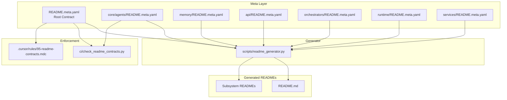

# README-as-Contract: Deterministic, Enforceable, Unavoidable

## Architecture




## Phase Structure

| GMP | Focus | Files Created | Tier |

|-----|-------|---------------|------|

| GMP-24 | Foundation + Generator | meta schema, generator script, root meta | KERNEL |

| GMP-25 | Core Module Contracts | 6 subsystem meta.yaml files | RUNTIME |

| GMP-26 | CI Enforcement Gate | ci/check_readme_contracts.py | INFRA |

| GMP-27 | Cursor Integration | .cursor/rules/95-readme-contracts.mdc | KERNEL |

| GMP-28 | Generate All READMEs | Run generator, validate output | RUNTIME |---

## GMP-24: Foundation + Generator (KERNEL_TIER)

### Files to Create

1. **[core/schemas/readme_contract.py](core/schemas/readme_contract.py)** - Pydantic models for README.meta.yaml validation
2. **[scripts/readme_generator.py](scripts/readme_generator.py)** - Generate README.md from meta.yaml
3. **[README.meta.yaml](README.meta.yaml)** - Root repository contract

### TODO Plan

| ID | Action | File | Description |

|----|--------|------|-------------|

| T1 | Create | `core/schemas/readme_contract.py` | Pydantic models: `ReadmeContract`, `Scope`, `Invariant`, `AIRules`, `APISpec` |

| T2 | Create | `scripts/readme_generator.py` | Jinja2-based generator that reads meta.yaml, outputs README.md |

| T3 | Create | `scripts/templates/readme_root.md.j2` | Jinja2 template for root README |

| T4 | Create | `scripts/templates/readme_subsystem.md.j2` | Jinja2 template for subsystem READMEs |

| T5 | Create | `README.meta.yaml` | Root contract defining L9 scope, architecture, AI rules |

### Key Schema (T1)

```python
# core/schemas/readme_contract.py
class AIRules(BaseModel):
    allowed: list[str]        # Paths AI may edit
    restricted: list[str]     # Paths requiring human review
    forbidden: list[str]      # Paths AI must not touch
    pre_reading: list[str]    # Files AI must read before editing

class Invariant(BaseModel):
    id: str                   # e.g., "INV-001"
    rule: str                 # e.g., "All packets have UUID v4 IDs"
    enforcement: str          # "runtime" | "ci" | "manual"

class ReadmeContract(BaseModel):
    location: str             # Path to module
    type: Literal["root", "subsystem", "component"]
    project: ProjectMeta      # name, goals, non_goals
    scope: ScopeDef           # responsibilities, boundaries
    architecture: ArchDef     # components, flows
    invariants: list[Invariant]
    ai_rules: AIRules
    testing: TestingReqs
```

---

## GMP-25: Core Module Contracts (RUNTIME_TIER)

### Files to Create

| Module | Meta File |

|--------|-----------|

| core/agents/ | `core/agents/README.meta.yaml` |

| memory/ | `memory/README.meta.yaml` |

| api/ | `api/README.meta.yaml` |

| orchestrators/ | `orchestrators/README.meta.yaml` |

| runtime/ | `runtime/README.meta.yaml` |

| services/ | `services/README.meta.yaml` |

### TODO Plan

| ID | Action | File | Key Sections |

|----|--------|------|--------------|

| T1 | Create | `core/agents/README.meta.yaml` | Agent execution, registry, schemas scope |

| T2 | Create | `memory/README.meta.yaml` | Substrate, PacketEnvelope, retrieval scope |

| T3 | Create | `api/README.meta.yaml` | Routes, adapters, webhooks scope |

| T4 | Create | `orchestrators/README.meta.yaml` | 7 orchestrators, interfaces scope |

| T5 | Create | `runtime/README.meta.yaml` | Task queue, WS orchestrator, kernel loader scope |

| T6 | Create | `services/README.meta.yaml` | Research, symbolic computation scope |

### Example Meta (T1 - core/agents)

```yaml
location: "core/agents/"
type: subsystem

subsystem:
  name: "Agent Execution Core"
  purpose: "Execute agent tasks via kernel-aware registry and executor service"
  
scope:
  responsibilities:
        - "Agent registration and lifecycle"
        - "Kernel loading and prompt building"
        - "Tool dispatch coordination"
  boundaries:
        - "Does NOT handle HTTP routing (see api/)"
        - "Does NOT persist to DB directly (see memory/)"
  dependencies:
    inbound: ["api/routes/", "orchestrators/"]
    outbound: ["memory/", "runtime/kernel_loader.py"]

invariants:
    - id: "INV-AGENT-001"
    rule: "AgentTask.agent_id must reference registered agent"
    enforcement: "runtime"
    - id: "INV-AGENT-002"
    rule: "All tool calls emit PacketEnvelope to memory"
    enforcement: "ci"

ai_rules:
  allowed:
        - "core/agents/adaptive_prompting.py"
        - "core/agents/agent_instance.py"
  restricted:
        - "core/agents/executor.py"  # Requires GMP
        - "core/agents/schemas.py"   # Breaking changes need review
  forbidden:
        - "core/agents/kernel_registry.py"  # Protected core
  pre_reading:
        - "README.meta.yaml"
        - "core/schemas/tasks.py"
```

---

## GMP-26: CI Enforcement Gate (INFRA_TIER)

### Files to Create

1. **[ci/check_readme_contracts.py](ci/check_readme_contracts.py)** - Validate all README contracts

### TODO Plan

| ID | Action | Description |

|----|--------|-------------|

| T1 | Create | `ci/check_readme_contracts.py` - Main validation script |

| T2 | Update | `ci/run_ci_gates.sh` - Add Gate 8: README contracts |

| T3 | Create | `tests/ci/test_readme_contracts.py` - Unit tests for validator |

### CI Gate Logic (T1)

```python
# ci/check_readme_contracts.py
"""
Gate 8: README Contract Validation

Checks:
1. Every module in REQUIRED_MODULES has README.meta.yaml
2. Each meta.yaml passes schema validation
3. If README.md exists, it was generated from meta.yaml (hash check)
4. AI rules don't conflict with protected-core.mdc
5. Invariants have valid enforcement types
"""

REQUIRED_MODULES = [
    "",                    # Root
    "core/agents/",
    "memory/",
    "api/",
    "orchestrators/",
    "runtime/",
    "services/",
]
```

---

## GMP-27: Cursor Integration (KERNEL_TIER)

### Files to Create

1. **[.cursor/rules/95-readme-contracts.mdc](/.cursor/rules/95-readme-contracts.mdc)** - Cursor rule referencing contracts

### TODO Plan

| ID | Action | Description |

|----|--------|-------------|

| T1 | Create | `.cursor/rules/95-readme-contracts.mdc` |

| T2 | Update | `.cursor/rules/90-protected-core.mdc` - Reference contract system |

### Cursor Rule Content (T1)

```markdown
# README Contract Enforcement

## Before Editing Any Module

1. Read the module's `README.meta.yaml`
2. Check `ai_rules.allowed` - you may edit these files
3. Check `ai_rules.restricted` - these require GMP
4. Check `ai_rules.forbidden` - DO NOT EDIT

## Invariant Preservation

All invariants in `README.meta.yaml` must be preserved.
If a change would violate an invariant, STOP and escalate.

## Pre-Reading Requirements

Before editing files in a module, read all files listed in:
- `ai_rules.pre_reading`
- The module's `README.md` (generated from contract)
```

---

## GMP-28: Generate All READMEs (RUNTIME_TIER)

### TODO Plan

| ID | Action | Description |

|----|--------|-------------|

| T1 | Run | `python scripts/readme_generator.py --all` |

| T2 | Validate | All generated READMEs match gold-standard structure |

| T3 | Update | `README.md` (root) from contract |

| T4 | Create | All 6 subsystem READMEs |

| T5 | Test | Run CI gate, verify 0 violations |---

## Summary

| Deliverable | Count | Purpose |

|-------------|-------|---------|

| Pydantic schema | 1 file | Validate meta.yaml structure |

| Generator script | 1 file | meta.yaml to README.md |

| Jinja2 templates | 2 files | Root + subsystem formats |

| Meta contracts | 7 files | Root + 6 subsystems |

| CI gate | 1 file | Block PRs without contracts |

| Cursor rule | 1 file | Enforce in editor |

| Generated READMEs | 7 files | Final documentation |**Total: 5 GMPs, 20+ files, deterministic enforcement**---

## Execution Order

```javascript
GMP-24 (Foundation) → BLOCKS → GMP-25 (Contracts)
                    → BLOCKS → GMP-26 (CI Gate)
                    
GMP-25 (Contracts) → BLOCKS → GMP-28 (Generate)

GMP-26 (CI Gate) ──────────→ Independent
GMP-27 (Cursor) ───────────→ Independent (after GMP-24)
```