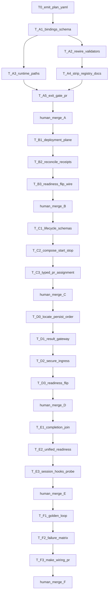

# Six-PR Closed-Loop Runtime Train — Plan Document (Improved)

## Improve kernel application (inspect → harden plan)

**Mode:** `inspect_only` on program code; **patch** on this plan artifact only.
**Target bound:** [`/Users/ib-mac/.cursor/plans/six_pr_runtime_train_c6b19e0a.plan.md`](/Users/ib-mac/.cursor/plans/six_pr_runtime_train_c6b19e0a.plan.md)
**Authority:** train brief [`WIP/6 Pr Train - CG.md`](WIP/6%20Pr%20Train%20-%20CG.md) > WIP schema [`WIP/canonical.schema.plan_document.v1.yaml`](WIP/canonical.schema.plan_document.v1.yaml) > repo ground truth > prior plan draft.

### Verified issues fixed in this plan revision

| ID | Severity | Defect in prior plan | Root-cause fix |
|---|---|---|---|
| I1 | high | Ambiguous A migration (“remove **or** stop reading” `execution:`) → dual-topology risk | **Locked:** strip `execution:` from `agent_registry.yaml` in Patch A; single reader = `PEER_RUNTIME_BINDINGS.yaml` |
| I2 | high | Consumer inventory incomplete (only validator/probe named) | Expand Patch A envelope to all live readers/docs/tests |
| I3 | high | Field rename unstated (`enabled` today vs train `required`) | **Locked:** bindings use `execution.required`; remap E1/E2 accordingly |
| I4 | medium | `isProject: false` contradicted `is_project: true` | Frontmatter `isProject: true` |
| I5 | medium | B–F collapsed as `T-B*` shells — not GMP-lockable | Expand atomic todos + per-patch exit gates |
| I6 | medium | Baseline branch is `feat/retire-memory-bank`, not train branch | Execution starts by cutting `feat/peer-runtime-bindings` from re-verified SHA |
| I7 | medium | `gated_write_pipeline` / architecture_impact under-specified for schema | Add both sections |
| I8 | low | Entropy: repeated undecided language; weak negative evidence | Concrete expected_negative + activation-law regression notes |

### Recursive passes (plan artifact)

1. **target_binding** — plan file + train + schema + live agent topology readers
2. **issue_discovery** — I1–I8 above
3. **contract_hardening** — locked migration, field names, consumer list, activation law
4. **entropy** — removed “or” forks; sharpened Patch A exit commands
5. **verification** — structural completeness vs WIP required_sections (see Convergence)

**Convergence (plan doc):** Converged for planning handoff. Not claim of runtime validation. Code validation remains `Unknown` until PF0/GMP.

---

## Planning SSOT and schema

- **Source program:** [WIP/6 Pr Train - CG.md](WIP/6%20Pr%20Train%20-%20CG.md)
- **Instance schema:** [WIP/canonical.schema.plan_document.v1.yaml](WIP/canonical.schema.plan_document.v1.yaml) (`canonical.schema.plan_document.v1` / `1.0.0`)
- **Skill pack:** `l9-plan` doctrine/stress gates; **authoritative instance shape is the WIP schema**, not `skills/l9-plan/schemas/plan-document.schema.json` (dual-gate promotion = follow-on)
- **Depth:** `deep`
- **Delivery shape:** program plan (`is_project: true`); only Patch A becomes `execution_ready` after PF0; B–F open only after prior human merge

### metadata (instance)

- `plan_id`: `plan.closed_loop_runtime_six_pr.v1`
- `name`: Cursor-Governance Closed-Loop Runtime Six-PR Train
- `status`: `draft` → `executable` after T0 + PF0
- `owner`: governance-control-plane
- `created_at`: 2026-08-12

### architect_framing

| Field | Value |
|---|---|
| `planning_ssot` | `WIP/6 Pr Train - CG.md` |
| `plan_class` | `integration_plan` |
| `redesign_allowed` | `false` |
| `follow_on_schema_evolution_separate` | `true` |
| `framing_notes` | Ownership matrix in train is binding; no second scheduler; no PE state-machine redesign |

---

## Ground truth (locked)

Baseline planning SHA: `49549d99781d4b7f2fd954cb23a63b38d7ad1764` on `feat/retire-memory-bank` (dirty: `WIP/**`, selected `reports/**`). **Reverify at execution start.**

**Exists**

- `agent_registry.yaml` owns identity **and** `execution.enabled` + bindings (conflict with train)
- `validate_executable_peers.py` (E1–E15), `probe_executable_peers.py`, `test_executable_peers.py`
- Docs: `PEER_EXECUTION.md`, `adapters/ADAPTER_CONTRACT.md`
- Cursor roles + `result_bridge.py`; generated-data processor (no `ingress/`)
- `subagentStart` → Graphiti only; **no** `subagentStop`
- Handoff already `.l9/pr/pr-remediation-handoff.json`
- Make: `agents-env`, `peer-execution-*`, `program-execution-*`

**Missing**

- `PEER_RUNTIME_BINDINGS.yaml`, bindings schema, `runtime_paths.py`, `deployment/`, `results/`, `generated-data/ingress/`, lifecycle receipts, closed-loop integration tests, readiness flips beyond today’s topology

### Live topology consumers (Patch A must update in one PR)

| Path | Role |
|---|---|
| [`environment/agents/agent_registry.yaml`](environment/agents/agent_registry.yaml) | Strip `execution:` blocks + header comments |
| [`environment/agents/tools/validate_executable_peers.py`](environment/agents/tools/validate_executable_peers.py) | Load bindings; remap E-rules |
| [`environment/agents/tools/test_executable_peers.py`](environment/agents/tools/test_executable_peers.py) | Fixtures use bindings model |
| [`environment/program-execution/scripts/probe_executable_peers.py`](environment/program-execution/scripts/probe_executable_peers.py) | `execution.required: true` peers only |
| [`environment/agents/PEER_EXECUTION.md`](environment/agents/PEER_EXECUTION.md) | Authority diagram → bindings plane |
| [`environment/agents/adapters/ADAPTER_CONTRACT.md`](environment/agents/adapters/ADAPTER_CONTRACT.md) | Replace `execution.enabled` assertions |

No dual-read compatibility shim. Temporary dual authority is an explicit plan failure (stress case).

---

## Locked design decisions (no optionality)

1. **Topology SSOT after A:** `PEER_RUNTIME_BINDINGS.yaml` only.
2. **Registry:** identity/memory/surfaces only — `execution:` removed in A.
3. **Flag name:** `execution.required` (train shape), not `enabled`.
4. **Readiness defaults in A:** deployment/results/data `readiness_required: false` / `capture_readiness_required: false`.
5. **Paths:** `runtime_paths.py` canonical + discover-legacy; **no DB move in A**.
6. **Branch for A:** `feat/peer-runtime-bindings` (cut at execution after baseline reverify).
7. **Publication:** each patch ends with real `make pr`; human merge only; tests mock `gh`/push.
8. **Claude result readiness:** remains false until a separate follow-on wires Claude → Result Gateway.

---

## Immutable baseline

- `repository`: `Quantum-L9/Cursor-Governance`
- `workspace`: `/Users/ib-mac/Cursor-Governance`
- `commit_sha`: `49549d99781d4b7f2fd954cb23a63b38d7ad1764` (reverify; drift → `stop_and_replan`)
- `dirty`: `true`
- `overlap_policy`: `explicitly_allow_listed_paths`
- `allowed_local_dirt`: `WIP/**`, `reports/GMP-Report-001-*.md`
- `artifact_hashes` (sha256):
  - train: `cfd0f7226c3f206e79c47bc7bb18f2be20f559e7425c6adb7d33fb61be23ba56`
  - schema: `fab85677985d48ba20a383692808fab5819e2adfc9f62534123eda18aff21986`
  - `agent_registry.yaml`: `3750cd0666e0edc2cb18c3e9e40c9b294349c87849a50a05ee6259014922e858`
  - `validate_executable_peers.py`: `e4b8f411a03eb493babd16583a9bf833c17493b5f5fcc03bcddf095e6fcccd05`
  - `probe_executable_peers.py`: `87c7712fad9ba798b4c5794534a0bbf06487a9e3d40fd4fc75c6b8b972b544f9`
- `verification_rule`: `reverify_at_execution_start`
- `on_drift`: `stop_and_replan`

---

## Objective

**Mission:** Land the closed-loop agent runtime as six independently valid PRs (A→F) that preserve authority boundaries, activate readiness only when satisfiers exist, and substitute receipts for conversational claims.

### success_properties

| id | property | evidence_type | proof |
|---|---|---|---|
| SP-TOPOLOGY | Every active registry agent has one peer entry; Cursor/Claude PE FKs resolve; Codex/Gemini/Manus non-executable | structural | bindings schema + rewritten peer validator |
| SP-SINGLE-TOPOLOGY | Zero readers of `agent_registry.*.execution` remain in governed paths | structural | ripgrep gate in A tests + docs update |
| SP-ACTIVATION-LAW | Readiness flips only in the PR that implements the satisfier | repository_state | binding diffs per PR |
| SP-NO-VACUOUS-PEER | Peer validate fails closed without bindings | quality_gate | negative fixture |
| SP-RECEIPT-AUTHORITY | No completion without typed dispatch/return/acceptance/ingress chain (C+) | proof_receipt | C–F fixtures; F golden |
| SP-SECURITY-ORDER | No ordinary durable persist before security gate | runtime_behavior | D security fixtures |
| SP-MAKE-PR | Each patch uses `make pr`; no autonomous merge | quality_gate | open_pr script + human merge |

---

## Capability preflight (`PF0-runtime-train`, blocking)

| id | probe | pass_condition | evidence_type |
|---|---|---|---|
| PF-git | SHA + dirty overlap | match/replan; dirt ⊆ allowlist | command_receipt |
| PF-consumers | `rg` for `agent_registry` execution readers | inventory ⊆ Patch A write_allow | structural |
| PF-agents-env | `make agents-env` | exit 0 | command_receipt |
| PF-peer-validate | `make peer-execution-validate` | exit 0 on **current** topology | command_receipt |
| PF-pe | `make program-execution-core-validate && make program-execution-conformance` | exit 0 | command_receipt |
| PF-pr-check | `make pr-check` | exit 0 (no commit/push) | command_receipt |
| PF-hooks | hooks template has `subagentStart`; no `subagentStop` yet | structural PASS | filesystem |

`failed_probe_status: blocked` → `preflight_blocked`.

---

## Execution envelope

### Patch A (active when executable)

- **write_allow:**
  `environment/agents/PEER_RUNTIME_BINDINGS.yaml`
  `environment/agents/schemas/peer-runtime-bindings.schema.json`
  `environment/agents/runtime_paths.py`
  `environment/agents/runtime_paths_test.py` (or `tests/` sibling)
  `environment/agents/tools/validate_executable_peers.py`
  `environment/agents/tools/test_executable_peers.py`
  `environment/program-execution/scripts/probe_executable_peers.py`
  `environment/agents/agent_registry.yaml` (strip `execution:` only)
  `environment/agents/PEER_EXECUTION.md`
  `environment/agents/adapters/ADAPTER_CONTRACT.md`
  `Makefile` (`agents-runtime-bindings-validate`; wire into `peer-execution-conformance` as needed)
  any new Patch A unit test files under `environment/agents/**/tests/`
- **write_deny:** `CANONICAL_LAW.md`, Dropbox/resolvers, `_archived/**`, `session_start_bootstrap.sh` (E only), fake non-Cursor renderers, DB relocation, expanding registry with new topology fields, dual-read shims
- **commands allow:** listed make/test/validate targets; `make pr` / `make pr-check`
- **commands deny:** force-push, merge, hard-reset, live DB migrate
- **network:** `bounded_external_write` at `make pr` only
- **secrets:** `read_only_named` (`openclaw-igorbot/github#token`); redaction required
- **autonomous_merge:** `false`

### Later patches (envelope opens at milestone)

| Patch | Added write_allow (summary) |
|---|---|
| B | `environment/agents/deployment/**`, bindings readiness flip, `ops/scripts/setup_workspace_symlinks.sh` materialize call |
| C | lifecycle schemas, hooks template + stop script, `ops/scripts/open_pr_after_gate.sh`, runtime assignment paths |
| D | `environment/agents/results/**`, `environment/agents/generated-data/ingress/**`, processor ordering fix sites |
| E | PE completion evidence join sites, `ops/hooks/session_start_bootstrap.sh` (**high-risk**), session-end drain, `Makefile` `agents-runtime-probe` |
| F | `environment/agents/integration/**`, wiring check upgrade, make topology compose |

---

## Execution DAG

`graph_type: directed_acyclic_graph`; `topological_sort_required: true`; `cycle_policy: stop_and_repair_before_execution`.
**Parallelism:** A2∥A3 after A1 only. No cross-patch parallelism.

### todos

| id | status | phase | content | depends_on |
|---|---|---|---|---|
| T0 | pending | plan | Emit `WIP/plan.closed_loop_runtime_six_pr.v1.yaml` | — |
| T-A1 | pending | A | Add bindings YAML (train peer shapes) + JSON Schema (`additionalProperties: false`) | T0 |
| T-A2 | pending | A | Rewire validate/probe/tests; remap E1–E15 onto bindings; fail unknown/missing peers | T-A1 |
| T-A3 | pending | A | Add `runtime_paths.py` (+ tests): canonical roots + discover-legacy | T-A1 |
| T-A4 | pending | A | Strip registry `execution:`; update PEER_EXECUTION + ADAPTER_CONTRACT; Makefile target | T-A2 |
| T-A5 | pending | A | Exit gate: `make agents-env`, bindings validate, peer/PE conformance, unit tests → `make pr` | T-A3,T-A4 |
| T-B1 | pending | B | Create `environment/agents/deployment/` Cursor-only (contract, reconcile, validate, receipts, renderer) | A merged |
| T-B2 | pending | B | Render five roles; idempotency/collision/shadow/preservation tests; receipts via `runtime_paths` | T-B1 |
| T-B3 | pending | B | Flip Cursor `deployment.readiness_required: true`; materialize from `setup_workspace_symlinks.sh`; `make pr` | T-B2 |
| T-C1 | pending | C | Schemas: AssignmentReceipt, SubagentDispatchReceipt, SubagentReturnReceipt | B merged |
| T-C2 | pending | C | Compose `subagentStart` (Graphiti+deploy+assign+lease); wire `subagentStop`; fixtures | T-C1 |
| T-C3 | pending | C | Typed `PRRemediationAssignment` in `open_pr_after_gate.sh`; compat pointer only if needed; `make pr` | T-C2 |
| T-D0 | pending | D | Locate persist-before-security call sites in generated-data (Unknown→evidence) | C merged |
| T-D1 | pending | D | Result Gateway + cursor_subagent adapter reusing `result_bridge.py` | T-D0 |
| T-D2 | pending | D | Secure ingress + ordering fix + idempotent outcome receipts | T-D1 |
| T-D3 | pending | D | Flip Cursor results/data readiness; fixtures; `make pr` | T-D2 |
| T-E1 | pending | E | Completion evidence join around existing PE states (no new states) | D merged |
| T-E2 | pending | E | Normalize EXECUTION_READY dimensions; delivery degraded≠blocked policy | T-E1 |
| T-E3 | pending | E | Bootstrap orchestration + session-end drain + `make agents-runtime-probe`; `make pr` | T-E2 |
| T-F1 | pending | F | `test_agent_closed_loop.py` under temp HOME/L9_RUNTIME_ROOT | E merged |
| T-F2 | pending | F | Failure-injection matrix → terminal classes only | T-F1 |
| T-F3 | pending | F | Compose `make agents-env`; upgrade `check_governance_wiring.sh`; mock make-pr tests; real `make pr` | T-F2 |

---

## Cross-PR activation law

| Patch | Activates | Must NOT activate |
|---|---|---|
| A | topology + autonomy binding checks | deployment/results/data readiness |
| B | Cursor `deployment.readiness_required` | result/data readiness |
| C | dispatch/return receipt requirements | result acceptance authority |
| D | Cursor results + capture readiness | Claude readiness unless transport wired |
| E | admission join + Controller completion evidence | learning-closure-as-task-completion |
| F | full structural env proof | new production architecture |

---

## Inventory and classification (activated)

| asset | category | note |
|---|---|---|
| `agent_registry.*.execution` | `migrate_then_delete` | checksum then strip in A |
| `PEER_EXECUTION.md` binding-on-identity claims | `replace` | bindings plane |
| `ADAPTER_CONTRACT.md` `execution.enabled` text | `replace` | `execution.required` |
| E1/E2 rule text | `replace` | remap to bindings |
| legacy generated-data DB locations | `keep` | discover-only in A |
| `.l9/pr/pr-remediation-handoff.json` path | `keep` | C upgrades authority typing, not directory move |
| non-Cursor deployment renderers | `skip` | out of scope |

`checksum_required: true`; destructive gate for `migrate_then_delete`.

---

## Side effects and idempotency

| todo_id | side_effects | idempotency | retry | compensation | irreversible |
|---|---|---|---|---|---|
| T0 | filesystem_mutation | safe_to_repeat | retry_once | delete draft YAML | false |
| T-A1..A4 | filesystem_mutation | safe_to_repeat | retry_once | git_restore_scoped_paths | false |
| T-A5 | filesystem_mutation, network_write, external_state_mutation | safe_with_dedupe | bounded_retry | close/abandon PR; never merge | true (PR exists) |
| T-B2 | filesystem_mutation, external_state_mutation (`~/.cursor/agents`) | safe_with_dedupe | bounded_retry | reconcile restore managed only | false |
| T-C2..C3 | filesystem_mutation, external_state_mutation | safe_with_dedupe | bounded_retry | git restore; disable stop hook | false |
| T-D2 | filesystem_mutation, database_write | safe_with_dedupe | bounded_retry | quarantine receipts; no secret echo | false |
| T-E3 | filesystem_mutation (bootstrap high-risk) | safe_with_dedupe | manual_only | revert bootstrap commit | false |
| T-F* | filesystem_mutation; tests must not network_write | safe_to_repeat | retry_once | git restore | false |
| T-F3 make pr | network_write, external_state_mutation | safe_with_dedupe | bounded_retry | abandon PR | true |

---

## Architecture impact

| todo_id | bounded_context | layer | owning_contract | prohibited |
|---|---|---|---|---|
| T-A* | executable peers | control_plane | PEER_RUNTIME_BINDINGS + PEER_EXECUTION | second topology; PE state changes |
| T-B* | cursor subagents | runtime | DEPLOYMENT_CONTRACT | scheduling; result acceptance |
| T-C* | cursor hooks | ops | lifecycle receipt schemas | acceptance authority; dual schedulers |
| T-D* | results + generated-data | data_plane | RESULT_CONTRACT + ingress | adapter→Graphiti/processor bypass |
| T-E* | PE completion + session | control_plane | Program Controller + readiness builder | new PE states; indefinite session block |
| T-F* | assurance | assurance | integration tests | new production architecture |

---

## Gated write pipeline (activated — `make pr` + D ingress)

Ordered gates:

1. local `make pr-check` / patch exit gate green
2. typed receipts present where required by activation law
3. dedupe key for non-idempotent external writes (PR reuse; acceptance→ingress→job id)
4. redaction check (no secrets in receipts/logs)
5. human merge only

`dedupe_before_non_idempotent_write: true`; `receipt_required: true`.

---

## Rollback

- `supported: true`
- **code:** `revert_commit` / `git_restore_scoped_paths` per PR branch
- **data:** no auto DB move A–C; D+ `corrective_append_only_record` / quarantine
- **external_state:** abandon PR; never force-push; human merge only
- **local_state:** redeploy managed agents; never delete unmanaged user agents
- **irreversible_operations:** GitHub PR creation; secret leakage (must be prevented)
- **verification:** re-run patch exit gate + `make peer-execution-validate` after rollback

---

## Complexity and uncertainty

- complexity: `high` | uncertainty: `medium` | blast_radius: `high`
- architectural_boundaries_crossed: `7`
- external_systems_touched: `2` (GitHub; Graphiti gate already present)
- migration_required: `true`
- unknown_dependency_count: `2` (tracked):
  1. Cursor `subagentStop` payload field parity vs receipt schema → resolve in T-C1/C2 with fixture capture
  2. Exact generated-data persist-before-security sites → resolve in T-D0 before gateway work

---

## Property evidence matrix

| property_id | check | expected_positive | expected_negative | covers |
|---|---|---|---|---|
| PE-A-bindings | schema + validator | all agents present; Cursor/Claude resolve | missing peer / unknown adapter FAIL | T-A1,T-A2 |
| PE-A-single-topology | rg + tests | zero `agent_registry` execution readers | any remaining reader FAIL | T-A4 |
| PE-A-no-vacuous | peer validate without bindings file | FAIL closed | vacuous PASS FAIL | T-A2 |
| PE-A-paths | runtime_paths unit tests | canonical + discover helpers | destructive migrate absent | T-A3 |
| PE-B-deploy | reconcile suite | DEPLOYMENT_READY iff effective managed | shadow/collision → BLOCKED | T-B2,T-B3 |
| PE-C-lifecycle | start/stop fixtures | receipt-required launch/return | wrong assign/stale deploy/orphan stop FAIL | T-C2 |
| PE-D-security | secret packet | quarantine; no ordinary persist; no secret echo | persist-before-gate FAIL | T-D2 |
| PE-E-join | completion without acceptance/ingress | BLOCK | implicit COMPLETE FAIL | T-E1 |
| PE-F-loop | golden + matrix | full chain + typed terminals | unknown/silent drop FAIL | T-F1,T-F2 |

---

## Stress and disconfirm

**disconfirming_cases**

- Any post-A reader of `agent_registry.execution`
- Readiness flip without satisfier implementation
- Second scheduler beside composed `subagentStart`
- Conversational acceptance without Result Gateway
- Patch F requiring substantial new production code
- Dirty overlap into may_modify without allowlist
- Dual authoritative handoff docs after C

**assumption_failure_conditions**

- `subagentStop` cannot correlate to DispatchReceipt → C blocked, replan transport
- Persist-before-security cannot be fixed without processor rewrite beyond D envelope → split follow-on
- Baseline SHA drift at execution → stop_and_replan

---

## Out of scope

- PE state-machine redesign / new Program states
- Non-Cursor deployment renderers
- Destructive generated-data DB migration in A–C
- Autonomous merge / force-push / admin-merge
- Promoting WIP plan schema into shipped `l9-plan`
- Graphiti MCP image/protocol changes
- PlasticOS / code-graph
- Adapter-spaghetti (shared brain under `environment/claude-code/`)
- Claude result-readiness flip before Claude→gateway transport

---

## Follow-on milestones (separate plans)

- P0/P1: Claude result transport → Result Gateway, then readiness flip
- P1: Deliberate path migration onto `$L9_RUNTIME_ROOT`
- P2: Promote plan schema into `skills/l9-plan` + dual validator
- P2: ADR for topology split vs PEER_EXECUTION v1

---

## Doc / root surface impact

| surface | action | reason |
|---|---|---|
| `PEER_EXECUTION.md` | update in A | authority move |
| `ADAPTER_CONTRACT.md` | update in A | flag rename |
| `Makefile` | update each patch | new targets |
| `AGENTS.md` | n_a for A; append-only later only if activation narrative changes | root protected |
| `CANONICAL_LAW.md` | n_a / deny | high-risk; not required by train |
| `session_start_bootstrap.sh` | update in E only | high-risk; KERNEL care |

---

## Convergence

- `current_state`: `draft` (plan improved; code not started)
- `executable_when`: T0 YAML valid ∧ PF0 green ∧ baseline match ∧ envelope respected ∧ DAG acyclic ∧ A readiness flags for B/D planes remain false
- `complete_when`: A–F human-merged ∧ F golden+matrix green ∧ SP-SINGLE-TOPOLOGY holds ∧ activation law evidenced
- `next_convergence_gate`: user approves → emit T0 YAML → PF0 → `l9-gmp-protocol` Patch A only
- `broader_work_requires_separate_plan`: `true`

---

## Post-approval actions (execution phase — not started)

1. Write `WIP/plan.closed_loop_runtime_six_pr.v1.yaml` from this contract.
2. Check required sections / PLAN-SCHEMA-001–015 against WIP schema.
3. Run PF0; cut `feat/peer-runtime-bindings`; execute T-A1…T-A5 via `l9-gmp-protocol`.
4. Do not start B–F until A is merged.
