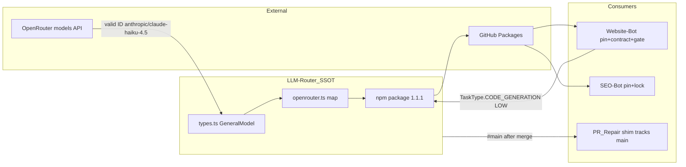

## PLAN: Unblock Website-Bot CI (Improve + Recursive Alignment)

### Kernel bindings (audit-only on this plan)
| Kernel | Mode | Applied to |
|--------|------|------------|
| `kernels/Improve.md` | inspect_only on plan text | Prior pass — locked decisions, honesty gates |
| `kernels/Recursive Alignment.md` | `audit_only` / `modify_target: false` | This pass — multi-repo architecture, contracts, ownership, correction roadmap |

**Plan artifact status:** ready for execution authorization. **Runtime remediation:** not applied.

### Objective
Restore release-safe alignment across the LLM routing constellation so Website-Bot (and coupled consumers) neither fail on invalid OpenRouter model IDs nor mis-attribute failures to package-auth (#22).

**Success (falsifiable):**
1. SSOT `@quantum-l9/llm-router@1.1.1` emits `anthropic/claude-haiku-4.5` for `CLAUDE_HAIKU`.
2. Website-Bot `package.json`, lockfile, `contracts/llm_router_integration.yaml`, and `memory-stack-dependency-gate.yml` all reference `1.1.1` (no residual `1.0.1` consumer pin).
3. SEO-Bot lock resolves `@quantum-l9/llm-router@1.1.1`.
4. Website-Bot Deploy `schema-generator` stage Passes (no invalid Haiku ID).
5. Agent Pipeline never fails with `/tmp` `ERR_MODULE_NOT_FOUND`; empty Inngest key → explicit preflight Failed.
6. Build Site Validate inputs Passes with `vars.CLIENT_ID` set.
7. Evidence matrix uses Passed/Failed/Skipped/NotApplicable/Unknown only; #22 closed for package-auth only.

### Recursive Alignment — target binding

| Root | Role | In modification scope |
|------|------|----------------------|
| `Quantum-L9/LLM-Router` | SSOT for OpenRouter model ID strings + `@quantum-l9/llm-router` publish | Yes |
| `Quantum-L9/Website-Bot` | Primary consumer; factory pipeline; Agent/Build/Deploy workflows; integration contract | Yes |
| `Quantum-L9/SEO-Bot` | Live consumer locked at `llm-router@1.0.1` (same broken Haiku via package) | Yes (pin/lock only) |
| `Quantum-L9/PR_Repair` (`router-shim`) | Depends on `github:Quantum-L9/LLM-Router#main` | Verify-only after LLM-Router main has fix (no pin PR required if #main tracks) |
| `Quantum-L9/l9-graphiti-memory` WIP pack copies | Stale mirrored `package.json` snippets under `docs/WIP/` | OutOfScope (not SSOT) |
| OpenRouter public model catalog | External schema for valid model IDs | Read-only authority for ID selection |
| GitHub Packages `npm.pkg.github.com` | Distribution boundary | Publish + consumer install |
| Cursor-Governance | Session tooling only | OutOfScope for code |

### Authority map

| Concern | Owning layer | Consumers must not |
|---------|--------------|-------------------|
| OpenRouter model ID strings | LLM-Router `GeneralModel` + `openrouter.ts` map | Fork/hardcode Haiku IDs in Website-Bot/SEO-Bot |
| Task→model matrix | LLM-Router matrices | Re-implement routing in bots |
| Bot task mapping (CONTENT_GENERATION → etc.) | Website-Bot `contracts/llm_router_integration.yaml` + `src/services/llm.ts` | Change LLM-Router task enums for bot convenience |
| npm package version consumed | Each consumer `package.json` + lockfile | Drift from contract/gate pins |
| Registry version gate | Website-Bot `memory-stack-dependency-gate.yml` | Assert a version the app no longer uses |
| Inngest event dispatch | Website-Bot Agent Pipeline + `scripts/fire-inngest-event.mjs` | Resolve modules from `/tmp` |
| Deploy/client identity | Website-Bot `vars.CLIENT_ID` + workflow inputs | Remove fail-closed CLIENT_ID check |
| Package install auth | `secrets.GITHUB_TOKEN` + `packages: read` | Introduce PAT for packages |
| Secrets values | GitHub Actions secrets/vars | Commit credentials |

**Adapters:** NotApplicable for PlasticOS-specific routing law. Applied: GitHub Packages publishConfig, Website-Bot integration contract, OpenRouter model catalog.

### Boundary map



### Alignment violations (Recursive Alignment taxonomy)

| ID | Severity | Confidence | Governing rule | Observed | Expected | Smallest correction | Release block? | Status |
|----|----------|------------|----------------|----------|----------|---------------------|----------------|--------|
| A1 | Critical | Confirmed | Schema/contract: model IDs must exist at OpenRouter | `anthropic/claude-haiku-4` rejected 400 in Deploy `30766537486` | Valid catalog ID | LLM-Router Haiku → `anthropic/claude-haiku-4.5`; publish `1.1.1` | Yes | Open |
| A2 | High | Confirmed | Source-of-truth: single owner for model strings | Haiku string only in LLM-Router (good) but published versions still wrong through `1.1.0` | Published package matches live catalog | Publish after A1 | Yes | Open |
| A3 | High | Confirmed | Consumer pin alignment | Website-Bot app pin `1.0.1`; contract `dependency: @quantum-l9/llm-router@1.0.1`; gate `npm view ...@1.0.1` | App, contract, gate share one version | Bump all three to `1.1.1` together | Yes (Website-Bot) | Open |
| A4 | High | Confirmed | Cross-repo interoperability | SEO-Bot lock `@quantum-l9/llm-router/1.0.1` | Consumers on fixed package | SEO-Bot pin+lock → `1.1.1` | Yes (SEO-Bot if it calls Haiku paths) | Open |
| A5 | High | Confirmed | Structure/ownership: Node resolves from package root | Agent Pipeline runs ESM from `/tmp` → `ERR_MODULE_NOT_FOUND` | Invoke from `$GITHUB_WORKSPACE` | Committed `scripts/fire-inngest-event.mjs` | Yes (Agent workflow) | Open |
| A6 | High | Confirmed | Config SoT: required secrets present | Empty `INNGEST_*`, `VERCEL_*`; empty `vars.CLIENT_ID` | Names present for workflows that require them | Operator set secrets/vars | Yes for those workflows | Open / Blocked on values |
| A7 | Medium | Confirmed | Validation gate honesty | memory-stack gate would still Pass on stale `1.0.1` after app moves to `1.1.1` if gate not updated | Gate asserts consumed version | Change gate to `@1.1.1` | Yes if left stale | Open |
| A8 | Low | Confirmed | WIP mirrors | l9-graphiti-memory `docs/WIP/...` package.json copies show `^1.1.0` | Not authoritative | OutOfScope — do not edit WIP as fix | No | OutOfScope |
| A9 | NotApplicable | Confirmed | Package-auth (#22) | `npm ci` Passes with `GITHUB_TOKEN` | Install works | Evidence close only | No for install | Resolved functionally |

**False positives rejected:** “Missing Manage Actions access on public packages” as current Deploy/Lint blocker — install already Passes.

### Locked decisions (cross-repo)
1. Haiku OpenRouter ID = `anthropic/claude-haiku-4.5` (re-validate catalog at execute P1).
2. Publish version = `1.1.1` from LLM-Router (repo currently at package.json `1.1.0` with bad ID).
3. Website-Bot exact pin `"1.1.1"` (not caret) to match contract/gate determinism.
4. Update in the **same Website-Bot change set**: `package.json`, `package-lock.json`, `contracts/llm_router_integration.yaml` (`contract.version` + `dependency`), `.github/workflows/memory-stack-dependency-gate.yml` (`npm view @quantum-l9/llm-router@1.1.1`).
5. SEO-Bot: set `"@quantum-l9/llm-router": "1.1.1"` (or `^1.1.1`) and regenerate lock so resolved version is `1.1.1`.
6. PR_Repair: after LLM-Router fix is on `main`, reinstall/shim CI verifies #main; open PR only if shim pins a SHA/tag that still points at broken release.
7. Agent Inngest: workspace script + fail-closed empty `INNGEST_EVENT_KEY`.
8. `vars.CLIENT_ID=supplementalinsurancepros_com` unless user overrides before M3.
9. Deploy validation: (a) schema-generator Pass required after A1–A3; (b) full workflow success only after A6 Vercel secrets.
10. No PAT; no package visibility change; no weakening CLIENT_ID gate.
11. Do not patch Haiku ID inside Website-Bot/SEO-Bot — that would fork SSOT (violates ownership).

### Scope
**In:** A1–A7 remediation loci above; operator A6 values; re-validation; #22 package-auth evidence close.

**Out:** A8 WIP mirrors; Inngest product redesign; WOM advisory domain-spec content; Cursor-Governance code; private-package Actions UI; disabling Agent schedule.

### Pre-Validation (execute start)
| Check | Action | Pass | Plan-time |
|-------|--------|------|-----------|
| P0 Multi-root bind | LLM-Router + Website-Bot + SEO-Bot SHAs recorded | Three roots | Passed (API) |
| P1 Catalog | OpenRouter lists `anthropic/claude-haiku-4.5` | Present | Passed; re-check |
| P2 Drift inventory | WB pin/contract/gate all `1.0.1`; SEO lock `1.0.1`; LLM-Router source still `claude-haiku-4` | Matches A1–A4,A7 | Passed |
| P3 Agent `/tmp` | Present in `agent-pipeline.yml` | Matches A5 | Passed |
| P4 Secret/var names | INNGEST/VERCEL/CLIENT_ID absent on WB | Matches A6 | Passed |
| P5 PR_Repair pin form | Still `github:...#main` | Verify-only path | Passed |
| P6 Clean gate | `make pr` (or governance `pr WS=`) per modified repo | Pass after edits | Unknown until execute |

### TODO Plan (dependency-ordered)
| # | Task | Repos / files | Effort | Risk |
|---|------|---------------|--------|------|
| 1 | Fix Haiku ID in enum + OpenRouter map; fix string-asserting tests | LLM-Router `src/types.ts`, `src/providers/openrouter.ts`, tests | M | Medium |
| 2 | Regression: CODE_GENERATION/LOW (or Haiku enum) → `anthropic/claude-haiku-4.5` | LLM-Router tests | S | Low |
| 3 | Bump package to `1.1.1`, CHANGELOG, publish to GitHub Packages | LLM-Router | M | Medium |
| 4 | Website-Bot: pin + lock + **contract yaml** + **memory-stack gate** | `package.json`, `package-lock.json`, `contracts/llm_router_integration.yaml`, `.github/workflows/memory-stack-dependency-gate.yml` | M | Low |
| 5 | SEO-Bot: pin + lock to `1.1.1` | `package.json`, `package-lock.json` | S | Low |
| 6 | Agent Pipeline: `scripts/fire-inngest-event.mjs` + workflow preflight; remove `/tmp` heredoc | Website-Bot | S | Low |
| 7 | Operator: `CLIENT_ID`, `VERCEL_TOKEN`, `VERCEL_PROJECT_ID`, `VERCEL_TEAM_ID`, `INNGEST_EVENT_KEY`, `INNGEST_SIGNING_KEY` | Website-Bot GitHub settings | M | High if wrong Vercel project |
| 8 | Re-dispatch WB: memory-stack gate, Lint/Test, Deploy, Agent, Build Site; SEO-Bot install/CI if available | Actions | M | Low |
| 9 | Confirm PR_Repair shim against fixed `main` (or note Blocked if inaccessible) | PR_Repair | S | Low |
| 10 | Evidence + close #22 package-auth; residual issue for any Open A* | GitHub Issues | S | Low |

### Execution passes
| Pass | Name | Closes | Exit criterion |
|------|------|--------|----------------|
| E1 | Bind + baseline | P0–P6 | Drift inventory frozen |
| E2 | SSOT fix + publish | A1,A2 | `npm view @quantum-l9/llm-router@1.1.1` |
| E3 | Website-Bot alignment quartet | A3,A7 | pin=contract=gate=`1.1.1` |
| E4 | SEO-Bot consumer | A4 | lock resolves `1.1.1` |
| E5 | Agent ownership | A5 | no `/tmp` inngest invoke |
| E6 | Operator config | A6 | secret/var **names** listed |
| E7 | Integration validate | matrix | run URLs filled |
| E8 | Handoff | A9 close + residuals | Convergence declared |

Parallel after E1: E2→E3→E4 chain; E5 parallel to E2; E6 after secrets available; E7 after E3+E5 (+E6 for full greens).

### Dependencies
```text
E1 → E2 → E3 → E7(WB schema + gate)
     E2 → E4 → E7(SEO)
E1 → E5 → E6(Inngest) → E7(Agent)
E6(CLIENT_ID) → E7(Build Site)
E6(Vercel) → E7(Deploy e2e)
E7 → E8
E2(main) → E9/PR_Repair verify (TODO9)
```

### Milestones
| M | Outcome | Unlocks |
|---|---------|---------|
| M1 | llm-router `1.1.1` published | Consumer bumps |
| M2 | WB + SEO pins/contracts/gates aligned | schema-generator / SEO routing safe |
| M3 | Agent script ownership fixed | Honest Inngest failures |
| M4 | Operator secrets/vars | Full workflow greens |
| M5 | Evidence + issue hygiene | #22 closed; residuals tracked |

### Checkpoints
| CP | Evidence | No-go |
|----|----------|-------|
| CP1 | LLM-Router test shows `claude-haiku-4.5` | Do not publish |
| CP2 | Packages shows `1.1.1` | Stop |
| CP3 | WB: `rg 'llm-router@1\.0\.1'` empty in package.json/contract/gate | Do not merge WB |
| CP4 | SEO lockfile contains `llm-router/1.1.1` | Do not claim cross-repo Done |
| CP5 | Agent: no `ERR_MODULE_NOT_FOUND`; empty key message clear | Rework script |
| CP6 | Secret/var names present | A6 Blocked |
| CP7 | Validation matrix complete | No false #22 closure |

### Validation matrix
| Check | Target | Expected | Result |
|-------|--------|----------|--------|
| V-ssot-unit | LLM-Router tests | Haiku ID assertion Passed | Unknown |
| V-publish | `npm view ...@1.1.1` | Passed | Unknown |
| V-wb-pin-trinity | package + contract + gate | All `1.1.1` | Unknown |
| V-wb-gate-ci | memory-stack-dependency-gate | Passed on `1.1.1` | Unknown |
| V-wb-install | Lint/Test or Deploy | `npm ci` Passed | Unknown |
| V-wb-schema | Deploy schema-generator | Passed (no bad Haiku) | Unknown |
| V-wb-deploy-e2e | Deploy conclusion | Passed iff Vercel set | Unknown/Blocked |
| V-wb-agent-module | Agent Pipeline | Passed (no /tmp resolve fail) | Unknown |
| V-wb-agent-inngest | Agent Fire step | Sent or explicit key Failed | Unknown |
| V-wb-build | Build Site validate | Passed | Unknown |
| V-seo-install | SEO-Bot CI/install | Resolves `1.1.1` | Unknown |
| V-prrepair | Shim against main | Passed or Skipped+reason | Unknown |
| V-pr-* | `make pr` per modified repo | Passed | Unknown |

### Checklist
- [ ] Recursive Alignment inventory A1–A9 recorded at execute
- [ ] LLM-Router `1.1.1` published with Haiku fix + regression
- [ ] Website-Bot pin + lock + contract + memory-stack gate = `1.1.1`
- [ ] SEO-Bot pin + lock = `1.1.1`
- [ ] No Haiku string forks in consumer repos
- [ ] Agent Pipeline workspace script + INNGEST preflight
- [ ] Operator CLIENT_ID / Vercel / Inngest configured
- [ ] Validation matrix filled with URLs
- [ ] PR_Repair verified or Skipped with reason
- [ ] #22 closed for package-auth only; residuals filed
- [ ] No commit/push/publish without explicit authorization

### Risks
| Risk | Mitigation |
|------|------------|
| Consumer drift (contract/gate left on 1.0.1) | CP3 mandatory; single WB PR for quartet |
| SEO-Bot left on 1.0.1 after WB fixed | E4 in critical path for “full cross-repo” claim |
| OpenRouter renames Haiku again | P1 at execute |
| PR_Repair #main lag | TODO9 verify; don’t block WB on shim if inaccessible |
| Operator secret delay | Stage-gate Deploy e2e; still ship A1–A5 |

### Known unknowns
| Item | Blocks |
|------|--------|
| Vercel/Inngest secret **values** | A6 full green |
| LLM-Router exact publish procedure (Actions vs local) | TODO3 mechanics only |
| Per-repo `make pr` vs governance `pr WS=` | Command shape |
| Whether SEO-Bot CI exercises Haiku path this week | Still bump for lock alignment |
| User override of CLIENT_ID | TODO7 value |

### Leverage (pass 9)
Highest-value single correction: **A1 at LLM-Router SSOT** — one publish remediates Website-Bot Deploy schema-generator and SEO-Bot latent Haiku failures without forking model IDs. Second: **A3 trinity** so gates/contracts cannot lie about the consumed version. Third: **A5** so Agent failures name secrets, not Node resolution.

### Entropy vs prior drafts
- Expanded modification scope to SEO-Bot + WB contract + memory-stack gate (were missing → would leave A3/A4/A7 Open).
- Explicit ownership rule: never patch model IDs in consumers.
- PR_Repair classified verify-only vs pin PR.
- WIP l9-graphiti-memory copies labeled OutOfScope.
- Alignment violation table replaces ad-hoc “also update docs maybe.”

### Estimate
**Total:** 0.5–1.5 days (extra SEO-Bot + contract/gate sync)  
**GMPs:** 3 — (1) LLM-Router publish, (2) Website-Bot alignment+Agent, (3) SEO-Bot pin

### Final Validation
| Check | Pass criteria |
|-------|---------------|
| V1 Plan vs Improve + Recursive Alignment | Multi-root bind, authority map, violations, roadmap, Unknowns present |
| V2 `make pr` per modified repo | Passed; no unauthorized push |
| V3 Honesty | Matrix results evidence-backed |
| V4 Cross-repo | A1–A5 Resolved; A6 Resolved or Blocked+owner; A7 Resolved; A8 OutOfScope; A9 closed |

### Convergence assessment
| Layer | Status | Evidence |
|-------|--------|----------|
| Plan text (alignment audit) | **Converged** | Cross-repo consumers inventoried; violations consolidated; no soft SSOT fork |
| Runtime constellation | **NotConverged** | A1–A7 Open until execute |
| Minimum safe next action | Authorize execution → **E2 LLM-Router Haiku SSOT + publish 1.1.1** | Unblocks all consumer alignment work |

### Recommend next
On execution auth: `l9-gmp-protocol` at **E2**, then **E3 Website-Bot trinity+Agent**, then **E4 SEO-Bot**, then operator **E6**, then **E7** validation.
