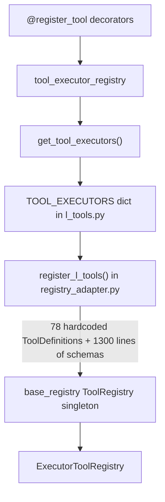
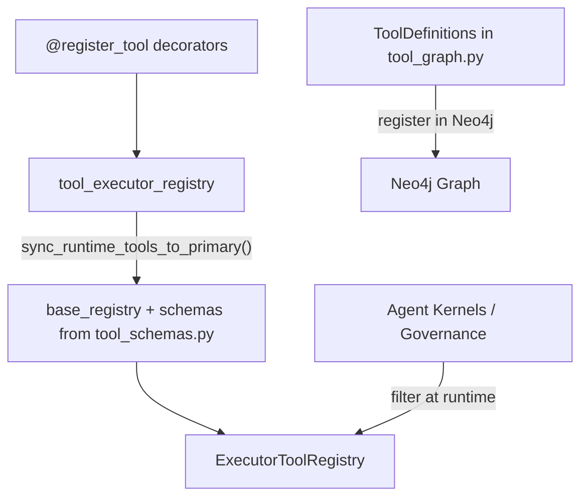

# Unified Tool Pipeline — Eliminate L-CTO Coupling

## Problem

The current tool pipeline has an L-CTO-specific bottleneck:




`register_l_tools()` is ~~940 lines (2903-3843) of hardcoded L-CTO tool definitions. `_get_l_tool_schema_for_registry()` is ~720 lines (2182-2900) of duplicate schemas. `_get_tool_schema()` is ~700 lines (1247-1948) of the same schemas as a method fallback. Total: **~~2,400 lines** of L-CTO-specific dead weight in `registry_adapter.py`.

Every new tool requires editing this function. This blocks scalability to any agent beyond L-CTO.

## Target Architecture




One generic bridge. Schemas live in a standalone data module. Tool access filtering happens in agent kernels or governance, not in the registry.

## Scope

### Files to modify

- [core/tools/registry_adapter.py](core/tools/registry_adapter.py) — Remove `register_l_tools()`, `_get_l_tool_schema_for_registry()`, `_get_tool_schema()`, `_TOOL_AGENT_IDS`, `_tool_belongs_to_agent()`. Enhance `sync_runtime_tools_to_primary()` to load schemas.
- [api/server.py](api/server.py) — Remove "REGISTER L-CTO TOOLS" lifespan block. Set `tool_graph_healthy` from bridge result.
- [runtime/l_tools.py](runtime/l_tools.py) — Remove `TOOL_EXECUTORS`, `get_tool_executor()`, `list_available_tools()`, and the `get_tool_executors` import.
- [runtime/execution_gate.py](runtime/execution_gate.py) — Replace `l_tools.get_tool_executor` with `base_registry.get_executor`.
- [core/tools/tool_graph.py](core/tools/tool_graph.py) — Add `perplexity_search` and `http_request` to `L_INTERNAL_TOOLS` (Neo4j gap fix).
- [ci/check_tool_wiring.py](ci/check_tool_wiring.py) — Rewrite: remove dead checks, add bridge validation.
- [reports/GMP Reports/GMP-Report-140-Adr-0094-Tool-Registry-Primary-Pipeline.md](reports/GMP%20Reports/GMP-Report-140-Adr-0094-Tool-Registry-Primary-Pipeline.md) — Correct to reflect reality.

### New file

- `**config/tool_schemas.py**` — Standalone data module containing OpenAI function-calling schemas for all tools. Extracted from the ~1,300 lines of duplicate schema dicts currently in `_get_tool_schema()` and `_get_l_tool_schema_for_registry()`. This is a pure data file (dict of dicts), no imports, no logic.

### Files NOT modified (bridge exception per ADR-0094)

- `runtime/tool_registry.py` — Keeps `@register_tool`, `tool_executor_registry`, `get_tool_executors()` (bridge reads from them).
- `runtime/tool_packages.py` — Uses `tool_executor_registry.discover()` which is bridge-internal.
- `core/tools/base_registry.py` — Re-exports `register_tool`; unchanged.
- `core/decorators.py` — Imports `register_tool` for decorator composition; unchanged.
- Individual tool files (`runtime/mcp_tools.py`, `runtime/redis_tools.py`, etc.) — They use `@register_tool` which is the correct pattern.

## Step-by-Step Changes

### Step 1: Extract schemas into `config/tool_schemas.py`

Create a standalone data module that holds all OpenAI function-calling schemas. Extract from the two duplicate sources:

- `_get_tool_schema()` (method, lines 1247-1948) — `l_tool_schemas` + `research_schemas`
- `_get_l_tool_schema_for_registry()` (function, lines 2182-2900) — same schemas as `ToolSchema` objects

Deduplicate into a single canonical dict:

```python
# config/tool_schemas.py
"""OpenAI function-calling schemas for L9 tools. Agent-agnostic."""
TOOL_SCHEMAS: dict[str, dict] = {
    "memory_search": {
        "type": "object",
        "properties": { ... },
        "required": ["query"],
    },
    ...
}
```

This mitigates the schema loss risk: schemas are preserved, just moved out of L-CTO-coupled code into a universal location.

### Step 2: Enhance `sync_runtime_tools_to_primary()` in registry_adapter.py

The bridge function (already partially added at line 2095) becomes the sole path for getting runtime executors into the base registry. Enhance it to:

- Import `TOOL_SCHEMAS` from `config.tool_schemas`
- For each synced tool, look up its schema in `TOOL_SCHEMAS` and populate `ToolMetadata.input_schema` as a `ToolSchema` object
- This ensures `base_registry.get_tool_schema(tool_id)` returns real schemas (not empty `{"type": "object", "properties": {}}`)
- The 4 call sites in `ExecutorToolRegistry` that use `self._registry.get_tool_schema()` (lines 365, 475, 681, 783) will now get schemas from the base registry, making `_get_tool_schema()` unnecessary

### Step 3: Remove L-CTO dead weight from registry_adapter.py

Delete in order:

1. `_TOOL_AGENT_IDS` dict (line 155) and `_tool_belongs_to_agent()` function (lines 158-182) — only populated by `register_l_tools()`, only read by `get_approved_tools()`. With `_TOOL_AGENT_IDS` empty, `_tool_belongs_to_agent()` always returns `True` anyway. Remove the calls to it in `get_approved_tools()` (line 320) and `get_relevant_tools()`.
2. `_get_tool_schema()` method (lines 1247-1948) — ~700 lines of hardcoded schemas, replaced by `config/tool_schemas.py` via the base registry
3. `_get_l_tool_schema_for_registry()` function (lines 2182-2900) — ~720 lines, only called by `register_l_tools()`
4. `register_l_tools()` function (lines 2902-3843) — ~940 lines of L-CTO-specific registration
5. Remove `register_l_tools` from `__all__`

Net removal: **~2,400 lines** from `registry_adapter.py`.

### Step 4: Remove "REGISTER L-CTO TOOLS" block from api/server.py lifespan

Delete the block at ~lines 1968-1993 that calls `register_l_tools()`.

**Critical**: this block also sets `app.state.tool_graph_healthy`. Move that flag-setting into the bridge block (already at ~lines 670-690). Set `tool_graph_healthy = True` when `sync_runtime_tools_to_primary()` returns > 0 tools.

### Step 5: Remove secondary access functions from runtime/l_tools.py

Delete at bottom of file (~lines 2896-2924):

- `TOOL_EXECUTORS = get_tool_executors()` (line 2901)
- `get_tool_executor()` (lines 2904-2914)
- `list_available_tools()` (lines 2917-2924)

Remove the top-level import: `from runtime.tool_registry import get_tool_executors` (line 44).

### Step 6: Fix runtime/execution_gate.py caller

Replace (lines 400-418):

```python
from runtime.l_tools import get_tool_executor
executor = get_tool_executor(tool_id)
```

With:

```python
from core.tools.base_registry import get_tool_registry
registry = get_tool_registry()
executor = registry.get_executor(tool_id)
```

Keep the same async/sync dispatch logic and the agent fallback.

### Step 7: Close Neo4j registration gap in tool_graph.py

`registry_adapter.register_l_tools()` was the **only** path that registered `perplexity_search` and `http_request` in Neo4j. The `tool_graph.py` lists (`L9_TOOLS` with 11 tools, `L_INTERNAL_TOOLS` with 108 tools) do not include them.

Add these two `ToolDefinition` entries to `L_INTERNAL_TOOLS` in [core/tools/tool_graph.py](core/tools/tool_graph.py):

```python
ToolDefinition(
    name="perplexity_search",
    description="Search and synthesize information using Perplexity AI",
    category="research",
    scope="external",
    risk_level="low",
    ...
),
ToolDefinition(
    name="http_request",
    description="Make HTTP requests to external APIs",
    category="integration",
    scope="external",
    risk_level="medium",
    ...
),
```

**Verification**: After code changes, run `python3 -c "from core.tools.tool_graph import L_INTERNAL_TOOLS; print(len(L_INTERNAL_TOOLS))"` and confirm count is 110 (was 108).

### Step 8: Rewrite ci/check_tool_wiring.py

Current checks and their status:

- Check 1 (TOOL_EXECUTORS vs ToolName): **Dead** — remove
- Check 2 (TOOL_EXECUTORS vs DEFAULT_L_CAPABILITIES): **Dead** — remove
- Check 3 (High-risk tools have approval flags): **Keep** — refactor to read from `tool_graph.py` ToolDefinitions
- Check 4 (register_l_tools ToolDefinitions match TOOL_EXECUTORS): **Dead** — remove
- Check 5 (l_tools.py TOOL_EXECUTORS vs register_l_tools): **Dead** — remove

Add new check: "All tools in `tool_executor_registry` are present in base registry" (validates bridge ran).

### Step 9: Update GMP-140 report

Correct the report to accurately reflect what was shipped per phase.

### Step 10: Validate

- `py_compile` on all changed files
- `python3 -c "from core.tools.registry_adapter import ExecutorToolRegistry, sync_runtime_tools_to_primary"` import chain test
- `python3 -c "from api.server import app"` import chain test
- `python3 -c "from core.tools.tool_graph import L_INTERNAL_TOOLS; assert len(L_INTERNAL_TOOLS) >= 110"` Neo4j gap check
- Grep audit: zero `TOOL_EXECUTORS` references in production code outside `runtime/tool_registry.py`
- Grep audit: zero `register_l_tools` references in production code outside `tool_graph.py`
- Grep audit: zero `_get_tool_schema` references (method fully removed)

## What This Does NOT Change

- **Tool definitions in tool_graph.py** — `L9_TOOLS` and `L_INTERNAL_TOOLS` stay. They define governance metadata (risk, approval, scope) for Neo4j. This is where governance belongs.
- **Individual tool functions in l_tools.py** — All ~70 async tool functions stay. They are the executor implementations. They just lose the `TOOL_EXECUTORS` dict wrapper at the bottom.
- **@register_tool decorator pattern** — Stays as-is. This is the correct way tools self-register.
- **ExecutorToolRegistry class** — Stays. It wraps the base registry with governance dispatch. It just no longer needs `register_l_tools()` to populate it.
- **ToolName enum** — Stays. Still used by `approval_gate.py` and `task_router.py` for capability checks.
- **DEFAULT_L_CAPABILITIES** — Stays in `core/schemas/capabilities.py`. Still used by `kernel_registry.py`. Only removed from CI checks.

## Risk Assessment

- **Schema preservation (MITIGATED)**: Schemas extracted into `config/tool_schemas.py` before removal. The bridge loads them into `ToolMetadata.input_schema`. The base registry's `get_tool_schema()` returns them. The 4 call sites in `ExecutorToolRegistry` that call `self._registry.get_tool_schema()` (lines 365, 475, 681, 783) get real schemas. The `_get_tool_schema()` fallback method (line 1247) is never reached when using the standard base registry (it checks `hasattr(self._registry, "get_tool_schema")` first, and `ToolRegistry` has that method), so removing it is safe.
- **Neo4j gap (MITIGATED)**: `perplexity_search` and `http_request` added to `L_INTERNAL_TOOLS` before removing `register_l_tools()`. Verified with count assertion.
- **tool_graph_healthy flag (MITIGATED)**: Moved to bridge block in lifespan.
- **_tool_belongs_to_agent removal**: With `_TOOL_AGENT_IDS` empty (never populated without `register_l_tools()`), this function always returns `True` — removing it is a no-op behavior change. Tool access filtering should happen in agent kernels or governance engine, not here.
- **Low risk overall**: The bridge already works. We are removing the redundant L-CTO-specific path and cleaning up dead weight.
